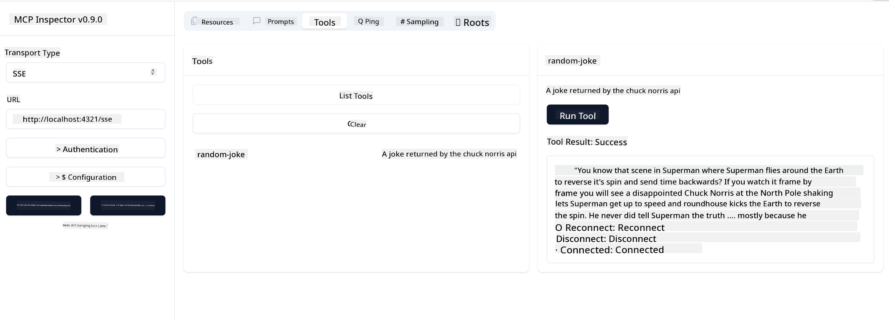

<!--
CO_OP_TRANSLATOR_METADATA:
{
  "original_hash": "d90ca3d326c48fab2ac0ebd3a9876f59",
  "translation_date": "2025-07-13T19:47:26+00:00",
  "source_file": "03-GettingStarted/05-sse-server/README.md",
  "language_code": "en"
}
-->
Now that we know a bit more about SSE, let's move on to building an SSE server.

## Exercise: Creating an SSE Server

When creating our server, we need to keep two things in mind:

- We need to use a web server to expose endpoints for connections and messages.
- Build our server as we normally do with tools, resources, and prompts, just like when using stdio.

### -1- Create a server instance

To create our server, we use the same types as with stdio. However, for the transport, we need to select SSE.

Let's add the necessary routes next.

### -2- Add routes

Next, let's add routes that handle the connection and incoming messages:

Now let's add capabilities to the server.

### -3- Adding server capabilities

Now that we've defined everything specific to SSE, let's add server capabilities like tools, prompts, and resources.

Your complete code should look like this:

Great, we have a server using SSE. Let's take it for a test drive next.

## Exercise: Debugging an SSE Server with Inspector

Inspector is a great tool we saw in a previous lesson [Creating your first server](/03-GettingStarted/01-first-server/README.md). Let's see if we can use the Inspector here as well:

### -1- Running the inspector

To run the inspector, you first need to have an SSE server running, so let's do that next:

1. Run the server

1. Run the inspector

    > ![NOTE]
    > Run this in a separate terminal window from where the server is running. Also, note that you need to adjust the command below to match the URL where your server is running.

    ```sh
    npx @modelcontextprotocol/inspector --cli http://localhost:8000/sse --method tools/list
    ```

Running the inspector looks the same across all runtimes. Notice that instead of passing a path to our server and a command to start the server, we pass the URL where the server is running and specify the `/sse` route.

### -2- Trying out the tool

Connect to the server by selecting SSE in the dropdown and entering the URL where your server is running, for example http://localhost:4321/sse. Then click the "Connect" button. As before, select to list tools, choose a tool, and provide input values. You should see a result like this:



Great, you can work with the inspector. Next, let's see how to work with Visual Studio Code.

## Assignment

Try expanding your server with more capabilities. Check out [this page](https://api.chucknorris.io/) to, for example, add a tool that calls an API. You decide what your server should look like. Have fun :)

## Solution

[Solution](./solution/README.md) Here's one possible solution with working code.

## Key Takeaways

The key takeaways from this chapter are:

- SSE is the second supported transport type alongside stdio.
- To support SSE, you need to manage incoming connections and messages using a web framework.
- You can use both Inspector and Visual Studio Code to consume an SSE server, just like stdio servers. Note the slight differences between stdio and SSE: for SSE, you need to start the server separately and then run your inspector tool. Also, for the inspector tool, you need to specify the URL.

## Samples 

- [Java Calculator](../samples/java/calculator/README.md)
- [.Net Calculator](../../../../03-GettingStarted/samples/csharp)
- [JavaScript Calculator](../samples/javascript/README.md)
- [TypeScript Calculator](../samples/typescript/README.md)
- [Python Calculator](../../../../03-GettingStarted/samples/python) 

## Additional Resources

- [SSE](https://developer.mozilla.org/en-US/docs/Web/API/Server-sent_events)

## What's Next

- Next: [HTTP Streaming with MCP (Streamable HTTP)](../06-http-streaming/README.md)

**Disclaimer**:  
This document has been translated using the AI translation service [Co-op Translator](https://github.com/Azure/co-op-translator). While we strive for accuracy, please be aware that automated translations may contain errors or inaccuracies. The original document in its native language should be considered the authoritative source. For critical information, professional human translation is recommended. We are not liable for any misunderstandings or misinterpretations arising from the use of this translation.