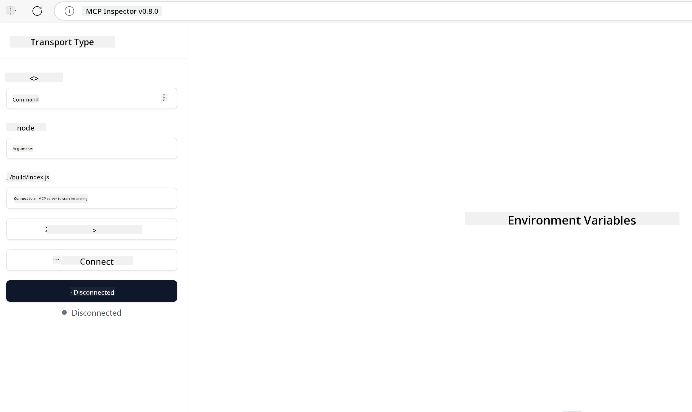

<!--
CO_OP_TRANSLATOR_METADATA:
{
  "original_hash": "717f34718a773f6cf52d8445e40a96bf",
  "translation_date": "2025-05-17T12:38:55+00:00",
  "source_file": "03-GettingStarted/07-testing/README.md",
  "language_code": "en"
}
-->
## Testing and Debugging

Before you start testing your MCP server, it's crucial to understand the tools available and best practices for debugging. Effective testing ensures your server functions as intended and helps you quickly pinpoint and fix issues. The following section outlines recommended strategies for validating your MCP implementation.

## Overview

This lesson covers how to choose the right testing approach and the most effective testing tool.

## Learning Objectives

By the end of this lesson, you will be able to:

- Describe various approaches for testing.
- Use different tools to effectively test your code.

## Testing MCP Servers

MCP provides tools to assist you in testing and debugging your servers:

- **MCP Inspector**: A command line tool that can be used both as a CLI tool and as a visual tool.
- **Manual testing**: You can use a tool like curl to run web requests, but any tool capable of running HTTP will suffice.
- **Unit testing**: You can use your preferred testing framework to test the features of both server and client.

### Using MCP Inspector

We've described the usage of this tool in previous lessons, but let's discuss it a bit at a high level. It's a tool built in Node.js and you can use it by calling the `npx` executable, which will download and install the tool temporarily and clean itself up once it's finished running your request.

The [MCP Inspector](https://github.com/modelcontextprotocol/inspector) helps you:

- **Discover Server Capabilities**: Automatically detect available resources, tools, and prompts.
- **Test Tool Execution**: Try different parameters and see responses in real-time.
- **View Server Metadata**: Examine server info, schemas, and configurations.

A typical run of the tool looks like this:

```bash
npx @modelcontextprotocol/inspector node build/index.js
```

The above command starts an MCP and its visual interface, launching a local web interface in your browser. You can expect to see a dashboard displaying your registered MCP servers, their available tools, resources, and prompts. The interface allows you to interactively test tool execution, inspect server metadata, and view real-time responses, making it easier to validate and debug your MCP server implementations.

Here's what it can look like: 

You can also run this tool in CLI mode by adding the `--cli` attribute. Here's an example of running the tool in "CLI" mode, which lists all the tools on the server:

```sh
npx @modelcontextprotocol/inspector --cli node build/index.js --method tools/list
```

### Manual Testing

Apart from running the inspector tool to test server capabilities, another similar approach is to run a client capable of using HTTP, like curl.

With curl, you can test MCP servers directly using HTTP requests:

```bash
# Example: Test server metadata
curl http://localhost:3000/v1/metadata

# Example: Execute a tool
curl -X POST http://localhost:3000/v1/tools/execute \
  -H "Content-Type: application/json" \
  -d '{"name": "calculator", "parameters": {"expression": "2+2"}}'
```

As shown above, using curl involves a POST request to invoke a tool using a payload consisting of the tool's name and its parameters. Use the approach that suits you best. CLI tools generally tend to be faster to use and lend themselves to scripting, which can be useful in a CI/CD environment.

### Unit Testing

Create unit tests for your tools and resources to ensure they work as expected. Here's some example testing code.

```python
import pytest

from mcp.server.fastmcp import FastMCP
from mcp.shared.memory import (
    create_connected_server_and_client_session as create_session,
)

# Mark the whole module for async tests
pytestmark = pytest.mark.anyio


async def test_list_tools_cursor_parameter():
    """Test that the cursor parameter is accepted for list_tools.

    Note: FastMCP doesn't currently implement pagination, so this test
    only verifies that the cursor parameter is accepted by the client.
    """

 server = FastMCP("test")

    # Create a couple of test tools
    @server.tool(name="test_tool_1")
    async def test_tool_1() -> str:
        """First test tool"""
        return "Result 1"

    @server.tool(name="test_tool_2")
    async def test_tool_2() -> str:
        """Second test tool"""
        return "Result 2"

    async with create_session(server._mcp_server) as client_session:
        # Test without cursor parameter (omitted)
        result1 = await client_session.list_tools()
        assert len(result1.tools) == 2

        # Test with cursor=None
        result2 = await client_session.list_tools(cursor=None)
        assert len(result2.tools) == 2

        # Test with cursor as string
        result3 = await client_session.list_tools(cursor="some_cursor_value")
        assert len(result3.tools) == 2

        # Test with empty string cursor
        result4 = await client_session.list_tools(cursor="")
        assert len(result4.tools) == 2
    
```

The preceding code does the following:

- Utilizes the pytest framework, allowing you to create tests as functions and use assert statements.
- Creates an MCP Server with two different tools.
- Uses the `assert` statement to check that certain conditions are met.

Take a look at the [full file here](https://github.com/modelcontextprotocol/python-sdk/blob/main/tests/client/test_list_methods_cursor.py)

Given the above file, you can test your own server to ensure capabilities are created as they should be.

All major SDKs have similar testing sections, so you can adapt to your chosen runtime.

## Samples 

- [Java Calculator](../samples/java/calculator/README.md)
- [.Net Calculator](../../../../03-GettingStarted/samples/csharp)
- [JavaScript Calculator](../samples/javascript/README.md)
- [TypeScript Calculator](../samples/typescript/README.md)
- [Python Calculator](../../../../03-GettingStarted/samples/python) 

## Additional Resources

- [Python SDK](https://github.com/modelcontextprotocol/python-sdk)

## What's Next

- Next: [Deployment](/03-GettingStarted/08-deployment/README.md)

**Disclaimer**:  
This document has been translated using AI translation service [Co-op Translator](https://github.com/Azure/co-op-translator). While we strive for accuracy, please be aware that automated translations may contain errors or inaccuracies. The original document in its native language should be considered the authoritative source. For critical information, professional human translation is recommended. We are not liable for any misunderstandings or misinterpretations arising from the use of this translation.