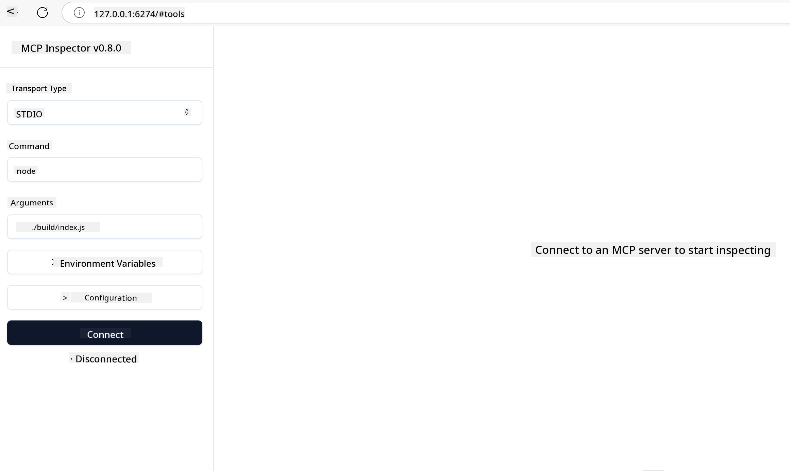

<!--
CO_OP_TRANSLATOR_METADATA:
{
  "original_hash": "4e34e34e84f013e73c7eaa6d09884756",
  "translation_date": "2025-07-13T21:56:06+00:00",
  "source_file": "03-GettingStarted/08-testing/README.md",
  "language_code": "en"
}
-->
## Testing and Debugging

Before you start testing your MCP server, it’s important to understand the available tools and best practices for debugging. Effective testing ensures your server behaves as expected and helps you quickly identify and fix issues. The following section outlines recommended methods for validating your MCP implementation.

## Overview

This lesson explains how to choose the right testing approach and the most effective testing tool.

## Learning Objectives

By the end of this lesson, you will be able to:

- Describe different testing approaches.
- Use various tools to test your code effectively.

## Testing MCP Servers

MCP offers tools to help you test and debug your servers:

- **MCP Inspector**: A command-line tool that can be used both as a CLI and with a visual interface.
- **Manual testing**: You can use tools like curl to send web requests, but any tool capable of making HTTP requests will work.
- **Unit testing**: You can use your preferred testing framework to test features on both the server and client sides.

### Using MCP Inspector

We’ve covered how to use this tool in previous lessons, but here’s a brief overview. It’s built with Node.js and can be run using the `npx` command, which temporarily downloads and installs the tool, then cleans up after running your request.

The [MCP Inspector](https://github.com/modelcontextprotocol/inspector) helps you:

- **Discover Server Capabilities**: Automatically detect available resources, tools, and prompts.
- **Test Tool Execution**: Experiment with different parameters and see responses in real time.
- **View Server Metadata**: Inspect server information, schemas, and configurations.

A typical command to run the tool looks like this:

```bash
npx @modelcontextprotocol/inspector node build/index.js
```

This command starts an MCP server with its visual interface and opens a local web interface in your browser. You’ll see a dashboard showing your registered MCP servers, their available tools, resources, and prompts. The interface lets you interactively test tool execution, inspect server metadata, and view real-time responses, making it easier to validate and debug your MCP server implementations.

Here’s an example of what it looks like: 

You can also run the tool in CLI mode by adding the `--cli` flag. Here’s an example of running it in CLI mode, which lists all the tools on the server:

```sh
npx @modelcontextprotocol/inspector --cli node build/index.js --method tools/list
```

### Manual Testing

Besides using the inspector tool to test server capabilities, another option is to use a client that can make HTTP requests, such as curl.

With curl, you can test MCP servers directly by sending HTTP requests:

```bash
# Example: Test server metadata
curl http://localhost:3000/v1/metadata

# Example: Execute a tool
curl -X POST http://localhost:3000/v1/tools/execute \
  -H "Content-Type: application/json" \
  -d '{"name": "calculator", "parameters": {"expression": "2+2"}}'
```

As shown in the example above, you use a POST request to invoke a tool by sending a payload with the tool’s name and parameters. Choose the method that works best for you. CLI tools are generally faster and can be scripted, which is useful in CI/CD environments.

### Unit Testing

Write unit tests for your tools and resources to ensure they work as expected. Here’s an example of test code:

```python
import pytest

from mcp.server.fastmcp import FastMCP
from mcp.shared.memory import (
    create_connected_server_and_client_session as create_session,
)

# Mark the whole module for async tests
pytestmark = pytest.mark.anyio


async def test_list_tools_cursor_parameter():
    """Test that the cursor parameter is accepted for list_tools.

    Note: FastMCP doesn't currently implement pagination, so this test
    only verifies that the cursor parameter is accepted by the client.
    """

 server = FastMCP("test")

    # Create a couple of test tools
    @server.tool(name="test_tool_1")
    async def test_tool_1() -> str:
        """First test tool"""
        return "Result 1"

    @server.tool(name="test_tool_2")
    async def test_tool_2() -> str:
        """Second test tool"""
        return "Result 2"

    async with create_session(server._mcp_server) as client_session:
        # Test without cursor parameter (omitted)
        result1 = await client_session.list_tools()
        assert len(result1.tools) == 2

        # Test with cursor=None
        result2 = await client_session.list_tools(cursor=None)
        assert len(result2.tools) == 2

        # Test with cursor as string
        result3 = await client_session.list_tools(cursor="some_cursor_value")
        assert len(result3.tools) == 2

        # Test with empty string cursor
        result4 = await client_session.list_tools(cursor="")
        assert len(result4.tools) == 2
    
```

This code does the following:

- Uses the pytest framework, which lets you write tests as functions and use assert statements.
- Creates an MCP Server with two different tools.
- Uses `assert` statements to verify that certain conditions are met.

Check out the [full file here](https://github.com/modelcontextprotocol/python-sdk/blob/main/tests/client/test_list_methods_cursor.py)

Using this file as a reference, you can test your own server to ensure capabilities are set up correctly.

All major SDKs have similar testing sections, so you can adapt this to your preferred runtime.

## Samples

- [Java Calculator](../samples/java/calculator/README.md)
- [.Net Calculator](../../../../03-GettingStarted/samples/csharp)
- [JavaScript Calculator](../samples/javascript/README.md)
- [TypeScript Calculator](../samples/typescript/README.md)
- [Python Calculator](../../../../03-GettingStarted/samples/python)

## Additional Resources

- [Python SDK](https://github.com/modelcontextprotocol/python-sdk)

## What's Next

- Next: [Deployment](../09-deployment/README.md)

**Disclaimer**:  
This document has been translated using the AI translation service [Co-op Translator](https://github.com/Azure/co-op-translator). While we strive for accuracy, please be aware that automated translations may contain errors or inaccuracies. The original document in its native language should be considered the authoritative source. For critical information, professional human translation is recommended. We are not liable for any misunderstandings or misinterpretations arising from the use of this translation.