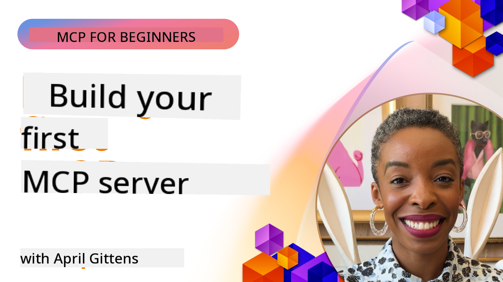

<!--
CO_OP_TRANSLATOR_METADATA:
{
  "original_hash": "858362ce0118de3fec0f9114bf396101",
  "translation_date": "2025-08-19T14:13:28+00:00",
  "source_file": "03-GettingStarted/README.md",
  "language_code": "en"
}
-->
## Getting Started  

_(Click the image above to watch the video for this lesson)_

This section includes several lessons:

- **1 Your first server**: In this initial lesson, you'll learn how to create your first server and use the inspector tool to test and debug it effectively. [Go to the lesson](01-first-server/README.md)

- **2 Client**: This lesson teaches you how to write a client that can connect to your server. [Go to the lesson](02-client/README.md)

- **3 Client with LLM**: Enhance your client by integrating an LLM, enabling it to "negotiate" with your server for better functionality. [Go to the lesson](03-llm-client/README.md)

- **4 Consuming a server GitHub Copilot Agent mode in Visual Studio Code**: Learn how to run your MCP Server directly within Visual Studio Code. [Go to the lesson](04-vscode/README.md)

- **5 Consuming from a SSE (Server Sent Events)**: Explore SSE, a standard for server-to-client streaming that allows servers to push real-time updates to clients over HTTP. [Go to the lesson](05-sse-server/README.md)

- **6 HTTP Streaming with MCP (Streamable HTTP)**: Dive into modern HTTP streaming, progress notifications, and scalable, real-time MCP servers and clients using Streamable HTTP. [Go to the lesson](06-http-streaming/README.md)

- **7 Utilizing AI Toolkit for VSCode**: Use AI Toolkit to consume and test your MCP Clients and Servers. [Go to the lesson](07-aitk/README.md)

- **8 Testing**: Focus on various methods to test your server and client implementations. [Go to the lesson](08-testing/README.md)

- **9 Deployment**: Explore different approaches to deploying your MCP solutions. [Go to the lesson](09-deployment/README.md)

The Model Context Protocol (MCP) is an open protocol that standardizes how applications provide context to LLMs. Think of MCP as a USB-C port for AI applications—it offers a universal way to connect AI models to diverse data sources and tools.

## Learning Objectives

By the end of this lesson, you will be able to:

- Set up development environments for MCP in C#, Java, Python, TypeScript, and JavaScript
- Build and deploy basic MCP servers with custom features (resources, prompts, and tools)
- Create host applications that connect to MCP servers
- Test and debug MCP implementations
- Address common setup challenges and their solutions
- Connect your MCP implementations to popular LLM services

## Setting Up Your MCP Environment

Before starting with MCP, it's essential to prepare your development environment and understand the basic workflow. This section will guide you through the initial setup steps for a smooth start.

### Prerequisites

Before diving into MCP development, ensure you have:

- **Development Environment**: Set up for your chosen language (C#, Java, Python, TypeScript, or JavaScript)
- **IDE/Editor**: Visual Studio, Visual Studio Code, IntelliJ, Eclipse, PyCharm, or any modern code editor
- **Package Managers**: NuGet, Maven/Gradle, pip, or npm/yarn
- **API Keys**: For any AI services you plan to use in your host applications

### Official SDKs

In the upcoming chapters, you'll encounter solutions built using Python, TypeScript, Java, and .NET. Below are the officially supported SDKs.

MCP provides official SDKs for multiple languages:
- [C# SDK](https://github.com/modelcontextprotocol/csharp-sdk) - Maintained in collaboration with Microsoft
- [Java SDK](https://github.com/modelcontextprotocol/java-sdk) - Maintained in collaboration with Spring AI
- [TypeScript SDK](https://github.com/modelcontextprotocol/typescript-sdk) - The official TypeScript implementation
- [Python SDK](https://github.com/modelcontextprotocol/python-sdk) - The official Python implementation
- [Kotlin SDK](https://github.com/modelcontextprotocol/kotlin-sdk) - The official Kotlin implementation
- [Swift SDK](https://github.com/modelcontextprotocol/swift-sdk) - Maintained in collaboration with Loopwork AI
- [Rust SDK](https://github.com/modelcontextprotocol/rust-sdk) - The official Rust implementation

## Key Takeaways

- Setting up an MCP development environment is simple with language-specific SDKs
- Building MCP servers involves creating and registering tools with clear schemas
- MCP clients connect to servers and models to unlock extended capabilities
- Testing and debugging are crucial for reliable MCP implementations
- Deployment options range from local setups to cloud-based solutions

## Practicing

We provide a set of samples to complement the exercises in all chapters of this section. Each chapter also includes its own exercises and assignments.

- [Java Calculator](./samples/java/calculator/README.md)
- [.Net Calculator](../../../03-GettingStarted/samples/csharp)
- [JavaScript Calculator](./samples/javascript/README.md)
- [TypeScript Calculator](./samples/typescript/README.md)
- [Python Calculator](../../../03-GettingStarted/samples/python)

## Additional Resources

- [Build Agents using Model Context Protocol on Azure](https://learn.microsoft.com/azure/developer/ai/intro-agents-mcp)
- [Remote MCP with Azure Container Apps (Node.js/TypeScript/JavaScript)](https://learn.microsoft.com/samples/azure-samples/mcp-container-ts/mcp-container-ts/)
- [.NET OpenAI MCP Agent](https://learn.microsoft.com/samples/azure-samples/openai-mcp-agent-dotnet/openai-mcp-agent-dotnet/)

## What's next

Next: [Creating your first MCP Server](01-first-server/README.md)

**Disclaimer**:  
This document has been translated using the AI translation service [Co-op Translator](https://github.com/Azure/co-op-translator). While we strive for accuracy, please note that automated translations may contain errors or inaccuracies. The original document in its native language should be regarded as the authoritative source. For critical information, professional human translation is recommended. We are not responsible for any misunderstandings or misinterpretations resulting from the use of this translation.