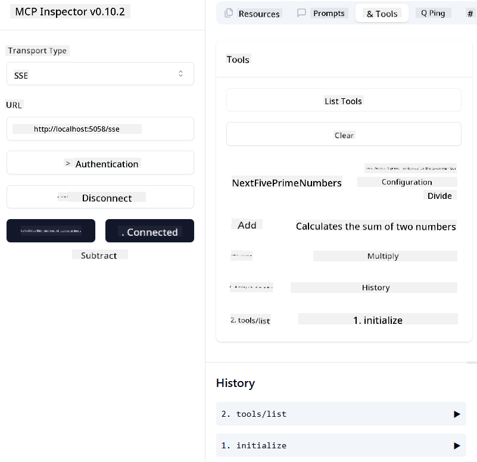

<!--
CO_OP_TRANSLATOR_METADATA:
{
  "original_hash": "5020a3e1a1c7f30c00f9e37f1fa208e3",
  "translation_date": "2025-05-17T14:04:51+00:00",
  "source_file": "04-PracticalImplementation/samples/csharp/README.md",
  "language_code": "en"
}
-->
# Sample

The previous example demonstrates how to use a local .NET project with the `sdio` type and how to run the server locally in a container. This approach works well in many scenarios. However, it can be advantageous to have the server running remotely, such as in a cloud environment. This is where the `http` type becomes relevant.

Examining the solution in the `04-PracticalImplementation` folder, it might initially seem more complicated than the previous one. But in reality, it isn't. If you take a closer look at the project `src/mcpserver/mcpserver.csproj`, you'll find that it mostly contains the same code as the earlier example. The only distinction is that we're using a different library `ModelContextProtocol.AspNetCore` to manage the HTTP requests. Additionally, we change the method `IsPrime` to make it private, just to demonstrate that private methods can be included in your code. The rest of the code remains unchanged.

The other projects originate from [.NET Aspire](https://learn.microsoft.com/dotnet/aspire/get-started/aspire-overview). Including .NET Aspire in the solution enhances the developer's experience during development and testing and aids in observability. It isn't necessary for running the server, but it's considered a good practice to incorporate it into your solution.

## Start the server locally

1. From VS Code (with the C# DevKit extension), open the solution `04-PracticalImplementation\samples\csharp\src\Calculator-chap4.sln`.
2. Press `F5` to start the server. This should launch a web browser with the .NET Aspire dashboard.

or

1. From a terminal, navigate to the folder `04-PracticalImplementation\samples\csharp\src`.
2. Execute the following command to start the server:
   ```bash
    dotnet run --project .\AppHost
   ```

3. From the Dashboard, note the `http` URL. It should resemble `http://localhost:5058/`.

## Test `SSE` with the ModelContext Protocol Inspector.

If you have Node.js 22.7.5 or higher, you can use the ModelContext Protocol Inspector to test your server.

Start the server and run the following command in a terminal:

```bash
npx @modelcontextprotocol/inspector@latest
```



- Select the `SSE` as the Transport type. SSE stand for Server-Sent Events. 
- In the Url field, enter the URL of the server noted earlier,and append `/sse`. It should be `http` (not `https`) something like `http://localhost:5058/sse`.
- select the Connect button.

A nice thing about the Inspector is that it provide a nice visibility on what is happening.

- Try listing the availables tools
- Try some of them, it should works just like before.


## Test `SSE` with Github Copilot Chat in VS Code

To use the `SSE` transport with Github Copilot Chat, change the configuration of the `mcp-calc` server created previously to look like this:

```json
"mcp-calc": {
    "type": "sse",
    "url": "http://localhost:5058/sse"
}
```

Conduct some tests:
- Request the 3 prime numbers following 6780. Notice how Copilot will utilize the new tools `NextFivePrimeNumbers` and only return the first 3 prime numbers.
- Request the 7 prime numbers after 111 to observe the results.

# Deploy the server to Azure

Let's deploy the server to Azure so more people can access it.

From a terminal, navigate to the folder `04-PracticalImplementation\samples\csharp\src` and execute the following command:

```bash
azd init
```

This will generate several files locally to store the configuration of Azure resources and your Infrastructure as Code (IaC).

Next, execute the following command to deploy the server to Azure:

```bash
azd up
```

Once the deployment is complete, you should see a message similar to this:


Navigate to the Aspire dashboard and note the `HTTP` URL to use it in the MCP Inspector and in the Github Copilot Chat.

## What's next?

We've experimented with different transport types and testing tools and deployed our MCP server to Azure. But what if our server needs access to private resources, like a database or a private API? In the next chapter, we'll explore ways to enhance the security of our server.

**Disclaimer**: 
This document has been translated using AI translation service [Co-op Translator](https://github.com/Azure/co-op-translator). While we strive for accuracy, please be aware that automated translations may contain errors or inaccuracies. The original document in its native language should be considered the authoritative source. For critical information, professional human translation is recommended. We are not liable for any misunderstandings or misinterpretations arising from the use of this translation.