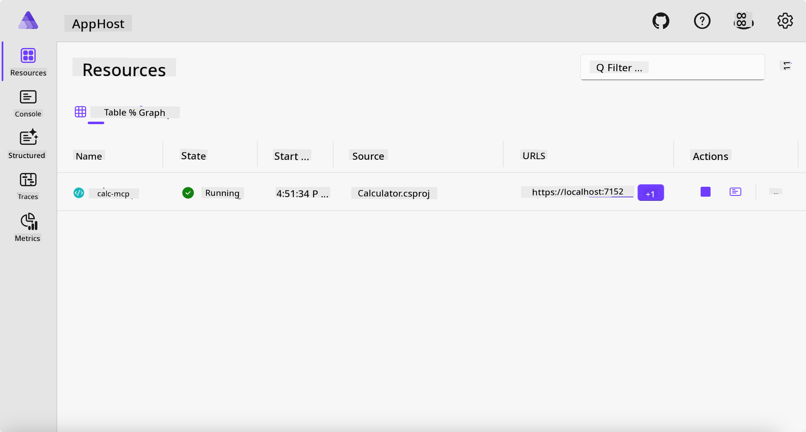
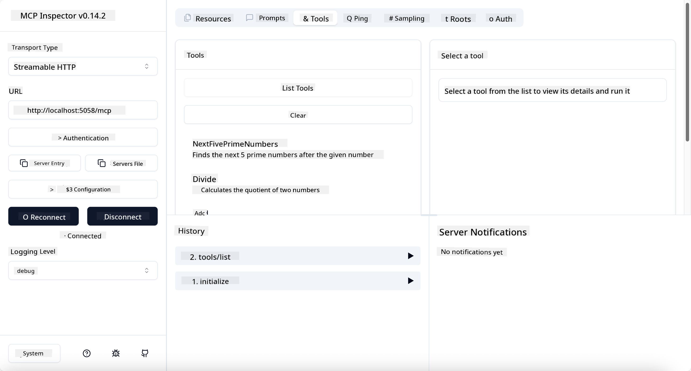
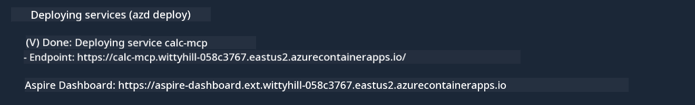

<!--
CO_OP_TRANSLATOR_METADATA:
{
  "original_hash": "0bc7bd48f55f1565f1d95ccb2c16f728",
  "translation_date": "2025-07-13T23:02:59+00:00",
  "source_file": "04-PracticalImplementation/samples/csharp/README.md",
  "language_code": "en"
}
-->
# Sample

The previous example demonstrates how to use a local .NET project with the `stdio` type and how to run the server locally inside a container. This approach works well in many cases. However, sometimes it’s useful to have the server running remotely, such as in a cloud environment. That’s where the `http` type comes into play.

Looking at the solution in the `04-PracticalImplementation` folder, it might seem much more complex than the previous one. But in reality, it’s not. If you take a closer look at the `src/Calculator` project, you’ll see it mostly contains the same code as before. The only difference is that we’re using a different library, `ModelContextProtocol.AspNetCore`, to handle HTTP requests. We also changed the `IsPrime` method to private, just to demonstrate that you can have private methods in your code. The rest of the code remains the same.

The other projects come from [.NET Aspire](https://learn.microsoft.com/dotnet/aspire/get-started/aspire-overview). Including .NET Aspire in the solution enhances the developer experience during development and testing and helps with observability. It’s not required to run the server, but it’s a good practice to include it in your solution.

## Start the server locally

1. In VS Code (with the C# DevKit extension), navigate to the `04-PracticalImplementation/samples/csharp` directory.
1. Run the following command to start the server:

   ```bash
    dotnet watch run --project ./src/AppHost
   ```

1. When a web browser opens the .NET Aspire dashboard, note the `http` URL. It should look something like `http://localhost:5058/`.

   

## Test Streamable HTTP with the MCP Inspector

If you have Node.js 22.7.5 or later, you can use the MCP Inspector to test your server.

Start the server and run the following command in a terminal:

```bash
npx @modelcontextprotocol/inspector http://localhost:5058
```



- Select `Streamable HTTP` as the Transport type.
- In the Url field, enter the server URL you noted earlier, appending `/mcp`. It should be `http` (not `https`), something like `http://localhost:5058/mcp`.
- Click the Connect button.

One great feature of the Inspector is that it provides clear visibility into what’s happening.

- Try listing the available tools.
- Try some of them; they should work just like before.

## Test MCP Server with GitHub Copilot Chat in VS Code

To use the Streamable HTTP transport with GitHub Copilot Chat, update the configuration of the previously created `calc-mcp` server to look like this:

```jsonc
// .vscode/mcp.json
{
  "servers": {
    "calc-mcp": {
      "type": "http",
      "url": "http://localhost:5058/mcp"
    }
  }
}
```

Try some tests:

- Ask for "3 prime numbers after 6780". Notice how Copilot uses the new `NextFivePrimeNumbers` tool and returns only the first 3 prime numbers.
- Ask for "7 prime numbers after 111" to see what happens.
- Ask "John has 24 lollies and wants to distribute them all to his 3 kids. How many lollies does each kid get?" to see the result.

## Deploy the server to Azure

Let’s deploy the server to Azure so more people can access it.

From a terminal, navigate to the `04-PracticalImplementation/samples/csharp` folder and run the following command:

```bash
azd up
```

Once deployment finishes, you should see a message like this:



Copy the URL and use it in the MCP Inspector and GitHub Copilot Chat.

```jsonc
// .vscode/mcp.json
{
  "servers": {
    "calc-mcp": {
      "type": "http",
      "url": "https://calc-mcp.gentleriver-3977fbcf.australiaeast.azurecontainerapps.io/mcp"
    }
  }
}
```

## What’s next?

We’ve explored different transport types and testing tools, and deployed your MCP server to Azure. But what if our server needs access to private resources? For example, a database or a private API? In the next chapter, we’ll look at how to enhance the security of our server.

**Disclaimer**:  
This document has been translated using the AI translation service [Co-op Translator](https://github.com/Azure/co-op-translator). While we strive for accuracy, please be aware that automated translations may contain errors or inaccuracies. The original document in its native language should be considered the authoritative source. For critical information, professional human translation is recommended. We are not liable for any misunderstandings or misinterpretations arising from the use of this translation.