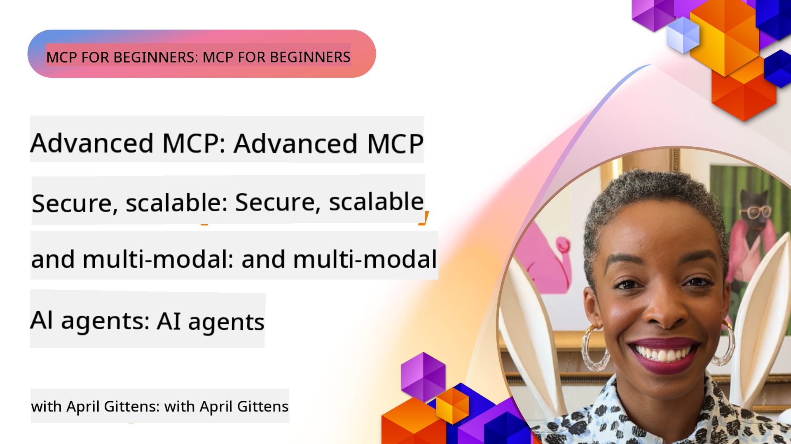

<!--
CO_OP_TRANSLATOR_METADATA:
{
  "original_hash": "d204bc94ea6027d06a703b21b711ca57",
  "translation_date": "2025-08-19T14:09:21+00:00",
  "source_file": "05-AdvancedTopics/README.md",
  "language_code": "en"
}
-->
# Advanced Topics in MCP

_(Click the image above to watch the video for this lesson)_

This chapter delves into advanced topics related to implementing the Model Context Protocol (MCP), including multi-modal integration, scalability, security best practices, and enterprise integration. These areas are critical for developing robust, production-ready MCP applications capable of meeting the demands of modern AI systems.

## Overview

This lesson focuses on advanced concepts in MCP implementation, emphasizing multi-modal integration, scalability, security best practices, and enterprise integration. These topics are vital for creating MCP applications that are ready for production and can address complex requirements in enterprise environments.

## Learning Objectives

By the end of this lesson, you will be able to:

- Implement multi-modal capabilities within MCP frameworks
- Design scalable MCP architectures for high-demand scenarios
- Apply security best practices aligned with MCP's security principles
- Integrate MCP with enterprise AI systems and frameworks
- Optimize performance and reliability in production environments

## Lessons and Sample Projects

| Link | Title | Description |
|------|-------|-------------|
| [5.1 Integration with Azure](./mcp-integration/README.md) | Integrate with Azure | Learn how to deploy your MCP Server on Azure |
| [5.2 Multi-modal Sample](./mcp-multi-modality/README.md) | MCP Multi-modal Samples | Examples for audio, image, and multi-modal responses |
| [5.3 MCP OAuth2 Sample](../../../05-AdvancedTopics/mcp-oauth2-demo) | MCP OAuth2 Demo | A minimal Spring Boot app demonstrating OAuth2 with MCP, both as an Authorization and Resource Server. Includes secure token issuance, protected endpoints, Azure Container Apps deployment, and API Management integration. |
| [5.4 Root Contexts](./mcp-root-contexts/README.md) | Root Contexts | Learn about root contexts and how to implement them |
| [5.5 Routing](./mcp-routing/README.md) | Routing | Explore different types of routing |
| [5.6 Sampling](./mcp-sampling/README.md) | Sampling | Understand how to work with sampling |
| [5.7 Scaling](./mcp-scaling/README.md) | Scaling | Learn about scaling strategies |
| [5.8 Security](./mcp-security/README.md) | Security | Secure your MCP Server effectively |
| [5.9 Web Search Sample](./web-search-mcp/README.md) | Web Search MCP | A Python MCP server and client integrating with SerpAPI for real-time web, news, product search, and Q&A. Demonstrates multi-tool orchestration, external API integration, and robust error handling. |
| [5.10 Real-time Streaming](./mcp-realtimestreaming/README.md) | Streaming | Real-time data streaming is essential in today's data-driven world, enabling businesses and applications to access information instantly for timely decision-making. |
| [5.11 Real-time Web Search](./mcp-realtimesearch/README.md) | Web Search | Discover how MCP transforms real-time web search by providing a standardized approach to context management across AI models, search engines, and applications. |
| [5.12 Entra ID Authentication for Model Context Protocol Servers](./mcp-security-entra/README.md) | Entra ID Authentication | Microsoft Entra ID offers a robust cloud-based identity and access management solution, ensuring that only authorized users and applications can interact with your MCP server. |
| [5.13 Azure AI Foundry Agent Integration](./mcp-foundry-agent-integration/README.md) | Azure AI Foundry Integration | Learn how to integrate MCP servers with Azure AI Foundry agents, enabling powerful tool orchestration and enterprise AI capabilities with standardized external data source connections. |
| [5.14 Context Engineering](./mcp-contextengineering/README.md) | Context Engineering | Explore the future opportunities of context engineering techniques for MCP servers, including context optimization, dynamic context management, and strategies for effective prompt engineering within MCP frameworks. |

## Additional References

For the latest information on advanced MCP topics, refer to:
- [MCP Documentation](https://modelcontextprotocol.io/)
- [MCP Specification](https://spec.modelcontextprotocol.io/)
- [GitHub Repository](https://github.com/modelcontextprotocol)

## Key Takeaways

- Multi-modal MCP implementations expand AI capabilities beyond text processing
- Scalability is crucial for enterprise deployments and can be achieved through horizontal and vertical scaling
- Comprehensive security measures safeguard data and ensure proper access control
- Enterprise integration with platforms like Azure OpenAI and Microsoft AI Foundry enhances MCP functionality
- Advanced MCP implementations benefit from optimized architectures and careful resource management

## Exercise

Design an enterprise-grade MCP implementation for a specific use case:

1. Identify multi-modal requirements for your use case
2. Outline the security controls needed to protect sensitive data
3. Design a scalable architecture that can handle varying loads
4. Plan integration points with enterprise AI systems
5. Document potential performance bottlenecks and strategies to mitigate them

## Additional Resources

- [Azure OpenAI Documentation](https://learn.microsoft.com/en-us/azure/ai-services/openai/)
- [Microsoft AI Foundry Documentation](https://learn.microsoft.com/en-us/ai-services/)

---

## What's Next

- [5.1 MCP Integration](./mcp-integration/README.md)

**Disclaimer**:  
This document has been translated using the AI translation service [Co-op Translator](https://github.com/Azure/co-op-translator). While we strive for accuracy, please note that automated translations may contain errors or inaccuracies. The original document in its native language should be regarded as the authoritative source. For critical information, professional human translation is recommended. We are not responsible for any misunderstandings or misinterpretations resulting from the use of this translation.