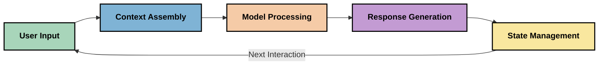
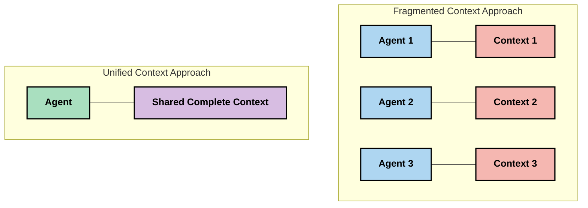
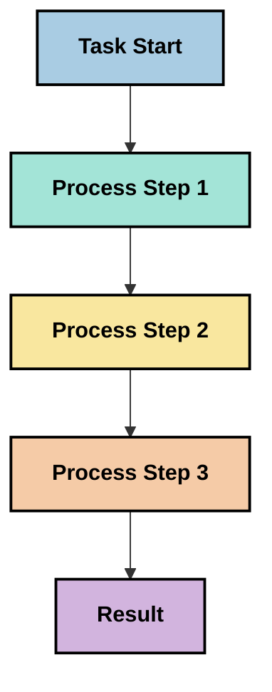
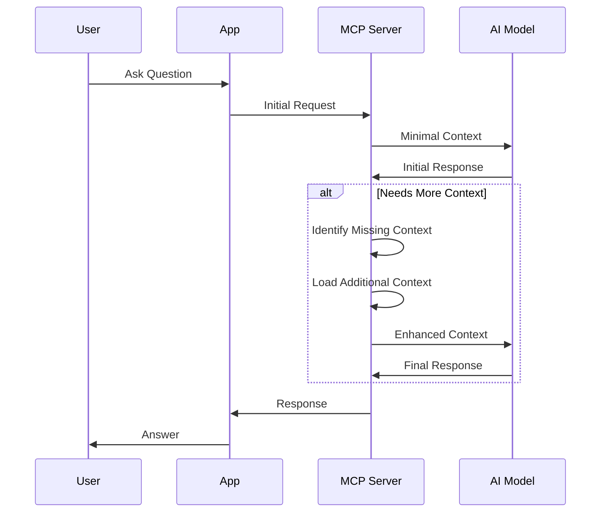
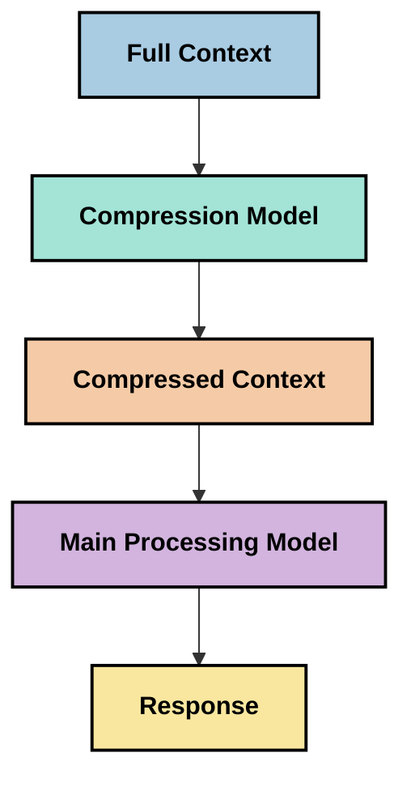
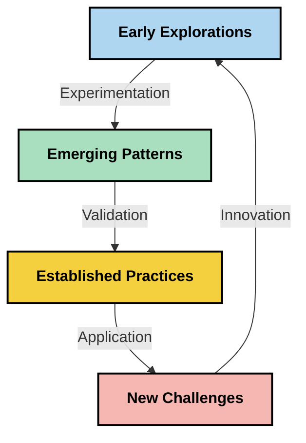

<!--
CO_OP_TRANSLATOR_METADATA:
{
  "original_hash": "fd169ca3071b81b5ee282e194bc823df",
  "translation_date": "2025-09-15T19:35:00+00:00",
  "source_file": "05-AdvancedTopics/mcp-contextengineering/README.md",
  "language_code": "en"
}
-->
# Context Engineering: An Emerging Concept in the MCP Ecosystem

## Overview

Context engineering is a new concept in the AI field that examines how information is organized, delivered, and maintained during interactions between clients and AI services. As the Model Context Protocol (MCP) ecosystem continues to grow, mastering context management becomes increasingly critical. This module introduces the idea of context engineering and explores its potential applications in MCP implementations.

## Learning Objectives

By the end of this module, you will be able to:

- Understand the emerging concept of context engineering and its potential role in MCP applications
- Identify key challenges in context management addressed by MCP protocol design
- Explore techniques to enhance model performance through improved context handling
- Consider methods to measure and evaluate context effectiveness
- Apply these concepts to improve AI experiences using the MCP framework

## Introduction to Context Engineering

Context engineering focuses on the intentional design and management of information flow between users, applications, and AI models. Unlike established fields like prompt engineering, context engineering is still being shaped by practitioners as they tackle the unique challenges of providing AI models with the right information at the right time.

As large language models (LLMs) have advanced, the importance of context has become increasingly clear. The quality, relevance, and structure of the context provided directly influence model outputs. Context engineering investigates this relationship and aims to establish principles for effective context management.

> "In 2025, the models out there are extremely intelligent. But even the smartest human won't be able to do their job effectively without the context of what they're being asked to do... 'Context engineering' is the next level of prompt engineering. It is about doing this automatically in a dynamic system." — Walden Yan, Cognition AI

Context engineering may involve:

1. **Context Selection**: Identifying relevant information for a specific task
2. **Context Structuring**: Organizing information to maximize model understanding
3. **Context Delivery**: Optimizing how and when information is provided to models
4. **Context Maintenance**: Managing the state and evolution of context over time
5. **Context Evaluation**: Assessing and improving the effectiveness of context

These focus areas are particularly relevant to the MCP ecosystem, which offers a standardized method for applications to provide context to LLMs.

## The Context Journey Perspective

One way to understand context engineering is by tracing the journey information takes through an MCP system:



### Key Stages in the Context Journey:

1. **User Input**: Raw data from the user (text, images, documents)
2. **Context Assembly**: Combining user input with system context, conversation history, and other retrieved information
3. **Model Processing**: The AI model processes the assembled context
4. **Response Generation**: The model generates outputs based on the provided context
5. **State Management**: The system updates its internal state based on the interaction

This perspective emphasizes the dynamic nature of context in AI systems and raises important questions about how to manage information effectively at each stage.

## Emerging Principles in Context Engineering

As context engineering evolves, practitioners are beginning to identify early principles that can guide MCP implementation decisions:

### Principle 1: Share Context Completely

Context should be shared fully across all components of a system rather than fragmented among multiple agents or processes. Fragmented context can lead to conflicting decisions within the system.



In MCP applications, this principle suggests designing systems where context flows seamlessly through the entire pipeline rather than being compartmentalized.

### Principle 2: Recognize That Actions Carry Implicit Decisions

Every action a model takes reflects implicit decisions about how to interpret the context. When different components act on separate contexts, these implicit decisions can conflict, resulting in inconsistent outcomes.

Implications for MCP applications:
- Favor linear processing of complex tasks over parallel execution with fragmented context
- Ensure all decision points have access to the same contextual information
- Design systems where later steps can view the full context of earlier decisions

### Principle 3: Balance Context Depth with Window Limitations

As conversations and processes grow longer, context windows eventually overflow. Effective context engineering explores ways to balance comprehensive context with technical limitations.

Potential strategies include:
- Compressing context to retain essential information while reducing token usage
- Loading context progressively based on relevance to current needs
- Summarizing previous interactions while preserving key decisions and facts

## Context Challenges and MCP Protocol Design

The Model Context Protocol (MCP) was developed with an understanding of the unique challenges of context management. These challenges help explain key aspects of MCP protocol design:

### Challenge 1: Context Window Limitations
Most AI models have fixed context window sizes, limiting the amount of information they can process at once.

**MCP Design Response:** 
- The protocol supports structured, resource-based context that can be referenced efficiently
- Resources can be paginated and loaded progressively

### Challenge 2: Relevance Determination
Determining which information is most relevant to include in context is challenging.

**MCP Design Response:**
- Flexible tools enable dynamic retrieval of information based on need
- Structured prompts ensure consistent context organization

### Challenge 3: Context Persistence
Tracking state across interactions requires careful context management.

**MCP Design Response:**
- Standardized session management
- Clearly defined interaction patterns for context evolution

### Challenge 4: Multi-Modal Context
Different types of data (text, images, structured data) require distinct handling.

**MCP Design Response:**
- Protocol design accommodates various content types
- Standardized representation of multi-modal information

### Challenge 5: Security and Privacy
Context often contains sensitive information that must be protected.

**MCP Design Response:**
- Clear boundaries between client and server responsibilities
- Local processing options to minimize data exposure

Understanding these challenges and MCP's responses provides a foundation for exploring advanced context engineering techniques.

## Emerging Context Engineering Approaches

As context engineering develops, several promising approaches are emerging. These represent current thinking rather than established best practices and will likely evolve as MCP implementations mature.

### 1. Single-Threaded Linear Processing

Instead of multi-agent architectures that distribute context, some practitioners find that single-threaded linear processing produces more consistent results. This aligns with the principle of unified context.



While this approach may seem less efficient than parallel processing, it often yields more coherent and reliable results because each step builds on a complete understanding of prior decisions.

### 2. Context Chunking and Prioritization

Breaking large contexts into manageable pieces and prioritizing the most important information.

```python
# Conceptual Example: Context Chunking and Prioritization
def process_with_chunked_context(documents, query):
    # 1. Break documents into smaller chunks
    chunks = chunk_documents(documents)
    
    # 2. Calculate relevance scores for each chunk
    scored_chunks = [(chunk, calculate_relevance(chunk, query)) for chunk in chunks]
    
    # 3. Sort chunks by relevance score
    sorted_chunks = sorted(scored_chunks, key=lambda x: x[1], reverse=True)
    
    # 4. Use the most relevant chunks as context
    context = create_context_from_chunks([chunk for chunk, score in sorted_chunks[:5]])
    
    # 5. Process with the prioritized context
    return generate_response(context, query)
```

This approach helps work within context window limitations while leveraging extensive knowledge bases.

### 3. Progressive Context Loading

Loading context incrementally as needed rather than all at once.



This method reduces token usage for simple queries while maintaining the ability to handle complex ones.

### 4. Context Compression and Summarization

Reducing context size while preserving essential information.



This technique is particularly useful for maintaining long conversations within context windows or processing large documents efficiently.

## Exploratory Context Engineering Considerations

When working with MCP implementations, consider the following exploratory areas to improve context engineering:

### Consider Your Context Goals

Clearly define your objectives before implementing complex context management solutions:
- What specific information does the model need to succeed?
- Which information is essential versus supplementary?
- What are your performance constraints (latency, token limits, costs)?

### Explore Layered Context Approaches

Some practitioners find success with context organized into conceptual layers:
- **Core Layer**: Essential information the model always needs
- **Situational Layer**: Context specific to the current interaction
- **Supporting Layer**: Additional helpful information
- **Fallback Layer**: Information accessed only when necessary

### Investigate Retrieval Strategies

The effectiveness of context often depends on retrieval methods:
- Semantic search and embeddings for conceptually relevant information
- Keyword-based search for specific factual details
- Hybrid approaches combining multiple retrieval methods
- Metadata filtering to narrow scope based on categories, dates, or sources

### Experiment with Context Coherence

The structure and flow of context may impact model understanding:
- Group related information together
- Use consistent formatting and organization
- Maintain logical or chronological order where appropriate
- Avoid contradictory information

### Weigh the Tradeoffs of Multi-Agent Architectures

While multi-agent architectures are popular, they pose significant challenges for context management:
- Fragmented context can lead to inconsistent decisions across agents
- Parallel processing may introduce conflicts that are hard to resolve
- Communication overhead between agents can offset performance gains
- Complex state management is required to maintain coherence

In many cases, a single-agent approach with comprehensive context management may yield more reliable results.

### Develop Evaluation Methods

To refine context engineering over time, consider how you'll measure success:
- A/B testing different context structures
- Monitoring token usage and response times
- Tracking user satisfaction and task completion rates
- Analyzing failures in context strategies

These considerations represent active areas of exploration in the context engineering space.

## Measuring Context Effectiveness: An Evolving Framework

Practitioners are beginning to explore ways to measure the effectiveness of context engineering. While no established framework exists yet, several metrics are being considered:

### Potential Measurement Dimensions

#### 1. Input Efficiency Considerations

- **Context-to-Response Ratio**: How much context is needed relative to the response size?
- **Token Utilization**: What percentage of context tokens influence the response?
- **Context Reduction**: How effectively can raw information be compressed?

#### 2. Performance Considerations

- **Latency Impact**: How does context management affect response time?
- **Token Economy**: Are tokens being used efficiently?
- **Retrieval Precision**: How relevant is the retrieved information?
- **Resource Utilization**: What computational resources are required?

#### 3. Quality Considerations

- **Response Relevance**: How well does the response address the query?
- **Factual Accuracy**: Does context management improve correctness?
- **Consistency**: Are responses consistent across similar queries?
- **Hallucination Rate**: Does better context reduce model hallucinations?

#### 4. User Experience Considerations

- **Follow-up Rate**: How often do users need clarification?
- **Task Completion**: Do users achieve their goals?
- **Satisfaction Indicators**: How do users rate their experience?

### Exploratory Approaches to Measurement

When experimenting with context engineering in MCP implementations, consider these approaches:

1. **Baseline Comparisons**: Start with simple context methods before testing advanced ones
2. **Incremental Changes**: Modify one aspect of context management at a time
3. **User-Centered Evaluation**: Combine quantitative metrics with user feedback
4. **Failure Analysis**: Study cases where context strategies fail
5. **Multi-Dimensional Assessment**: Balance efficiency, quality, and user experience

This experimental approach aligns with the emerging nature of context engineering.

## Closing Thoughts

Context engineering is a developing field that may become central to effective MCP applications. By carefully managing information flow, you can create AI experiences that are more efficient, accurate, and valuable to users.

The techniques outlined in this module represent early thinking in this space. As AI capabilities evolve, context engineering may become a more defined discipline. For now, experimentation and measurement seem to be the most productive strategies.

## Potential Future Directions

Although still in its infancy, context engineering shows promise in several areas:

- Context engineering principles may significantly impact model performance, efficiency, user experience, and reliability
- Single-threaded approaches with unified context management may outperform multi-agent architectures in many scenarios
- Specialized context compression models may become standard in AI pipelines
- The tension between context completeness and token limitations will drive innovation
- As models improve in human-like communication, true multi-agent collaboration may become feasible
- MCP implementations may evolve to standardize emerging context management patterns



## Resources

### Official MCP Resources
- [Model Context Protocol Website](https://modelcontextprotocol.io/)
- [Model Context Protocol Specification](https://github.com/modelcontextprotocol/modelcontextprotocol)
- [MCP Documentation](https://modelcontextprotocol.io/docs)
- [MCP C# SDK](https://github.com/modelcontextprotocol/csharp-sdk)
- [MCP Python SDK](https://github.com/modelcontextprotocol/python-sdk)
- [MCP TypeScript SDK](https://github.com/modelcontextprotocol/typescript-sdk)
- [MCP Inspector](https://github.com/modelcontextprotocol/inspector) - A visual testing tool for MCP servers

### Context Engineering Articles
- [Don't Build Multi-Agents: Principles of Context Engineering](https://cognition.ai/blog/dont-build-multi-agents) - Walden Yan shares key principles of context engineering
- [A Practical Guide to Building Agents](https://cdn.openai.com/business-guides-and-resources/a-practical-guide-to-building-agents.pdf) - OpenAI's guide to designing effective agents
- [Building Effective Agents](https://www.anthropic.com/engineering/building-effective-agents) - Anthropic's methodology for agent development

### Related Research
- [Dynamic Retrieval Augmentation for Large Language Models](https://arxiv.org/abs/2310.01487) - Study on dynamic retrieval methods
- [Lost in the Middle: How Language Models Use Long Contexts](https://arxiv.org/abs/2307.03172) - Key research on how models process extended contexts
- [Hierarchical Text-Conditioned Image Generation with CLIP Latents](https://arxiv.org/abs/2204.06125) - DALL-E 2 paper discussing context structuring
- [Exploring the Role of Context in Large Language Model Architectures](https://aclanthology.org/2023.findings-emnlp.124/) - Recent findings on context management in model architectures
- [Multi-Agent Collaboration: A Survey](https://arxiv.org/abs/2304.03442) - Research exploring challenges in multi-agent systems

### Additional Resources
- [Context Window Optimization Techniques](https://learn.microsoft.com/en-us/azure/ai-services/openai/concepts/context-window)
- [Advanced RAG Techniques](https://www.microsoft.com/en-us/research/blog/retrieval-augmented-generation-rag-and-frontier-models/)
- [Semantic Kernel Documentation](https://github.com/microsoft/semantic-kernel)
- [AI Toolkit for Context Management](https://github.com/microsoft/aitoolkit)

## What's next 

- [5.15 MCP Custom Transport](../mcp-transport/README.md)

---

**Disclaimer**:  
This document has been translated using the AI translation service [Co-op Translator](https://github.com/Azure/co-op-translator). While we aim for accuracy, please note that automated translations may include errors or inaccuracies. The original document in its native language should be regarded as the authoritative source. For critical information, professional human translation is advised. We are not responsible for any misunderstandings or misinterpretations resulting from the use of this translation.