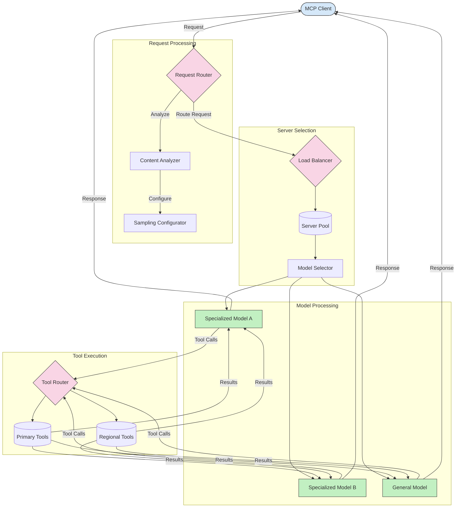

<!--
CO_OP_TRANSLATOR_METADATA:
{
  "original_hash": "af40eab7bd6ebf7e607f982a5506a5b5",
  "translation_date": "2025-07-14T02:08:55+00:00",
  "source_file": "05-AdvancedTopics/mcp-routing/README.md",
  "language_code": "en"
}
-->
## Intelligent Load Balancing

Load balancing optimizes resource use and ensures high availability for MCP services. There are various ways to implement load balancing, such as round-robin, weighted response time, or content-aware strategies.

Let's look at the example implementation below that uses the following strategies:

- **Round Robin**: Evenly distributes requests across available servers.
- **Weighted Response Time**: Routes requests to servers based on their average response time.
- **Content-Aware**: Routes requests to specialized servers depending on the content of the request.

## Dynamic Tool Routing

Tool routing ensures that tool calls are sent to the most appropriate service based on context. For example, a weather tool call might need to be routed to a regional endpoint depending on the user's location, or a calculator tool might need to use a specific API version.

Let's look at an example implementation that demonstrates dynamic tool routing based on request analysis, regional endpoints, and versioning support.

## Sampling and Routing Architecture in MCP

Sampling is a key part of the Model Context Protocol (MCP) that enables efficient request processing and routing. It involves analyzing incoming requests to determine the best model or service to handle them, based on factors like content type, user context, and system load.

Sampling and routing can be combined to build a robust architecture that optimizes resource use and ensures high availability. Sampling classifies requests, while routing directs them to the right models or services.

The diagram below shows how sampling and routing work together in a comprehensive MCP architecture:

## What's next

- [5.6 Sampling](../mcp-sampling/README.md)

**Disclaimer**:  
This document has been translated using the AI translation service [Co-op Translator](https://github.com/Azure/co-op-translator). While we strive for accuracy, please be aware that automated translations may contain errors or inaccuracies. The original document in its native language should be considered the authoritative source. For critical information, professional human translation is recommended. We are not liable for any misunderstandings or misinterpretations arising from the use of this translation.