<!--
CO_OP_TRANSLATOR_METADATA:
{
  "original_hash": "9abe1d303ab126f9a8b87f03cebe5213",
  "translation_date": "2025-06-26T14:30:47+00:00",
  "source_file": "05-AdvancedTopics/mcp-security-entra/README.md",
  "language_code": "en"
}
-->
# Securing AI Workflows: Entra ID Authentication for Model Context Protocol Servers

## Introduction
Securing your Model Context Protocol (MCP) server is just as important as locking the front door of your house. Leaving your MCP server open exposes your tools and data to unauthorized access, which can lead to security breaches. Microsoft Entra ID offers a powerful cloud-based identity and access management solution, ensuring that only authorized users and applications can interact with your MCP server. In this section, you’ll learn how to protect your AI workflows using Entra ID authentication.

## Learning Objectives
By the end of this section, you will be able to:

- Understand the importance of securing MCP servers.
- Explain the basics of Microsoft Entra ID and OAuth 2.0 authentication.
- Recognize the difference between public and confidential clients.
- Implement Entra ID authentication in both local (public client) and remote (confidential client) MCP server scenarios.
- Apply security best practices when developing AI workflows.

# Securing AI Workflows: Entra ID Authentication for Model Context Protocol Servers

Just like you wouldn’t leave your front door unlocked, you shouldn’t leave your MCP server open to anyone. Securing your AI workflows is essential for building reliable, trustworthy, and safe applications. This chapter introduces how to use Microsoft Entra ID to secure your MCP servers, making sure only authorized users and applications can access your tools and data.

## Why Security Matters for MCP Servers

Imagine your MCP server has a tool that can send emails or access a customer database. An unsecured server means anyone could potentially use that tool, leading to unauthorized data access, spam, or other malicious actions.

By implementing authentication, you ensure that every request to your server is verified, confirming the identity of the user or application making the request. This is the first and most crucial step in securing your AI workflows.

## Introduction to Microsoft Entra ID

**Microsoft Entra ID** is a cloud-based identity and access management service. Think of it as a universal security guard for your applications. It handles the complex process of verifying user identities (authentication) and deciding what they’re allowed to do (authorization).

By using Entra ID, you can:

- Enable secure sign-in for users.
- Protect APIs and services.
- Manage access policies centrally.

For MCP servers, Entra ID offers a robust and widely trusted way to control who can access your server’s capabilities.

---

## Understanding the Magic: How Entra ID Authentication Works

Entra ID uses open standards like **OAuth 2.0** for authentication. While the details can be complex, the core idea is simple and can be explained with an analogy.

### A Gentle Introduction to OAuth 2.0: The Valet Key

Think of OAuth 2.0 like a valet service for your car. When you arrive at a restaurant, you don’t give the valet your master key. Instead, you provide a **valet key** with limited permissions—it can start the car and lock the doors, but it can’t open the trunk or glove compartment.

In this analogy:

- **You** are the **User**.
- **Your car** is the **MCP Server** with its valuable tools and data.
- The **Valet** is **Microsoft Entra ID**.
- The **Parking Attendant** is the **MCP Client** (the application trying to access the server).
- The **Valet Key** is the **Access Token**.

The access token is a secure string the MCP client receives from Entra ID after you sign in. The client then presents this token to the MCP server with every request. The server verifies the token to ensure the request is legitimate and that the client has the necessary permissions, all without ever handling your actual credentials (like your password).

### The Authentication Flow

Here’s how the process works in practice:

```mermaid
sequenceDiagram
    actor User as 👤 User
    participant Client as 🖥️ MCP Client
    participant Entra as 🔐 Microsoft Entra ID
    participant Server as 🔧 MCP Server

    Client->>+User: Please sign in to continue.
    User->>+Entra: Enters credentials (username/password).
    Entra-->>Client: Here is your access token.
    User-->>-Client: (Returns to the application)

    Client->>+Server: I need to use a tool. Here is my access token.
    Server->>+Entra: Is this access token valid?
    Entra-->>-Server: Yes, it is.
    Server-->>-Client: Token is valid. Here is the result of the tool.
```



### Introducing the Microsoft Authentication Library (MSAL)

Before diving into the code, it’s important to introduce a key component you’ll see in the examples: the **Microsoft Authentication Library (MSAL)**.

MSAL is a Microsoft-developed library that simplifies authentication for developers. Instead of writing all the complex code to handle security tokens, manage sign-ins, and refresh sessions, MSAL handles the heavy lifting.

Using MSAL is highly recommended because:

- **It’s Secure:** Implements industry-standard protocols and security best practices, reducing risks in your code.
- **It Simplifies Development:** Abstracts the complexity of OAuth 2.0 and OpenID Connect, letting you add strong authentication with just a few lines of code.
- **It’s Maintained:** Microsoft actively updates MSAL to address new security threats and platform changes.

MSAL supports many languages and frameworks, including .NET, JavaScript/TypeScript, Python, Java, Go, and mobile platforms like iOS and Android. This lets you use consistent authentication patterns across your entire tech stack.

To learn more about MSAL, check out the official [MSAL overview documentation](https://learn.microsoft.com/entra/identity-platform/msal-overview).

---

## Securing Your MCP Server with Entra ID: A Step-by-Step Guide

Now, let’s walk through how to secure a local MCP server (one that communicates over `stdio`).

**`AuthenticationService.cs`**

The core method is `CreateAsync` in the `PublicClientApplication` class. It first tries to get a token silently (meaning the user won’t have to sign in again if they already have a valid session). If a silent token can’t be acquired, it will prompt the user to sign in interactively.

```csharp
// Simplified for clarity
public static async Task<AuthenticationService> CreateAsync(ILogger<AuthenticationService> logger)
{
    var msalClient = PublicClientApplicationBuilder
        .Create(_clientId) // Your Application (client) ID
        .WithAuthority(AadAuthorityAudience.AzureAdMyOrg)
        .WithTenantId(_tenantId) // Your Directory (tenant) ID
        .WithBroker(new BrokerOptions(BrokerOptions.OperatingSystems.Windows))
        .Build();

    // ... cache registration ...

    return new AuthenticationService(logger, msalClient);
}

public async Task<string> AcquireTokenAsync()
{
    try
    {
        // Try silent authentication first
        var accounts = await _msalClient.GetAccountsAsync();
        var account = accounts.FirstOrDefault();

        AuthenticationResult? result = null;

        if (account != null)
        {
            result = await _msalClient.AcquireTokenSilent(_scopes, account).ExecuteAsync();
        }
        else
        {
            // If no account, or silent fails, go interactive
            result = await _msalClient.AcquireTokenInteractive(_scopes).ExecuteAsync();
        }

        return result.AccessToken;
    }
    catch (Exception ex)
    {
        _logger.LogError(ex, "An error occurred while acquiring the token.");
        throw; // Optionally rethrow the exception for higher-level handling
    }
}
```

**`Program.cs`**

Use `AddSingleton<AuthenticationService>` to register the authentication service. The `GetUserDetailsFromGraph` method in `AuthenticationService` calls `authService.AcquireTokenAsync()` to get a valid access token. If authentication succeeds, it uses the token to call the Microsoft Graph API and fetch the user’s details.

```csharp
// Simplified for clarity
[McpServerTool(Name = "GetUserDetailsFromGraph")]
public static async Task<string> GetUserDetailsFromGraph(
    AuthenticationService authService)
{
    try
    {
        // This will trigger the authentication flow
        var accessToken = await authService.AcquireTokenAsync();

        // Use the token to create a GraphServiceClient
        var graphClient = new GraphServiceClient(
            new BaseBearerTokenAuthenticationProvider(new TokenProvider(authService)));

        var user = await graphClient.Me.GetAsync();

        return System.Text.Json.JsonSerializer.Serialize(user);
    }
    catch (Exception ex)
    {
        return $"Error: {ex.Message}";
    }
}
```

#### 3. How It All Works Together

1. When the MCP client calls the `GetUserDetailsFromGraph` tool, it calls `AcquireTokenAsync` to obtain an access token.
2. The token is then used to authenticate requests to Microsoft Graph.
3. The `auth/callback` endpoint handles the redirect from Entra ID after the user authenticates. It exchanges the authorization code for an access token and a refresh token.

```typescript
// Simplified for clarity
const app = express();
const { server } = createServer();
const provider = new EntraIdServerAuthProvider();

// Protect the SSE endpoint
app.get("/sse", requireBearerAuth({
  provider,
  requiredScopes: ["User.Read"]
}), async (req, res) => {
  // ... connect to the transport ...
});

// Protect the message endpoint
app.post("/message", requireBearerAuth({
  provider,
  requiredScopes: ["User.Read"]
}), async (req, res) => {
  // ... handle the message ...
});

// Handle the OAuth 2.0 callback
app.get("/auth/callback", (req, res) => {
  provider.handleCallback(req.query.code, req.query.state)
    .then(result => {
      // ... handle success or failure ...
    });
});
```

**`Tools.ts`**

The `getUserDetails` tool is similar to the previous example but retrieves the access token from the session.

```typescript
// Simplified for clarity
server.setRequestHandler(CallToolRequestSchema, async (request) => {
  const { name } = request.params;
  const context = request.params?.context as { token?: string } | undefined;
  const sessionToken = context?.token;

  if (name === ToolName.GET_USER_DETAILS) {
    if (!sessionToken) {
      throw new AuthenticationError("Authentication token is missing or invalid. Ensure the token is provided in the request context.");
    }

    // Get the Entra ID token from the session store
    const tokenData = tokenStore.getToken(sessionToken);
    const entraIdToken = tokenData.accessToken;

    const graphClient = Client.init({
      authProvider: (done) => {
        done(null, entraIdToken);
      }
    });

    const user = await graphClient.api('/me').get();

    // ... return user details ...
  }
});
```

**`auth/EntraIdServerAuthProvider.ts`**

When the `getUserDetails` tool is called, it uses the session token to look up the Entra ID access token, then calls the Microsoft Graph API.

This flow is more complex than the public client flow but is necessary for internet-facing endpoints. Since remote MCP servers are accessible over the public internet, they require stronger security to prevent unauthorized access and attacks.

## Security Best Practices

- **Always use HTTPS**: Encrypt communication between client and server to protect tokens from interception.
- **Implement Role-Based Access Control (RBAC)**: Don’t just check *if* a user is authenticated; verify *what* they’re authorized to do. Define roles in Entra ID and check them in your MCP server.
- **Monitor and audit**: Log all authentication events to detect and respond to suspicious activity.
- **Handle rate limiting and throttling**: Microsoft Graph and other APIs enforce rate limits. Implement exponential backoff and retry logic in your MCP server to gracefully handle HTTP 429 (Too Many Requests) responses. Cache frequently accessed data to reduce API calls.
- **Secure token storage**: Store access and refresh tokens securely. For local apps, use the system’s secure storage. For server apps, consider encrypted storage or key management services like Azure Key Vault.
- **Token expiration handling**: Access tokens have limited lifetimes. Implement automatic token refresh using refresh tokens for a seamless user experience without re-authentication.
- **Consider using Azure API Management**: While securing your MCP server directly offers fine-grained control, API Gateways like Azure API Management can automatically handle authentication, authorization, rate limiting, and monitoring. They provide a centralized security layer between your clients and MCP servers. For more on using API Gateways with MCP, see [Azure API Management Your Auth Gateway For MCP Servers](https://techcommunity.microsoft.com/blog/integrationsonazureblog/azure-api-management-your-auth-gateway-for-mcp-servers/4402690).

## Key Takeaways

- Securing your MCP server is essential to protect your data and tools.
- Microsoft Entra ID provides a robust, scalable authentication and authorization solution.
- Use a **public client** for local applications and a **confidential client** for remote servers.
- The **Authorization Code Flow** is the most secure option for web applications.

## Exercise

1. Think about an MCP server you might build. Would it be local or remote?
2. Based on your answer, would you use a public or confidential client?
3. What permissions would your MCP server request to perform actions against Microsoft Graph?

## Hands-on Exercises

### Exercise 1: Register an Application in Entra ID
- Go to the Microsoft Entra portal.
- Register a new application for your MCP server.
- Record the Application (client) ID and Directory (tenant) ID.

### Exercise 2: Secure a Local MCP Server (Public Client)
- Follow the code example to integrate MSAL for user authentication.
- Test the authentication flow by calling the MCP tool that fetches user details from Microsoft Graph.

### Exercise 3: Secure a Remote MCP Server (Confidential Client)
- Register a confidential client in Entra ID and create a client secret.
- Configure your Express.js MCP server to use the Authorization Code Flow.
- Test the protected endpoints and confirm token-based access.

### Exercise 4: Apply Security Best Practices
- Enable HTTPS for your local or remote server.
- Implement role-based access control (RBAC) in your server logic.
- Add token expiration handling and secure token storage.

## Resources

1. **MSAL Overview Documentation**  
   Learn how the Microsoft Authentication Library (MSAL) enables secure token acquisition across platforms:  
   [MSAL Overview on Microsoft Learn](https://learn.microsoft.com/en-gb/entra/msal/overview)

2. **Azure-Samples/mcp-auth-servers GitHub Repository**  
   Reference implementations of MCP servers demonstrating authentication flows:  
   [Azure-Samples/mcp-auth-servers on GitHub](https://github.com/Azure-Samples/mcp-auth-servers)

3. **Managed Identities for Azure Resources Overview**  
   Learn how to eliminate secrets by using system- or user-assigned managed identities:  
   [Managed Identities Overview on Microsoft Learn](https://learn.microsoft.com/en-us/entra/identity/managed-identities-azure-resources/)

4. **Azure API Management: Your Auth Gateway for MCP Servers**  
   A deep dive into using APIM as a secure OAuth2 gateway for MCP servers:  
   [Azure API Management Your Auth Gateway For MCP Servers](https://techcommunity.microsoft.com/blog/integrationsonazureblog/azure-api-management-your-auth-gateway-for-mcp-servers/4402690)

5. **Microsoft Graph Permissions Reference**  
   Comprehensive list of delegated and application permissions for Microsoft Graph:  
   [Microsoft Graph Permissions Reference](https://learn.microsoft.com/zh-tw/graph/permissions-reference)

## Learning Outcomes
After completing this section, you will be able to:

- Explain why authentication is critical for MCP servers and AI workflows.
- Set up and configure Entra ID authentication for both local and remote MCP server scenarios.
- Choose the right client type (public or confidential) based on your server’s deployment.
- Implement secure coding practices, including token storage and role-based authorization.
- Confidently protect your MCP server and its tools from unauthorized access.

## What's next 

- [6. Community Contributions](../../06-CommunityContributions/README.md)

**Disclaimer**:  
This document has been translated using the AI translation service [Co-op Translator](https://github.com/Azure/co-op-translator). While we strive for accuracy, please be aware that automated translations may contain errors or inaccuracies. The original document in its native language should be considered the authoritative source. For critical information, professional human translation is recommended. We are not liable for any misunderstandings or misinterpretations arising from the use of this translation.