<!--
CO_OP_TRANSLATOR_METADATA:
{
  "original_hash": "6e562d7e5a77c8982da4aa8f762ad1d8",
  "translation_date": "2025-07-14T02:45:48+00:00",
  "source_file": "05-AdvancedTopics/mcp-security-entra/README.md",
  "language_code": "en"
}
-->
# Securing AI Workflows: Entra ID Authentication for Model Context Protocol Servers

## Introduction
Protecting your Model Context Protocol (MCP) server is just as crucial as locking your front door. Leaving your MCP server unsecured exposes your tools and data to unauthorized access, which can lead to security breaches. Microsoft Entra ID offers a strong cloud-based identity and access management solution, ensuring that only authorized users and applications can interact with your MCP server. In this section, you’ll learn how to safeguard your AI workflows using Entra ID authentication.

## Learning Objectives
By the end of this section, you will be able to:

- Understand why securing MCP servers is important.
- Explain the basics of Microsoft Entra ID and OAuth 2.0 authentication.
- Distinguish between public and confidential clients.
- Implement Entra ID authentication for both local (public client) and remote (confidential client) MCP server scenarios.
- Apply security best practices when building AI workflows.

## Security and MCP

Just like you wouldn’t leave your front door unlocked, you shouldn’t leave your MCP server open to anyone. Securing your AI workflows is key to building reliable, trustworthy, and safe applications. This chapter introduces how to use Microsoft Entra ID to protect your MCP servers, ensuring only authorized users and applications can access your tools and data.

## Why Security Matters for MCP Servers

Imagine your MCP server has a tool that can send emails or access a customer database. If the server isn’t secured, anyone could potentially use that tool, leading to unauthorized data access, spam, or other harmful actions.

By implementing authentication, you make sure every request to your server is verified, confirming the identity of the user or application making the request. This is the first and most important step in securing your AI workflows.

## Introduction to Microsoft Entra ID

[**Microsoft Entra ID**](https://adoption.microsoft.com/microsoft-security/entra/) is a cloud-based identity and access management service. Think of it as a universal security guard for your applications. It handles the complex process of verifying user identities (authentication) and determining what they’re allowed to do (authorization).

By using Entra ID, you can:

- Enable secure sign-in for users.
- Protect APIs and services.
- Manage access policies from a central place.

For MCP servers, Entra ID offers a reliable and widely trusted way to control who can access your server’s features.

---

## Understanding the Magic: How Entra ID Authentication Works

Entra ID uses open standards like **OAuth 2.0** to manage authentication. While the details can be complex, the core idea is simple and can be explained with an analogy.

### A Gentle Introduction to OAuth 2.0: The Valet Key

Think of OAuth 2.0 like a valet service for your car. When you arrive at a restaurant, you don’t hand the valet your master key. Instead, you give them a **valet key** that has limited permissions—it can start the car and lock the doors, but it can’t open the trunk or glove compartment.

In this analogy:

- **You** are the **User**.
- **Your car** is the **MCP Server** with its valuable tools and data.
- The **Valet** is **Microsoft Entra ID**.
- The **Parking Attendant** is the **MCP Client** (the application trying to access the server).
- The **Valet Key** is the **Access Token**.

The access token is a secure string the MCP client receives from Entra ID after you sign in. The client then presents this token to the MCP server with every request. The server verifies the token to ensure the request is legitimate and that the client has the right permissions, all without ever handling your actual credentials (like your password).

### The Authentication Flow

Here’s how the process works in practice:

```mermaid
sequenceDiagram
    actor User as 👤 User
    participant Client as 🖥️ MCP Client
    participant Entra as 🔐 Microsoft Entra ID
    participant Server as 🔧 MCP Server

    Client->>+User: Please sign in to continue.
    User->>+Entra: Enters credentials (username/password).
    Entra-->>Client: Here is your access token.
    User-->>-Client: (Returns to the application)

    Client->>+Server: I need to use a tool. Here is my access token.
    Server->>+Entra: Is this access token valid?
    Entra-->>-Server: Yes, it is.
    Server-->>-Client: Token is valid. Here is the result of the tool.
```



### Introducing the Microsoft Authentication Library (MSAL)

Before we dive into the code, it’s important to introduce a key component you’ll see in the examples: the **Microsoft Authentication Library (MSAL)**.

MSAL is a library developed by Microsoft that simplifies authentication for developers. Instead of writing all the complex code to handle security tokens, manage sign-ins, and refresh sessions, MSAL handles the heavy lifting.

Using a library like MSAL is highly recommended because:

- **It’s Secure:** It follows industry-standard protocols and security best practices, reducing vulnerabilities in your code.
- **It Simplifies Development:** It abstracts the complexity of OAuth 2.0 and OpenID Connect, letting you add strong authentication with just a few lines of code.
- **It’s Maintained:** Microsoft actively updates MSAL to address new security threats and platform changes.

MSAL supports many languages and frameworks, including .NET, JavaScript/TypeScript, Python, Java, Go, and mobile platforms like iOS and Android. This lets you use consistent authentication patterns across your entire tech stack.

To learn more about MSAL, check out the official [MSAL overview documentation](https://learn.microsoft.com/entra/identity-platform/msal-overview).

---

## Securing Your MCP Server with Entra ID: A Step-by-Step Guide

Now, let’s walk through securing a local MCP server (one that communicates over `stdio`) using Entra ID. This example uses a **public client**, suitable for applications running on a user’s machine, like a desktop app or local development server.

### Scenario 1: Securing a Local MCP Server (with a Public Client)

In this scenario, we’ll look at an MCP server running locally, communicating over `stdio`, and using Entra ID to authenticate the user before granting access to its tools. The server will have a single tool that fetches the user’s profile information from the Microsoft Graph API.

#### 1. Setting Up the Application in Entra ID

Before writing any code, you need to register your application in Microsoft Entra ID. This tells Entra ID about your app and grants it permission to use the authentication service.

1. Go to the **[Microsoft Entra portal](https://entra.microsoft.com/)**.
2. Navigate to **App registrations** and click **New registration**.
3. Name your application (e.g., "My Local MCP Server").
4. For **Supported account types**, select **Accounts in this organizational directory only**.
5. You can leave the **Redirect URI** blank for this example.
6. Click **Register**.

After registering, note the **Application (client) ID** and **Directory (tenant) ID**. You’ll need these in your code.

#### 2. The Code: A Breakdown

Let’s review the key parts of the code that handle authentication. The full example is available in the [Entra ID - Local - WAM](https://github.com/Azure-Samples/mcp-auth-servers/tree/main/src/entra-id-local-wam) folder of the [mcp-auth-servers GitHub repository](https://github.com/Azure-Samples/mcp-auth-servers).

**`AuthenticationService.cs`**

This class manages interaction with Entra ID.

- **`CreateAsync`**: Initializes the `PublicClientApplication` from MSAL, configured with your app’s `clientId` and `tenantId`.
- **`WithBroker`**: Enables use of a broker (like Windows Web Account Manager) for a more secure and seamless single sign-on experience.
- **`AcquireTokenAsync`**: The core method. It first tries to get a token silently (so the user doesn’t have to sign in again if they have a valid session). If that fails, it prompts the user to sign in interactively.

```csharp
// Simplified for clarity
public static async Task<AuthenticationService> CreateAsync(ILogger<AuthenticationService> logger)
{
    var msalClient = PublicClientApplicationBuilder
        .Create(_clientId) // Your Application (client) ID
        .WithAuthority(AadAuthorityAudience.AzureAdMyOrg)
        .WithTenantId(_tenantId) // Your Directory (tenant) ID
        .WithBroker(new BrokerOptions(BrokerOptions.OperatingSystems.Windows))
        .Build();

    // ... cache registration ...

    return new AuthenticationService(logger, msalClient);
}

public async Task<string> AcquireTokenAsync()
{
    try
    {
        // Try silent authentication first
        var accounts = await _msalClient.GetAccountsAsync();
        var account = accounts.FirstOrDefault();

        AuthenticationResult? result = null;

        if (account != null)
        {
            result = await _msalClient.AcquireTokenSilent(_scopes, account).ExecuteAsync();
        }
        else
        {
            // If no account, or silent fails, go interactive
            result = await _msalClient.AcquireTokenInteractive(_scopes).ExecuteAsync();
        }

        return result.AccessToken;
    }
    catch (Exception ex)
    {
        _logger.LogError(ex, "An error occurred while acquiring the token.");
        throw; // Optionally rethrow the exception for higher-level handling
    }
}
```

**`Program.cs`**

This sets up the MCP server and integrates the authentication service.

- **`AddSingleton<AuthenticationService>`**: Registers the `AuthenticationService` with the dependency injection container, so other parts of the app (like the tool) can use it.
- **`GetUserDetailsFromGraph` tool**: This tool requires an `AuthenticationService` instance. Before doing anything, it calls `authService.AcquireTokenAsync()` to get a valid access token. If authentication succeeds, it uses the token to call the Microsoft Graph API and fetch the user’s details.

```csharp
// Simplified for clarity
[McpServerTool(Name = "GetUserDetailsFromGraph")]
public static async Task<string> GetUserDetailsFromGraph(
    AuthenticationService authService)
{
    try
    {
        // This will trigger the authentication flow
        var accessToken = await authService.AcquireTokenAsync();

        // Use the token to create a GraphServiceClient
        var graphClient = new GraphServiceClient(
            new BaseBearerTokenAuthenticationProvider(new TokenProvider(authService)));

        var user = await graphClient.Me.GetAsync();

        return System.Text.Json.JsonSerializer.Serialize(user);
    }
    catch (Exception ex)
    {
        return $"Error: {ex.Message}";
    }
}
```

#### 3. How It All Works Together

1. When the MCP client tries to use the `GetUserDetailsFromGraph` tool, the tool first calls `AcquireTokenAsync`.
2. `AcquireTokenAsync` asks MSAL to check for a valid token.
3. If no token is found, MSAL, via the broker, prompts the user to sign in with their Entra ID account.
4. After signing in, Entra ID issues an access token.
5. The tool receives the token and uses it to securely call the Microsoft Graph API.
6. The user’s details are returned to the MCP client.

This process ensures only authenticated users can use the tool, effectively securing your local MCP server.

### Scenario 2: Securing a Remote MCP Server (with a Confidential Client)

When your MCP server runs on a remote machine (like a cloud server) and communicates over a protocol like HTTP Streaming, security needs are different. Here, you should use a **confidential client** and the **Authorization Code Flow**. This method is more secure because the app’s secrets are never exposed to the browser.

This example uses a TypeScript-based MCP server with Express.js handling HTTP requests.

#### 1. Setting Up the Application in Entra ID

The setup is similar to the public client but with one key difference: you need to create a **client secret**.

1. Go to the **[Microsoft Entra portal](https://entra.microsoft.com/)**.
2. In your app registration, open the **Certificates & secrets** tab.
3. Click **New client secret**, add a description, and click **Add**.
4. **Important:** Copy the secret value immediately. You won’t be able to see it again.
5. Configure a **Redirect URI**: go to the **Authentication** tab, click **Add a platform**, select **Web**, and enter your app’s redirect URI (e.g., `http://localhost:3001/auth/callback`).

> **⚠️ Important Security Note:** For production apps, Microsoft strongly recommends using **secretless authentication** methods like **Managed Identity** or **Workload Identity Federation** instead of client secrets. Client secrets can be exposed or compromised. Managed identities offer a safer approach by removing the need to store credentials in your code or config.
>
> For more on managed identities and how to implement them, see the [Managed identities for Azure resources overview](https://learn.microsoft.com/entra/identity/managed-identities-azure-resources/overview).

#### 2. The Code: A Breakdown

This example uses a session-based approach. When the user authenticates, the server stores the access and refresh tokens in a session and issues the user a session token. This session token is used for subsequent requests. The full example is in the [Entra ID - Confidential client](https://github.com/Azure-Samples/mcp-auth-servers/tree/main/src/entra-id-cca-session) folder of the [mcp-auth-servers GitHub repository](https://github.com/Azure-Samples/mcp-auth-servers).

**`Server.ts`**

This file sets up the Express server and MCP transport layer.

- **`requireBearerAuth`**: Middleware protecting the `/sse` and `/message` endpoints. It checks for a valid bearer token in the request’s `Authorization` header.
- **`EntraIdServerAuthProvider`**: A custom class implementing the `McpServerAuthorizationProvider` interface. It handles the OAuth 2.0 flow.
- **`/auth/callback`**: Endpoint that handles the redirect from Entra ID after user authentication. It exchanges the authorization code for access and refresh tokens.

```typescript
// Simplified for clarity
const app = express();
const { server } = createServer();
const provider = new EntraIdServerAuthProvider();

// Protect the SSE endpoint
app.get("/sse", requireBearerAuth({
  provider,
  requiredScopes: ["User.Read"]
}), async (req, res) => {
  // ... connect to the transport ...
});

// Protect the message endpoint
app.post("/message", requireBearerAuth({
  provider,
  requiredScopes: ["User.Read"]
}), async (req, res) => {
  // ... handle the message ...
});

// Handle the OAuth 2.0 callback
app.get("/auth/callback", (req, res) => {
  provider.handleCallback(req.query.code, req.query.state)
    .then(result => {
      // ... handle success or failure ...
    });
});
```

**`Tools.ts`**

Defines the tools the MCP server offers. The `getUserDetails` tool is similar to the previous example but retrieves the access token from the session.

```typescript
// Simplified for clarity
server.setRequestHandler(CallToolRequestSchema, async (request) => {
  const { name } = request.params;
  const context = request.params?.context as { token?: string } | undefined;
  const sessionToken = context?.token;

  if (name === ToolName.GET_USER_DETAILS) {
    if (!sessionToken) {
      throw new AuthenticationError("Authentication token is missing or invalid. Ensure the token is provided in the request context.");
    }

    // Get the Entra ID token from the session store
    const tokenData = tokenStore.getToken(sessionToken);
    const entraIdToken = tokenData.accessToken;

    const graphClient = Client.init({
      authProvider: (done) => {
        done(null, entraIdToken);
      }
    });

    const user = await graphClient.api('/me').get();

    // ... return user details ...
  }
});
```

**`auth/EntraIdServerAuthProvider.ts`**

This class manages:

- Redirecting users to the Entra ID sign-in page.
- Exchanging the authorization code for an access token.
- Storing tokens in the `tokenStore`.
- Refreshing the access token when it expires.

#### 3. How It All Works Together

1. When a user first tries to connect to the MCP server, the `requireBearerAuth` middleware sees they don’t have a valid session and redirects them to the Entra ID sign-in page.
2. The user signs in with their Entra ID account.
3. Entra ID redirects the user back to the `/auth/callback` endpoint with an authorization code.
4. The server exchanges the code for an access token and a refresh token, stores them, and creates a session token which is sent to the client.  
5. The client can now use this session token in the `Authorization` header for all future requests to the MCP server.  
6. When the `getUserDetails` tool is called, it uses the session token to look up the Entra ID access token and then uses that to call the Microsoft Graph API.

This flow is more complex than the public client flow but is necessary for internet-facing endpoints. Since remote MCP servers are accessible over the public internet, they require stronger security measures to protect against unauthorized access and potential attacks.


## Security Best Practices

- **Always use HTTPS**: Encrypt communication between the client and server to protect tokens from being intercepted.  
- **Implement Role-Based Access Control (RBAC)**: Don’t just check *if* a user is authenticated; check *what* they are authorized to do. You can define roles in Entra ID and verify them in your MCP server.  
- **Monitor and audit**: Log all authentication events so you can detect and respond to suspicious activity.  
- **Handle rate limiting and throttling**: Microsoft Graph and other APIs enforce rate limits to prevent abuse. Implement exponential backoff and retry logic in your MCP server to gracefully handle HTTP 429 (Too Many Requests) responses. Consider caching frequently accessed data to reduce API calls.  
- **Secure token storage**: Store access tokens and refresh tokens securely. For local applications, use the system’s secure storage mechanisms. For server applications, consider encrypted storage or secure key management services like Azure Key Vault.  
- **Token expiration handling**: Access tokens have a limited lifetime. Implement automatic token refresh using refresh tokens to maintain a seamless user experience without requiring re-authentication.  
- **Consider using Azure API Management**: While implementing security directly in your MCP server gives you fine-grained control, API Gateways like Azure API Management can handle many of these security concerns automatically, including authentication, authorization, rate limiting, and monitoring. They provide a centralized security layer between your clients and MCP servers. For more details on using API Gateways with MCP, see our [Azure API Management Your Auth Gateway For MCP Servers](https://techcommunity.microsoft.com/blog/integrationsonazureblog/azure-api-management-your-auth-gateway-for-mcp-servers/4402690).


## Key Takeaways

- Securing your MCP server is essential to protect your data and tools.  
- Microsoft Entra ID offers a robust and scalable solution for authentication and authorization.  
- Use a **public client** for local applications and a **confidential client** for remote servers.  
- The **Authorization Code Flow** is the most secure option for web applications.


## Exercise

1. Think about an MCP server you might build. Would it be a local server or a remote server?  
2. Based on your answer, would you use a public or confidential client?  
3. What permissions would your MCP server request to perform actions against Microsoft Graph?


## Hands-on Exercises

### Exercise 1: Register an Application in Entra ID  
Navigate to the Microsoft Entra portal.  
Register a new application for your MCP server.  
Record the Application (client) ID and Directory (tenant) ID.

### Exercise 2: Secure a Local MCP Server (Public Client)  
- Follow the code example to integrate MSAL (Microsoft Authentication Library) for user authentication.  
- Test the authentication flow by calling the MCP tool that fetches user details from Microsoft Graph.

### Exercise 3: Secure a Remote MCP Server (Confidential Client)  
- Register a confidential client in Entra ID and create a client secret.  
- Configure your Express.js MCP server to use the Authorization Code Flow.  
- Test the protected endpoints and confirm token-based access.

### Exercise 4: Apply Security Best Practices  
- Enable HTTPS for your local or remote server.  
- Implement role-based access control (RBAC) in your server logic.  
- Add token expiration handling and secure token storage.

## Resources

1. **MSAL Overview Documentation**  
   Learn how the Microsoft Authentication Library (MSAL) enables secure token acquisition across platforms:  
   [MSAL Overview on Microsoft Learn](https://learn.microsoft.com/en-gb/entra/msal/overview)

2. **Azure-Samples/mcp-auth-servers GitHub Repository**  
   Reference implementations of MCP servers demonstrating authentication flows:  
   [Azure-Samples/mcp-auth-servers on GitHub](https://github.com/Azure-Samples/mcp-auth-servers)

3. **Managed Identities for Azure Resources Overview**  
   Understand how to eliminate secrets by using system- or user-assigned managed identities:  
   [Managed Identities Overview on Microsoft Learn](https://learn.microsoft.com/en-us/entra/identity/managed-identities-azure-resources/)

4. **Azure API Management: Your Auth Gateway for MCP Servers**  
   A deep dive into using APIM as a secure OAuth2 gateway for MCP servers:  
   [Azure API Management Your Auth Gateway For MCP Servers](https://techcommunity.microsoft.com/blog/integrationsonazureblog/azure-api-management-your-auth-gateway-for-mcp-servers/4402690)

5. **Microsoft Graph Permissions Reference**  
   Comprehensive list of delegated and application permissions for Microsoft Graph:  
   [Microsoft Graph Permissions Reference](https://learn.microsoft.com/zh-tw/graph/permissions-reference)


## Learning Outcomes  
After completing this section, you will be able to:

- Explain why authentication is critical for MCP servers and AI workflows.  
- Set up and configure Entra ID authentication for both local and remote MCP server scenarios.  
- Choose the appropriate client type (public or confidential) based on your server’s deployment.  
- Implement secure coding practices, including token storage and role-based authorization.  
- Confidently protect your MCP server and its tools from unauthorized access.

## What's next

- [5.13 Model Context Protocol (MCP) Integration with Azure AI Foundry](../mcp-foundry-agent-integration/README.md)

**Disclaimer**:  
This document has been translated using the AI translation service [Co-op Translator](https://github.com/Azure/co-op-translator). While we strive for accuracy, please be aware that automated translations may contain errors or inaccuracies. The original document in its native language should be considered the authoritative source. For critical information, professional human translation is recommended. We are not liable for any misunderstandings or misinterpretations arising from the use of this translation.