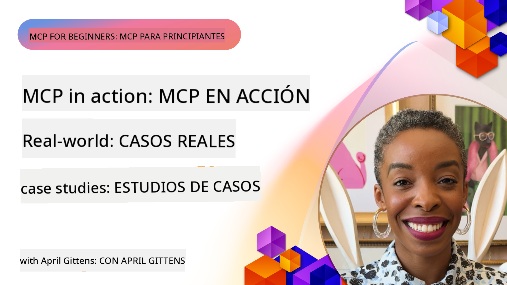

<!--
CO_OP_TRANSLATOR_METADATA:
{
  "original_hash": "1611dc5f6a2a35a789fc4c95fc5bfbe8",
  "translation_date": "2025-09-26T17:32:30+00:00",
  "source_file": "09-CaseStudy/README.md",
  "language_code": "en"
}
-->
# MCP in Action: Real-World Case Studies

_(Click the image above to view the video for this lesson)_

The Model Context Protocol (MCP) is revolutionizing how AI applications interact with data, tools, and services. This section highlights real-world case studies that showcase practical applications of MCP in various enterprise scenarios.

## Overview

This section provides concrete examples of MCP implementations, illustrating how organizations are using this protocol to address complex business challenges. By exploring these case studies, you'll gain insights into the flexibility, scalability, and tangible benefits of MCP in real-world applications.

## Key Learning Objectives

By reviewing these case studies, you will:

- Learn how MCP can be applied to solve specific business challenges
- Explore different integration patterns and architectural approaches
- Understand best practices for implementing MCP in enterprise environments
- Gain insights into the obstacles and solutions encountered in real-world implementations
- Discover opportunities to apply similar patterns in your own projects

## Featured Case Studies

### 1. [Azure AI Travel Agents – Reference Implementation](./travelagentsample.md)

This case study explores Microsoft's comprehensive reference solution for building a multi-agent, AI-powered travel planning application using MCP, Azure OpenAI, and Azure AI Search. Key highlights include:

- Multi-agent orchestration enabled by MCP
- Integration of enterprise data using Azure AI Search
- Secure and scalable architecture leveraging Azure services
- Extensible tools with reusable MCP components
- Conversational user experience powered by Azure OpenAI

The architecture and implementation details offer valuable insights into creating complex, multi-agent systems with MCP as the coordination layer.

### 2. [Updating Azure DevOps Items from YouTube Data](./UpdateADOItemsFromYT.md)

This case study demonstrates a practical use of MCP for automating workflows. It showcases how MCP tools can:

- Extract data from online platforms like YouTube
- Update work items in Azure DevOps systems
- Create repeatable automation workflows
- Integrate data across different systems

This example highlights how even straightforward MCP implementations can significantly improve efficiency by automating routine tasks and ensuring data consistency across systems.

### 3. [Real-Time Documentation Retrieval with MCP](./docs-mcp/README.md)

This case study walks you through connecting a Python console client to an MCP server to retrieve and log real-time, context-aware Microsoft documentation. You'll learn how to:

- Connect to an MCP server using a Python client and the official MCP SDK
- Use streaming HTTP clients for efficient, real-time data retrieval
- Call documentation tools on the server and log responses directly to the console
- Seamlessly integrate up-to-date Microsoft documentation into your workflow without leaving the terminal

The chapter includes a hands-on assignment, a minimal working code sample, and links to additional resources for deeper learning. The walkthrough and code provide a clear understanding of how MCP can enhance documentation access and developer productivity in console-based environments.

### 4. [Interactive Study Plan Generator Web App with MCP](./docs-mcp/README.md)

This case study demonstrates how to create an interactive web application using Chainlit and MCP to generate personalized study plans for any topic. Users can specify a subject (e.g., "AI-900 certification") and a study duration (e.g., 8 weeks), and the app will provide a week-by-week breakdown of recommended content. Chainlit enables a conversational chat interface, making the experience engaging and adaptive.

- Conversational web app powered by Chainlit
- User-driven prompts for topic and duration
- Week-by-week content recommendations using MCP
- Real-time, adaptive responses in a chat interface

This project illustrates how conversational AI and MCP can be combined to create dynamic, user-driven educational tools in a modern web environment.

### 5. [In-Editor Docs with MCP Server in VS Code](./docs-mcp/README.md)

This case study shows how to bring Microsoft Learn Docs directly into your VS Code environment using the MCP server—eliminating the need to switch browser tabs. You'll learn how to:

- Instantly search and read documentation within VS Code using the MCP panel or command palette
- Reference documentation and insert links directly into your README or markdown files
- Use GitHub Copilot and MCP together for seamless, AI-powered documentation and code workflows
- Validate and enhance your documentation with real-time feedback and Microsoft-sourced accuracy
- Integrate MCP with GitHub workflows for continuous documentation validation

The implementation includes:

- Example `.vscode/mcp.json` configuration for easy setup
- Screenshot-based walkthroughs of the in-editor experience
- Tips for combining Copilot and MCP for maximum productivity

This scenario is ideal for course authors, documentation writers, and developers who want to stay focused in their editor while working with documentation, Copilot, and validation tools—all powered by MCP.

### 6. [APIM MCP Server Creation](./apimsample.md)

This case study provides a step-by-step guide to creating an MCP server using Azure API Management (APIM). It covers:

- Setting up an MCP server in Azure API Management
- Exposing API operations as MCP tools
- Configuring policies for rate limiting and security
- Testing the MCP server using Visual Studio Code and GitHub Copilot

This example demonstrates how to use Azure's capabilities to create a robust MCP server that can be applied in various scenarios, enhancing the integration of AI systems with enterprise APIs.

### 7. [GitHub MCP Registry — Accelerating Agentic Integration](https://github.com/mcp)

This case study explores how GitHub's MCP Registry, launched in September 2025, addresses a critical challenge in the AI ecosystem: the fragmented discovery and deployment of MCP servers.

#### Overview
The **MCP Registry** resolves the growing issue of scattered MCP servers across repositories and registries, which previously made integration slow and error-prone. These servers enable AI agents to interact with external systems like APIs, databases, and documentation sources.

#### Problem Statement
Developers building agentic workflows faced several challenges:
- **Limited discoverability** of MCP servers across platforms
- **Redundant setup questions** scattered across forums and documentation
- **Security risks** from unverified sources
- **Lack of standardization** in server quality and compatibility

#### Solution Architecture
GitHub's MCP Registry centralizes trusted MCP servers with key features:
- **One-click install** integration via VS Code for streamlined setup
- **Signal-over-noise sorting** by stars, activity, and community validation
- **Direct integration** with GitHub Copilot and other MCP-compatible tools
- **Open contribution model** allowing both community and enterprise partners to contribute

#### Business Impact
The registry has delivered measurable improvements:
- **Faster onboarding** for developers using tools like the Microsoft Learn MCP Server, which streams official documentation directly into agents
- **Enhanced productivity** via specialized servers like `github-mcp-server`, enabling natural language GitHub automation (PR creation, CI reruns, code scanning)
- **Stronger ecosystem trust** through curated listings and transparent configuration standards

#### Strategic Value
For practitioners specializing in agent lifecycle management and reproducible workflows, the MCP Registry offers:
- **Modular agent deployment** with standardized components
- **Registry-backed evaluation pipelines** for consistent testing and validation
- **Cross-tool interoperability** enabling seamless integration across AI platforms

This case study demonstrates that the MCP Registry is more than just a directory—it’s a foundational platform for scalable, real-world model integration and agentic system deployment.

## Conclusion

These seven detailed case studies showcase the incredible versatility and practical applications of the Model Context Protocol across diverse real-world scenarios. From complex multi-agent travel planning systems and enterprise API management to streamlined documentation workflows and the groundbreaking GitHub MCP Registry, these examples illustrate how MCP provides a standardized, scalable way to connect AI systems with the tools, data, and services they need to deliver exceptional value.

The case studies cover multiple dimensions of MCP implementation:
- **Enterprise Integration**: Azure API Management and Azure DevOps automation
- **Multi-Agent Orchestration**: Travel planning with coordinated AI agents
- **Developer Productivity**: VS Code integration and real-time documentation access
- **Ecosystem Development**: GitHub's MCP Registry as a foundational platform
- **Educational Applications**: Interactive study plan generators and conversational interfaces

By studying these implementations, you gain critical insights into:
- **Architectural patterns** for different scales and use cases
- **Implementation strategies** balancing functionality and maintainability
- **Security and scalability** considerations for production deployments
- **Best practices** for MCP server development and client integration
- **Ecosystem thinking** for building interconnected AI-powered solutions

These examples collectively demonstrate that MCP is not just a theoretical framework but a mature, production-ready protocol enabling practical solutions to complex business challenges. Whether you're developing simple automation tools or sophisticated multi-agent systems, the patterns and approaches illustrated here provide a solid foundation for your own MCP projects.

## Additional Resources

- [Azure AI Travel Agents GitHub Repository](https://github.com/Azure-Samples/azure-ai-travel-agents)
- [Azure DevOps MCP Tool](https://github.com/microsoft/azure-devops-mcp)
- [Playwright MCP Tool](https://github.com/microsoft/playwright-mcp)
- [Microsoft Docs MCP Server](https://github.com/MicrosoftDocs/mcp)
- [GitHub MCP Registry — Accelerating Agentic Integration](https://github.com/mcp)
- [MCP Community Examples](https://github.com/microsoft/mcp)

Next: Hands-on Lab [Streamlining AI Workflows: Building an MCP Server with AI Toolkit](../10-StreamliningAIWorkflowsBuildingAnMCPServerWithAIToolkit/README.md)

---

