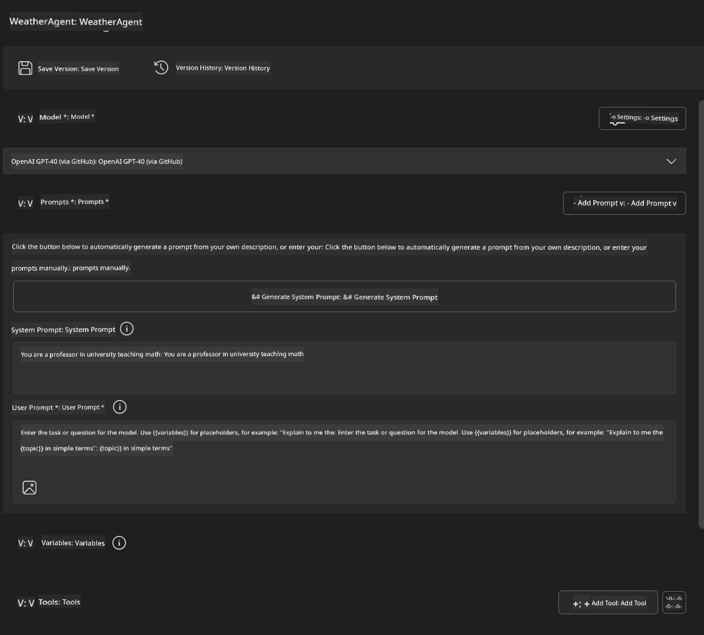
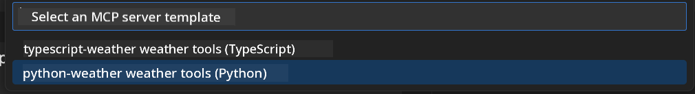
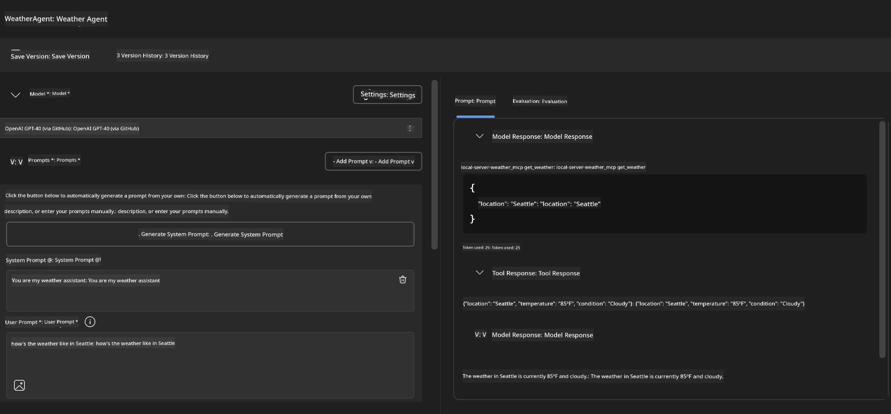

<!--
CO_OP_TRANSLATOR_METADATA:
{
  "original_hash": "dd8da3f75addcef453fe11f02a270217",
  "translation_date": "2025-07-14T08:06:01+00:00",
  "source_file": "10-StreamliningAIWorkflowsBuildingAnMCPServerWithAIToolkit/lab3/README.md",
  "language_code": "en"
}
-->
# 🔧 Module 3: Advanced MCP Development with AI Toolkit


## 🎯 Learning Objectives

By the end of this lab, you will be able to:

- ✅ Build custom MCP servers using the AI Toolkit
- ✅ Configure and work with the latest MCP Python SDK (v1.9.3)
- ✅ Set up and use the MCP Inspector for debugging
- ✅ Debug MCP servers in both Agent Builder and Inspector environments
- ✅ Understand advanced workflows for MCP server development

## 📋 Prerequisites

- Completion of Lab 2 (MCP Fundamentals)
- VS Code with AI Toolkit extension installed
- Python 3.10+ environment
- Node.js and npm for setting up Inspector

## 🏗️ What You'll Build

In this lab, you'll create a **Weather MCP Server** that showcases:
- Custom MCP server implementation
- Integration with AI Toolkit Agent Builder
- Professional debugging workflows
- Modern MCP SDK usage patterns

---

## 🔧 Core Components Overview

### 🐍 MCP Python SDK
The Model Context Protocol Python SDK is the foundation for building custom MCP servers. You'll use version 1.9.3, which includes improved debugging features.

### 🔍 MCP Inspector
A powerful debugging tool that offers:
- Real-time server monitoring
- Visualization of tool execution
- Inspection of network requests and responses
- An interactive testing environment

---

## 📖 Step-by-Step Implementation

### Step 1: Create a WeatherAgent in Agent Builder

1. **Open Agent Builder** in VS Code via the AI Toolkit extension
2. **Create a new agent** with the following settings:
   - Agent Name: `WeatherAgent`



### Step 2: Initialize MCP Server Project

1. **Go to Tools** → **Add Tool** in Agent Builder
2. **Select "MCP Server"** from the options
3. **Choose "Create A new MCP Server"**
4. **Pick the `python-weather` template**
5. **Name your server:** `weather_mcp`



### Step 3: Open and Review the Project

1. **Open the generated project** in VS Code
2. **Examine the project structure:**
   ```
   weather_mcp/
   ├── src/
   │   ├── __init__.py
   │   └── server.py
   ├── inspector/
   │   ├── package.json
   │   └── package-lock.json
   ├── .vscode/
   │   ├── launch.json
   │   └── tasks.json
   ├── pyproject.toml
   └── README.md
   ```

### Step 4: Upgrade to the Latest MCP SDK

> **🔍 Why Upgrade?** We want to use the latest MCP SDK (v1.9.3) and Inspector service (0.14.0) to access new features and improved debugging.

#### 4a. Update Python Dependencies

**Edit `pyproject.toml`:** update [./code/weather_mcp/pyproject.toml](../../../../10-StreamliningAIWorkflowsBuildingAnMCPServerWithAIToolkit/lab3/code/weather_mcp/pyproject.toml)

#### 4b. Update Inspector Configuration

**Edit `inspector/package.json`:** update [./code/weather_mcp/inspector/package.json](../../../../10-StreamliningAIWorkflowsBuildingAnMCPServerWithAIToolkit/lab3/code/weather_mcp/inspector/package.json)

#### 4c. Update Inspector Dependencies

**Edit `inspector/package-lock.json`:** update [./code/weather_mcp/inspector/package-lock.json](../../../../10-StreamliningAIWorkflowsBuildingAnMCPServerWithAIToolkit/lab3/code/weather_mcp/inspector/package-lock.json)

> **📝 Note:** This file contains detailed dependency definitions. Below is the essential structure — the full file ensures proper dependency resolution.

> **⚡ Full Package Lock:** The complete package-lock.json has about 3000 lines of dependencies. The snippet above shows the key structure — use the provided file for full dependency resolution.

### Step 5: Configure VS Code Debugging

*Note: Please copy the file at the specified path to replace the corresponding local file*

#### 5a. Update Launch Configuration

**Edit `.vscode/launch.json`:**

```json
{
  "version": "0.2.0",
  "configurations": [
    {
      "name": "Attach to Local MCP",
      "type": "debugpy",
      "request": "attach",
      "connect": {
        "host": "localhost",
        "port": 5678
      },
      "presentation": {
        "hidden": true
      },
      "internalConsoleOptions": "neverOpen",
      "postDebugTask": "Terminate All Tasks"
    },
    {
      "name": "Launch Inspector (Edge)",
      "type": "msedge",
      "request": "launch",
      "url": "http://localhost:6274?timeout=60000&serverUrl=http://localhost:3001/sse#tools",
      "cascadeTerminateToConfigurations": [
        "Attach to Local MCP"
      ],
      "presentation": {
        "hidden": true
      },
      "internalConsoleOptions": "neverOpen"
    },
    {
      "name": "Launch Inspector (Chrome)",
      "type": "chrome",
      "request": "launch",
      "url": "http://localhost:6274?timeout=60000&serverUrl=http://localhost:3001/sse#tools",
      "cascadeTerminateToConfigurations": [
        "Attach to Local MCP"
      ],
      "presentation": {
        "hidden": true
      },
      "internalConsoleOptions": "neverOpen"
    }
  ],
  "compounds": [
    {
      "name": "Debug in Agent Builder",
      "configurations": [
        "Attach to Local MCP"
      ],
      "preLaunchTask": "Open Agent Builder",
    },
    {
      "name": "Debug in Inspector (Edge)",
      "configurations": [
        "Launch Inspector (Edge)",
        "Attach to Local MCP"
      ],
      "preLaunchTask": "Start MCP Inspector",
      "stopAll": true
    },
    {
      "name": "Debug in Inspector (Chrome)",
      "configurations": [
        "Launch Inspector (Chrome)",
        "Attach to Local MCP"
      ],
      "preLaunchTask": "Start MCP Inspector",
      "stopAll": true
    }
  ]
}
```

**Edit `.vscode/tasks.json`:**

```
{
  "version": "2.0.0",
  "tasks": [
    {
      "label": "Start MCP Server",
      "type": "shell",
      "command": "python -m debugpy --listen 127.0.0.1:5678 src/__init__.py sse",
      "isBackground": true,
      "options": {
        "cwd": "${workspaceFolder}",
        "env": {
          "PORT": "3001"
        }
      },
      "problemMatcher": {
        "pattern": [
          {
            "regexp": "^.*$",
            "file": 0,
            "location": 1,
            "message": 2
          }
        ],
        "background": {
          "activeOnStart": true,
          "beginsPattern": ".*",
          "endsPattern": "Application startup complete|running"
        }
      }
    },
    {
      "label": "Start MCP Inspector",
      "type": "shell",
      "command": "npm run dev:inspector",
      "isBackground": true,
      "options": {
        "cwd": "${workspaceFolder}/inspector",
        "env": {
          "CLIENT_PORT": "6274",
          "SERVER_PORT": "6277",
        }
      },
      "problemMatcher": {
        "pattern": [
          {
            "regexp": "^.*$",
            "file": 0,
            "location": 1,
            "message": 2
          }
        ],
        "background": {
          "activeOnStart": true,
          "beginsPattern": "Starting MCP inspector",
          "endsPattern": "Proxy server listening on port"
        }
      },
      "dependsOn": [
        "Start MCP Server"
      ]
    },
    {
      "label": "Open Agent Builder",
      "type": "shell",
      "command": "echo ${input:openAgentBuilder}",
      "presentation": {
        "reveal": "never"
      },
      "dependsOn": [
        "Start MCP Server"
      ],
    },
    {
      "label": "Terminate All Tasks",
      "command": "echo ${input:terminate}",
      "type": "shell",
      "problemMatcher": []
    }
  ],
  "inputs": [
    {
      "id": "openAgentBuilder",
      "type": "command",
      "command": "ai-mlstudio.agentBuilder",
      "args": {
        "initialMCPs": [ "local-server-weather_mcp" ],
        "triggeredFrom": "vsc-tasks"
      }
    },
    {
      "id": "terminate",
      "type": "command",
      "command": "workbench.action.tasks.terminate",
      "args": "terminateAll"
    }
  ]
}
```

---

## 🚀 Running and Testing Your MCP Server

### Step 6: Install Dependencies

After updating configurations, run the following commands:

**Install Python dependencies:**
```bash
uv sync
```

**Install Inspector dependencies:**
```bash
cd inspector
npm install
```

### Step 7: Debug with Agent Builder

1. **Press F5** or select the **"Debug in Agent Builder"** configuration
2. **Choose the compound configuration** from the debug panel
3. **Wait for the server to start** and Agent Builder to launch
4. **Test your weather MCP server** using natural language queries

Example input prompt:

SYSTEM_PROMPT

```
You are my weather assistant
```

USER_PROMPT

```
How's the weather like in Seattle
```



### Step 8: Debug with MCP Inspector

1. **Select the "Debug in Inspector"** configuration (Edge or Chrome)
2. **Open the Inspector interface** at `http://localhost:6274`
3. **Explore the interactive testing environment:**
   - View available tools
   - Test tool execution
   - Monitor network requests
   - Debug server responses


---

## 🎯 Key Learning Outcomes

By completing this lab, you have:

- [x] **Built a custom MCP server** using AI Toolkit templates
- [x] **Upgraded to the latest MCP SDK** (v1.9.3) for improved features
- [x] **Set up professional debugging workflows** for both Agent Builder and Inspector
- [x] **Configured the MCP Inspector** for interactive server testing
- [x] **Mastered VS Code debugging setups** for MCP development

## 🔧 Advanced Features Explored

| Feature | Description | Use Case |
|---------|-------------|----------|
| **MCP Python SDK v1.9.3** | Latest protocol implementation | Modern server development |
| **MCP Inspector 0.14.0** | Interactive debugging tool | Real-time server testing |
| **VS Code Debugging** | Integrated development environment | Professional debugging workflow |
| **Agent Builder Integration** | Direct AI Toolkit connection | End-to-end agent testing |

## 📚 Additional Resources

- [MCP Python SDK Documentation](https://modelcontextprotocol.io/docs/sdk/python)
- [AI Toolkit Extension Guide](https://code.visualstudio.com/docs/ai/ai-toolkit)
- [VS Code Debugging Documentation](https://code.visualstudio.com/docs/editor/debugging)
- [Model Context Protocol Specification](https://modelcontextprotocol.io/docs/concepts/architecture)

---

**🎉 Congratulations!** You’ve successfully completed Lab 3 and can now create, debug, and deploy custom MCP servers using professional development workflows.

### 🔜 Continue to Next Module

Ready to apply your MCP skills in a real-world development workflow? Proceed to **[Module 4: Practical MCP Development - Custom GitHub Clone Server](../lab4/README.md)** where you will:
- Build a production-ready MCP server that automates GitHub repository operations
- Implement GitHub repository cloning functionality via MCP
- Integrate custom MCP servers with VS Code and GitHub Copilot Agent Mode
- Test and deploy custom MCP servers in production environments
- Learn practical workflow automation for developers

**Disclaimer**:  
This document has been translated using the AI translation service [Co-op Translator](https://github.com/Azure/co-op-translator). While we strive for accuracy, please be aware that automated translations may contain errors or inaccuracies. The original document in its native language should be considered the authoritative source. For critical information, professional human translation is recommended. We are not liable for any misunderstandings or misinterpretations arising from the use of this translation.