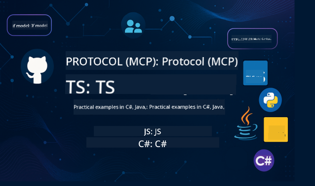

<!--
CO_OP_TRANSLATOR_METADATA:
{
  "original_hash": "866c8877136cb03e1efb9ad633a2f0a6",
  "translation_date": "2025-08-26T16:58:55+00:00",
  "source_file": "README.md",
  "language_code": "en"
}
-->
 

  
  
  
  

  
  
  

  

Follow these steps to start using these resources:  
1. **Fork the Repository**: Click   
2. **Clone the Repository**:   `git clone https://github.com/microsoft/mcp-for-beginners.git`  
3. [**Join The Azure AI Foundry Discord and connect with experts and fellow developers**](https://discord.com/invite/ByRwuEEgH4)  

### 🌐 Multi-Language Support  

#### Supported via GitHub Action (Automated & Always Up-to-Date)  

 [Arabic](../ar/README.md) | [Bengali](../bn/README.md) | [Bulgarian](../bg/README.md) | [Burmese (Myanmar)](../my/README.md) | [Chinese (Simplified)](../zh/README.md) | [Chinese (Traditional, Hong Kong)](../hk/README.md) | [Chinese (Traditional, Macau)](../mo/README.md) | [Chinese (Traditional, Taiwan)](../tw/README.md) | [Croatian](../hr/README.md) | [Czech](../cs/README.md) | [Danish](../da/README.md) | [Dutch](../nl/README.md) | [Finnish](../fi/README.md) | [French](../fr/README.md) | [German](../de/README.md) | [Greek](../el/README.md) | [Hebrew](../he/README.md) | [Hindi](../hi/README.md) | [Hungarian](../hu/README.md) | [Indonesian](../id/README.md) | [Italian](../it/README.md) | [Japanese](../ja/README.md) | [Korean](../ko/README.md) | [Malay](../ms/README.md) | [Marathi](../mr/README.md) | [Nepali](../ne/README.md) | [Norwegian](../no/README.md) | [Persian (Farsi)](../fa/README.md) | [Polish](../pl/README.md) | [Portuguese (Brazil)](../br/README.md) | [Portuguese (Portugal)](../pt/README.md) | [Punjabi (Gurmukhi)](../pa/README.md) | [Romanian](../ro/README.md) | [Russian](../ru/README.md) | [Serbian (Cyrillic)](../sr/README.md) | [Slovak](../sk/README.md) | [Slovenian](../sl/README.md) | [Spanish](../es/README.md) | [Swahili](../sw/README.md) | [Swedish](../sv/README.md) | [Tagalog (Filipino)](../tl/README.md) | [Thai](../th/README.md) | [Turkish](../tr/README.md) | [Ukrainian](../uk/README.md) | [Urdu](../ur/README.md) | [Vietnamese](../vi/README.md)  

# 🚀 Model Context Protocol (MCP) Curriculum for Beginners  

## **Learn MCP with Hands-on Code Examples in C#, Java, JavaScript, Rust, Python, and TypeScript**  

## 🧠 Overview of the Model Context Protocol Curriculum  

The **Model Context Protocol (MCP)** is an innovative framework designed to standardize interactions between AI models and client applications. This open-source curriculum provides a structured learning path, complete with practical coding examples and real-world use cases, across popular programming languages like C#, Java, JavaScript, TypeScript, and Python.  

Whether you're an AI developer, system architect, or software engineer, this guide is your all-in-one resource for mastering MCP fundamentals and implementation strategies.  

## 🔗 Official MCP Resources  

- 📘 [MCP Documentation](https://modelcontextprotocol.io/) – Comprehensive tutorials and user guides  
- 📜 [MCP Specification](https://modelcontextprotocol.io/docs/) – Protocol architecture and technical references  
- 📜 [Original MCP Specification](https://spec.modelcontextprotocol.io/) – Legacy technical references (may include additional details)  
- 🧑‍💻 [MCP GitHub Repository](https://github.com/modelcontextprotocol) – Open-source SDKs, tools, and code samples  
- 🌐 [MCP Community](https://github.com/orgs/modelcontextprotocol/discussions) – Join discussions and contribute to the community  

## 🧭 MCP Curriculum Overview  

### 📚 Complete Curriculum Structure  

| Module | Topic | Description | Link |  
|--------|-------|-------------|------|  
| **Module 1-3: Fundamentals** | | | |  
| 00 | Introduction to MCP | Overview of the Model Context Protocol and its importance in AI pipelines | [Read more](./00-Introduction/README.md) |  
| 01 | Core Concepts Explained | Detailed exploration of core MCP concepts | [Read more](./01-CoreConcepts/README.md) |  
| 02 | Security in MCP | Security threats and best practices | [Read more](./02-Security/README.md) |  
| 03 | Getting Started with MCP | Environment setup, basic servers/clients, integration | [Read more](./03-GettingStarted/README.md) |  
| **Module 3: Building Your First Server & Client** | | | |  
| 3.1 | First Server | Create your first MCP server | [Guide](./03-GettingStarted/01-first-server/README.md) |  
| 3.2 | First Client | Develop a basic MCP client | [Guide](./03-GettingStarted/02-client/README.md) |  
| 3.3 | Client with LLM | Integrate large language models | [Guide](./03-GettingStarted/03-llm-client/README.md) |  
| 3.4 | VS Code Integration | Consume MCP servers in VS Code | [Guide](./03-GettingStarted/04-vscode/README.md) |  
| 3.5 | stdio Server | Create servers using stdio transport | [Guide](./03-GettingStarted/05-stdio-server/README.md) |  
| 3.6 | HTTP Streaming | Implement HTTP streaming in MCP | [Guide](./03-GettingStarted/06-http-streaming/README.md) |  
| 3.7 | AI Toolkit | Use AI Toolkit with MCP | [Guide](./03-GettingStarted/07-aitk/README.md) |  
| 3.8 | Testing | Test your MCP server implementation | [Guide](./03-GettingStarted/08-testing/README.md) |  
| 3.9 | Deployment | Deploy MCP servers to production | [Guide](./03-GettingStarted/09-deployment/README.md) |  
| **Module 4-5: Practical & Advanced** | | | |  
| 04 | Practical Implementation | SDKs, debugging, testing, reusable prompt templates | [Read more](./04-PracticalImplementation/README.md) |  
| 05 | Advanced Topics in MCP | Multi-modal AI, scaling, enterprise use | [Read more](./05-AdvancedTopics/README.md) |  
| 5.1 | Azure Integration | MCP Integration with Azure | [Guide](./05-AdvancedTopics/mcp-integration/README.md) |  
| 5.2 | Multi-modality | Working with multiple modalities | [Guide](./05-AdvancedTopics/mcp-multi-modality/README.md) |  
| 5.3 | OAuth2 Demo | Implement OAuth2 authentication | [Guide](./05-AdvancedTopics/mcp-oauth2-demo/README.md) |  
| 5.4 | Root Contexts | Understand and implement root contexts | [Guide](./05-AdvancedTopics/mcp-root-contexts/README.md) |  
| 5.5 | Routing | MCP routing strategies | [Guide](./05-AdvancedTopics/mcp-routing/README.md) |  
| 5.6 | Sampling | Sampling techniques in MCP | [Guide](./05-AdvancedTopics/mcp-sampling/README.md) |  
| 5.7 | Scaling | Scale MCP implementations | [Guide](./05-AdvancedTopics/mcp-scaling/README.md) |  
| 5.8 | Security | Advanced security considerations | [Guide](./05-AdvancedTopics/mcp-security/README.md) |  
| 5.9 | Web Search | Implement web search capabilities | [Guide](./05-AdvancedTopics/web-search-mcp/README.md) |  
| 5.10 | Realtime Streaming | Build realtime streaming functionality | [Guide](./05-AdvancedTopics/mcp-realtimestreaming/README.md) |  
| 5.11 | Realtime Search | Implement realtime search | [Guide](./05-AdvancedTopics/mcp-realtimesearch/README.md) |  
| 5.12 | Entra ID Auth | Authentication with Microsoft Entra ID | [Guide](./05-AdvancedTopics/mcp-security-entra/README.md) |  
| 5.13 | Foundry Integration | Integrate with Azure AI Foundry | [Guide](./05-AdvancedTopics/mcp-foundry-agent-integration/README.md) |  
| 5.14 | Context Engineering | Techniques for effective context engineering | [Guide](./05-AdvancedTopics/mcp-contextengineering/README.md) |  
| **Module 6-10: Community & Best Practices** | | | |  
| 06 | Community Contributions | How to contribute to the MCP ecosystem | [Guide](./06-CommunityContributions/README.md) |  
| 07 | Insights from Early Adoption | Real-world implementation stories | [Guide](./07-LessonsFromEarlyAdoption/README.md) |  
| 08 | Best Practices for MCP | Performance, fault-tolerance, resilience | [Guide](./08-BestPractices/README.md) |  
| 09 | MCP Case Studies | Practical implementation examples | [Guide](./09-CaseStudy/README.md) |  
| 10 | Hands-on Workshop | Building an MCP Server with AI Toolkit | [Lab](./10-StreamliningAIWorkflowsBuildingAnMCPServerWithAIToolkit/README.md) |  

### 💻 Sample Code Projects  

#### Basic MCP Calculator Samples  

| Language | Description | Link |  
|----------|-------------|------|  
| C# | MCP Server Example | [View Code](./03-GettingStarted/samples/csharp/README.md) |  
| Java | MCP Calculator | [View Code](./03-GettingStarted/samples/java/calculator/README.md) |  
| JavaScript | MCP Demo | [View Code](./03-GettingStarted/samples/javascript/README.md) |  
| Python | MCP Server | [View Code](../../03-GettingStarted/samples/python/mcp_calculator_server.py) |  
| TypeScript | MCP Example | [View Code](./03-GettingStarted/samples/typescript/README.md) |  
| Rust | MCP Example | [View Code](./03-GettingStarted/samples/rust/README.md) |  

#### Advanced MCP Implementations  

| Language | Description | Link |  
|----------|-------------|------|  
| C# | Advanced Example | [View Code](./04-PracticalImplementation/samples/csharp/README.md) |
| Java with Spring | Container App Example | [View Code](./04-PracticalImplementation/samples/java/containerapp/README.md) |
| JavaScript | Advanced Example | [View Code](./04-PracticalImplementation/samples/javascript/README.md) |
| Python | Complex Implementation | [View Code](../../04-PracticalImplementation/samples/python/READMEmd) |
| TypeScript | Container Example | [View Code](./04-PracticalImplementation/samples/typescript/README.md) |

## 🎯 Prerequisites for Learning MCP

To make the most of this curriculum, you should have:

- Basic programming knowledge in at least one of the following languages: C#, Java, JavaScript, Python, or TypeScript
- An understanding of the client-server model and APIs
- Familiarity with REST and HTTP concepts
- (Optional) Background knowledge in AI/ML concepts

- Participation in our community discussions for support

## 📚 Study Guide & Resources

This repository provides several resources to help you learn effectively:

### Study Guide

A detailed [Study Guide](./study_guide.md) is available to help you navigate this repository. The guide includes:

- A visual map of the curriculum covering all topics
- A detailed breakdown of each section in the repository
- Instructions on how to use the sample projects
- Suggested learning paths for different skill levels
- Additional resources to enhance your learning experience

### Changelog

We maintain a detailed [Changelog](./changelog.md) that records all major updates to the curriculum materials, including:

- New content additions
- Structural changes
- Feature enhancements
- Documentation updates

## 🛠️ How to Use This Curriculum Effectively

Each lesson in this guide includes:

1. Clear explanations of MCP concepts  
2. Live code examples in multiple programming languages  
3. Exercises to create real MCP applications  
4. Additional resources for advanced learners

## Events 

### [MCP Dev Days July 2025](https://developer.microsoft.com/en-us/reactor/series/S-1563/)
#### [➡️Watch on Demand - MCP Dev Days](https://developer.microsoft.com/en-us/reactor/series/S-1563/)
Prepare for two days of in-depth technical insights, community engagement, and hands-on learning at MCP Dev Days, a virtual event focused on the Model Context Protocol (MCP) — the emerging standard connecting AI models with the tools they depend on.
You can watch MCP Dev Days by registering on our event page: https://aka.ms/mcpdevdays. 

#### [Day 1: MCP Productivity, DevTools, & Community:](https://developer.microsoft.com/en-us/reactor/series/S-1563/)

This day is dedicated to empowering developers to incorporate MCP into their workflows and celebrating the vibrant MCP community. We’ll feature community members and partners like Arcade, Block, Okta, and Neon to showcase how they’re collaborating with Microsoft to build an open, extensible MCP ecosystem.  
Real-world demos across VS Code, Visual Studio, GitHub Copilot, and popular community tools  
Practical, context-driven development workflows  
Community-led sessions and insights  
Whether you’re new to MCP or already working with it, Day 1 will provide inspiration and actionable takeaways.

#### [Day 2: Build MCP Servers with Confidence](https://developer.microsoft.com/en-us/reactor/series/S-1563/)

This day is for MCP developers. We’ll dive deep into strategies and best practices for building MCP servers and integrating MCP into AI workflows.

#### Topics include:

- Creating MCP Servers and integrating them into agent experiences
- Prompt-driven development
- Security best practices
- Leveraging building blocks like Functions, ACA, and API Management
- Registry alignment and tooling (1P + 3P)

If you’re a developer, tool creator, or AI product strategist, this day is packed with insights to help you build scalable, secure, and future-ready MCP solutions.

### MCP Boot Camp August 2025
Learn through intensive video sessions how to build MCP servers, integrate with VS Code, and deploy professionally on Azure using content from the MCP for Beginners curriculum. Gain practical skills in a technology already adopted by major companies.

#### [➡️Watch on Demand MCP Bootcamp | English](https://developer.microsoft.com/en-us/reactor/series/s-1568/)
#### [➡️Watch on Demand MCP Bootcamp | Brasil](https://developer.microsoft.com/en-us/reactor/series/S-1566/)
#### [➡️Watch on Demand MCP Bootcamp | Spanish](https://developer.microsoft.com/en-us/reactor/series/S-1567/)

## 🌟 Community Thanks

Special thanks to Microsoft Valued Professional [Shivam Goyal](https://www.linkedin.com/in/shivam2003/) for contributing key code samples.

## 📜 License Information

This content is licensed under the **MIT License**. For terms and conditions, see the [LICENSE](../../LICENSE).

## 🤝 Contribution Guidelines

We welcome contributions and suggestions for this project. Most contributions require you to agree to a Contributor License Agreement (CLA), which confirms that you have the rights to grant us permission to use your contribution. For details, visit <https://cla.opensource.microsoft.com>.

When you submit a pull request, a CLA bot will automatically check whether you need to sign a CLA and will update the PR accordingly (e.g., status check, comment). Follow the instructions provided by the bot. You only need to do this once across all repositories using our CLA.

This project adheres to the [Microsoft Open Source Code of Conduct](https://opensource.microsoft.com/codeofconduct/).  
For more information, see the [Code of Conduct FAQ](https://opensource.microsoft.com/codeofconduct/faq/) or contact [opencode@microsoft.com](mailto:opencode@microsoft.com) with any additional questions or comments.

## 📂 Repository Structure

The repository is organized as follows:

- **Core Curriculum (00-10)**: The main content divided into ten sequential modules
- **images/**: Diagrams and illustrations used throughout the curriculum
- **translations/**: Multi-language support with automated translations
- **translated_images/**: Localized versions of diagrams and illustrations
- **study_guide.md**: Comprehensive guide to navigating the repository
- **changelog.md**: Record of all major changes to the curriculum materials
- **mcp.json**: Configuration file for MCP specification
- **CODE_OF_CONDUCT.md, LICENSE, SECURITY.md, SUPPORT.md**: Project governance documents

## 🎒 Other Courses
Our team offers additional courses! Check out:

- [AI Agents For Beginners](https://github.com/microsoft/ai-agents-for-beginners?WT.mc_id=academic-105485-koreyst)
- [Generative AI for Beginners using .NET](https://github.com/microsoft/Generative-AI-for-beginners-dotnet?WT.mc_id=academic-105485-koreyst)
- [Generative AI for Beginners using JavaScript](https://github.com/microsoft/generative-ai-with-javascript?WT.mc_id=academic-105485-koreyst)
- [Generative AI for Beginners](https://github.com/microsoft/generative-ai-for-beginners?WT.mc_id=academic-105485-koreyst)
- [Generative AI for Beginners using Java](https://github.com/microsoft/generative-ai-for-beginners-java?WT.mc_id=academic-105485-koreyst)
- [ML for Beginners](https://aka.ms/ml-beginners?WT.mc_id=academic-105485-koreyst)
- [Data Science for Beginners](https://aka.ms/datascience-beginners?WT.mc_id=academic-105485-koreyst)
- [AI for Beginners](https://aka.ms/ai-beginners?WT.mc_id=academic-105485-koreyst)
- [Cybersecurity for Beginners](https://github.com/microsoft/Security-101?WT.mc_id=academic-96948-sayoung)
- [Web Dev for Beginners](https://aka.ms/webdev-beginners?WT.mc_id=academic-105485-koreyst)
- [IoT for Beginners](https://aka.ms/iot-beginners?WT.mc_id=academic-105485-koreyst)
- [XR Development for Beginners](https://github.com/microsoft/xr-development-for-beginners?WT.mc_id=academic-105485-koreyst)
- [Mastering GitHub Copilot for AI Paired Programming](https://aka.ms/GitHubCopilotAI?WT.mc_id=academic-105485-koreyst)
- [Mastering GitHub Copilot for C#/.NET Developers](https://github.com/microsoft/mastering-github-copilot-for-dotnet-csharp-developers?WT.mc_id=academic-105485-koreyst)
- [Choose Your Own Copilot Adventure](https://github.com/microsoft/CopilotAdventures?WT.mc_id=academic-105485-koreyst)

## ™️ Trademark Notice

This project may include trademarks or logos for projects, products, or services. Authorized use of Microsoft trademarks or logos must comply with [Microsoft's Trademark & Brand Guidelines](https://www.microsoft.com/legal/intellectualproperty/trademarks/usage/general).  
Use of Microsoft trademarks or logos in modified versions of this project must not create confusion or imply Microsoft sponsorship.  
Any use of third-party trademarks or logos must adhere to the policies of those third parties.

---

**Disclaimer**:  
This document has been translated using the AI translation service [Co-op Translator](https://github.com/Azure/co-op-translator). While we aim for accuracy, please note that automated translations may include errors or inaccuracies. The original document in its native language should be regarded as the authoritative source. For critical information, professional human translation is advised. We are not responsible for any misunderstandings or misinterpretations resulting from the use of this translation.