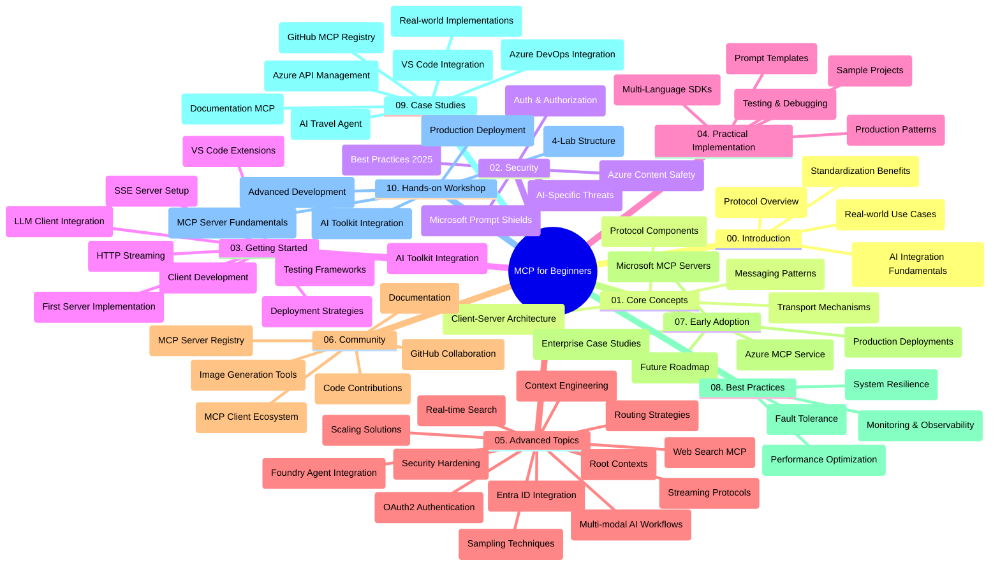

<!--
CO_OP_TRANSLATOR_METADATA:
{
  "original_hash": "719117a0a5f34ade7b5dfb61ee06fb13",
  "translation_date": "2025-09-26T17:32:10+00:00",
  "source_file": "study_guide.md",
  "language_code": "en"
}
-->
# Model Context Protocol (MCP) for Beginners - Study Guide

This study guide offers an overview of the repository structure and content for the "Model Context Protocol (MCP) for Beginners" curriculum. Use it to navigate the repository effectively and maximize the available resources.

## Repository Overview

The Model Context Protocol (MCP) is a standardized framework for facilitating interactions between AI models and client applications. Originally developed by Anthropic, MCP is now maintained by the broader MCP community through its official GitHub organization. This repository provides a detailed curriculum with hands-on code examples in C#, Java, JavaScript, Python, and TypeScript, tailored for AI developers, system architects, and software engineers.

## Visual Curriculum Map

## Repository Structure

The repository is divided into ten main sections, each focusing on different aspects of MCP:

1. **Introduction (00-Introduction/)**
   - Overview of the Model Context Protocol
   - Importance of standardization in AI pipelines
   - Practical use cases and benefits

2. **Core Concepts (01-CoreConcepts/)**
   - Client-server architecture
   - Key components of the protocol
   - Messaging patterns in MCP

3. **Security (02-Security/)**
   - Security risks in MCP-based systems
   - Best practices for secure implementations
   - Authentication and authorization strategies
   - **Comprehensive Security Documentation**:
     - MCP Security Best Practices 2025
     - Azure Content Safety Implementation Guide
     - MCP Security Controls and Techniques
     - MCP Best Practices Quick Reference
   - **Key Security Topics**:
     - Prompt injection and tool poisoning attacks
     - Session hijacking and confused deputy problems
     - Token passthrough vulnerabilities
     - Excessive permissions and access control
     - Supply chain security for AI components
     - Microsoft Prompt Shields integration

4. **Getting Started (03-GettingStarted/)**
   - Setting up and configuring your environment
   - Building basic MCP servers and clients
   - Integrating MCP with existing applications
   - Includes sections for:
     - First server implementation
     - Client development
     - LLM client integration
     - VS Code integration
     - Server-Sent Events (SSE) server
     - HTTP streaming
     - AI Toolkit integration
     - Testing strategies
     - Deployment guidelines

5. **Practical Implementation (04-PracticalImplementation/)**
   - Using SDKs across various programming languages
   - Debugging, testing, and validation techniques
   - Creating reusable prompt templates and workflows
   - Sample projects with implementation examples

6. **Advanced Topics (05-AdvancedTopics/)**
   - Context engineering techniques
   - Foundry agent integration
   - Multi-modal AI workflows
   - OAuth2 authentication demos
   - Real-time search capabilities
   - Real-time streaming
   - Root contexts implementation
   - Routing strategies
   - Sampling techniques
   - Scaling approaches
   - Security considerations
   - Entra ID security integration
   - Web search integration

7. **Community Contributions (06-CommunityContributions/)**
   - Guidelines for contributing code and documentation
   - Collaborating via GitHub
   - Community-driven enhancements and feedback
   - Using various MCP clients (Claude Desktop, Cline, VSCode)
   - Working with popular MCP servers, including image generation

8. **Lessons from Early Adoption (07-LessonsfromEarlyAdoption/)**
   - Real-world implementations and success stories
   - Building and deploying MCP-based solutions
   - Trends and future roadmap
   - **Microsoft MCP Servers Guide**: Detailed guide to 10 production-ready Microsoft MCP servers, including:
     - Microsoft Learn Docs MCP Server
     - Azure MCP Server (15+ specialized connectors)
     - GitHub MCP Server
     - Azure DevOps MCP Server
     - MarkItDown MCP Server
     - SQL Server MCP Server
     - Playwright MCP Server
     - Dev Box MCP Server
     - Azure AI Foundry MCP Server
     - Microsoft 365 Agents Toolkit MCP Server

9. **Best Practices (08-BestPractices/)**
   - Performance tuning and optimization
   - Designing fault-tolerant MCP systems
   - Testing and resilience strategies

10. **Case Studies (09-CaseStudy/)**
    - **Seven detailed case studies** showcasing MCP's versatility across various scenarios:
    - **Azure AI Travel Agents**: Multi-agent orchestration with Azure OpenAI and AI Search
    - **Azure DevOps Integration**: Automating workflow processes with YouTube data updates
    - **Real-Time Documentation Retrieval**: Python console client with streaming HTTP
    - **Interactive Study Plan Generator**: Chainlit web app with conversational AI
    - **In-Editor Documentation**: VS Code integration with GitHub Copilot workflows
    - **Azure API Management**: Enterprise API integration with MCP server creation
    - **GitHub MCP Registry**: Ecosystem development and agentic integration platform
    - Implementation examples spanning enterprise integration, developer productivity, and ecosystem development

11. **Hands-on Workshop (10-StreamliningAIWorkflowsBuildingAnMCPServerWithAIToolkit/)**
    - Comprehensive hands-on workshop combining MCP with AI Toolkit
    - Building intelligent applications that connect AI models with real-world tools
    - Practical modules covering fundamentals, custom server development, and production deployment strategies
    - **Lab Structure**:
      - Lab 1: MCP Server Fundamentals
      - Lab 2: Advanced MCP Server Development
      - Lab 3: AI Toolkit Integration
      - Lab 4: Production Deployment and Scaling
    - Lab-based learning approach with step-by-step instructions

## Additional Resources

The repository includes supplementary resources:

- **Images folder**: Contains diagrams and illustrations used throughout the curriculum
- **Translations**: Multi-language support with automated translations of documentation
- **Official MCP Resources**:
  - [MCP Documentation](https://modelcontextprotocol.io/)
  - [MCP Specification](https://spec.modelcontextprotocol.io/)
  - [MCP GitHub Repository](https://github.com/modelcontextprotocol)

## How to Use This Repository

1. **Sequential Learning**: Follow the chapters in order (00 through 10) for a structured learning experience.
2. **Language-Specific Focus**: If you're interested in a specific programming language, explore the samples directories for implementations in your preferred language.
3. **Practical Implementation**: Begin with the "Getting Started" section to set up your environment and create your first MCP server and client.
4. **Advanced Exploration**: Once you've mastered the basics, delve into the advanced topics to deepen your understanding.
5. **Community Engagement**: Join the MCP community through GitHub discussions and Discord channels to connect with experts and fellow developers.

## MCP Clients and Tools

The curriculum covers various MCP clients and tools:

1. **Official Clients**:
   - Visual Studio Code 
   - MCP in Visual Studio Code
   - Claude Desktop
   - Claude in VSCode 
   - Claude API

2. **Community Clients**:
   - Cline (terminal-based)
   - Cursor (code editor)
   - ChatMCP
   - Windsurf

3. **MCP Management Tools**:
   - MCP CLI
   - MCP Manager
   - MCP Linker
   - MCP Router

## Popular MCP Servers

The repository introduces various MCP servers, including:

1. **Official Microsoft MCP Servers**:
   - Microsoft Learn Docs MCP Server
   - Azure MCP Server (15+ specialized connectors)
   - GitHub MCP Server
   - Azure DevOps MCP Server
   - MarkItDown MCP Server
   - SQL Server MCP Server
   - Playwright MCP Server
   - Dev Box MCP Server
   - Azure AI Foundry MCP Server
   - Microsoft 365 Agents Toolkit MCP Server

2. **Official Reference Servers**:
   - Filesystem
   - Fetch
   - Memory
   - Sequential Thinking

3. **Image Generation**:
   - Azure OpenAI DALL-E 3
   - Stable Diffusion WebUI
   - Replicate

4. **Development Tools**:
   - Git MCP
   - Terminal Control
   - Code Assistant

5. **Specialized Servers**:
   - Salesforce
   - Microsoft Teams
   - Jira & Confluence

## Contributing

This repository welcomes contributions from the community. Refer to the Community Contributions section for guidance on how to contribute effectively to the MCP ecosystem.

## Changelog

| Date | Changes |
|------|---------|
| September 26, 2025 | - Added GitHub MCP Registry case study to 09-CaseStudy section - Updated Case Studies to reflect seven comprehensive case studies - Enhanced case study descriptions with specific implementation details - Updated Visual Curriculum Map to include GitHub MCP Registry - Revised study guide structure to reflect ecosystem development focus |
| July 18, 2025 | - Updated repository structure to include Microsoft MCP Servers Guide - Added comprehensive list of 10 production-ready Microsoft MCP servers - Enhanced Popular MCP Servers section with Official Microsoft MCP Servers - Updated Case Studies section with actual file examples - Added Lab Structure details for Hands-on Workshop |
| July 16, 2025 | - Updated repository structure to reflect current content - Added MCP Clients and Tools section - Added Popular MCP Servers section - Updated Visual Curriculum Map with all current topics - Enhanced Advanced Topics section with all specialized areas - Updated Case Studies to reflect actual examples - Clarified MCP origin as created by Anthropic |
| June 11, 2025 | - Initial creation of the study guide - Added Visual Curriculum Map - Outlined repository structure - Included sample projects and additional resources |

---

*This study guide was updated on September 26, 2025, and provides an overview of the repository as of that date. Repository content may be updated after this date.*

---

