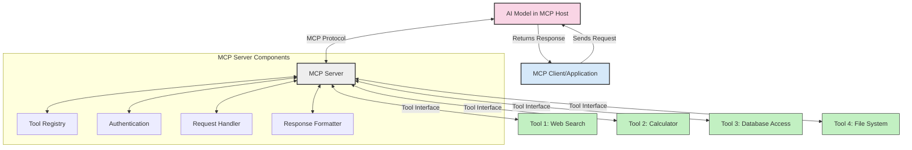
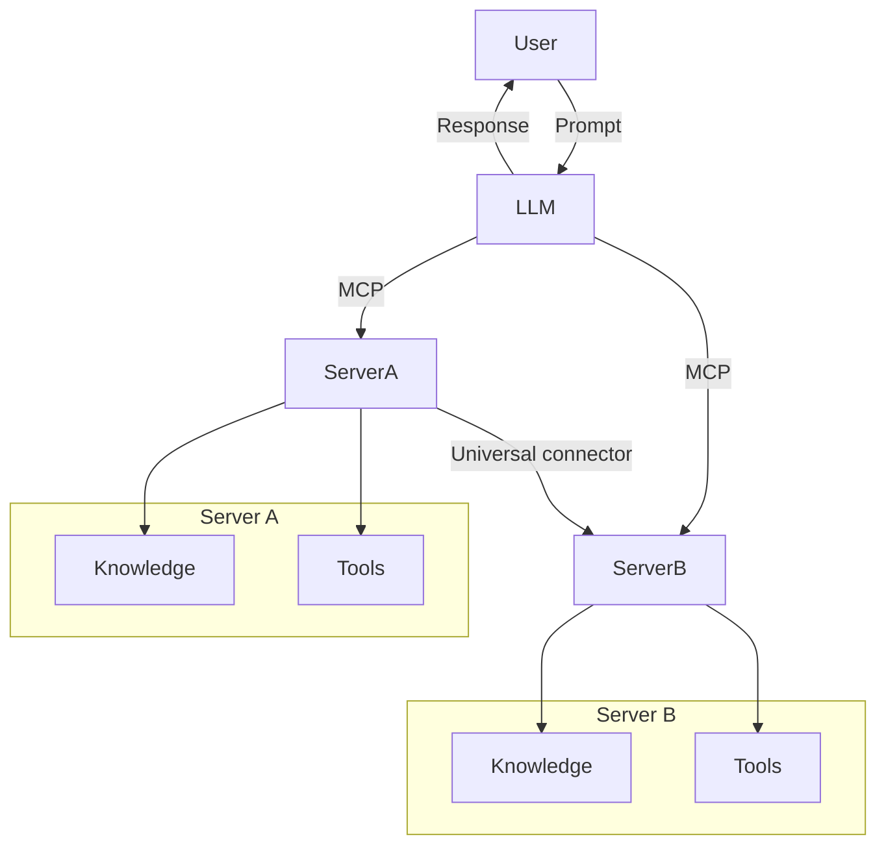

<!--
CO_OP_TRANSLATOR_METADATA:
{
  "original_hash": "cf84f987e1b771d2201408e110dfd2db",
  "translation_date": "2025-05-20T15:36:18+00:00",
  "source_file": "00-Introduction/README.md",
  "language_code": "es"
}
-->
# Introducción al Model Context Protocol (MCP): Por qué es importante para aplicaciones de IA escalables

Las aplicaciones de IA generativa representan un gran avance, ya que a menudo permiten que el usuario interactúe con la aplicación mediante indicaciones en lenguaje natural. Sin embargo, a medida que se invierte más tiempo y recursos en estas aplicaciones, es importante asegurarse de que se puedan integrar funcionalidades y recursos de manera sencilla, que sea fácil extenderlas, que la aplicación pueda manejar más de un modelo y sus particularidades. En resumen, construir aplicaciones de IA generativa es fácil al principio, pero a medida que crecen y se vuelven más complejas, es necesario empezar a definir una arquitectura y, muy probablemente, apoyarse en un estándar para garantizar que las aplicaciones se construyan de manera coherente. Aquí es donde entra MCP para organizar las cosas y proporcionar un estándar.

---

## **🔍 ¿Qué es el Model Context Protocol (MCP)?**

El **Model Context Protocol (MCP)** es una **interfaz abierta y estandarizada** que permite a los Large Language Models (LLMs) interactuar de forma fluida con herramientas externas, APIs y fuentes de datos. Proporciona una arquitectura consistente para ampliar la funcionalidad de los modelos de IA más allá de sus datos de entrenamiento, permitiendo sistemas de IA más inteligentes, escalables y receptivos.

---

## **🎯 Por qué la estandarización en IA es importante**

A medida que las aplicaciones de IA generativa se vuelven más complejas, es esencial adoptar estándares que aseguren **escalabilidad, extensibilidad** y **mantenibilidad**. MCP aborda estas necesidades al:

- Unificar las integraciones modelo-herramienta
- Reducir soluciones personalizadas frágiles y únicas
- Permitir que múltiples modelos coexistan dentro de un mismo ecosistema

---

## **📚 Objetivos de aprendizaje**

Al final de este artículo, podrás:

- Definir qué es el **Model Context Protocol (MCP)** y sus casos de uso
- Entender cómo MCP estandariza la comunicación entre modelos y herramientas
- Identificar los componentes principales de la arquitectura MCP
- Explorar aplicaciones reales de MCP en contextos empresariales y de desarrollo

---

## **💡 Por qué el Model Context Protocol (MCP) es un cambio radical**

### **🔗 MCP soluciona la fragmentación en las interacciones de IA**

Antes de MCP, integrar modelos con herramientas requería:

- Código personalizado para cada par herramienta-modelo
- APIs no estandarizadas para cada proveedor
- Rompimientos frecuentes debido a actualizaciones
- Escalabilidad limitada al aumentar el número de herramientas

### **✅ Beneficios de la estandarización con MCP**

| **Beneficio**            | **Descripción**                                                               |
|--------------------------|-------------------------------------------------------------------------------|
| Interoperabilidad        | Los LLMs trabajan sin problemas con herramientas de diferentes proveedores    |
| Consistencia             | Comportamiento uniforme en plataformas y herramientas                         |
| Reutilización            | Herramientas construidas una vez pueden usarse en varios proyectos y sistemas |
| Desarrollo acelerado     | Reduce el tiempo de desarrollo usando interfaces estandarizadas y plug-and-play |

---

## **🧱 Visión general de la arquitectura MCP a alto nivel**

MCP sigue un **modelo cliente-servidor**, donde:

- **MCP Hosts** ejecutan los modelos de IA  
- **MCP Clients** inician las solicitudes  
- **MCP Servers** proveen contexto, herramientas y capacidades  

### **Componentes clave:**

- **Resources** – Datos estáticos o dinámicos para los modelos  
- **Prompts** – Flujos de trabajo predefinidos para generación guiada  
- **Tools** – Funciones ejecutables como búsquedas, cálculos  
- **Sampling** – Comportamiento agentivo mediante interacciones recursivas  

---

## Cómo funcionan los MCP Servers

Los MCP servers operan de la siguiente manera:

- **Flujo de solicitud**:  
    1. El MCP Client envía una solicitud al modelo de IA que se ejecuta en un MCP Host.  
    2. El modelo de IA identifica cuándo necesita herramientas o datos externos.  
    3. El modelo se comunica con el MCP Server usando el protocolo estandarizado.

- **Funcionalidad del MCP Server**:  
    - Registro de herramientas: Mantiene un catálogo de herramientas disponibles y sus capacidades.  
    - Autenticación: Verifica permisos para el acceso a herramientas.  
    - Manejador de solicitudes: Procesa las solicitudes entrantes de herramientas desde el modelo.  
    - Formateador de respuestas: Estructura las salidas de las herramientas en un formato que el modelo pueda entender.

- **Ejecución de herramientas**:  
    - El servidor dirige las solicitudes a las herramientas externas adecuadas  
    - Las herramientas ejecutan sus funciones especializadas (búsqueda, cálculo, consultas a bases de datos, etc.)  
    - Los resultados se devuelven al modelo en un formato consistente.

- **Finalización de la respuesta**:  
    - El modelo de IA incorpora las salidas de las herramientas en su respuesta.  
    - La respuesta final se envía de vuelta a la aplicación cliente.

## 👨‍💻 Cómo construir un MCP Server (con ejemplos)

Los MCP servers te permiten ampliar las capacidades de los LLM proporcionando datos y funcionalidades.

¿Listo para probar? Aquí tienes ejemplos de cómo crear un MCP server sencillo en diferentes lenguajes:

- **Ejemplo en Python**: https://github.com/modelcontextprotocol/python-sdk

- **Ejemplo en TypeScript**: https://github.com/modelcontextprotocol/typescript-sdk

- **Ejemplo en Java**: https://github.com/modelcontextprotocol/java-sdk

- **Ejemplo en C#/.NET**: https://github.com/modelcontextprotocol/csharp-sdk

## 🌍 Casos de uso reales para MCP

MCP habilita una amplia variedad de aplicaciones al extender las capacidades de la IA:

| **Aplicación**              | **Descripción**                                                               |
|----------------------------|-------------------------------------------------------------------------------|
| Integración de datos empresariales | Conectar LLMs a bases de datos, CRMs o herramientas internas            |
| Sistemas de IA agentiva     | Permitir agentes autónomos con acceso a herramientas y flujos de toma de decisiones |
| Aplicaciones multimodales   | Combinar herramientas de texto, imagen y audio dentro de una sola aplicación de IA unificada |
| Integración de datos en tiempo real | Incorporar datos en vivo en interacciones de IA para resultados más precisos y actuales |

### 🧠 MCP = Estándar universal para interacciones de IA

El Model Context Protocol (MCP) actúa como un estándar universal para las interacciones de IA, similar a cómo USB-C estandarizó las conexiones físicas para dispositivos. En el mundo de la IA, MCP proporciona una interfaz consistente que permite a los modelos (clientes) integrarse sin problemas con herramientas externas y proveedores de datos (servidores). Esto elimina la necesidad de protocolos personalizados y variados para cada API o fuente de datos.

Bajo MCP, una herramienta compatible (llamada MCP server) sigue un estándar unificado. Estos servidores pueden listar las herramientas o acciones que ofrecen y ejecutar esas acciones cuando un agente de IA las solicita. Las plataformas de agentes de IA que soportan MCP pueden descubrir las herramientas disponibles en los servidores e invocarlas mediante este protocolo estándar.

### 💡 Facilita el acceso al conocimiento

Más allá de ofrecer herramientas, MCP también facilita el acceso al conocimiento. Permite a las aplicaciones proporcionar contexto a los LLMs vinculándolos a diversas fuentes de datos. Por ejemplo, un MCP server podría representar el repositorio de documentos de una empresa, permitiendo a los agentes recuperar información relevante bajo demanda. Otro servidor podría encargarse de acciones específicas como enviar correos electrónicos o actualizar registros. Desde la perspectiva del agente, estas son simplemente herramientas que puede usar: algunas devuelven datos (contexto de conocimiento), mientras que otras ejecutan acciones. MCP gestiona eficientemente ambas.

Un agente que se conecta a un MCP server aprende automáticamente las capacidades disponibles y los datos accesibles a través de un formato estándar. Esta estandarización permite que la disponibilidad de herramientas sea dinámica. Por ejemplo, agregar un nuevo MCP server al sistema de un agente hace que sus funciones sean inmediatamente utilizables sin necesidad de personalizar más las instrucciones del agente.

Esta integración simplificada se alinea con el flujo representado en el diagrama mermaid, donde los servidores proveen tanto herramientas como conocimiento, asegurando una colaboración fluida entre sistemas.

### 👉 Ejemplo: Solución de agente escalable

## 🔐 Beneficios prácticos de MCP

Estos son los beneficios prácticos de usar MCP:

- **Actualización**: Los modelos pueden acceder a información actualizada más allá de sus datos de entrenamiento  
- **Extensión de capacidades**: Los modelos pueden aprovechar herramientas especializadas para tareas para las que no fueron entrenados  
- **Reducción de alucinaciones**: Las fuentes de datos externas proporcionan una base factual  
- **Privacidad**: Los datos sensibles pueden permanecer en entornos seguros en lugar de estar incrustados en las indicaciones  

## 📌 Puntos clave

Estos son los puntos clave para usar MCP:

- **MCP** estandariza cómo los modelos de IA interactúan con herramientas y datos  
- Promueve **extensibilidad, consistencia e interoperabilidad**  
- MCP ayuda a **reducir el tiempo de desarrollo, mejorar la fiabilidad y ampliar las capacidades del modelo**  
- La arquitectura cliente-servidor **permite aplicaciones de IA flexibles y extensibles**

## 🧠 Ejercicio

Piensa en una aplicación de IA que te interese desarrollar.

- ¿Qué **herramientas o datos externos** podrían mejorar sus capacidades?  
- ¿Cómo podría MCP hacer que la integración sea **más sencilla y confiable**?

## Recursos adicionales

- [MCP GitHub Repository](https://github.com/modelcontextprotocol)

## Qué sigue

Siguiente: [Chapter 1: Core Concepts](/01-CoreConcepts/README.md)

**Aviso Legal**:  
Este documento ha sido traducido utilizando el servicio de traducción automática [Co-op Translator](https://github.com/Azure/co-op-translator). Aunque nos esforzamos por la precisión, tenga en cuenta que las traducciones automáticas pueden contener errores o inexactitudes. El documento original en su idioma nativo debe considerarse la fuente autorizada. Para información crítica, se recomienda una traducción profesional realizada por humanos. No nos hacemos responsables de ningún malentendido o interpretación errónea que pueda surgir del uso de esta traducción.