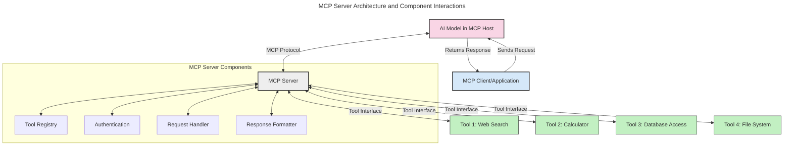
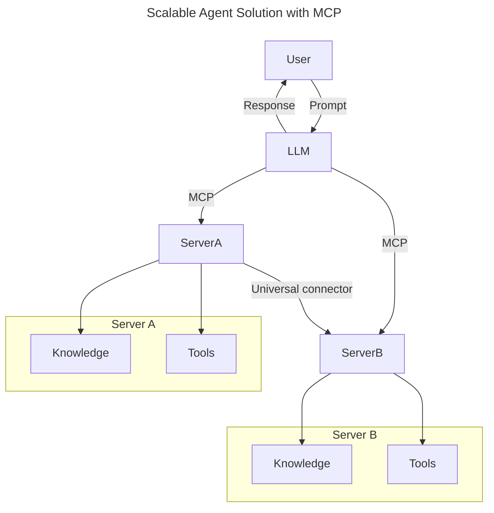
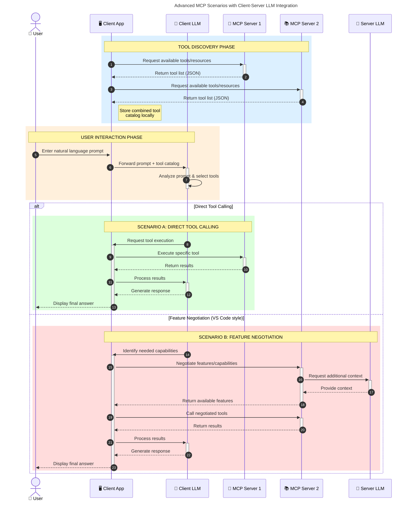

<!--
CO_OP_TRANSLATOR_METADATA:
{
  "original_hash": "2bbbcded256d46a24e3f448384a2b4a2",
  "translation_date": "2025-07-29T00:50:42+00:00",
  "source_file": "00-Introduction/README.md",
  "language_code": "es"
}
-->
# Introducción al Protocolo de Contexto de Modelos (MCP): Por qué es importante para aplicaciones de IA escalables

_(Haz clic en la imagen de arriba para ver el video de esta lección)_

Las aplicaciones de IA generativa representan un gran avance, ya que a menudo permiten que el usuario interactúe con la aplicación mediante indicaciones en lenguaje natural. Sin embargo, a medida que se invierten más tiempo y recursos en estas aplicaciones, es importante asegurarse de que puedas integrar funcionalidades y recursos de manera que sea fácil de extender, que tu aplicación pueda trabajar con más de un modelo y manejar las particularidades de cada uno. En resumen, construir aplicaciones de IA generativa es fácil al principio, pero a medida que crecen y se vuelven más complejas, necesitas empezar a definir una arquitectura y probablemente depender de un estándar para garantizar que tus aplicaciones se construyan de manera consistente. Aquí es donde entra MCP para organizar las cosas y proporcionar un estándar.

---

## **🔍 ¿Qué es el Protocolo de Contexto de Modelos (MCP)?**

El **Protocolo de Contexto de Modelos (MCP)** es una **interfaz abierta y estandarizada** que permite a los Modelos de Lenguaje Extenso (LLMs) interactuar sin problemas con herramientas externas, APIs y fuentes de datos. Proporciona una arquitectura consistente para mejorar la funcionalidad de los modelos de IA más allá de sus datos de entrenamiento, habilitando sistemas de IA más inteligentes, escalables y receptivos.

---

## **🎯 Por qué la estandarización en IA es importante**

A medida que las aplicaciones de IA generativa se vuelven más complejas, es esencial adoptar estándares que garanticen **escalabilidad, extensibilidad** y **mantenibilidad**. MCP aborda estas necesidades al:

- Unificar las integraciones entre modelos y herramientas
- Reducir soluciones personalizadas frágiles y únicas
- Permitir que múltiples modelos coexistan dentro de un mismo ecosistema

---

## **📚 Objetivos de aprendizaje**

Al final de este artículo, podrás:

- Definir el **Protocolo de Contexto de Modelos (MCP)** y sus casos de uso
- Comprender cómo MCP estandariza la comunicación entre modelos y herramientas
- Identificar los componentes principales de la arquitectura MCP
- Explorar aplicaciones reales de MCP en contextos empresariales y de desarrollo

---

## **💡 Por qué el Protocolo de Contexto de Modelos (MCP) es revolucionario**

### **🔗 MCP resuelve la fragmentación en las interacciones de IA**

Antes de MCP, integrar modelos con herramientas requería:

- Código personalizado para cada par herramienta-modelo
- APIs no estandarizadas para cada proveedor
- Fallos frecuentes debido a actualizaciones
- Escalabilidad limitada con más herramientas

### **✅ Beneficios de la estandarización con MCP**

| **Beneficio**              | **Descripción**                                                                |
|----------------------------|--------------------------------------------------------------------------------|
| Interoperabilidad          | Los LLMs funcionan sin problemas con herramientas de diferentes proveedores    |
| Consistencia               | Comportamiento uniforme en plataformas y herramientas                         |
| Reutilización              | Herramientas creadas una vez pueden usarse en múltiples proyectos y sistemas   |
| Desarrollo acelerado       | Reducción del tiempo de desarrollo gracias a interfaces estándar plug-and-play |

---

## **🧱 Descripción general de la arquitectura de MCP**

MCP sigue un **modelo cliente-servidor**, donde:

- Los **Hosts MCP** ejecutan los modelos de IA
- Los **Clientes MCP** inician solicitudes
- Los **Servidores MCP** proporcionan contexto, herramientas y capacidades

### **Componentes clave:**

- **Recursos** – Datos estáticos o dinámicos para los modelos  
- **Prompts** – Flujos de trabajo predefinidos para generación guiada  
- **Herramientas** – Funciones ejecutables como búsquedas, cálculos  
- **Muestreo** – Comportamiento agente mediante interacciones recursivas  

---

## Cómo funcionan los servidores MCP

Los servidores MCP operan de la siguiente manera:

- **Flujo de solicitudes**:  
    1. El Cliente MCP envía una solicitud al modelo de IA que se ejecuta en un Host MCP.  
    2. El modelo de IA identifica cuándo necesita herramientas o datos externos.  
    3. El modelo se comunica con el Servidor MCP utilizando el protocolo estandarizado.  

- **Funcionalidad del Servidor MCP**:  
    - Registro de herramientas: Mantiene un catálogo de herramientas disponibles y sus capacidades.  
    - Autenticación: Verifica permisos para el acceso a herramientas.  
    - Manejador de solicitudes: Procesa las solicitudes de herramientas provenientes del modelo.  
    - Formateador de respuestas: Estructura las salidas de las herramientas en un formato que el modelo pueda entender.  

- **Ejecución de herramientas**:  
    - El servidor dirige las solicitudes a las herramientas externas correspondientes.  
    - Las herramientas ejecutan sus funciones especializadas (búsquedas, cálculos, consultas a bases de datos, etc.).  
    - Los resultados se devuelven al modelo en un formato consistente.  

- **Finalización de la respuesta**:  
    - El modelo de IA incorpora las salidas de las herramientas en su respuesta.  
    - La respuesta final se envía de vuelta a la aplicación cliente.  

## 👨‍💻 Cómo construir un servidor MCP (con ejemplos)

Los servidores MCP te permiten extender las capacidades de los LLM proporcionando datos y funcionalidades.

¿Listo para probarlo? Aquí tienes ejemplos de cómo crear un servidor MCP simple en diferentes lenguajes:

- **Ejemplo en Python**: https://github.com/modelcontextprotocol/python-sdk  
- **Ejemplo en TypeScript**: https://github.com/modelcontextprotocol/typescript-sdk  
- **Ejemplo en Java**: https://github.com/modelcontextprotocol/java-sdk  
- **Ejemplo en C#/.NET**: https://github.com/modelcontextprotocol/csharp-sdk  

---

## 🌍 Casos de uso reales de MCP

MCP habilita una amplia gama de aplicaciones al extender las capacidades de la IA:

| **Aplicación**              | **Descripción**                                                                |
|-----------------------------|--------------------------------------------------------------------------------|
| Integración de datos empresariales | Conecta LLMs con bases de datos, CRMs o herramientas internas              |
| Sistemas de IA agente       | Permite agentes autónomos con acceso a herramientas y flujos de toma de decisiones |
| Aplicaciones multimodales   | Combina herramientas de texto, imagen y audio en una sola aplicación de IA unificada |
| Integración de datos en tiempo real | Incorpora datos en vivo en interacciones de IA para resultados más precisos y actuales |

### 🧠 MCP = Estándar universal para interacciones de IA

El Protocolo de Contexto de Modelos (MCP) actúa como un estándar universal para las interacciones de IA, de manera similar a cómo el USB-C estandarizó las conexiones físicas para dispositivos. En el mundo de la IA, MCP proporciona una interfaz consistente, permitiendo que los modelos (clientes) se integren sin problemas con herramientas externas y proveedores de datos (servidores). Esto elimina la necesidad de protocolos personalizados y diversos para cada API o fuente de datos.

Bajo MCP, una herramienta compatible con MCP (denominada servidor MCP) sigue un estándar unificado. Estos servidores pueden listar las herramientas o acciones que ofrecen y ejecutar esas acciones cuando son solicitadas por un agente de IA. Las plataformas de agentes de IA que soportan MCP son capaces de descubrir herramientas disponibles en los servidores e invocarlas a través de este protocolo estándar.

### 💡 Facilita el acceso al conocimiento

Además de ofrecer herramientas, MCP también facilita el acceso al conocimiento. Permite que las aplicaciones proporcionen contexto a los modelos de lenguaje extenso (LLMs) al vincularlos con diversas fuentes de datos. Por ejemplo, un servidor MCP podría representar el repositorio de documentos de una empresa, permitiendo que los agentes recuperen información relevante bajo demanda. Otro servidor podría manejar acciones específicas como enviar correos electrónicos o actualizar registros. Desde la perspectiva del agente, estas son simplemente herramientas que puede usar: algunas herramientas devuelven datos (contexto de conocimiento), mientras que otras realizan acciones. MCP gestiona ambos de manera eficiente.

Un agente que se conecta a un servidor MCP aprende automáticamente las capacidades disponibles del servidor y los datos accesibles a través de un formato estándar. Esta estandarización permite la disponibilidad dinámica de herramientas. Por ejemplo, agregar un nuevo servidor MCP al sistema de un agente hace que sus funciones sean inmediatamente utilizables sin necesidad de personalización adicional en las instrucciones del agente.

Esta integración simplificada se alinea con el flujo representado en el diagrama mermaid, donde los servidores proporcionan tanto herramientas como conocimiento, asegurando una colaboración fluida entre sistemas.

### 👉 Ejemplo: Solución escalable para agentes

### 🔄 Escenarios avanzados de MCP con integración de LLM en el lado del cliente

Más allá de la arquitectura básica de MCP, existen escenarios avanzados donde tanto el cliente como el servidor contienen LLMs, habilitando interacciones más sofisticadas:

---

## 🔐 Beneficios prácticos de MCP

Aquí tienes los beneficios prácticos de usar MCP:

- **Actualización constante**: Los modelos pueden acceder a información actualizada más allá de sus datos de entrenamiento  
- **Extensión de capacidades**: Los modelos pueden aprovechar herramientas especializadas para tareas para las que no fueron entrenados  
- **Reducción de alucinaciones**: Las fuentes de datos externas proporcionan una base factual  
- **Privacidad**: Los datos sensibles pueden permanecer en entornos seguros en lugar de ser incrustados en prompts  

---

## 📌 Conclusiones clave

Las siguientes son conclusiones clave sobre el uso de MCP:

- **MCP** estandariza cómo los modelos de IA interactúan con herramientas y datos  
- Promueve la **extensibilidad, consistencia e interoperabilidad**  
- MCP ayuda a **reducir el tiempo de desarrollo, mejorar la confiabilidad y extender las capacidades de los modelos**  
- La arquitectura cliente-servidor **habilita aplicaciones de IA flexibles y extensibles**  

---

## 🧠 Ejercicio

Piensa en una aplicación de IA que te interese construir.

- ¿Qué **herramientas o datos externos** podrían mejorar sus capacidades?  
- ¿Cómo podría MCP hacer que la integración sea **más simple y confiable**?  

---

## Recursos adicionales

- [Repositorio de GitHub de MCP](https://github.com/modelcontextprotocol)

---

## Qué sigue

Siguiente: [Capítulo 1: Conceptos básicos](../01-CoreConcepts/README.md)

**Descargo de responsabilidad**:  
Este documento ha sido traducido utilizando el servicio de traducción automática [Co-op Translator](https://github.com/Azure/co-op-translator). Aunque nos esforzamos por garantizar la precisión, tenga en cuenta que las traducciones automatizadas pueden contener errores o imprecisiones. El documento original en su idioma nativo debe considerarse como la fuente autorizada. Para información crítica, se recomienda una traducción profesional realizada por humanos. No nos hacemos responsables de malentendidos o interpretaciones erróneas que puedan surgir del uso de esta traducción.