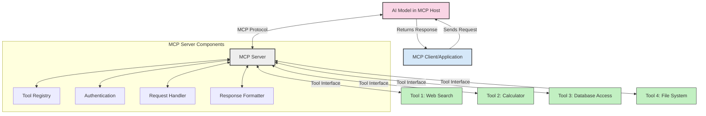
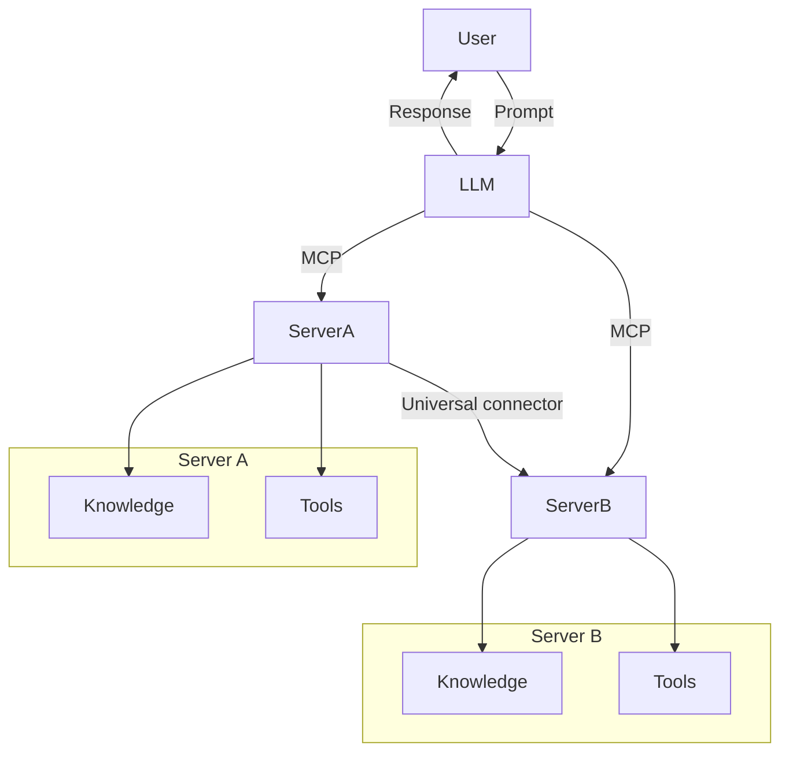

<!--
CO_OP_TRANSLATOR_METADATA:
{
  "original_hash": "1d88dee994dcbb3fa52c271d0c0817b5",
  "translation_date": "2025-05-20T20:10:42+00:00",
  "source_file": "00-Introduction/README.md",
  "language_code": "es"
}
-->
# Introducción al Protocolo de Contexto del Modelo (MCP): Por qué es importante para aplicaciones de IA escalables

Las aplicaciones de IA generativa representan un gran avance, ya que a menudo permiten al usuario interactuar con la aplicación usando comandos en lenguaje natural. Sin embargo, a medida que se invierte más tiempo y recursos en estas aplicaciones, querrás asegurarte de que puedas integrar funcionalidades y recursos de manera sencilla, que sea fácil extenderlas, que tu aplicación pueda manejar más de un modelo a la vez y gestionar las distintas particularidades de cada modelo. En resumen, construir aplicaciones de IA generativa es fácil al principio, pero conforme crecen y se vuelven más complejas, es necesario definir una arquitectura y probablemente depender de un estándar para asegurar que tus aplicaciones se construyan de manera consistente. Aquí es donde entra MCP para organizar todo y proporcionar un estándar.

---

## **🔍 ¿Qué es el Protocolo de Contexto del Modelo (MCP)?**

El **Protocolo de Contexto del Modelo (MCP)** es una **interfaz abierta y estandarizada** que permite a los Grandes Modelos de Lenguaje (LLMs) interactuar de forma fluida con herramientas externas, APIs y fuentes de datos. Proporciona una arquitectura consistente para ampliar la funcionalidad de los modelos de IA más allá de sus datos de entrenamiento, permitiendo sistemas de IA más inteligentes, escalables y receptivos.

---

## **🎯 Por qué la estandarización en IA es importante**

A medida que las aplicaciones de IA generativa se vuelven más complejas, es fundamental adoptar estándares que garanticen **escalabilidad, extensibilidad** y **mantenibilidad**. MCP responde a estas necesidades al:

- Unificar las integraciones entre modelos y herramientas
- Reducir soluciones personalizadas frágiles y únicas
- Permitir que múltiples modelos coexistan dentro de un mismo ecosistema

---

## **📚 Objetivos de aprendizaje**

Al finalizar este artículo, podrás:

- Definir qué es el **Protocolo de Contexto del Modelo (MCP)** y sus casos de uso
- Entender cómo MCP estandariza la comunicación entre modelos y herramientas
- Identificar los componentes clave de la arquitectura MCP
- Explorar aplicaciones reales de MCP en entornos empresariales y de desarrollo

---

## **💡 Por qué el Protocolo de Contexto del Modelo (MCP) es un cambio radical**

### **🔗 MCP resuelve la fragmentación en las interacciones con IA**

Antes de MCP, integrar modelos con herramientas requería:

- Código personalizado para cada par herramienta-modelo
- APIs no estandarizadas para cada proveedor
- Interrupciones frecuentes debido a actualizaciones
- Escalabilidad limitada al aumentar el número de herramientas

### **✅ Beneficios de la estandarización MCP**

| **Beneficio**             | **Descripción**                                                                |
|---------------------------|--------------------------------------------------------------------------------|
| Interoperabilidad         | Los LLMs funcionan sin problemas con herramientas de distintos proveedores    |
| Consistencia             | Comportamiento uniforme en plataformas y herramientas                         |
| Reutilización            | Herramientas construidas una vez pueden usarse en varios proyectos y sistemas |
| Desarrollo acelerado     | Reduce el tiempo de desarrollo usando interfaces estándar y plug-and-play     |

---

## **🧱 Visión general de la arquitectura MCP a alto nivel**

MCP sigue un **modelo cliente-servidor**, donde:

- **Hosts MCP** ejecutan los modelos de IA
- **Clientes MCP** inician las solicitudes
- **Servidores MCP** proporcionan contexto, herramientas y capacidades

### **Componentes clave:**

- **Recursos** – Datos estáticos o dinámicos para los modelos  
- **Prompts** – Flujos de trabajo predefinidos para generación guiada  
- **Herramientas** – Funciones ejecutables como búsqueda, cálculos  
- **Sampling** – Comportamiento agente a través de interacciones recursivas

---

## Cómo funcionan los servidores MCP

Los servidores MCP operan de la siguiente manera:

- **Flujo de solicitudes**:  
    1. El Cliente MCP envía una solicitud al Modelo de IA que se ejecuta en un Host MCP.  
    2. El Modelo de IA identifica cuándo necesita herramientas o datos externos.  
    3. El modelo se comunica con el Servidor MCP usando el protocolo estandarizado.

- **Funcionalidad del Servidor MCP**:  
    - Registro de herramientas: Mantiene un catálogo de las herramientas disponibles y sus capacidades.  
    - Autenticación: Verifica permisos para el acceso a herramientas.  
    - Gestor de solicitudes: Procesa las peticiones de herramientas provenientes del modelo.  
    - Formateador de respuestas: Estructura las salidas de las herramientas en un formato que el modelo pueda entender.

- **Ejecución de herramientas**:  
    - El servidor dirige las solicitudes a las herramientas externas correspondientes  
    - Las herramientas ejecutan sus funciones especializadas (búsqueda, cálculo, consultas a bases de datos, etc.)  
    - Los resultados se devuelven al modelo en un formato consistente.

- **Finalización de la respuesta**:  
    - El modelo de IA incorpora las salidas de las herramientas en su respuesta.  
    - La respuesta final se envía de vuelta a la aplicación cliente.

## 👨‍💻 Cómo construir un servidor MCP (con ejemplos)

Los servidores MCP te permiten ampliar las capacidades de los LLMs proporcionando datos y funcionalidades.

¿Listo para probarlo? Aquí tienes ejemplos de cómo crear un servidor MCP simple en diferentes lenguajes:

- **Ejemplo en Python**: https://github.com/modelcontextprotocol/python-sdk

- **Ejemplo en TypeScript**: https://github.com/modelcontextprotocol/typescript-sdk

- **Ejemplo en Java**: https://github.com/modelcontextprotocol/java-sdk

- **Ejemplo en C#/.NET**: https://github.com/modelcontextprotocol/csharp-sdk

## 🌍 Casos de uso reales para MCP

MCP habilita una amplia gama de aplicaciones al extender las capacidades de la IA:

| **Aplicación**               | **Descripción**                                                                |
|-----------------------------|--------------------------------------------------------------------------------|
| Integración de datos empresariales | Conectar LLMs a bases de datos, CRMs o herramientas internas                  |
| Sistemas de IA agentes       | Permitir agentes autónomos con acceso a herramientas y flujos de toma de decisiones |
| Aplicaciones multimodales    | Combinar herramientas de texto, imagen y audio en una sola aplicación de IA unificada |
| Integración de datos en tiempo real | Incorporar datos en vivo en interacciones de IA para resultados más precisos y actuales |

### 🧠 MCP = Estándar universal para interacciones con IA

El Protocolo de Contexto del Modelo (MCP) funciona como un estándar universal para las interacciones con IA, similar a cómo USB-C estandarizó las conexiones físicas para dispositivos. En el mundo de la IA, MCP proporciona una interfaz consistente que permite a los modelos (clientes) integrarse sin problemas con herramientas externas y proveedores de datos (servidores). Esto elimina la necesidad de protocolos personalizados y diversos para cada API o fuente de datos.

Bajo MCP, una herramienta compatible (llamada servidor MCP) sigue un estándar unificado. Estos servidores pueden listar las herramientas o acciones que ofrecen y ejecutarlas cuando un agente de IA las solicita. Las plataformas de agentes de IA que soportan MCP pueden descubrir las herramientas disponibles en los servidores y usarlas mediante este protocolo estándar.

### 💡 Facilita el acceso al conocimiento

Más allá de ofrecer herramientas, MCP también facilita el acceso al conocimiento. Permite a las aplicaciones proporcionar contexto a los grandes modelos de lenguaje (LLMs) vinculándolos a diversas fuentes de datos. Por ejemplo, un servidor MCP podría representar el repositorio documental de una empresa, permitiendo que los agentes recuperen información relevante bajo demanda. Otro servidor podría encargarse de acciones específicas como enviar correos electrónicos o actualizar registros. Desde la perspectiva del agente, estas son simplemente herramientas que puede usar: algunas devuelven datos (contexto de conocimiento), mientras que otras ejecutan acciones. MCP gestiona ambas de manera eficiente.

Un agente que se conecta a un servidor MCP aprende automáticamente las capacidades disponibles y los datos accesibles a través de un formato estándar. Esta estandarización permite la disponibilidad dinámica de herramientas. Por ejemplo, agregar un nuevo servidor MCP al sistema de un agente hace que sus funciones sean utilizables inmediatamente sin necesidad de personalizar más las instrucciones del agente.

Esta integración fluida se alinea con el flujo mostrado en el diagrama mermaid, donde los servidores proporcionan tanto herramientas como conocimiento, asegurando una colaboración sin interrupciones entre sistemas.

### 👉 Ejemplo: Solución escalable para agentes

## 🔐 Beneficios prácticos de MCP

Estos son los beneficios prácticos de usar MCP:

- **Actualización**: Los modelos pueden acceder a información actualizada más allá de sus datos de entrenamiento  
- **Extensión de capacidades**: Los modelos pueden aprovechar herramientas especializadas para tareas para las que no fueron entrenados  
- **Reducción de alucinaciones**: Las fuentes externas de datos aportan fundamento factual  
- **Privacidad**: Los datos sensibles pueden mantenerse en entornos seguros en lugar de estar incrustados en los prompts

## 📌 Puntos clave

Estos son los puntos clave para usar MCP:

- **MCP** estandariza cómo los modelos de IA interactúan con herramientas y datos  
- Promueve la **extensibilidad, consistencia e interoperabilidad**  
- MCP ayuda a **reducir el tiempo de desarrollo, mejorar la fiabilidad y ampliar las capacidades del modelo**  
- La arquitectura cliente-servidor **permite aplicaciones de IA flexibles y extensibles**

## 🧠 Ejercicio

Piensa en una aplicación de IA que te interese desarrollar.

- ¿Qué **herramientas externas o datos** podrían mejorar sus capacidades?  
- ¿Cómo podría MCP hacer que la integración sea **más simple y confiable**?

## Recursos adicionales

- [Repositorio MCP en GitHub](https://github.com/modelcontextprotocol)

## Qué sigue

Siguiente: [Capítulo 1: Conceptos clave](/01-CoreConcepts/README.md)

**Descargo de responsabilidad**:  
Este documento ha sido traducido utilizando el servicio de traducción automática [Co-op Translator](https://github.com/Azure/co-op-translator). Aunque nos esforzamos por la precisión, tenga en cuenta que las traducciones automáticas pueden contener errores o inexactitudes. El documento original en su idioma nativo debe considerarse la fuente autorizada. Para información crítica, se recomienda la traducción profesional realizada por humanos. No nos hacemos responsables de malentendidos o interpretaciones erróneas derivadas del uso de esta traducción.