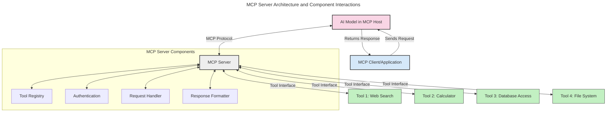
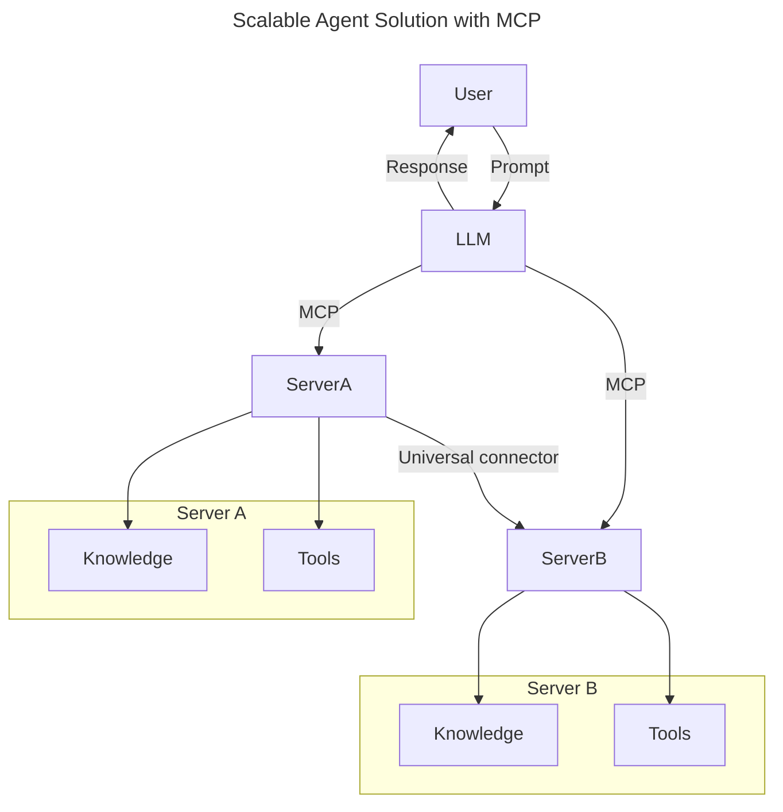
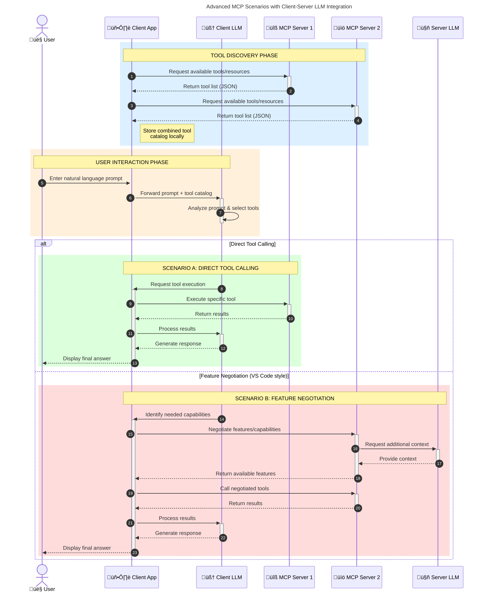

<!--
CO_OP_TRANSLATOR_METADATA:
{
  "original_hash": "105c2ddbb77bc38f7e9df009e1b06e45",
  "translation_date": "2025-07-13T15:24:58+00:00",
  "source_file": "00-Introduction/README.md",
  "language_code": "es"
}
-->
# Introducción al Protocolo de Contexto de Modelo (MCP): Por qué es importante para aplicaciones de IA escalables

Las aplicaciones de IA generativa representan un gran avance, ya que a menudo permiten al usuario interactuar con la aplicación mediante indicaciones en lenguaje natural. Sin embargo, a medida que se invierte más tiempo y recursos en estas aplicaciones, es importante asegurarse de que se puedan integrar funcionalidades y recursos de manera sencilla, que sea fácil extenderlas, que la aplicación pueda manejar más de un modelo y gestionar las particularidades de cada uno. En resumen, construir aplicaciones de IA generativa es fácil al principio, pero a medida que crecen y se vuelven más complejas, es necesario definir una arquitectura y probablemente depender de un estándar para garantizar que las aplicaciones se construyan de forma coherente. Aquí es donde entra MCP para organizar y proporcionar un estándar.

---

## **🔍 ¿Qué es el Protocolo de Contexto de Modelo (MCP)?**

El **Protocolo de Contexto de Modelo (MCP)** es una **interfaz abierta y estandarizada** que permite a los Modelos de Lenguaje Grande (LLMs) interactuar sin problemas con herramientas externas, APIs y fuentes de datos. Proporciona una arquitectura consistente para ampliar la funcionalidad de los modelos de IA m√°s all√° de sus datos de entrenamiento, permitiendo sistemas de IA m√°s inteligentes, escalables y receptivos.

---

## **🎯 Por qué la estandarización en IA es importante**

A medida que las aplicaciones de IA generativa se vuelven m√°s complejas, es fundamental adoptar est√°ndares que aseguren **escalabilidad, extensibilidad** y **mantenibilidad**. MCP aborda estas necesidades al:

- Unificar las integraciones entre modelos y herramientas
- Reducir soluciones personalizadas fr√°giles y puntuales
- Permitir que m√∫ltiples modelos coexistan dentro de un mismo ecosistema

---

## **üìö Objetivos de aprendizaje**

Al finalizar este artículo, podrás:

- Definir el **Protocolo de Contexto de Modelo (MCP)** y sus casos de uso
- Entender cómo MCP estandariza la comunicación entre modelos y herramientas
- Identificar los componentes clave de la arquitectura MCP
- Explorar aplicaciones reales de MCP en contextos empresariales y de desarrollo

---

## **💡 Por qué el Protocolo de Contexto de Modelo (MCP) es un cambio radical**

### **🔗 MCP resuelve la fragmentación en las interacciones de IA**

Antes de MCP, integrar modelos con herramientas requería:

- Código personalizado para cada par herramienta-modelo
- APIs no estandarizadas para cada proveedor
- Rupturas frecuentes debido a actualizaciones
- Mala escalabilidad al aumentar el n√∫mero de herramientas

### **✅ Beneficios de la estandarización MCP**

| **Beneficio**            | **Descripción**                                                                |
|--------------------------|--------------------------------------------------------------------------------|
| Interoperabilidad        | Los LLMs funcionan sin problemas con herramientas de diferentes proveedores    |
| Consistencia             | Comportamiento uniforme en plataformas y herramientas                         |
| Reutilización            | Herramientas construidas una vez pueden usarse en múltiples proyectos y sistemas |
| Desarrollo acelerado     | Reduce el tiempo de desarrollo usando interfaces estandarizadas y plug-and-play |

---

## **🧱 Visión general de la arquitectura MCP a alto nivel**

MCP sigue un **modelo cliente-servidor**, donde:

- **Hosts MCP** ejecutan los modelos de IA
- **Clientes MCP** inician las solicitudes
- **Servidores MCP** proveen contexto, herramientas y capacidades

### **Componentes clave:**

- **Recursos** – Datos estáticos o dinámicos para los modelos  
- **Prompts** – Flujos de trabajo predefinidos para generación guiada  
- **Herramientas** – Funciones ejecutables como búsqueda, cálculos  
- **Muestreo** – Comportamiento agente mediante interacciones recursivas

---

## Cómo funcionan los Servidores MCP

Los servidores MCP operan de la siguiente manera:

- **Flujo de solicitud**:  
    1. El Cliente MCP envía una solicitud al Modelo de IA que se ejecuta en un Host MCP.  
    2. El Modelo de IA identifica cu√°ndo necesita herramientas o datos externos.  
    3. El modelo se comunica con el Servidor MCP usando el protocolo estandarizado.

- **Funcionalidad del Servidor MCP**:  
    - Registro de herramientas: Mantiene un cat√°logo de herramientas disponibles y sus capacidades.  
    - Autenticación: Verifica permisos para acceder a las herramientas.  
    - Gestor de solicitudes: Procesa las solicitudes de herramientas provenientes del modelo.  
    - Formateador de respuestas: Estructura las salidas de las herramientas en un formato que el modelo pueda entender.

- **Ejecución de herramientas**:  
    - El servidor enruta las solicitudes a las herramientas externas correspondientes  
    - Las herramientas ejecutan sus funciones especializadas (b√∫squeda, c√°lculo, consultas a bases de datos, etc.)  
    - Los resultados se devuelven al modelo en un formato consistente.

- **Finalización de la respuesta**:  
    - El modelo de IA incorpora las salidas de las herramientas en su respuesta.  
    - La respuesta final se envía de vuelta a la aplicación cliente.

```mermaid
---
title: MCP Server Architecture and Component Interactions
description: A diagram showing how AI models interact with MCP servers and various tools, depicting the request flow and server components including Tool Registry, Authentication, Request Handler, and Response Formatter
---
graph TD
    A[AI Model in MCP Host] <-->|MCP Protocol| B[MCP Server]
    B <-->|Tool Interface| C[Tool 1: Web Search]
    B <-->|Tool Interface| D[Tool 2: Calculator]
    B <-->|Tool Interface| E[Tool 3: Database Access]
    B <-->|Tool Interface| F[Tool 4: File System]
    
    Client[MCP Client/Application] -->|Sends Request| A
    A -->|Returns Response| Client
    
    subgraph "MCP Server Components"
        B
        G[Tool Registry]
        H[Authentication]
        I[Request Handler]
        J[Response Formatter]
    end
    
    B <--> G
    B <--> H
    B <--> I
    B <--> J
    
    style A fill:#f9d5e5,stroke:#333,stroke-width:2px
    style B fill:#eeeeee,stroke:#333,stroke-width:2px
    style Client fill:#d5e8f9,stroke:#333,stroke-width:2px
    style C fill:#c2f0c2,stroke:#333,stroke-width:1px
    style D fill:#c2f0c2,stroke:#333,stroke-width:1px
    style E fill:#c2f0c2,stroke:#333,stroke-width:1px
    style F fill:#c2f0c2,stroke:#333,stroke-width:1px    
```

## 👨‍💻 Cómo construir un Servidor MCP (con ejemplos)

Los servidores MCP te permiten ampliar las capacidades de los LLM proporcionando datos y funcionalidades.

¿Listo para probarlo? Aquí tienes ejemplos para crear un servidor MCP simple en diferentes lenguajes:

- **Ejemplo en Python**: https://github.com/modelcontextprotocol/python-sdk

- **Ejemplo en TypeScript**: https://github.com/modelcontextprotocol/typescript-sdk

- **Ejemplo en Java**: https://github.com/modelcontextprotocol/java-sdk

- **Ejemplo en C#/.NET**: https://github.com/modelcontextprotocol/csharp-sdk

## üåç Casos de uso reales para MCP

MCP habilita una amplia variedad de aplicaciones al extender las capacidades de la IA:

| **Aplicación**              | **Descripción**                                                                |
|----------------------------|--------------------------------------------------------------------------------|
| Integración de datos empresariales | Conectar LLMs a bases de datos, CRM o herramientas internas                  |
| Sistemas de IA agenticos    | Permitir agentes autónomos con acceso a herramientas y flujos de toma de decisiones |
| Aplicaciones multimodales   | Combinar herramientas de texto, imagen y audio en una sola aplicación de IA    |
| Integración de datos en tiempo real | Incorporar datos en vivo en interacciones de IA para resultados más precisos y actuales |

### 🧠 MCP = Estándar universal para interacciones de IA

El Protocolo de Contexto de Modelo (MCP) actúa como un estándar universal para las interacciones de IA, similar a cómo USB-C estandarizó las conexiones físicas para dispositivos. En el mundo de la IA, MCP proporciona una interfaz consistente que permite a los modelos (clientes) integrarse sin problemas con herramientas externas y proveedores de datos (servidores). Esto elimina la necesidad de protocolos diversos y personalizados para cada API o fuente de datos.

Bajo MCP, una herramienta compatible (llamada servidor MCP) sigue un est√°ndar unificado. Estos servidores pueden listar las herramientas o acciones que ofrecen y ejecutar esas acciones cuando un agente de IA las solicita. Las plataformas de agentes de IA que soportan MCP pueden descubrir las herramientas disponibles en los servidores y llamarlas mediante este protocolo est√°ndar.

### üí° Facilita el acceso al conocimiento

Más allá de ofrecer herramientas, MCP también facilita el acceso al conocimiento. Permite que las aplicaciones proporcionen contexto a los modelos de lenguaje grande (LLMs) vinculándolos a diversas fuentes de datos. Por ejemplo, un servidor MCP podría representar el repositorio de documentos de una empresa, permitiendo a los agentes recuperar información relevante bajo demanda. Otro servidor podría manejar acciones específicas como enviar correos electrónicos o actualizar registros. Desde la perspectiva del agente, estas son simplemente herramientas que puede usar: algunas devuelven datos (contexto de conocimiento), mientras que otras ejecutan acciones. MCP gestiona ambos de manera eficiente.

Un agente que se conecta a un servidor MCP aprende automáticamente las capacidades disponibles y los datos accesibles a través de un formato estándar. Esta estandarización permite la disponibilidad dinámica de herramientas. Por ejemplo, agregar un nuevo servidor MCP al sistema de un agente hace que sus funciones sean inmediatamente utilizables sin necesidad de personalizar más las instrucciones del agente.

Esta integración simplificada se alinea con el flujo mostrado en el diagrama mermaid, donde los servidores proveen tanto herramientas como conocimiento, asegurando una colaboración fluida entre sistemas.

### 👉 Ejemplo: Solución escalable para agentes

```mermaid
---
title: Scalable Agent Solution with MCP
description: A diagram illustrating how a user interacts with an LLM that connects to multiple MCP servers, with each server providing both knowledge and tools, creating a scalable AI system architecture
---
graph TD
    User -->|Prompt| LLM
    LLM -->|Response| User
    LLM -->|MCP| ServerA
    LLM -->|MCP| ServerB
    ServerA -->|Universal connector| ServerB
    ServerA --> KnowledgeA
    ServerA --> ToolsA
    ServerB --> KnowledgeB
    ServerB --> ToolsB

    subgraph Server A
        KnowledgeA[Knowledge]
        ToolsA[Tools]
    end

    subgraph Server B
        KnowledgeB[Knowledge]
        ToolsB[Tools]
    end
```

### 🔄 Escenarios avanzados de MCP con integración de LLM en el cliente

M√°s all√° de la arquitectura b√°sica de MCP, existen escenarios avanzados donde tanto el cliente como el servidor contienen LLMs, permitiendo interacciones m√°s sofisticadas:

```mermaid
---
title: Advanced MCP Scenarios with Client-Server LLM Integration
description: A sequence diagram showing the detailed interaction flow between user, client application, client LLM, multiple MCP servers, and server LLM, illustrating tool discovery, user interaction, direct tool calling, and feature negotiation phases
---
sequenceDiagram
    autonumber
    actor User as 👤 User
    participant ClientApp as 🖥️ Client App
    participant ClientLLM as 🧠 Client LLM
    participant Server1 as üîß MCP Server 1
    participant Server2 as üìö MCP Server 2
    participant ServerLLM as 🤖 Server LLM
    
    %% Discovery Phase
    rect rgb(220, 240, 255)
        Note over ClientApp, Server2: TOOL DISCOVERY PHASE
        ClientApp->>+Server1: Request available tools/resources
        Server1-->>-ClientApp: Return tool list (JSON)
        ClientApp->>+Server2: Request available tools/resources
        Server2-->>-ClientApp: Return tool list (JSON)
        Note right of ClientApp: Store combined tool<br/>catalog locally
    end
    
    %% User Interaction
    rect rgb(255, 240, 220)
        Note over User, ClientLLM: USER INTERACTION PHASE
        User->>+ClientApp: Enter natural language prompt
        ClientApp->>+ClientLLM: Forward prompt + tool catalog
        ClientLLM->>-ClientLLM: Analyze prompt & select tools
    end
    
    %% Scenario A: Direct Tool Calling
    alt Direct Tool Calling
        rect rgb(220, 255, 220)
            Note over ClientApp, Server1: SCENARIO A: DIRECT TOOL CALLING
            ClientLLM->>+ClientApp: Request tool execution
            ClientApp->>+Server1: Execute specific tool
            Server1-->>-ClientApp: Return results
            ClientApp->>+ClientLLM: Process results
            ClientLLM-->>-ClientApp: Generate response
            ClientApp-->>-User: Display final answer
        end
    
    %% Scenario B: Feature Negotiation (VS Code style)
    else Feature Negotiation (VS Code style)
        rect rgb(255, 220, 220)
            Note over ClientApp, ServerLLM: SCENARIO B: FEATURE NEGOTIATION
            ClientLLM->>+ClientApp: Identify needed capabilities
            ClientApp->>+Server2: Negotiate features/capabilities
            Server2->>+ServerLLM: Request additional context
            ServerLLM-->>-Server2: Provide context
            Server2-->>-ClientApp: Return available features
            ClientApp->>+Server2: Call negotiated tools
            Server2-->>-ClientApp: Return results
            ClientApp->>+ClientLLM: Process results
            ClientLLM-->>-ClientApp: Generate response
            ClientApp-->>-User: Display final answer
        end
    end
```

## üîê Beneficios pr√°cticos de MCP

Estos son los beneficios pr√°cticos de usar MCP:

- **Actualización**: Los modelos pueden acceder a información actualizada más allá de sus datos de entrenamiento  
- **Extensión de capacidades**: Los modelos pueden aprovechar herramientas especializadas para tareas para las que no fueron entrenados  
- **Reducción de alucinaciones**: Las fuentes de datos externas proporcionan una base factual  
- **Privacidad**: Los datos sensibles pueden permanecer en entornos seguros en lugar de estar incrustados en los prompts

## üìå Puntos clave

Estos son los puntos clave para usar MCP:

- **MCP** estandariza cómo los modelos de IA interactúan con herramientas y datos  
- Promueve **extensibilidad, consistencia e interoperabilidad**  
- MCP ayuda a **reducir el tiempo de desarrollo, mejorar la fiabilidad y ampliar las capacidades del modelo**  
- La arquitectura cliente-servidor **permite aplicaciones de IA flexibles y extensibles**

## 🧠 Ejercicio

Piensa en una aplicación de IA que te interese construir.

- ¿Qué **herramientas o datos externos** podrían mejorar sus capacidades?  
- ¿Cómo podría MCP hacer que la integración sea **más sencilla y confiable**?

## Recursos adicionales

- [Repositorio MCP en GitHub](https://github.com/modelcontextprotocol)

## Qué sigue

Siguiente: [Capítulo 1: Conceptos básicos](../01-CoreConcepts/README.md)

**Aviso legal**:  
Este documento ha sido traducido utilizando el servicio de traducción automática [Co-op Translator](https://github.com/Azure/co-op-translator). Aunque nos esforzamos por la precisión, tenga en cuenta que las traducciones automáticas pueden contener errores o inexactitudes. El documento original en su idioma nativo debe considerarse la fuente autorizada. Para información crítica, se recomienda la traducción profesional realizada por humanos. No nos hacemos responsables de malentendidos o interpretaciones erróneas derivadas del uso de esta traducción.