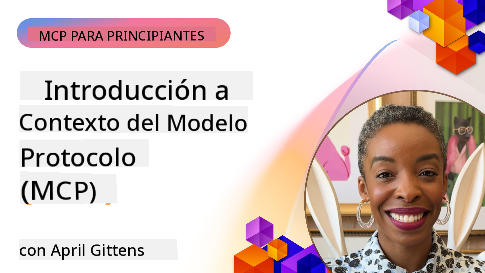
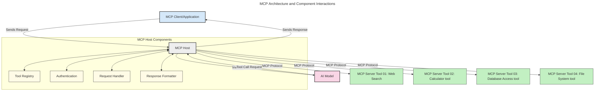
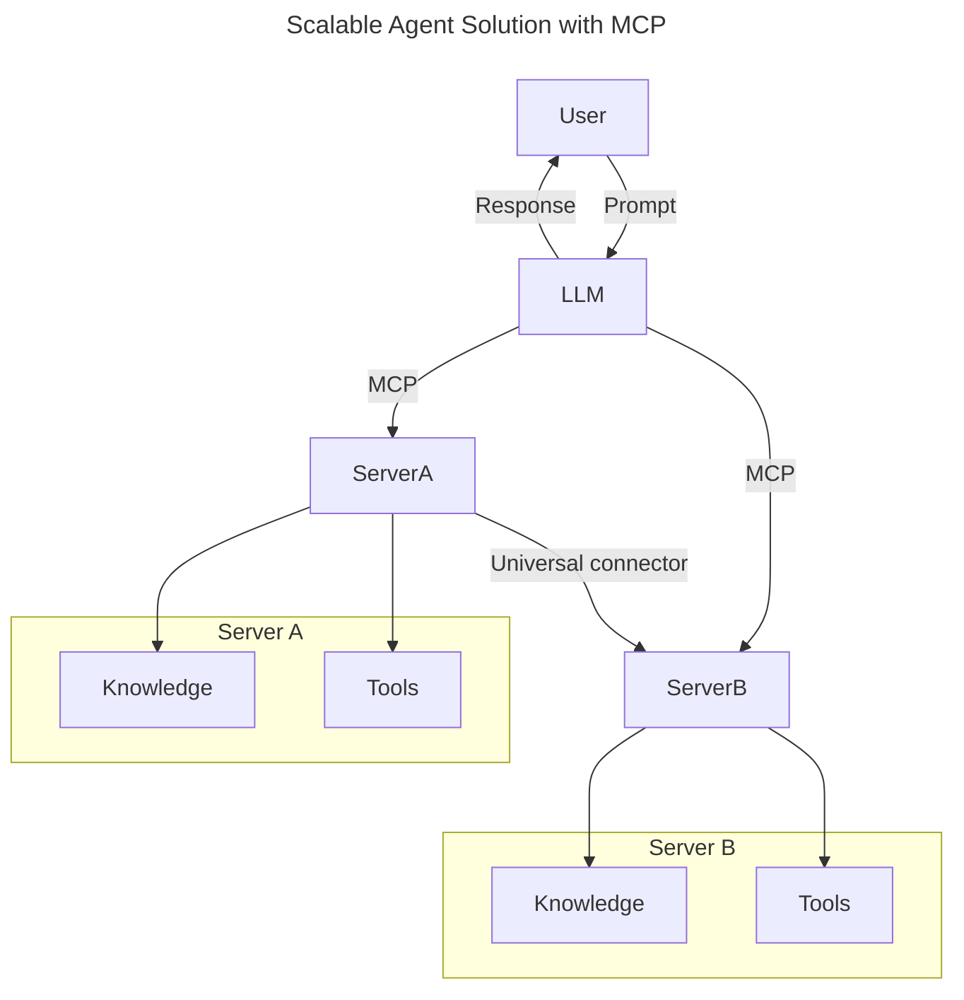
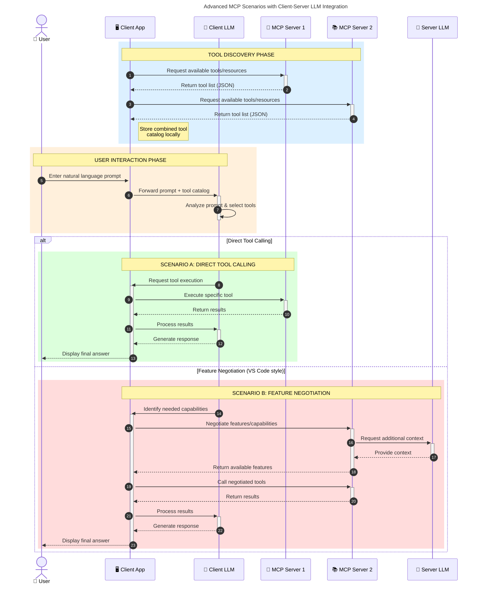

<!--
CO_OP_TRANSLATOR_METADATA:
{
  "original_hash": "0df1ee78a6dd8300f3a040ca5b411c2e",
  "translation_date": "2025-08-12T07:59:13+00:00",
  "source_file": "00-Introduction/README.md",
  "language_code": "es"
}
-->
# Introducción al Protocolo de Contexto de Modelos (MCP): Por qué es importante para aplicaciones de IA escalables

_(Haz clic en la imagen de arriba para ver el video de esta lección)_

Las aplicaciones de IA generativa representan un gran avance, ya que a menudo permiten que el usuario interactúe con la aplicación mediante indicaciones en lenguaje natural. Sin embargo, a medida que se invierten más tiempo y recursos en estas aplicaciones, es importante asegurarse de que puedas integrar funcionalidades y recursos de manera que sea fácil de extender, que tu aplicación pueda trabajar con más de un modelo y manejar las particularidades de cada uno. En resumen, construir aplicaciones de IA generativa es sencillo al principio, pero a medida que crecen y se vuelven más complejas, necesitas empezar a definir una arquitectura y probablemente depender de un estándar para garantizar que tus aplicaciones se construyan de manera consistente. Aquí es donde entra en juego MCP para organizar las cosas y proporcionar un estándar.

---

## **🔍 ¿Qué es el Protocolo de Contexto de Modelos (MCP)?**

El **Protocolo de Contexto de Modelos (MCP)** es una **interfaz abierta y estandarizada** que permite a los Modelos de Lenguaje Extenso (LLMs) interactuar sin problemas con herramientas externas, APIs y fuentes de datos. Proporciona una arquitectura consistente para mejorar la funcionalidad de los modelos de IA más allá de sus datos de entrenamiento, habilitando sistemas de IA más inteligentes, escalables y receptivos.

---

## **🎯 Por qué la estandarización en IA es importante**

A medida que las aplicaciones de IA generativa se vuelven más complejas, es esencial adoptar estándares que aseguren la **escalabilidad, extensibilidad, mantenibilidad** y **eviten la dependencia de un solo proveedor**. MCP aborda estas necesidades al:

- Unificar las integraciones entre modelos y herramientas
- Reducir soluciones personalizadas frágiles y únicas
- Permitir que múltiples modelos de diferentes proveedores coexistan en un mismo ecosistema

**Nota:** Aunque MCP se presenta como un estándar abierto, no hay planes para estandarizar MCP a través de organismos existentes como IEEE, IETF, W3C, ISO u otros.

---

## **📚 Objetivos de aprendizaje**

Al final de este artículo, podrás:

- Definir el **Protocolo de Contexto de Modelos (MCP)** y sus casos de uso
- Comprender cómo MCP estandariza la comunicación entre modelos y herramientas
- Identificar los componentes principales de la arquitectura MCP
- Explorar aplicaciones reales de MCP en contextos empresariales y de desarrollo

---

## **💡 Por qué el Protocolo de Contexto de Modelos (MCP) es revolucionario**

### **🔗 MCP resuelve la fragmentación en las interacciones de IA**

Antes de MCP, integrar modelos con herramientas requería:

- Código personalizado para cada par herramienta-modelo
- APIs no estandarizadas para cada proveedor
- Fallos frecuentes debido a actualizaciones
- Escalabilidad limitada con más herramientas

### **✅ Beneficios de la estandarización con MCP**

| **Beneficio**              | **Descripción**                                                                |
|----------------------------|--------------------------------------------------------------------------------|
| Interoperabilidad          | Los LLMs funcionan sin problemas con herramientas de diferentes proveedores    |
| Consistencia               | Comportamiento uniforme en plataformas y herramientas                         |
| Reutilización              | Herramientas creadas una vez pueden usarse en múltiples proyectos y sistemas   |
| Desarrollo acelerado       | Reducción del tiempo de desarrollo gracias a interfaces estándar plug-and-play |

---

## **🧱 Descripción general de la arquitectura de MCP**

MCP sigue un modelo **cliente-servidor**, donde:

- Los **Hosts MCP** ejecutan los modelos de IA
- Los **Clientes MCP** inician solicitudes
- Los **Servidores MCP** proporcionan contexto, herramientas y capacidades

### **Componentes clave:**

- **Recursos** – Datos estáticos o dinámicos para los modelos  
- **Prompts** – Flujos de trabajo predefinidos para generación guiada  
- **Herramientas** – Funciones ejecutables como búsquedas, cálculos  
- **Muestreo** – Comportamiento agente a través de interacciones recursivas  

---

## Cómo funcionan los servidores MCP

Los servidores MCP operan de la siguiente manera:

- **Flujo de solicitud**:
    1. Un usuario final o software actúa en su nombre para iniciar una solicitud.
    2. El **Cliente MCP** envía la solicitud a un **Host MCP**, que gestiona el tiempo de ejecución del modelo de IA.
    3. El **Modelo de IA** recibe la indicación del usuario y puede solicitar acceso a herramientas o datos externos mediante una o más llamadas a herramientas.
    4. El **Host MCP**, y no el modelo directamente, se comunica con los **Servidores MCP** correspondientes utilizando el protocolo estandarizado.
- **Funcionalidad del Host MCP**:
    - **Registro de herramientas**: Mantiene un catálogo de herramientas disponibles y sus capacidades.
    - **Autenticación**: Verifica permisos para el acceso a herramientas.
    - **Manejador de solicitudes**: Procesa las solicitudes de herramientas provenientes del modelo.
    - **Formateador de respuestas**: Estructura las salidas de herramientas en un formato comprensible para el modelo.
- **Ejecución del Servidor MCP**:
    - El **Host MCP** dirige las llamadas a herramientas hacia uno o más **Servidores MCP**, cada uno exponiendo funciones especializadas (por ejemplo, búsquedas, cálculos, consultas a bases de datos).
    - Los **Servidores MCP** realizan sus respectivas operaciones y devuelven resultados al **Host MCP** en un formato consistente.
    - El **Host MCP** formatea y retransmite estos resultados al **Modelo de IA**.
- **Finalización de la respuesta**:
    - El **Modelo de IA** incorpora las salidas de las herramientas en una respuesta final.
    - El **Host MCP** envía esta respuesta de vuelta al **Cliente MCP**, que la entrega al usuario final o al software que la solicitó.

```mermaid
---
title: MCP Architecture and Component Interactions
description: A diagram showing the flows of the components in MCP.
---
graph TD
    Client[MCP Client/Application] -->|Sends Request| H[MCP Host]
    H -->|Invokes| A[AI Model]
    A -->|Tool Call Request| H
    H -->|MCP Protocol| T1[MCP Server Tool 01: Web Search]
    H -->|MCP Protocol| T2[MCP Server Tool 02: Calculator tool]
    H -->|MCP Protocol| T3[MCP Server Tool 03: Database Access tool]
    H -->|MCP Protocol| T4[MCP Server Tool 04: File System tool]
    H -->|Sends Response| Client

    subgraph "MCP Host Components"
        H
        G[Tool Registry]
        I[Authentication]
        J[Request Handler]
        K[Response Formatter]
    end

    H <--> G
    H <--> I
    H <--> J
    H <--> K

    style A fill:#f9d5e5,stroke:#333,stroke-width:2px
    style H fill:#eeeeee,stroke:#333,stroke-width:2px
    style Client fill:#d5e8f9,stroke:#333,stroke-width:2px
    style G fill:#fffbe6,stroke:#333,stroke-width:1px
    style I fill:#fffbe6,stroke:#333,stroke-width:1px
    style J fill:#fffbe6,stroke:#333,stroke-width:1px
    style K fill:#fffbe6,stroke:#333,stroke-width:1px
    style T1 fill:#c2f0c2,stroke:#333,stroke-width:1px
    style T2 fill:#c2f0c2,stroke:#333,stroke-width:1px
    style T3 fill:#c2f0c2,stroke:#333,stroke-width:1px
    style T4 fill:#c2f0c2,stroke:#333,stroke-width:1px
```

## 👨‍💻 Cómo construir un servidor MCP (con ejemplos)

Los servidores MCP permiten extender las capacidades de los LLM proporcionando datos y funcionalidades.

¿Listo para probarlo? Aquí tienes SDKs específicos por lenguaje y/o stack con ejemplos para crear servidores MCP simples en diferentes lenguajes/stacks:

- **Python SDK**: https://github.com/modelcontextprotocol/python-sdk

- **TypeScript SDK**: https://github.com/modelcontextprotocol/typescript-sdk

- **Java SDK**: https://github.com/modelcontextprotocol/java-sdk

- **C#/.NET SDK**: https://github.com/modelcontextprotocol/csharp-sdk

---

## 🌍 Casos de uso reales de MCP

MCP habilita una amplia gama de aplicaciones al extender las capacidades de la IA:

| **Aplicación**              | **Descripción**                                                                |
|-----------------------------|--------------------------------------------------------------------------------|
| Integración de datos empresariales | Conecta LLMs a bases de datos, CRMs o herramientas internas                |
| Sistemas de IA agentes      | Permite agentes autónomos con acceso a herramientas y flujos de trabajo de toma de decisiones |
| Aplicaciones multimodales   | Combina herramientas de texto, imagen y audio en una sola aplicación de IA unificada |
| Integración de datos en tiempo real | Incorpora datos en vivo en interacciones de IA para resultados más precisos y actuales |

### 🧠 MCP = Estándar universal para interacciones de IA

El Protocolo de Contexto de Modelos (MCP) actúa como un estándar universal para las interacciones de IA, de manera similar a cómo el USB-C estandarizó las conexiones físicas para dispositivos. En el mundo de la IA, MCP proporciona una interfaz consistente, permitiendo que los modelos (clientes) se integren sin problemas con herramientas externas y proveedores de datos (servidores). Esto elimina la necesidad de protocolos diversos y personalizados para cada API o fuente de datos.

Bajo MCP, una herramienta compatible con MCP (denominada servidor MCP) sigue un estándar unificado. Estos servidores pueden listar las herramientas o acciones que ofrecen y ejecutar esas acciones cuando son solicitadas por un agente de IA. Las plataformas de agentes de IA que soportan MCP son capaces de descubrir herramientas disponibles en los servidores e invocarlas a través de este protocolo estándar.

### 💡 Facilita el acceso al conocimiento

Además de ofrecer herramientas, MCP también facilita el acceso al conocimiento. Permite que las aplicaciones proporcionen contexto a los modelos de lenguaje extenso (LLMs) vinculándolos a diversas fuentes de datos. Por ejemplo, un servidor MCP podría representar el repositorio de documentos de una empresa, permitiendo que los agentes recuperen información relevante bajo demanda. Otro servidor podría manejar acciones específicas como enviar correos electrónicos o actualizar registros. Desde la perspectiva del agente, estas son simplemente herramientas que puede usar: algunas herramientas devuelven datos (contexto de conocimiento), mientras que otras realizan acciones. MCP gestiona ambas de manera eficiente.

Un agente que se conecta a un servidor MCP aprende automáticamente las capacidades disponibles y los datos accesibles del servidor a través de un formato estándar. Esta estandarización permite la disponibilidad dinámica de herramientas. Por ejemplo, agregar un nuevo servidor MCP al sistema de un agente hace que sus funciones sean inmediatamente utilizables sin necesidad de personalización adicional en las instrucciones del agente.

Esta integración simplificada se alinea con el flujo representado en el siguiente diagrama, donde los servidores proporcionan tanto herramientas como conocimiento, asegurando una colaboración fluida entre sistemas.

### 👉 Ejemplo: Solución escalable para agentes

```mermaid
---
title: Scalable Agent Solution with MCP
description: A diagram illustrating how a user interacts with an LLM that connects to multiple MCP servers, with each server providing both knowledge and tools, creating a scalable AI system architecture
---
graph TD
    User -->|Prompt| LLM
    LLM -->|Response| User
    LLM -->|MCP| ServerA
    LLM -->|MCP| ServerB
    ServerA -->|Universal connector| ServerB
    ServerA --> KnowledgeA
    ServerA --> ToolsA
    ServerB --> KnowledgeB
    ServerB --> ToolsB

    subgraph Server A
        KnowledgeA[Knowledge]
        ToolsA[Tools]
    end

    subgraph Server B
        KnowledgeB[Knowledge]
        ToolsB[Tools]
    end
```

### 🔄 Escenarios avanzados de MCP con integración de LLM en el lado del cliente

Más allá de la arquitectura básica de MCP, existen escenarios avanzados donde tanto el cliente como el servidor contienen LLMs, habilitando interacciones más sofisticadas. En el siguiente diagrama, la **Aplicación Cliente** podría ser un IDE con varias herramientas MCP disponibles para el uso del LLM:

```mermaid
---
title: Advanced MCP Scenarios with Client-Server LLM Integration
description: A sequence diagram showing the detailed interaction flow between user, client application, client LLM, multiple MCP servers, and server LLM, illustrating tool discovery, user interaction, direct tool calling, and feature negotiation phases
---
sequenceDiagram
    autonumber
    actor User as 👤 User
    participant ClientApp as 🖥️ Client App
    participant ClientLLM as 🧠 Client LLM
    participant Server1 as 🔧 MCP Server 1
    participant Server2 as 📚 MCP Server 2
    participant ServerLLM as 🤖 Server LLM
    
    %% Discovery Phase
    rect rgb(220, 240, 255)
        Note over ClientApp, Server2: TOOL DISCOVERY PHASE
        ClientApp->>+Server1: Request available tools/resources
        Server1-->>-ClientApp: Return tool list (JSON)
        ClientApp->>+Server2: Request available tools/resources
        Server2-->>-ClientApp: Return tool list (JSON)
        Note right of ClientApp: Store combined tool<br/>catalog locally
    end
    
    %% User Interaction
    rect rgb(255, 240, 220)
        Note over User, ClientLLM: USER INTERACTION PHASE
        User->>+ClientApp: Enter natural language prompt
        ClientApp->>+ClientLLM: Forward prompt + tool catalog
        ClientLLM->>-ClientLLM: Analyze prompt & select tools
    end
    
    %% Scenario A: Direct Tool Calling
    alt Direct Tool Calling
        rect rgb(220, 255, 220)
            Note over ClientApp, Server1: SCENARIO A: DIRECT TOOL CALLING
            ClientLLM->>+ClientApp: Request tool execution
            ClientApp->>+Server1: Execute specific tool
            Server1-->>-ClientApp: Return results
            ClientApp->>+ClientLLM: Process results
            ClientLLM-->>-ClientApp: Generate response
            ClientApp-->>-User: Display final answer
        end
    
    %% Scenario B: Feature Negotiation (VS Code style)
    else Feature Negotiation (VS Code style)
        rect rgb(255, 220, 220)
            Note over ClientApp, ServerLLM: SCENARIO B: FEATURE NEGOTIATION
            ClientLLM->>+ClientApp: Identify needed capabilities
            ClientApp->>+Server2: Negotiate features/capabilities
            Server2->>+ServerLLM: Request additional context
            ServerLLM-->>-Server2: Provide context
            Server2-->>-ClientApp: Return available features
            ClientApp->>+Server2: Call negotiated tools
            Server2-->>-ClientApp: Return results
            ClientApp->>+ClientLLM: Process results
            ClientLLM-->>-ClientApp: Generate response
            ClientApp-->>-User: Display final answer
        end
    end
```

---

## 🔐 Beneficios prácticos de MCP

Aquí tienes los beneficios prácticos de usar MCP:

- **Actualización constante**: Los modelos pueden acceder a información actualizada más allá de sus datos de entrenamiento
- **Extensión de capacidades**: Los modelos pueden aprovechar herramientas especializadas para tareas para las que no fueron entrenados
- **Reducción de alucinaciones**: Las fuentes de datos externas proporcionan una base factual
- **Privacidad**: Los datos sensibles pueden permanecer en entornos seguros en lugar de ser incrustados en indicaciones

---

## 📌 Puntos clave

Los siguientes son puntos clave sobre el uso de MCP:

- **MCP** estandariza cómo los modelos de IA interactúan con herramientas y datos
- Promueve la **extensibilidad, consistencia e interoperabilidad**
- MCP ayuda a **reducir el tiempo de desarrollo, mejorar la confiabilidad y extender las capacidades del modelo**
- La arquitectura cliente-servidor **habilita aplicaciones de IA flexibles y extensibles**

---

## 🧠 Ejercicio

Piensa en una aplicación de IA que te interese construir.

- ¿Qué **herramientas o datos externos** podrían mejorar sus capacidades?
- ¿Cómo podría MCP hacer que la integración sea **más simple y confiable**?

---

## Recursos adicionales

- [Repositorio de GitHub de MCP](https://github.com/modelcontextprotocol)

---

## Qué sigue

Siguiente: [Capítulo 1: Conceptos básicos](../01-CoreConcepts/README.md)

**Descargo de responsabilidad**:  
Este documento ha sido traducido utilizando el servicio de traducción automática [Co-op Translator](https://github.com/Azure/co-op-translator). Si bien nos esforzamos por garantizar la precisión, tenga en cuenta que las traducciones automáticas pueden contener errores o imprecisiones. El documento original en su idioma nativo debe considerarse como la fuente autorizada. Para información crítica, se recomienda una traducción profesional realizada por humanos. No nos hacemos responsables de malentendidos o interpretaciones erróneas que puedan surgir del uso de esta traducción.