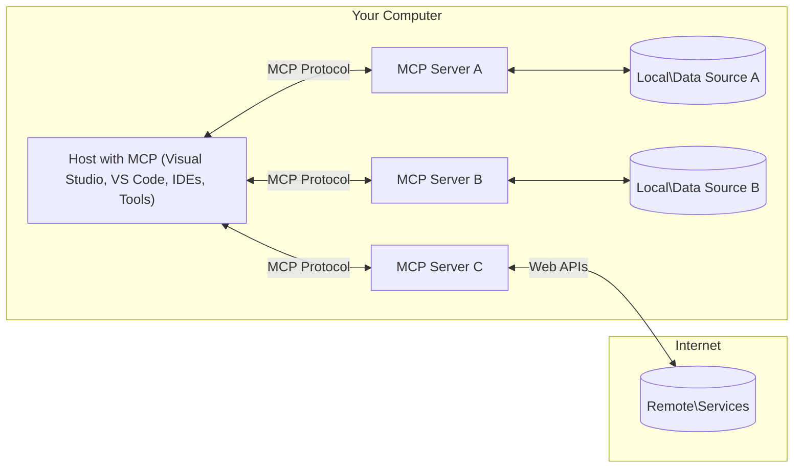

<!--
CO_OP_TRANSLATOR_METADATA:
{
  "original_hash": "904b59de1de9264801242d90a42cdd9d",
  "translation_date": "2025-09-05T10:15:10+00:00",
  "source_file": "01-CoreConcepts/README.md",
  "language_code": "es"
}
-->
# Conceptos Básicos de MCP: Dominando el Protocolo de Contexto de Modelo para la Integración de IA

[](https://youtu.be/earDzWGtE84)

_(Haz clic en la imagen de arriba para ver el video de esta lección)_

El [Protocolo de Contexto de Modelo (MCP)](https://github.com/modelcontextprotocol) es un marco estandarizado y poderoso que optimiza la comunicación entre Modelos de Lenguaje Extenso (LLMs) y herramientas, aplicaciones y fuentes de datos externas. 
Esta guía te llevará a través de los conceptos básicos de MCP. Aprenderás sobre su arquitectura cliente-servidor, componentes esenciales, mecánicas de comunicación y mejores prácticas de implementación.

- **Consentimiento Explícito del Usuario**: Todo acceso a datos y operaciones requiere la aprobación explícita del usuario antes de su ejecución. Los usuarios deben comprender claramente qué datos se accederán y qué acciones se realizarán, con un control detallado sobre permisos y autorizaciones.

- **Protección de la Privacidad de los Datos**: Los datos del usuario solo se exponen con consentimiento explícito y deben estar protegidos mediante controles de acceso robustos durante todo el ciclo de interacción. Las implementaciones deben prevenir transmisiones no autorizadas de datos y mantener límites estrictos de privacidad.

- **Seguridad en la Ejecución de Herramientas**: Cada invocación de herramientas requiere el consentimiento explícito del usuario, con una comprensión clara de la funcionalidad, parámetros e impacto potencial de la herramienta. Los límites de seguridad robustos deben prevenir ejecuciones no intencionadas, inseguras o maliciosas.

- **Seguridad en la Capa de Transporte**: Todos los canales de comunicación deben usar mecanismos apropiados de cifrado y autenticación. Las conexiones remotas deben implementar protocolos de transporte seguros y una gestión adecuada de credenciales.

#### Directrices de Implementación:

- **Gestión de Permisos**: Implementar sistemas de permisos detallados que permitan a los usuarios controlar qué servidores, herramientas y recursos son accesibles.
- **Autenticación y Autorización**: Usar métodos seguros de autenticación (OAuth, claves API) con una gestión adecuada de tokens y expiración.  
- **Validación de Entradas**: Validar todos los parámetros y entradas de datos según esquemas definidos para prevenir ataques de inyección.
- **Registro de Auditoría**: Mantener registros completos de todas las operaciones para monitoreo de seguridad y cumplimiento.

## Resumen

Esta lección explora la arquitectura y los componentes fundamentales que conforman el ecosistema del Protocolo de Contexto de Modelo (MCP). Aprenderás sobre la arquitectura cliente-servidor, los componentes clave y los mecanismos de comunicación que impulsan las interacciones de MCP.

## Objetivos Clave de Aprendizaje

Al final de esta lección, podrás:

- Comprender la arquitectura cliente-servidor de MCP.
- Identificar los roles y responsabilidades de Hosts, Clientes y Servidores.
- Analizar las características principales que hacen de MCP una capa de integración flexible.
- Aprender cómo fluye la información dentro del ecosistema MCP.
- Obtener conocimientos prácticos a través de ejemplos de código en .NET, Java, Python y JavaScript.

## Arquitectura de MCP: Una Mirada Más Profunda

El ecosistema MCP se basa en un modelo cliente-servidor. Esta estructura modular permite que las aplicaciones de IA interactúen de manera eficiente con herramientas, bases de datos, APIs y recursos contextuales. Desglosemos esta arquitectura en sus componentes principales.

En su núcleo, MCP sigue una arquitectura cliente-servidor donde una aplicación host puede conectarse a múltiples servidores:



- **Hosts de MCP**: Programas como VSCode, Claude Desktop, IDEs o herramientas de IA que desean acceder a datos a través de MCP.
- **Clientes de MCP**: Clientes del protocolo que mantienen conexiones 1:1 con servidores.
- **Servidores de MCP**: Programas ligeros que exponen capacidades específicas a través del Protocolo de Contexto de Modelo estandarizado.
- **Fuentes de Datos Locales**: Archivos, bases de datos y servicios de tu computadora a los que los servidores MCP pueden acceder de manera segura.
- **Servicios Remotos**: Sistemas externos disponibles en internet a los que los servidores MCP pueden conectarse a través de APIs.

El Protocolo MCP es un estándar en evolución que utiliza versionado basado en fechas (formato YYYY-MM-DD). La versión actual del protocolo es **2025-06-18**. Puedes ver las últimas actualizaciones de la [especificación del protocolo](https://modelcontextprotocol.io/specification/2025-06-18/).

### 1. Hosts

En el Protocolo de Contexto de Modelo (MCP), los **Hosts** son aplicaciones de IA que sirven como la interfaz principal a través de la cual los usuarios interactúan con el protocolo. Los Hosts coordinan y gestionan conexiones a múltiples servidores MCP creando clientes MCP dedicados para cada conexión de servidor. Ejemplos de Hosts incluyen:

- **Aplicaciones de IA**: Claude Desktop, Visual Studio Code, Claude Code.
- **Entornos de Desarrollo**: IDEs y editores de código con integración MCP.  
- **Aplicaciones Personalizadas**: Agentes y herramientas de IA diseñados para propósitos específicos.

Los **Hosts** son aplicaciones que coordinan las interacciones con modelos de IA. Ellos:

- **Orquestan Modelos de IA**: Ejecutan o interactúan con LLMs para generar respuestas y coordinar flujos de trabajo de IA.
- **Gestionan Conexiones de Clientes**: Crean y mantienen un cliente MCP por cada conexión de servidor MCP.
- **Controlan la Interfaz de Usuario**: Manejan el flujo de conversación, las interacciones del usuario y la presentación de respuestas.  
- **Imponen Seguridad**: Controlan permisos, restricciones de seguridad y autenticación.
- **Gestionan el Consentimiento del Usuario**: Administran la aprobación del usuario para compartir datos y ejecutar herramientas.

### 2. Clientes

Los **Clientes** son componentes esenciales que mantienen conexiones dedicadas uno a uno entre los Hosts y los servidores MCP. Cada cliente MCP es instanciado por el Host para conectarse a un servidor MCP específico, asegurando canales de comunicación organizados y seguros. Múltiples clientes permiten que los Hosts se conecten a varios servidores simultáneamente.

Los **Clientes** son componentes conectores dentro de la aplicación host. Ellos:

- **Comunicación del Protocolo**: Envían solicitudes JSON-RPC 2.0 a los servidores con indicaciones e instrucciones.
- **Negociación de Capacidades**: Negocian las características y versiones del protocolo compatibles con los servidores durante la inicialización.
- **Ejecución de Herramientas**: Gestionan solicitudes de ejecución de herramientas de los modelos y procesan las respuestas.
- **Actualizaciones en Tiempo Real**: Manejan notificaciones y actualizaciones en tiempo real de los servidores.
- **Procesamiento de Respuestas**: Procesan y formatean las respuestas de los servidores para mostrarlas a los usuarios.

### 3. Servidores

Los **Servidores** son programas que proporcionan contexto, herramientas y capacidades a los clientes MCP. Pueden ejecutarse localmente (en la misma máquina que el Host) o de forma remota (en plataformas externas) y son responsables de manejar las solicitudes de los clientes y proporcionar respuestas estructuradas. Los servidores exponen funcionalidades específicas a través del Protocolo de Contexto de Modelo estandarizado.

Los **Servidores** son servicios que proporcionan contexto y capacidades. Ellos:

- **Registro de Funcionalidades**: Registran y exponen primitivas disponibles (recursos, indicaciones, herramientas) a los clientes.
- **Procesamiento de Solicitudes**: Reciben y ejecutan llamadas a herramientas, solicitudes de recursos y solicitudes de indicaciones de los clientes.
- **Provisión de Contexto**: Proporcionan información contextual y datos para mejorar las respuestas del modelo.
- **Gestión de Estado**: Mantienen el estado de la sesión y manejan interacciones con estado cuando es necesario.
- **Notificaciones en Tiempo Real**: Envían notificaciones sobre cambios de capacidades y actualizaciones a los clientes conectados.

Los servidores pueden ser desarrollados por cualquier persona para extender las capacidades del modelo con funcionalidades especializadas, y admiten escenarios de implementación tanto locales como remotos.

### 4. Primitivas del Servidor

Los servidores en el Protocolo de Contexto de Modelo (MCP) proporcionan tres **primitivas** principales que definen los bloques fundamentales para interacciones enriquecidas entre clientes, hosts y modelos de lenguaje. Estas primitivas especifican los tipos de información contextual y acciones disponibles a través del protocolo.

Los servidores MCP pueden exponer cualquier combinación de las siguientes tres primitivas principales:

#### Recursos

**Recursos** son fuentes de datos que proporcionan información contextual a las aplicaciones de IA. Representan contenido estático o dinámico que puede mejorar la comprensión y la toma de decisiones del modelo:

- **Datos Contextuales**: Información estructurada y contexto para el consumo del modelo de IA.
- **Bases de Conocimiento**: Repositorios de documentos, artículos, manuales y trabajos de investigación.
- **Fuentes de Datos Locales**: Archivos, bases de datos e información del sistema local.  
- **Datos Externos**: Respuestas de APIs, servicios web y datos de sistemas remotos.
- **Contenido Dinámico**: Datos en tiempo real que se actualizan según condiciones externas.

Los recursos se identifican mediante URIs y admiten descubrimiento a través de los métodos `resources/list` y recuperación mediante `resources/read`:

```text
file://documents/project-spec.md
database://production/users/schema
api://weather/current
```

#### Indicaciones (Prompts)

**Indicaciones** son plantillas reutilizables que ayudan a estructurar interacciones con modelos de lenguaje. Proporcionan patrones de interacción estandarizados y flujos de trabajo predefinidos:

- **Interacciones Basadas en Plantillas**: Mensajes preestructurados e iniciadores de conversación.
- **Plantillas de Flujos de Trabajo**: Secuencias estandarizadas para tareas e interacciones comunes.
- **Ejemplos Few-shot**: Plantillas basadas en ejemplos para instrucción del modelo.
- **Indicaciones del Sistema**: Indicaciones fundamentales que definen el comportamiento y contexto del modelo.
- **Plantillas Dinámicas**: Indicaciones parametrizadas que se adaptan a contextos específicos.

Las indicaciones admiten la sustitución de variables y pueden descubrirse mediante `prompts/list` y recuperarse con `prompts/get`:

```markdown
Generate a {{task_type}} for {{product}} targeting {{audience}} with the following requirements: {{requirements}}
```

#### Herramientas

**Herramientas** son funciones ejecutables que los modelos de IA pueden invocar para realizar acciones específicas. Representan los "verbos" del ecosistema MCP, permitiendo que los modelos interactúen con sistemas externos:

- **Funciones Ejecutables**: Operaciones discretas que los modelos pueden invocar con parámetros específicos.
- **Integración con Sistemas Externos**: Llamadas a APIs, consultas a bases de datos, operaciones con archivos, cálculos.
- **Identidad Única**: Cada herramienta tiene un nombre, descripción y esquema de parámetros distintivos.
- **E/S Estructurada**: Las herramientas aceptan parámetros validados y devuelven respuestas estructuradas y tipadas.
- **Capacidades de Acción**: Permiten a los modelos realizar acciones en el mundo real y recuperar datos en vivo.

Las herramientas se definen con JSON Schema para la validación de parámetros, se descubren mediante `tools/list` y se ejecutan a través de `tools/call`:

```typescript
server.tool(
  "search_products", 
  {
    query: z.string().describe("Search query for products"),
    category: z.string().optional().describe("Product category filter"),
    max_results: z.number().default(10).describe("Maximum results to return")
  }, 
  async (params) => {
    // Execute search and return structured results
    return await productService.search(params);
  }
);
```

## Primitivas del Cliente

En el Protocolo de Contexto de Modelo (MCP), los **clientes** pueden exponer primitivas que permiten a los servidores solicitar capacidades adicionales de la aplicación host. Estas primitivas del lado del cliente permiten implementaciones de servidor más ricas e interactivas que pueden acceder a capacidades del modelo de IA e interacciones del usuario.

### Muestreo (Sampling)

**Muestreo** permite a los servidores solicitar completaciones de modelos de lenguaje desde la aplicación de IA del cliente. Esta primitiva permite a los servidores acceder a capacidades de LLM sin depender de modelos propios:

- **Acceso Independiente del Modelo**: Los servidores pueden solicitar completaciones sin incluir SDKs de LLM ni gestionar acceso a modelos.
- **IA Iniciada por el Servidor**: Permite a los servidores generar contenido de forma autónoma utilizando el modelo de IA del cliente.
- **Interacciones Recursivas con LLM**: Soporta escenarios complejos donde los servidores necesitan asistencia de IA para procesar.
- **Generación de Contenido Dinámico**: Permite a los servidores crear respuestas contextuales utilizando el modelo del host.

El muestreo se inicia a través del método `sampling/complete`, donde los servidores envían solicitudes de completación a los clientes.

### Obtención de Información (Elicitation)

**Obtención de Información** permite a los servidores solicitar información adicional o confirmación de los usuarios a través de la interfaz del cliente:

- **Solicitudes de Entrada del Usuario**: Los servidores pueden pedir información adicional cuando sea necesaria para la ejecución de herramientas.
- **Diálogos de Confirmación**: Solicitar aprobación del usuario para operaciones sensibles o de impacto.
- **Flujos de Trabajo Interactivos**: Permitir a los servidores crear interacciones paso a paso con los usuarios.
- **Recopilación Dinámica de Parámetros**: Recoger parámetros faltantes u opcionales durante la ejecución de herramientas.

Las solicitudes de obtención de información se realizan utilizando el método `elicitation/request` para recopilar entradas del usuario a través de la interfaz del cliente.

### Registro (Logging)

**Registro** permite a los servidores enviar mensajes de registro estructurados a los clientes para depuración, monitoreo y visibilidad operativa:

- **Soporte para Depuración**: Permitir a los servidores proporcionar registros detallados de ejecución para resolución de problemas.
- **Monitoreo Operativo**: Enviar actualizaciones de estado y métricas de rendimiento a los clientes.
- **Reporte de Errores**: Proporcionar contexto detallado de errores e información de diagnóstico.
- **Rastros de Auditoría**: Crear registros completos de operaciones y decisiones del servidor.

Los mensajes de registro se envían a los clientes para proporcionar transparencia en las operaciones del servidor y facilitar la depuración.

## Flujo de Información en MCP

El Protocolo de Contexto de Modelo (MCP) define un flujo estructurado de información entre hosts, clientes, servidores y modelos. Comprender este flujo ayuda a clarificar cómo se procesan las solicitudes de los usuarios y cómo se integran herramientas y datos externos en las respuestas del modelo.

- **El Host Inicia la Conexión**  
  La aplicación host (como un IDE o una interfaz de chat) establece una conexión con un servidor MCP, típicamente a través de STDIO, WebSocket u otro transporte compatible.

- **Negociación de Capacidades**  
  El cliente (embebido en el host) y el servidor intercambian información sobre sus características, herramientas, recursos y versiones del protocolo compatibles. Esto asegura que ambas partes comprendan las capacidades disponibles para la sesión.

- **Solicitud del Usuario**  
  El usuario interactúa con el host (por ejemplo, ingresa un mensaje o comando). El host recopila esta entrada y la pasa al cliente para su procesamiento.

- **Uso de Recursos o Herramientas**  
  - El cliente puede solicitar contexto adicional o recursos del servidor (como archivos, entradas de bases de datos o artículos de bases de conocimiento) para enriquecer la comprensión del modelo.
  - Si el modelo determina que se necesita una herramienta (por ejemplo, para obtener datos, realizar un cálculo o llamar a una API), el cliente envía una solicitud de invocación de herramienta al servidor, especificando el nombre de la herramienta y los parámetros.

- **Ejecución del Servidor**  
  El servidor recibe la solicitud de recurso o herramienta, ejecuta las operaciones necesarias (como ejecutar una función, consultar una base de datos o recuperar un archivo) y devuelve los resultados al cliente en un formato estructurado.

- **Generación de Respuesta**  
  El cliente integra las respuestas del servidor (datos de recursos, salidas de herramientas, etc.) en la interacción en curso con el modelo. El modelo utiliza esta información para generar una respuesta completa y contextualmente relevante.

- **Presentación del Resultado**  
  El host recibe la salida final del cliente y la presenta al usuario, a menudo incluyendo tanto el texto generado por el modelo como cualquier resultado de ejecuciones de herramientas o búsquedas de recursos.

Este flujo permite que MCP soporte aplicaciones de IA avanzadas, interactivas y conscientes del contexto al conectar de manera fluida modelos con herramientas y fuentes de datos externas.

## Arquitectura y Capas del Protocolo

MCP consta de dos capas arquitectónicas distintas que trabajan juntas para proporcionar un marco de comunicación completo:

### Capa de Datos

La **Capa de Datos** implementa el núcleo del protocolo MCP utilizando **JSON-RPC 2.0** como base. Esta capa define la estructura de los mensajes, la semántica y los patrones de interacción:

#### Componentes Principales:
- **Protocolo JSON-RPC 2.0**: Toda la comunicación utiliza el formato de mensaje estandarizado JSON-RPC 2.0 para llamadas a métodos, respuestas y notificaciones.  
- **Gestión del ciclo de vida**: Maneja la inicialización de conexiones, negociación de capacidades y terminación de sesiones entre clientes y servidores.  
- **Primitivas del servidor**: Permite que los servidores proporcionen funcionalidades principales mediante herramientas, recursos y plantillas.  
- **Primitivas del cliente**: Permite que los servidores soliciten muestreo de LLMs, obtengan entradas de usuarios y envíen mensajes de registro.  
- **Notificaciones en tiempo real**: Admite notificaciones asíncronas para actualizaciones dinámicas sin necesidad de sondeo.  

#### Características clave:

- **Negociación de versión del protocolo**: Utiliza versiones basadas en fechas (YYYY-MM-DD) para garantizar compatibilidad.  
- **Descubrimiento de capacidades**: Los clientes y servidores intercambian información sobre las características compatibles durante la inicialización.  
- **Sesiones con estado**: Mantiene el estado de la conexión a través de múltiples interacciones para garantizar continuidad de contexto.  

### Capa de transporte

La **Capa de transporte** gestiona los canales de comunicación, el encuadre de mensajes y la autenticación entre los participantes de MCP:

#### Mecanismos de transporte compatibles:

1. **Transporte STDIO**:  
   - Utiliza flujos de entrada/salida estándar para comunicación directa entre procesos.  
   - Óptimo para procesos locales en la misma máquina sin sobrecarga de red.  
   - Comúnmente utilizado para implementaciones locales de servidores MCP.  

2. **Transporte HTTP transmisible**:  
   - Utiliza HTTP POST para mensajes de cliente a servidor.  
   - Eventos enviados por el servidor (SSE) opcionales para transmisión de servidor a cliente.  
   - Permite comunicación con servidores remotos a través de redes.  
   - Admite autenticación estándar HTTP (tokens de portador, claves API, encabezados personalizados).  
   - MCP recomienda OAuth para autenticación segura basada en tokens.  

#### Abstracción de transporte:

La capa de transporte abstrae los detalles de comunicación de la capa de datos, permitiendo el mismo formato de mensaje JSON-RPC 2.0 en todos los mecanismos de transporte. Esta abstracción permite que las aplicaciones cambien entre servidores locales y remotos sin problemas.

### Consideraciones de seguridad

Las implementaciones de MCP deben adherirse a varios principios de seguridad críticos para garantizar interacciones seguras, confiables y protegidas en todas las operaciones del protocolo:

- **Consentimiento y control del usuario**: Los usuarios deben proporcionar consentimiento explícito antes de que se acceda a cualquier dato o se realicen operaciones. Deben tener un control claro sobre qué datos se comparten y qué acciones están autorizadas, respaldado por interfaces intuitivas para revisar y aprobar actividades.  

- **Privacidad de los datos**: Los datos del usuario solo deben exponerse con consentimiento explícito y deben estar protegidos mediante controles de acceso adecuados. Las implementaciones de MCP deben proteger contra transmisiones de datos no autorizadas y garantizar que la privacidad se mantenga en todas las interacciones.  

- **Seguridad de herramientas**: Antes de invocar cualquier herramienta, se requiere consentimiento explícito del usuario. Los usuarios deben comprender claramente la funcionalidad de cada herramienta, y se deben aplicar límites de seguridad robustos para evitar ejecuciones no intencionadas o inseguras.  

Al seguir estos principios de seguridad, MCP garantiza que la confianza, privacidad y seguridad del usuario se mantengan en todas las interacciones del protocolo, al tiempo que habilita integraciones potentes con IA.

## Ejemplos de código: Componentes clave

A continuación, se presentan ejemplos de código en varios lenguajes de programación populares que ilustran cómo implementar componentes clave de servidores MCP y herramientas.

### Ejemplo en .NET: Crear un servidor MCP simple con herramientas

Aquí hay un ejemplo práctico en .NET que demuestra cómo implementar un servidor MCP simple con herramientas personalizadas. Este ejemplo muestra cómo definir y registrar herramientas, manejar solicitudes y conectar el servidor utilizando el Protocolo de Contexto de Modelo.

```csharp
using System;
using System.Threading.Tasks;
using ModelContextProtocol.Server;
using ModelContextProtocol.Server.Transport;
using ModelContextProtocol.Server.Tools;

public class WeatherServer
{
    public static async Task Main(string[] args)
    {
        // Create an MCP server
        var server = new McpServer(
            name: "Weather MCP Server",
            version: "1.0.0"
        );
        
        // Register our custom weather tool
        server.AddTool<string, WeatherData>("weatherTool", 
            description: "Gets current weather for a location",
            execute: async (location) => {
                // Call weather API (simplified)
                var weatherData = await GetWeatherDataAsync(location);
                return weatherData;
            });
        
        // Connect the server using stdio transport
        var transport = new StdioServerTransport();
        await server.ConnectAsync(transport);
        
        Console.WriteLine("Weather MCP Server started");
        
        // Keep the server running until process is terminated
        await Task.Delay(-1);
    }
    
    private static async Task<WeatherData> GetWeatherDataAsync(string location)
    {
        // This would normally call a weather API
        // Simplified for demonstration
        await Task.Delay(100); // Simulate API call
        return new WeatherData { 
            Temperature = 72.5,
            Conditions = "Sunny",
            Location = location
        };
    }
}

public class WeatherData
{
    public double Temperature { get; set; }
    public string Conditions { get; set; }
    public string Location { get; set; }
}
```

### Ejemplo en Java: Componentes del servidor MCP

Este ejemplo demuestra el mismo servidor MCP y registro de herramientas que el ejemplo en .NET anterior, pero implementado en Java.

```java
import io.modelcontextprotocol.server.McpServer;
import io.modelcontextprotocol.server.McpToolDefinition;
import io.modelcontextprotocol.server.transport.StdioServerTransport;
import io.modelcontextprotocol.server.tool.ToolExecutionContext;
import io.modelcontextprotocol.server.tool.ToolResponse;

public class WeatherMcpServer {
    public static void main(String[] args) throws Exception {
        // Create an MCP server
        McpServer server = McpServer.builder()
            .name("Weather MCP Server")
            .version("1.0.0")
            .build();
            
        // Register a weather tool
        server.registerTool(McpToolDefinition.builder("weatherTool")
            .description("Gets current weather for a location")
            .parameter("location", String.class)
            .execute((ToolExecutionContext ctx) -> {
                String location = ctx.getParameter("location", String.class);
                
                // Get weather data (simplified)
                WeatherData data = getWeatherData(location);
                
                // Return formatted response
                return ToolResponse.content(
                    String.format("Temperature: %.1f°F, Conditions: %s, Location: %s", 
                    data.getTemperature(), 
                    data.getConditions(), 
                    data.getLocation())
                );
            })
            .build());
        
        // Connect the server using stdio transport
        try (StdioServerTransport transport = new StdioServerTransport()) {
            server.connect(transport);
            System.out.println("Weather MCP Server started");
            // Keep server running until process is terminated
            Thread.currentThread().join();
        }
    }
    
    private static WeatherData getWeatherData(String location) {
        // Implementation would call a weather API
        // Simplified for example purposes
        return new WeatherData(72.5, "Sunny", location);
    }
}

class WeatherData {
    private double temperature;
    private String conditions;
    private String location;
    
    public WeatherData(double temperature, String conditions, String location) {
        this.temperature = temperature;
        this.conditions = conditions;
        this.location = location;
    }
    
    public double getTemperature() {
        return temperature;
    }
    
    public String getConditions() {
        return conditions;
    }
    
    public String getLocation() {
        return location;
    }
}
```

### Ejemplo en Python: Construir un servidor MCP

Este ejemplo utiliza fastmcp, así que asegúrate de instalarlo primero:

```python
pip install fastmcp
```  
Ejemplo de código:  

```python
#!/usr/bin/env python3
import asyncio
from fastmcp import FastMCP
from fastmcp.transports.stdio import serve_stdio

# Create a FastMCP server
mcp = FastMCP(
    name="Weather MCP Server",
    version="1.0.0"
)

@mcp.tool()
def get_weather(location: str) -> dict:
    """Gets current weather for a location."""
    return {
        "temperature": 72.5,
        "conditions": "Sunny",
        "location": location
    }

# Alternative approach using a class
class WeatherTools:
    @mcp.tool()
    def forecast(self, location: str, days: int = 1) -> dict:
        """Gets weather forecast for a location for the specified number of days."""
        return {
            "location": location,
            "forecast": [
                {"day": i+1, "temperature": 70 + i, "conditions": "Partly Cloudy"}
                for i in range(days)
            ]
        }

# Register class tools
weather_tools = WeatherTools()

# Start the server
if __name__ == "__main__":
    asyncio.run(serve_stdio(mcp))
```

### Ejemplo en JavaScript: Crear un servidor MCP

Este ejemplo muestra la creación de un servidor MCP en JavaScript y cómo registrar dos herramientas relacionadas con el clima.

```javascript
// Using the official Model Context Protocol SDK
import { McpServer } from "@modelcontextprotocol/sdk/server/mcp.js";
import { StdioServerTransport } from "@modelcontextprotocol/sdk/server/stdio.js";
import { z } from "zod"; // For parameter validation

// Create an MCP server
const server = new McpServer({
  name: "Weather MCP Server",
  version: "1.0.0"
});

// Define a weather tool
server.tool(
  "weatherTool",
  {
    location: z.string().describe("The location to get weather for")
  },
  async ({ location }) => {
    // This would normally call a weather API
    // Simplified for demonstration
    const weatherData = await getWeatherData(location);
    
    return {
      content: [
        { 
          type: "text", 
          text: `Temperature: ${weatherData.temperature}°F, Conditions: ${weatherData.conditions}, Location: ${weatherData.location}` 
        }
      ]
    };
  }
);

// Define a forecast tool
server.tool(
  "forecastTool",
  {
    location: z.string(),
    days: z.number().default(3).describe("Number of days for forecast")
  },
  async ({ location, days }) => {
    // This would normally call a weather API
    // Simplified for demonstration
    const forecast = await getForecastData(location, days);
    
    return {
      content: [
        { 
          type: "text", 
          text: `${days}-day forecast for ${location}: ${JSON.stringify(forecast)}` 
        }
      ]
    };
  }
);

// Helper functions
async function getWeatherData(location) {
  // Simulate API call
  return {
    temperature: 72.5,
    conditions: "Sunny",
    location: location
  };
}

async function getForecastData(location, days) {
  // Simulate API call
  return Array.from({ length: days }, (_, i) => ({
    day: i + 1,
    temperature: 70 + Math.floor(Math.random() * 10),
    conditions: i % 2 === 0 ? "Sunny" : "Partly Cloudy"
  }));
}

// Connect the server using stdio transport
const transport = new StdioServerTransport();
server.connect(transport).catch(console.error);

console.log("Weather MCP Server started");
```

Este ejemplo en JavaScript demuestra cómo crear un cliente MCP que se conecta a un servidor, envía un mensaje y procesa la respuesta, incluyendo cualquier llamada a herramientas que se haya realizado.

## Seguridad y autorización

MCP incluye varios conceptos y mecanismos integrados para gestionar la seguridad y la autorización en todo el protocolo:

1. **Control de permisos de herramientas**:  
   Los clientes pueden especificar qué herramientas puede usar un modelo durante una sesión. Esto asegura que solo las herramientas explícitamente autorizadas sean accesibles, reduciendo el riesgo de operaciones no intencionadas o inseguras. Los permisos pueden configurarse dinámicamente según las preferencias del usuario, políticas organizacionales o el contexto de la interacción.  

2. **Autenticación**:  
   Los servidores pueden requerir autenticación antes de otorgar acceso a herramientas, recursos u operaciones sensibles. Esto puede implicar claves API, tokens OAuth u otros esquemas de autenticación. La autenticación adecuada asegura que solo clientes y usuarios confiables puedan invocar capacidades del servidor.  

3. **Validación**:  
   La validación de parámetros se aplica a todas las invocaciones de herramientas. Cada herramienta define los tipos, formatos y restricciones esperados para sus parámetros, y el servidor valida las solicitudes entrantes en consecuencia. Esto previene entradas malformadas o maliciosas y ayuda a mantener la integridad de las operaciones.  

4. **Limitación de tasa**:  
   Para prevenir abusos y garantizar un uso justo de los recursos del servidor, los servidores MCP pueden implementar limitación de tasa para llamadas a herramientas y acceso a recursos. Los límites de tasa pueden aplicarse por usuario, por sesión o de manera global, y ayudan a proteger contra ataques de denegación de servicio o consumo excesivo de recursos.  

Al combinar estos mecanismos, MCP proporciona una base segura para integrar modelos de lenguaje con herramientas y fuentes de datos externas, mientras ofrece a los usuarios y desarrolladores un control detallado sobre el acceso y el uso.

## Mensajes del protocolo y flujo de comunicación

La comunicación MCP utiliza mensajes estructurados **JSON-RPC 2.0** para facilitar interacciones claras y confiables entre hosts, clientes y servidores. El protocolo define patrones específicos de mensajes para diferentes tipos de operaciones:

### Tipos principales de mensajes:

#### **Mensajes de inicialización**  
- **Solicitud `initialize`**: Establece la conexión y negocia la versión del protocolo y las capacidades.  
- **Respuesta `initialize`**: Confirma las características compatibles e información del servidor.  
- **`notifications/initialized`**: Indica que la inicialización está completa y la sesión está lista.  

#### **Mensajes de descubrimiento**  
- **Solicitud `tools/list`**: Descubre herramientas disponibles en el servidor.  
- **Solicitud `resources/list`**: Lista recursos disponibles (fuentes de datos).  
- **Solicitud `prompts/list`**: Recupera plantillas de mensajes disponibles.  

#### **Mensajes de ejecución**  
- **Solicitud `tools/call`**: Ejecuta una herramienta específica con parámetros proporcionados.  
- **Solicitud `resources/read`**: Recupera contenido de un recurso específico.  
- **Solicitud `prompts/get`**: Obtiene una plantilla de mensaje con parámetros opcionales.  

#### **Mensajes del lado del cliente**  
- **Solicitud `sampling/complete`**: El servidor solicita una finalización de LLM al cliente.  
- **`elicitation/request`**: El servidor solicita entrada del usuario a través de la interfaz del cliente.  
- **Mensajes de registro**: El servidor envía mensajes de registro estructurados al cliente.  

#### **Mensajes de notificación**  
- **`notifications/tools/list_changed`**: El servidor notifica al cliente sobre cambios en las herramientas.  
- **`notifications/resources/list_changed`**: El servidor notifica al cliente sobre cambios en los recursos.  
- **`notifications/prompts/list_changed`**: El servidor notifica al cliente sobre cambios en las plantillas de mensajes.  

### Estructura de mensajes:

Todos los mensajes MCP siguen el formato JSON-RPC 2.0 con:  
- **Mensajes de solicitud**: Incluyen `id`, `method` y parámetros opcionales.  
- **Mensajes de respuesta**: Incluyen `id` y `result` o `error`.  
- **Mensajes de notificación**: Incluyen `method` y parámetros opcionales (sin `id` ni respuesta esperada).  

Esta comunicación estructurada asegura interacciones confiables, rastreables y extensibles que admiten escenarios avanzados como actualizaciones en tiempo real, encadenamiento de herramientas y manejo robusto de errores.

## Puntos clave

- **Arquitectura**: MCP utiliza una arquitectura cliente-servidor donde los hosts gestionan múltiples conexiones de clientes a servidores.  
- **Participantes**: El ecosistema incluye hosts (aplicaciones de IA), clientes (conectores del protocolo) y servidores (proveedores de capacidades).  
- **Mecanismos de transporte**: La comunicación admite STDIO (local) y HTTP transmisible con SSE opcional (remoto).  
- **Primitivas principales**: Los servidores exponen herramientas (funciones ejecutables), recursos (fuentes de datos) y plantillas (mensajes).  
- **Primitivas del cliente**: Los servidores pueden solicitar muestreo (finalizaciones de LLM), obtención de entradas (input del usuario) y registro de clientes.  
- **Fundamento del protocolo**: Basado en JSON-RPC 2.0 con versiones basadas en fechas (actual: 2025-06-18).  
- **Capacidades en tiempo real**: Admite notificaciones para actualizaciones dinámicas y sincronización en tiempo real.  
- **Seguridad como prioridad**: Consentimiento explícito del usuario, protección de privacidad de datos y transporte seguro son requisitos fundamentales.  

## Ejercicio

Diseña una herramienta MCP simple que sea útil en tu área. Define:  
1. El nombre de la herramienta.  
2. Los parámetros que aceptaría.  
3. La salida que devolvería.  
4. Cómo un modelo podría usar esta herramienta para resolver problemas de los usuarios.  

---

## Próximos pasos

Siguiente: [Capítulo 2: Seguridad](../02-Security/README.md)  

---

**Descargo de responsabilidad**:  
Este documento ha sido traducido utilizando el servicio de traducción automática [Co-op Translator](https://github.com/Azure/co-op-translator). Si bien nos esforzamos por lograr precisión, tenga en cuenta que las traducciones automáticas pueden contener errores o imprecisiones. El documento original en su idioma nativo debe considerarse como la fuente autorizada. Para información crítica, se recomienda una traducción profesional realizada por humanos. No nos hacemos responsables de malentendidos o interpretaciones erróneas que puedan surgir del uso de esta traducción.