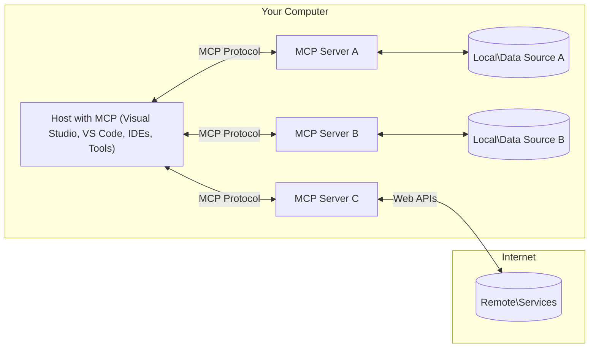

<!--
CO_OP_TRANSLATOR_METADATA:
{
  "original_hash": "11010ad254e48628bb6a457be2211640",
  "translation_date": "2025-08-12T07:57:38+00:00",
  "source_file": "01-CoreConcepts/README.md",
  "language_code": "es"
}
-->
# 📖 Conceptos Fundamentales de MCP: Dominando el Protocolo de Contexto de Modelo para la Integración de IA

[](https://youtu.be/earDzWGtE84)

_(Haz clic en la imagen de arriba para ver el video de esta lección)_

El [Protocolo de Contexto de Modelo (MCP)](https://github.com/modelcontextprotocol) es un marco estandarizado y poderoso que optimiza la comunicación entre Modelos de Lenguaje Extenso (LLMs) y herramientas, aplicaciones y fuentes de datos externas. Esta guía te llevará a través de los conceptos fundamentales de MCP, asegurando que comprendas su arquitectura cliente-servidor, componentes esenciales, mecánicas de comunicación y mejores prácticas de implementación.

## Resumen

Esta lección explora la arquitectura y los componentes fundamentales que conforman el ecosistema del Protocolo de Contexto de Modelo (MCP). Aprenderás sobre la arquitectura cliente-servidor, los componentes clave y los mecanismos de comunicación que impulsan las interacciones de MCP.

## 👩‍🎓 Objetivos Clave de Aprendizaje

Al final de esta lección, podrás:

- Comprender la arquitectura cliente-servidor de MCP.
- Identificar los roles y responsabilidades de Hosts, Clientes y Servidores.
- Analizar las características principales que hacen de MCP una capa de integración flexible.
- Aprender cómo fluye la información dentro del ecosistema MCP.
- Obtener conocimientos prácticos a través de ejemplos de código en .NET, Java, Python y JavaScript.

## 🔎 Arquitectura de MCP: Una Mirada Profunda

El ecosistema MCP está construido sobre un modelo cliente-servidor. Esta estructura modular permite que las aplicaciones de IA interactúen eficientemente con herramientas, bases de datos, APIs y recursos contextuales. Desglosaremos esta arquitectura en sus componentes principales.

En su núcleo, MCP sigue una arquitectura cliente-servidor donde una aplicación host puede conectarse a múltiples servidores:



- **Hosts de MCP**: Programas como VSCode, Claude Desktop, IDEs o herramientas de IA que desean acceder a datos a través de MCP.
- **Clientes de MCP**: Clientes del protocolo que mantienen conexiones 1:1 con los servidores.
- **Servidores de MCP**: Programas ligeros que exponen capacidades específicas a través del Protocolo de Contexto de Modelo estandarizado.
- **Fuentes de Datos Locales**: Archivos, bases de datos y servicios de tu computadora que los servidores MCP pueden acceder de manera segura.
- **Servicios Remotos**: Sistemas externos disponibles en internet que los servidores MCP pueden conectar a través de APIs.

El Protocolo MCP es un estándar en evolución. Puedes ver las últimas actualizaciones de la [especificación del protocolo](https://modelcontextprotocol.io/specification/2025-06-18/).

### 1. Hosts

En el Protocolo de Contexto de Modelo (MCP), los Hosts desempeñan un papel crucial como la interfaz principal a través de la cual los usuarios interactúan con el protocolo. Los Hosts son aplicaciones o entornos que inician conexiones con servidores MCP para acceder a datos, herramientas y prompts. Ejemplos de Hosts incluyen entornos de desarrollo integrados (IDEs) como Visual Studio Code, herramientas de IA como Claude Desktop, o agentes personalizados diseñados para tareas específicas.

**Hosts** son aplicaciones que inician conexiones con LLMs. Ellos:

- Ejecutan o interactúan con modelos de IA para generar respuestas.
- Inician conexiones con servidores MCP.
- Gestionan el flujo de conversación y la interfaz de usuario.
- Controlan permisos y restricciones de seguridad.
- Manejan el consentimiento del usuario para compartir datos y ejecutar herramientas.

### 2. Clientes

Los Clientes son componentes esenciales que facilitan la interacción entre los Hosts y los servidores MCP. Los Clientes actúan como intermediarios, permitiendo que los Hosts accedan y utilicen las funcionalidades proporcionadas por los servidores MCP. Juegan un papel crucial en garantizar una comunicación fluida y un intercambio de datos eficiente dentro de la arquitectura MCP.

**Clientes** son conectores dentro de la aplicación host. Ellos:

- Envían solicitudes a los servidores con prompts/instrucciones.
- Negocian capacidades con los servidores.
- Gestionan solicitudes de ejecución de herramientas desde los modelos.
- Procesan y muestran respuestas a los usuarios.

### 3. Servidores

Los Servidores son responsables de manejar solicitudes de los Clientes MCP y proporcionar respuestas adecuadas. Más comúnmente, los servidores actúan como herramientas que brindan una capacidad específica al LLM. Gestionan diversas operaciones como recuperación de datos, ejecución de herramientas y generación de prompts. Los Servidores aseguran que la comunicación entre Clientes y Hosts sea eficiente y confiable, manteniendo la integridad del proceso de interacción.

**Servidores** son servicios que proporcionan contexto y capacidades. Ellos:

- Registran las características disponibles (recursos, prompts, herramientas).
- Reciben y ejecutan llamadas de herramientas desde el cliente.
- Proporcionan información contextual para mejorar las respuestas del modelo.
- Devuelven resultados al cliente.
- Mantienen el estado a través de las interacciones cuando es necesario.

Los Servidores pueden ser desarrollados por cualquier persona para extender las capacidades del modelo con funcionalidades especializadas.

### 4. Características del Servidor

Los Servidores en el Protocolo de Contexto de Modelo (MCP) proporcionan bloques fundamentales que permiten interacciones enriquecidas entre Clientes, Hosts y modelos de lenguaje. Estas características están diseñadas para mejorar las capacidades de MCP ofreciendo contexto estructurado, herramientas y prompts.

Los servidores MCP pueden ofrecer cualquiera de las siguientes características:

#### 📑 Recursos 

Los Recursos en el Protocolo de Contexto de Modelo (MCP) abarcan varios tipos de contexto y datos que pueden ser utilizados por usuarios o modelos de IA. Estos incluyen:

- **Datos Contextuales**: Información y contexto que los usuarios o modelos de IA pueden aprovechar para la toma de decisiones y ejecución de tareas.
- **Bases de Conocimiento y Repositorios de Documentos**: Colecciones de datos estructurados y no estructurados, como artículos, manuales y documentos de investigación, que proporcionan información valiosa.
- **Archivos Locales y Bases de Datos**: Datos almacenados localmente en dispositivos o dentro de bases de datos, accesibles para procesamiento y análisis.
- **APIs y Servicios Web**: Interfaces y servicios externos que ofrecen datos y funcionalidades adicionales, permitiendo la integración con diversos recursos y herramientas en línea.

Un ejemplo de recurso puede ser un esquema de base de datos o un archivo que puede ser accedido de la siguiente manera:

```text
file://log.txt
database://schema
```

### 🤖 Prompts
Los Prompts en el Protocolo de Contexto de Modelo (MCP) incluyen varios patrones de interacción y plantillas predefinidas diseñadas para optimizar los flujos de trabajo de los usuarios y mejorar la comunicación. Estos incluyen:

- **Mensajes y Flujos de Trabajo Predefinidos**: Mensajes y procesos estructurados que guían a los usuarios a través de tareas e interacciones específicas.
- **Patrones de Interacción Predefinidos**: Secuencias estandarizadas de acciones y respuestas que facilitan una comunicación consistente y eficiente.
- **Plantillas de Conversación Especializadas**: Plantillas personalizables adaptadas a tipos específicos de conversaciones, asegurando interacciones relevantes y contextualmente apropiadas.

Una plantilla de prompt podría verse así:

```markdown
Generate a product slogan based on the following {{product}} with the following {{keywords}}
```

#### ⛏️ Herramientas

Las Herramientas en el Protocolo de Contexto de Modelo (MCP) son funciones que el modelo de IA puede ejecutar para realizar tareas específicas. Estas herramientas están diseñadas para mejorar las capacidades del modelo de IA proporcionando operaciones estructuradas y confiables. Los aspectos clave incluyen:

- **Funciones para que el modelo de IA las ejecute**: Las herramientas son funciones ejecutables que el modelo de IA puede invocar para llevar a cabo diversas tareas.
- **Nombre Único y Descripción**: Cada herramienta tiene un nombre distintivo y una descripción detallada que explica su propósito y funcionalidad.
- **Parámetros y Resultados**: Las herramientas aceptan parámetros específicos y devuelven resultados estructurados, asegurando resultados consistentes y predecibles.
- **Funciones Discretas**: Las herramientas realizan funciones discretas como búsquedas web, cálculos y consultas a bases de datos.

Un ejemplo de herramienta podría verse así:

```typescript
server.tool(
  "GetProducts",
  {
    pageSize: z.string().optional(),
    pageCount: z.string().optional()
  }, () => {
    // return results from API
  }
)
```

## Características del Cliente

En el Protocolo de Contexto de Modelo (MCP), los Clientes ofrecen varias características clave a los servidores, mejorando la funcionalidad general y la interacción dentro del protocolo. Una de las características destacadas es el Muestreo.

### 👉 Muestreo

- **Comportamientos Agénticos Iniciados por el Servidor**: Los Clientes permiten que los servidores inicien acciones o comportamientos específicos de manera autónoma, mejorando las capacidades dinámicas del sistema.
- **Interacciones Recursivas con LLMs**: Esta característica permite interacciones recursivas con modelos de lenguaje extenso (LLMs), habilitando un procesamiento más complejo e iterativo de tareas.
- **Solicitar Completaciones Adicionales del Modelo**: Los servidores pueden solicitar completaciones adicionales del modelo, asegurando que las respuestas sean completas y contextualmente relevantes.

## Flujo de Información en MCP

El Protocolo de Contexto de Modelo (MCP) define un flujo estructurado de información entre Hosts, Clientes, Servidores y Modelos. Comprender este flujo ayuda a clarificar cómo se procesan las solicitudes de los usuarios y cómo se integran herramientas y datos externos en las respuestas del modelo.

- **El Host Inicia la Conexión**  
  La aplicación host (como un IDE o interfaz de chat) establece una conexión con un servidor MCP, típicamente a través de STDIO, WebSocket u otro transporte compatible.

- **Negociación de Capacidades**  
  El Cliente (embebido en el Host) y el Servidor intercambian información sobre sus características compatibles, herramientas, recursos y versiones del protocolo. Esto asegura que ambos lados comprendan qué capacidades están disponibles para la sesión.

- **Solicitud del Usuario**  
  El usuario interactúa con el Host (por ejemplo, ingresa un prompt o comando). El Host recopila esta entrada y la pasa al Cliente para su procesamiento.

- **Uso de Recursos o Herramientas**  
  - El Cliente puede solicitar contexto adicional o recursos del Servidor (como archivos, entradas de bases de datos o artículos de bases de conocimiento) para enriquecer la comprensión del modelo.
  - Si el modelo determina que se necesita una herramienta (por ejemplo, para obtener datos, realizar un cálculo o llamar a una API), el Cliente envía una solicitud de invocación de herramienta al Servidor, especificando el nombre de la herramienta y los parámetros.

- **Ejecución del Servidor**  
  El Servidor recibe la solicitud de recurso o herramienta, ejecuta las operaciones necesarias (como ejecutar una función, consultar una base de datos o recuperar un archivo) y devuelve los resultados al Cliente en un formato estructurado.

- **Generación de Respuesta**  
  El Cliente integra las respuestas del Servidor (datos de recursos, resultados de herramientas, etc.) en la interacción continua del modelo. El modelo utiliza esta información para generar una respuesta completa y contextualmente relevante.

- **Presentación del Resultado**  
  El Host recibe la salida final del Cliente y la presenta al usuario, a menudo incluyendo tanto el texto generado por el modelo como cualquier resultado de ejecuciones de herramientas o búsquedas de recursos.

Este flujo permite que MCP soporte aplicaciones de IA avanzadas, interactivas y conscientes del contexto al conectar sin problemas modelos con herramientas y fuentes de datos externas.

## Detalles del Protocolo

MCP (Protocolo de Contexto de Modelo) está construido sobre [JSON-RPC 2.0](https://www.jsonrpc.org/), proporcionando un formato de mensaje estandarizado y agnóstico al lenguaje para la comunicación entre Hosts, Clientes y Servidores. Esta base permite interacciones confiables, estructuradas y extensibles en diversas plataformas y lenguajes de programación.

### Características Clave del Protocolo

MCP extiende JSON-RPC 2.0 con convenciones adicionales para invocación de herramientas, acceso a recursos y gestión de prompts. Soporta múltiples capas de transporte (STDIO, WebSocket, SSE) y permite una comunicación segura, extensible y agnóstica al lenguaje entre componentes.

#### 🧢 Protocolo Base

- **Formato de Mensaje JSON-RPC**: Todas las solicitudes y respuestas utilizan la especificación JSON-RPC 2.0, asegurando una estructura consistente para llamadas de métodos, parámetros, resultados y manejo de errores.
- **Conexiones con Estado**: Las sesiones MCP mantienen estado a través de múltiples solicitudes, soportando conversaciones continuas, acumulación de contexto y gestión de recursos.
- **Negociación de Capacidades**: Durante la configuración de la conexión, los Clientes y Servidores intercambian información sobre características compatibles, versiones del protocolo, herramientas disponibles y recursos. Esto asegura que ambos lados comprendan las capacidades del otro y puedan adaptarse en consecuencia.

#### ➕ Utilidades Adicionales

A continuación se presentan algunas utilidades adicionales y extensiones del protocolo que MCP proporciona para mejorar la experiencia del desarrollador y habilitar escenarios avanzados:

- **Opciones de Configuración**: MCP permite la configuración dinámica de parámetros de sesión, como permisos de herramientas, acceso a recursos y configuraciones del modelo, adaptados a cada interacción.
- **Seguimiento de Progreso**: Las operaciones de larga duración pueden informar actualizaciones de progreso, habilitando interfaces de usuario receptivas y mejorando la experiencia del usuario durante tareas complejas.
- **Cancelación de Solicitudes**: Los Clientes pueden cancelar solicitudes en curso, permitiendo a los usuarios interrumpir operaciones que ya no son necesarias o que están tardando demasiado.
- **Reporte de Errores**: Mensajes de error y códigos estandarizados ayudan a diagnosticar problemas, manejar fallos de manera elegante y proporcionar retroalimentación accionable a usuarios y desarrolladores.
- **Registro de Actividades**: Tanto los Clientes como los Servidores pueden emitir registros estructurados para auditoría, depuración y monitoreo de interacciones del protocolo.

Al aprovechar estas características del protocolo, MCP asegura una comunicación robusta, segura y flexible entre modelos de lenguaje y herramientas o fuentes de datos externas.

### 🔐 Consideraciones de Seguridad

Las implementaciones de MCP deben adherirse a varios principios clave de seguridad para garantizar interacciones seguras y confiables:

- **Consentimiento y Control del Usuario**: Los usuarios deben proporcionar consentimiento explícito antes de que se acceda a cualquier dato o se realicen operaciones. Deben tener un control claro sobre qué datos se comparten y qué acciones están autorizadas, respaldado por interfaces de usuario intuitivas para revisar y aprobar actividades.

- **Privacidad de los Datos**: Los datos del usuario solo deben ser expuestos con consentimiento explícito y deben estar protegidos por controles de acceso apropiados. Las implementaciones de MCP deben salvaguardar contra transmisiones de datos no autorizadas y garantizar que la privacidad se mantenga en todas las interacciones.

- **Seguridad de las Herramientas**: Antes de invocar cualquier herramienta, se requiere consentimiento explícito del usuario. Los usuarios deben tener una comprensión clara de la funcionalidad de cada herramienta, y se deben imponer límites de seguridad robustos para prevenir ejecuciones de herramientas no intencionadas o inseguras.

Al seguir estos principios, MCP asegura que la confianza, privacidad y seguridad del usuario se mantengan en todas las interacciones del protocolo.

## Ejemplos de Código: Componentes Clave

A continuación se presentan ejemplos de código en varios lenguajes de programación populares que ilustran cómo implementar componentes clave de servidores MCP y herramientas.

### Ejemplo en .NET: Creando un Servidor MCP Simple con Herramientas

Aquí hay un ejemplo práctico de código en .NET que demuestra cómo implementar un servidor MCP simple con herramientas personalizadas. Este ejemplo muestra cómo definir y registrar herramientas, manejar solicitudes y conectar el servidor utilizando el Protocolo de Contexto de Modelo.

```csharp
using System;
using System.Threading.Tasks;
using ModelContextProtocol.Server;
using ModelContextProtocol.Server.Transport;
using ModelContextProtocol.Server.Tools;

public class WeatherServer
{
    public static async Task Main(string[] args)
    {
        // Create an MCP server
        var server = new McpServer(
            name: "Weather MCP Server",
            version: "1.0.0"
        );
        
        // Register our custom weather tool
        server.AddTool<string, WeatherData>("weatherTool", 
            description: "Gets current weather for a location",
            execute: async (location) => {
                // Call weather API (simplified)
                var weatherData = await GetWeatherDataAsync(location);
                return weatherData;
            });
        
        // Connect the server using stdio transport
        var transport = new StdioServerTransport();
        await server.ConnectAsync(transport);
        
        Console.WriteLine("Weather MCP Server started");
        
        // Keep the server running until process is terminated
        await Task.Delay(-1);
    }
    
    private static async Task<WeatherData> GetWeatherDataAsync(string location)
    {
        // This would normally call a weather API
        // Simplified for demonstration
        await Task.Delay(100); // Simulate API call
        return new WeatherData { 
            Temperature = 72.5,
            Conditions = "Sunny",
            Location = location
        };
    }
}

public class WeatherData
{
    public double Temperature { get; set; }
    public string Conditions { get; set; }
    public string Location { get; set; }
}
```

### Ejemplo en Java: Componentes del Servidor MCP

Este ejemplo demuestra el mismo servidor MCP y registro de herramientas que el ejemplo en .NET anterior, pero implementado en Java.

```java
import io.modelcontextprotocol.server.McpServer;
import io.modelcontextprotocol.server.McpToolDefinition;
import io.modelcontextprotocol.server.transport.StdioServerTransport;
import io.modelcontextprotocol.server.tool.ToolExecutionContext;
import io.modelcontextprotocol.server.tool.ToolResponse;

public class WeatherMcpServer {
    public static void main(String[] args) throws Exception {
        // Create an MCP server
        McpServer server = McpServer.builder()
            .name("Weather MCP Server")
            .version("1.0.0")
            .build();
            
        // Register a weather tool
        server.registerTool(McpToolDefinition.builder("weatherTool")
            .description("Gets current weather for a location")
            .parameter("location", String.class)
            .execute((ToolExecutionContext ctx) -> {
                String location = ctx.getParameter("location", String.class);
                
                // Get weather data (simplified)
                WeatherData data = getWeatherData(location);
                
                // Return formatted response
                return ToolResponse.content(
                    String.format("Temperature: %.1f°F, Conditions: %s, Location: %s", 
                    data.getTemperature(), 
                    data.getConditions(), 
                    data.getLocation())
                );
            })
            .build());
        
        // Connect the server using stdio transport
        try (StdioServerTransport transport = new StdioServerTransport()) {
            server.connect(transport);
            System.out.println("Weather MCP Server started");
            // Keep server running until process is terminated
            Thread.currentThread().join();
        }
    }
    
    private static WeatherData getWeatherData(String location) {
        // Implementation would call a weather API
        // Simplified for example purposes
        return new WeatherData(72.5, "Sunny", location);
    }
}

class WeatherData {
    private double temperature;
    private String conditions;
    private String location;
    
    public WeatherData(double temperature, String conditions, String location) {
        this.temperature = temperature;
        this.conditions = conditions;
        this.location = location;
    }
    
    public double getTemperature() {
        return temperature;
    }
    
    public String getConditions() {
        return conditions;
    }
    
    public String getLocation() {
        return location;
    }
}
```

### Ejemplo en Python: Construyendo un Servidor MCP

En este ejemplo mostramos cómo construir un servidor MCP en Python. También se muestran dos formas diferentes de crear herramientas.

```python
#!/usr/bin/env python3
import asyncio
from mcp.server.fastmcp import FastMCP
from mcp.server.transports.stdio import serve_stdio

# Create a FastMCP server
mcp = FastMCP(
    name="Weather MCP Server",
    version="1.0.0"
)

@mcp.tool()
def get_weather(location: str) -> dict:
    """Gets current weather for a location."""
    # This would normally call a weather API
    # Simplified for demonstration
    return {
        "temperature": 72.5,
        "conditions": "Sunny",
        "location": location
    }

# Alternative approach using a class
class WeatherTools:
    @mcp.tool()
    def forecast(self, location: str, days: int = 1) -> dict:
        """Gets weather forecast for a location for the specified number of days."""
        # This would normally call a weather API forecast endpoint
        # Simplified for demonstration
        return {
            "location": location,
            "forecast": [
                {"day": i+1, "temperature": 70 + i, "conditions": "Partly Cloudy"}
                for i in range(days)
            ]
        }

# Instantiate the class to register its tools
weather_tools = WeatherTools()

# Start the server using stdio transport
if __name__ == "__main__":
    asyncio.run(serve_stdio(mcp))
```

### Ejemplo en JavaScript: Creando un Servidor MCP
Este ejemplo muestra la creación de un servidor MCP en JavaScript y cómo registrar dos herramientas relacionadas con el clima.

```javascript
// Using the official Model Context Protocol SDK
import { McpServer } from "@modelcontextprotocol/sdk/server/mcp.js";
import { StdioServerTransport } from "@modelcontextprotocol/sdk/server/stdio.js";
import { z } from "zod"; // For parameter validation

// Create an MCP server
const server = new McpServer({
  name: "Weather MCP Server",
  version: "1.0.0"
});

// Define a weather tool
server.tool(
  "weatherTool",
  {
    location: z.string().describe("The location to get weather for")
  },
  async ({ location }) => {
    // This would normally call a weather API
    // Simplified for demonstration
    const weatherData = await getWeatherData(location);
    
    return {
      content: [
        { 
          type: "text", 
          text: `Temperature: ${weatherData.temperature}°F, Conditions: ${weatherData.conditions}, Location: ${weatherData.location}` 
        }
      ]
    };
  }
);

// Define a forecast tool
server.tool(
  "forecastTool",
  {
    location: z.string(),
    days: z.number().default(3).describe("Number of days for forecast")
  },
  async ({ location, days }) => {
    // This would normally call a weather API
    // Simplified for demonstration
    const forecast = await getForecastData(location, days);
    
    return {
      content: [
        { 
          type: "text", 
          text: `${days}-day forecast for ${location}: ${JSON.stringify(forecast)}` 
        }
      ]
    };
  }
);

// Helper functions
async function getWeatherData(location) {
  // Simulate API call
  return {
    temperature: 72.5,
    conditions: "Sunny",
    location: location
  };
}

async function getForecastData(location, days) {
  // Simulate API call
  return Array.from({ length: days }, (_, i) => ({
    day: i + 1,
    temperature: 70 + Math.floor(Math.random() * 10),
    conditions: i % 2 === 0 ? "Sunny" : "Partly Cloudy"
  }));
}

// Connect the server using stdio transport
const transport = new StdioServerTransport();
server.connect(transport).catch(console.error);

console.log("Weather MCP Server started");
```

Este ejemplo en JavaScript demuestra cómo crear un cliente MCP que se conecta a un servidor, envía un mensaje, y procesa la respuesta, incluyendo cualquier llamada a herramientas que se haya realizado.

## Seguridad y Autorización

MCP incluye varios conceptos y mecanismos integrados para gestionar la seguridad y la autorización a lo largo del protocolo:

1. **Control de Permisos de Herramientas**:  
   Los clientes pueden especificar qué herramientas un modelo tiene permitido usar durante una sesión. Esto asegura que solo las herramientas explícitamente autorizadas sean accesibles, reduciendo el riesgo de operaciones no deseadas o inseguras. Los permisos pueden configurarse dinámicamente según las preferencias del usuario, políticas organizacionales o el contexto de la interacción.

2. **Autenticación**:  
   Los servidores pueden requerir autenticación antes de otorgar acceso a herramientas, recursos u operaciones sensibles. Esto puede implicar claves API, tokens OAuth u otros esquemas de autenticación. Una autenticación adecuada asegura que solo clientes y usuarios de confianza puedan invocar capacidades del servidor.

3. **Validación**:  
   La validación de parámetros se aplica a todas las invocaciones de herramientas. Cada herramienta define los tipos, formatos y restricciones esperados para sus parámetros, y el servidor valida las solicitudes entrantes en consecuencia. Esto previene que entradas malformadas o maliciosas lleguen a las implementaciones de herramientas y ayuda a mantener la integridad de las operaciones.

4. **Limitación de Tasa**:  
   Para prevenir abusos y garantizar un uso equitativo de los recursos del servidor, los servidores MCP pueden implementar limitación de tasa para llamadas a herramientas y acceso a recursos. Los límites de tasa pueden aplicarse por usuario, por sesión o de manera global, y ayudan a proteger contra ataques de denegación de servicio o consumo excesivo de recursos.

Combinando estos mecanismos, MCP proporciona una base segura para integrar modelos de lenguaje con herramientas y fuentes de datos externas, mientras ofrece a los usuarios y desarrolladores un control detallado sobre el acceso y el uso.

## Mensajes del Protocolo

La comunicación MCP utiliza mensajes JSON estructurados para facilitar interacciones claras y confiables entre clientes, servidores y modelos. Los principales tipos de mensajes incluyen:

- **Solicitud del Cliente**  
   Enviada desde el cliente al servidor, este mensaje típicamente incluye:
   - El mensaje o comando del usuario
   - Historial de conversación para contexto
   - Configuración y permisos de herramientas
   - Cualquier información adicional de metadatos o sesión

- **Respuesta del Modelo**  
   Devuelta por el modelo (a través del cliente), este mensaje contiene:
   - Texto generado o completado basado en el mensaje y el contexto
   - Instrucciones opcionales para llamadas a herramientas si el modelo determina que se debe invocar una herramienta
   - Referencias a recursos o contexto adicional según sea necesario

- **Solicitud de Herramienta**  
   Enviada desde el cliente al servidor cuando se necesita ejecutar una herramienta. Este mensaje incluye:
   - El nombre de la herramienta a invocar
   - Parámetros requeridos por la herramienta (validados contra el esquema de la herramienta)
   - Información contextual o identificadores para rastrear la solicitud

- **Respuesta de Herramienta**  
   Devuelta por el servidor después de ejecutar una herramienta. Este mensaje proporciona:
   - Los resultados de la ejecución de la herramienta (datos estructurados o contenido)
   - Cualquier error o información de estado si la llamada a la herramienta falló
   - Opcionalmente, metadatos adicionales o registros relacionados con la ejecución

Estos mensajes estructurados aseguran que cada paso en el flujo de trabajo MCP sea explícito, rastreable y extensible, apoyando escenarios avanzados como conversaciones de múltiples turnos, encadenamiento de herramientas y manejo robusto de errores.

## Puntos Clave

- MCP utiliza una arquitectura cliente-servidor para conectar modelos con capacidades externas
- El ecosistema consiste en clientes, hosts, servidores, herramientas y fuentes de datos
- La comunicación puede realizarse a través de STDIO, SSE o WebSockets
- Las herramientas son las unidades fundamentales de funcionalidad expuestas a los modelos
- Los protocolos de comunicación estructurados aseguran interacciones consistentes

## Ejercicio

Diseña una herramienta MCP simple que sea útil en tu área. Define:
1. El nombre de la herramienta
2. Los parámetros que aceptaría
3. La salida que devolvería
4. Cómo un modelo podría usar esta herramienta para resolver problemas de los usuarios


---

## ¿Qué sigue?

Siguiente: [Capítulo 2: Seguridad](../02-Security/README.md)

**Descargo de responsabilidad**:  
Este documento ha sido traducido utilizando el servicio de traducción automática [Co-op Translator](https://github.com/Azure/co-op-translator). Si bien nos esforzamos por lograr precisión, tenga en cuenta que las traducciones automáticas pueden contener errores o imprecisiones. El documento original en su idioma nativo debe considerarse como la fuente autorizada. Para información crítica, se recomienda una traducción profesional realizada por humanos. No nos hacemos responsables de malentendidos o interpretaciones erróneas que puedan surgir del uso de esta traducción.