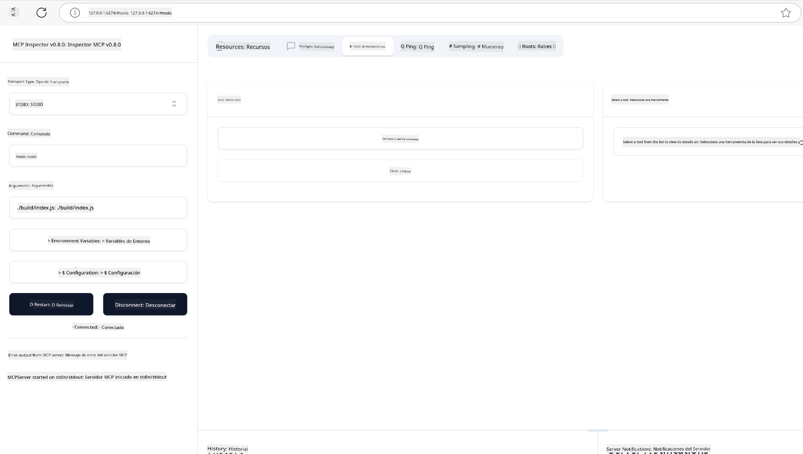
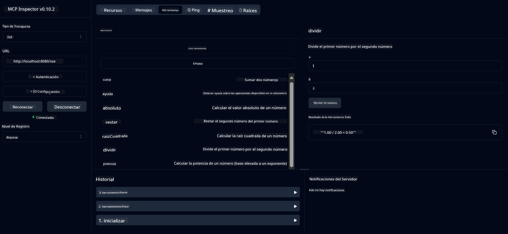
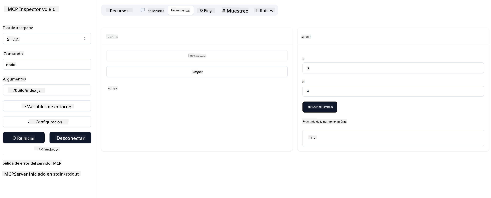

<!--
CO_OP_TRANSLATOR_METADATA:
{
  "original_hash": "ee93d6093964ea579dbdc20b4d643e9b",
  "translation_date": "2025-08-12T21:29:20+00:00",
  "source_file": "03-GettingStarted/01-first-server/README.md",
  "language_code": "es"
}
-->
# Comenzando con MCP

¡Bienvenido a tus primeros pasos con el Protocolo de Contexto de Modelos (MCP)! Ya sea que seas nuevo en MCP o busques profundizar tu comprensión, esta guía te llevará a través del proceso esencial de configuración y desarrollo. Descubrirás cómo MCP permite una integración fluida entre modelos de IA y aplicaciones, y aprenderás cómo preparar rápidamente tu entorno para construir y probar soluciones impulsadas por MCP.

> Resumen rápido: Si desarrollas aplicaciones de IA, sabes que puedes agregar herramientas y otros recursos a tu LLM (modelo de lenguaje grande) para hacerlo más inteligente. Sin embargo, si colocas esas herramientas y recursos en un servidor, las capacidades de la aplicación y el servidor pueden ser utilizadas por cualquier cliente con o sin un LLM.

## Descripción general

Esta lección proporciona orientación práctica sobre cómo configurar entornos MCP y construir tus primeras aplicaciones MCP. Aprenderás a configurar las herramientas y marcos necesarios, construir servidores MCP básicos, crear aplicaciones anfitrionas y probar tus implementaciones.

El Protocolo de Contexto de Modelos (MCP) es un protocolo abierto que estandariza cómo las aplicaciones proporcionan contexto a los LLMs. Piensa en MCP como un puerto USB-C para aplicaciones de IA: proporciona una forma estandarizada de conectar modelos de IA a diferentes fuentes de datos y herramientas.

## Objetivos de aprendizaje

Al final de esta lección, podrás:

- Configurar entornos de desarrollo para MCP en C#, Java, Python, TypeScript y Rust
- Construir y desplegar servidores MCP básicos con características personalizadas (recursos, indicaciones y herramientas)
- Crear aplicaciones anfitrionas que se conecten a servidores MCP
- Probar y depurar implementaciones de MCP

## Configuración de tu entorno MCP

Antes de comenzar a trabajar con MCP, es importante preparar tu entorno de desarrollo y comprender el flujo de trabajo básico. Esta sección te guiará a través de los pasos iniciales de configuración para garantizar un inicio sin problemas con MCP.

### Requisitos previos

Antes de sumergirte en el desarrollo de MCP, asegúrate de tener:

- **Entorno de desarrollo**: Para el lenguaje que elijas (C#, Java, Python, TypeScript o Rust)
- **IDE/Editor**: Visual Studio, Visual Studio Code, IntelliJ, Eclipse, PyCharm o cualquier editor de código moderno
- **Gestores de paquetes**: NuGet, Maven/Gradle, pip, npm/yarn o Cargo
- **Claves API**: Para cualquier servicio de IA que planees usar en tus aplicaciones anfitrionas

## Estructura básica de un servidor MCP

Un servidor MCP típicamente incluye:

- **Configuración del servidor**: Configuración de puerto, autenticación y otros ajustes
- **Recursos**: Datos y contexto disponibles para los LLMs
- **Herramientas**: Funcionalidades que los modelos pueden invocar
- **Indicaciones**: Plantillas para generar o estructurar texto

Aquí hay un ejemplo simplificado en TypeScript:

```typescript
import { McpServer, ResourceTemplate } from "@modelcontextprotocol/sdk/server/mcp.js";
import { StdioServerTransport } from "@modelcontextprotocol/sdk/server/stdio.js";
import { z } from "zod";

// Create an MCP server
const server = new McpServer({
  name: "Demo",
  version: "1.0.0"
});

// Add an addition tool
server.tool("add",
  { a: z.number(), b: z.number() },
  async ({ a, b }) => ({
    content: [{ type: "text", text: String(a + b) }]
  })
);

// Add a dynamic greeting resource
server.resource(
  "file",
  // The 'list' parameter controls how the resource lists available files. Setting it to undefined disables listing for this resource.
  new ResourceTemplate("file://{path}", { list: undefined }),
  async (uri, { path }) => ({
    contents: [{
      uri: uri.href,
      text: `File, ${path}!`
    }]
// Add a file resource that reads the file contents
server.resource(
  "file",
  new ResourceTemplate("file://{path}", { list: undefined }),
  async (uri, { path }) => {
    let text;
    try {
      text = await fs.readFile(path, "utf8");
    } catch (err) {
      text = `Error reading file: ${err.message}`;
    }
    return {
      contents: [{
        uri: uri.href,
        text
      }]
    };
  }
);

server.prompt(
  "review-code",
  { code: z.string() },
  ({ code }) => ({
    messages: [{
      role: "user",
      content: {
        type: "text",
        text: `Please review this code:\n\n${code}`
      }
    }]
  })
);

// Start receiving messages on stdin and sending messages on stdout
const transport = new StdioServerTransport();
await server.connect(transport);
```

En el código anterior:

- Importamos las clases necesarias del SDK de MCP para TypeScript.
- Creamos y configuramos una nueva instancia de servidor MCP.
- Registramos una herramienta personalizada (`calculator`) con una función manejadora.
- Iniciamos el servidor para escuchar solicitudes MCP entrantes.

## Pruebas y depuración

Antes de comenzar a probar tu servidor MCP, es importante comprender las herramientas disponibles y las mejores prácticas para la depuración. Las pruebas efectivas garantizan que tu servidor se comporte como se espera y te ayudan a identificar y resolver problemas rápidamente. La siguiente sección describe enfoques recomendados para validar tu implementación de MCP.

MCP proporciona herramientas para ayudarte a probar y depurar tus servidores:

- **Herramienta Inspector**, una interfaz gráfica que te permite conectarte a tu servidor y probar tus herramientas, indicaciones y recursos.
- **curl**, también puedes conectarte a tu servidor usando una herramienta de línea de comandos como curl u otros clientes que puedan crear y ejecutar comandos HTTP.

### Uso del Inspector MCP

El [Inspector MCP](https://github.com/modelcontextprotocol/inspector) es una herramienta de prueba visual que te ayuda a:

1. **Descubrir capacidades del servidor**: Detectar automáticamente recursos, herramientas e indicaciones disponibles
2. **Probar ejecución de herramientas**: Probar diferentes parámetros y ver respuestas en tiempo real
3. **Ver metadatos del servidor**: Examinar información del servidor, esquemas y configuraciones

```bash
# ex TypeScript, installing and running MCP Inspector
npx @modelcontextprotocol/inspector node build/index.js
```

Cuando ejecutes los comandos anteriores, el Inspector MCP lanzará una interfaz web local en tu navegador. Puedes esperar ver un panel que muestra tus servidores MCP registrados, sus herramientas, recursos e indicaciones disponibles. La interfaz te permite probar interactivamente la ejecución de herramientas, inspeccionar metadatos del servidor y ver respuestas en tiempo real, facilitando la validación y depuración de tus implementaciones de servidor MCP.

Aquí hay una captura de pantalla de cómo podría verse:



## Problemas comunes de configuración y soluciones

| Problema | Posible solución |
|----------|------------------|
| Conexión rechazada | Verifica si el servidor está en ejecución y el puerto es correcto |
| Errores en la ejecución de herramientas | Revisa la validación de parámetros y el manejo de errores |
| Fallos de autenticación | Verifica las claves API y permisos |
| Errores de validación de esquemas | Asegúrate de que los parámetros coincidan con el esquema definido |
| El servidor no inicia | Revisa conflictos de puertos o dependencias faltantes |
| Errores de CORS | Configura los encabezados CORS adecuados para solicitudes de origen cruzado |
| Problemas de autenticación | Verifica la validez del token y los permisos |

## Desarrollo local

Para el desarrollo y pruebas locales, puedes ejecutar servidores MCP directamente en tu máquina:

1. **Inicia el proceso del servidor**: Ejecuta tu aplicación de servidor MCP
2. **Configura la red**: Asegúrate de que el servidor sea accesible en el puerto esperado
3. **Conecta clientes**: Usa URLs de conexión local como `http://localhost:3000`

```bash
# Example: Running a TypeScript MCP server locally
npm run start
# Server running at http://localhost:3000
```

## Construyendo tu primer servidor MCP

Hemos cubierto [Conceptos básicos](/01-CoreConcepts/README.md) en una lección anterior, ahora es momento de poner ese conocimiento en práctica.

### Lo que puede hacer un servidor

Antes de comenzar a escribir código, recordemos lo que puede hacer un servidor:

Un servidor MCP puede, por ejemplo:

- Acceder a archivos locales y bases de datos
- Conectarse a APIs remotas
- Realizar cálculos
- Integrarse con otras herramientas y servicios
- Proporcionar una interfaz de usuario para la interacción

Genial, ahora que sabemos lo que podemos hacer, comencemos a codificar.

## Ejercicio: Creando un servidor

Para crear un servidor, debes seguir estos pasos:

- Instalar el SDK de MCP.
- Crear un proyecto y configurar la estructura del proyecto.
- Escribir el código del servidor.
- Probar el servidor.

### -1- Crear proyecto

#### TypeScript

```sh
# Create project directory and initialize npm project
mkdir calculator-server
cd calculator-server
npm init -y
```

#### Python

```sh
# Create project dir
mkdir calculator-server
cd calculator-server
# Open the folder in Visual Studio Code - Skip this if you are using a different IDE
code .
```

#### .NET

```sh
dotnet new console -n McpCalculatorServer
cd McpCalculatorServer
```

#### Java

Para Java, crea un proyecto Spring Boot:

```bash
curl https://start.spring.io/starter.zip \
  -d dependencies=web \
  -d javaVersion=21 \
  -d type=maven-project \
  -d groupId=com.example \
  -d artifactId=calculator-server \
  -d name=McpServer \
  -d packageName=com.microsoft.mcp.sample.server \
  -o calculator-server.zip
```

Extrae el archivo zip:

```bash
unzip calculator-server.zip -d calculator-server
cd calculator-server
# optional remove the unused test
rm -rf src/test/java
```

Agrega la siguiente configuración completa a tu archivo *pom.xml*:

```xml
<?xml version="1.0" encoding="UTF-8"?>
<project xmlns="http://maven.apache.org/POM/4.0.0"
    xmlns:xsi="http://www.w3.org/2001/XMLSchema-instance"
    xsi:schemaLocation="http://maven.apache.org/POM/4.0.0 http://maven.apache.org/xsd/maven-4.0.0.xsd">
    <modelVersion>4.0.0</modelVersion>
    
    <!-- Spring Boot parent for dependency management -->
    <parent>
        <groupId>org.springframework.boot</groupId>
        <artifactId>spring-boot-starter-parent</artifactId>
        <version>3.5.0</version>
        <relativePath />
    </parent>

    <!-- Project coordinates -->
    <groupId>com.example</groupId>
    <artifactId>calculator-server</artifactId>
    <version>0.0.1-SNAPSHOT</version>
    <name>Calculator Server</name>
    <description>Basic calculator MCP service for beginners</description>

    <!-- Properties -->
    <properties>
        <java.version>21</java.version>
        <maven.compiler.source>21</maven.compiler.source>
        <maven.compiler.target>21</maven.compiler.target>
    </properties>

    <!-- Spring AI BOM for version management -->
    <dependencyManagement>
        <dependencies>
            <dependency>
                <groupId>org.springframework.ai</groupId>
                <artifactId>spring-ai-bom</artifactId>
                <version>1.0.0-SNAPSHOT</version>
                <type>pom</type>
                <scope>import</scope>
            </dependency>
        </dependencies>
    </dependencyManagement>

    <!-- Dependencies -->
    <dependencies>
        <dependency>
            <groupId>org.springframework.ai</groupId>
            <artifactId>spring-ai-starter-mcp-server-webflux</artifactId>
        </dependency>
        <dependency>
            <groupId>org.springframework.boot</groupId>
            <artifactId>spring-boot-starter-actuator</artifactId>
        </dependency>
        <dependency>
         <groupId>org.springframework.boot</groupId>
         <artifactId>spring-boot-starter-test</artifactId>
         <scope>test</scope>
      </dependency>
    </dependencies>

    <!-- Build configuration -->
    <build>
        <plugins>
            <plugin>
                <groupId>org.springframework.boot</groupId>
                <artifactId>spring-boot-maven-plugin</artifactId>
            </plugin>
            <plugin>
                <groupId>org.apache.maven.plugins</groupId>
                <artifactId>maven-compiler-plugin</artifactId>
                <configuration>
                    <release>21</release>
                </configuration>
            </plugin>
        </plugins>
    </build>

    <!-- Repositories for Spring AI snapshots -->
    <repositories>
        <repository>
            <id>spring-milestones</id>
            <name>Spring Milestones</name>
            <url>https://repo.spring.io/milestone</url>
            <snapshots>
                <enabled>false</enabled>
            </snapshots>
        </repository>
        <repository>
            <id>spring-snapshots</id>
            <name>Spring Snapshots</name>
            <url>https://repo.spring.io/snapshot</url>
            <releases>
                <enabled>false</enabled>
            </releases>
        </repository>
    </repositories>
</project>
```

#### Rust

```sh
mkdir calculator-server
cd calculator-server
cargo init
```

### -2- Agregar dependencias

Ahora que has creado tu proyecto, agreguemos las dependencias necesarias:

#### TypeScript

```sh
# If not already installed, install TypeScript globally
npm install typescript -g

# Install the MCP SDK and Zod for schema validation
npm install @modelcontextprotocol/sdk zod
npm install -D @types/node typescript
```

#### Python

```sh
# Create a virtual env and install dependencies
python -m venv venv
venv\Scripts\activate
pip install "mcp[cli]"
```

#### Java

```bash
cd calculator-server
./mvnw clean install -DskipTests
```

#### Rust

```sh
cargo add rmcp --features server,transport-io
cargo add serde
cargo add tokio --features rt-multi-thread
```

### -3- Crear archivos del proyecto

#### TypeScript

Abre el archivo *package.json* y reemplaza el contenido con lo siguiente para asegurarte de que puedes construir y ejecutar el servidor:

```json
{
  "name": "calculator-server",
  "version": "1.0.0",
  "main": "index.js",
  "type": "module",
  "scripts": {
    "start": "tsc && node ./build/index.js",
    "build": "tsc && node ./build/index.js"
  },
  "keywords": [],
  "author": "",
  "license": "ISC",
  "description": "A simple calculator server using Model Context Protocol",
  "dependencies": {
    "@modelcontextprotocol/sdk": "^1.16.0",
    "zod": "^3.25.76"
  },
  "devDependencies": {
    "@types/node": "^24.0.14",
    "typescript": "^5.8.3"
  }
}
```

Crea un archivo *tsconfig.json* con el siguiente contenido:

```json
{
  "compilerOptions": {
    "target": "ES2022",
    "module": "Node16",
    "moduleResolution": "Node16",
    "outDir": "./build",
    "rootDir": "./src",
    "strict": true,
    "esModuleInterop": true,
    "skipLibCheck": true,
    "forceConsistentCasingInFileNames": true
  },
  "include": ["src/**/*"],
  "exclude": ["node_modules"]
}
```

Crea un directorio para tu código fuente:

```sh
mkdir src
touch src/index.ts
```

#### Python

Crea un archivo *server.py*

```sh
touch server.py
```

#### .NET

Instala los paquetes NuGet requeridos:

```sh
dotnet add package ModelContextProtocol --prerelease
dotnet add package Microsoft.Extensions.Hosting
```

#### Java

Para proyectos Java Spring Boot, la estructura del proyecto se crea automáticamente.

#### Rust

Para Rust, se crea un archivo *src/main.rs* por defecto cuando ejecutas `cargo init`. Abre el archivo y elimina el código predeterminado.

### -4- Crear código del servidor

#### TypeScript

Crea un archivo *index.ts* y agrega el siguiente código:

```typescript
import { McpServer, ResourceTemplate } from "@modelcontextprotocol/sdk/server/mcp.js";
import { StdioServerTransport } from "@modelcontextprotocol/sdk/server/stdio.js";
import { z } from "zod";
 
// Create an MCP server
const server = new McpServer({
  name: "Calculator MCP Server",
  version: "1.0.0"
});
```

Ahora tienes un servidor, pero no hace mucho, arreglemos eso.

#### Python

```python
# server.py
from mcp.server.fastmcp import FastMCP

# Create an MCP server
mcp = FastMCP("Demo")
```

#### .NET

```csharp
using Microsoft.Extensions.DependencyInjection;
using Microsoft.Extensions.Hosting;
using Microsoft.Extensions.Logging;
using ModelContextProtocol.Server;
using System.ComponentModel;

var builder = Host.CreateApplicationBuilder(args);
builder.Logging.AddConsole(consoleLogOptions =>
{
    // Configure all logs to go to stderr
    consoleLogOptions.LogToStandardErrorThreshold = LogLevel.Trace;
});

builder.Services
    .AddMcpServer()
    .WithStdioServerTransport()
    .WithToolsFromAssembly();
await builder.Build().RunAsync();

// add features
```

#### Java

Para Java, crea los componentes principales del servidor. Primero, modifica la clase principal de la aplicación:

*src/main/java/com/microsoft/mcp/sample/server/McpServerApplication.java*:

```java
package com.microsoft.mcp.sample.server;

import org.springframework.ai.tool.ToolCallbackProvider;
import org.springframework.ai.tool.method.MethodToolCallbackProvider;
import org.springframework.boot.SpringApplication;
import org.springframework.boot.autoconfigure.SpringBootApplication;
import org.springframework.context.annotation.Bean;
import com.microsoft.mcp.sample.server.service.CalculatorService;

@SpringBootApplication
public class McpServerApplication {

    public static void main(String[] args) {
        SpringApplication.run(McpServerApplication.class, args);
    }
    
    @Bean
    public ToolCallbackProvider calculatorTools(CalculatorService calculator) {
        return MethodToolCallbackProvider.builder().toolObjects(calculator).build();
    }
}
```

Crea el servicio de calculadora *src/main/java/com/microsoft/mcp/sample/server/service/CalculatorService.java*:

```java
package com.microsoft.mcp.sample.server.service;

import org.springframework.ai.tool.annotation.Tool;
import org.springframework.stereotype.Service;

/**
 * Service for basic calculator operations.
 * This service provides simple calculator functionality through MCP.
 */
@Service
public class CalculatorService {

    /**
     * Add two numbers
     * @param a The first number
     * @param b The second number
     * @return The sum of the two numbers
     */
    @Tool(description = "Add two numbers together")
    public String add(double a, double b) {
        double result = a + b;
        return formatResult(a, "+", b, result);
    }

    /**
     * Subtract one number from another
     * @param a The number to subtract from
     * @param b The number to subtract
     * @return The result of the subtraction
     */
    @Tool(description = "Subtract the second number from the first number")
    public String subtract(double a, double b) {
        double result = a - b;
        return formatResult(a, "-", b, result);
    }

    /**
     * Multiply two numbers
     * @param a The first number
     * @param b The second number
     * @return The product of the two numbers
     */
    @Tool(description = "Multiply two numbers together")
    public String multiply(double a, double b) {
        double result = a * b;
        return formatResult(a, "*", b, result);
    }

    /**
     * Divide one number by another
     * @param a The numerator
     * @param b The denominator
     * @return The result of the division
     */
    @Tool(description = "Divide the first number by the second number")
    public String divide(double a, double b) {
        if (b == 0) {
            return "Error: Cannot divide by zero";
        }
        double result = a / b;
        return formatResult(a, "/", b, result);
    }

    /**
     * Calculate the power of a number
     * @param base The base number
     * @param exponent The exponent
     * @return The result of raising the base to the exponent
     */
    @Tool(description = "Calculate the power of a number (base raised to an exponent)")
    public String power(double base, double exponent) {
        double result = Math.pow(base, exponent);
        return formatResult(base, "^", exponent, result);
    }

    /**
     * Calculate the square root of a number
     * @param number The number to find the square root of
     * @return The square root of the number
     */
    @Tool(description = "Calculate the square root of a number")
    public String squareRoot(double number) {
        if (number < 0) {
            return "Error: Cannot calculate square root of a negative number";
        }
        double result = Math.sqrt(number);
        return String.format("√%.2f = %.2f", number, result);
    }

    /**
     * Calculate the modulus (remainder) of division
     * @param a The dividend
     * @param b The divisor
     * @return The remainder of the division
     */
    @Tool(description = "Calculate the remainder when one number is divided by another")
    public String modulus(double a, double b) {
        if (b == 0) {
            return "Error: Cannot divide by zero";
        }
        double result = a % b;
        return formatResult(a, "%", b, result);
    }

    /**
     * Calculate the absolute value of a number
     * @param number The number to find the absolute value of
     * @return The absolute value of the number
     */
    @Tool(description = "Calculate the absolute value of a number")
    public String absolute(double number) {
        double result = Math.abs(number);
        return String.format("|%.2f| = %.2f", number, result);
    }

    /**
     * Get help about available calculator operations
     * @return Information about available operations
     */
    @Tool(description = "Get help about available calculator operations")
    public String help() {
        return "Basic Calculator MCP Service\n\n" +
               "Available operations:\n" +
               "1. add(a, b) - Adds two numbers\n" +
               "2. subtract(a, b) - Subtracts the second number from the first\n" +
               "3. multiply(a, b) - Multiplies two numbers\n" +
               "4. divide(a, b) - Divides the first number by the second\n" +
               "5. power(base, exponent) - Raises a number to a power\n" +
               "6. squareRoot(number) - Calculates the square root\n" + 
               "7. modulus(a, b) - Calculates the remainder of division\n" +
               "8. absolute(number) - Calculates the absolute value\n\n" +
               "Example usage: add(5, 3) will return 5 + 3 = 8";
    }

    /**
     * Format the result of a calculation
     */
    private String formatResult(double a, String operator, double b, double result) {
        return String.format("%.2f %s %.2f = %.2f", a, operator, b, result);
    }
}
```

**Componentes opcionales para un servicio listo para producción:**

Crea una configuración de inicio *src/main/java/com/microsoft/mcp/sample/server/config/StartupConfig.java*:

```java
package com.microsoft.mcp.sample.server.config;

import org.springframework.boot.CommandLineRunner;
import org.springframework.context.annotation.Bean;
import org.springframework.context.annotation.Configuration;

@Configuration
public class StartupConfig {
    
    @Bean
    public CommandLineRunner startupInfo() {
        return args -> {
            System.out.println("\n" + "=".repeat(60));
            System.out.println("Calculator MCP Server is starting...");
            System.out.println("SSE endpoint: http://localhost:8080/sse");
            System.out.println("Health check: http://localhost:8080/actuator/health");
            System.out.println("=".repeat(60) + "\n");
        };
    }
}
```

Crea un controlador de salud *src/main/java/com/microsoft/mcp/sample/server/controller/HealthController.java*:

```java
package com.microsoft.mcp.sample.server.controller;

import org.springframework.http.ResponseEntity;
import org.springframework.web.bind.annotation.GetMapping;
import org.springframework.web.bind.annotation.RestController;
import java.time.LocalDateTime;
import java.util.HashMap;
import java.util.Map;

@RestController
public class HealthController {
    
    @GetMapping("/health")
    public ResponseEntity<Map<String, Object>> healthCheck() {
        Map<String, Object> response = new HashMap<>();
        response.put("status", "UP");
        response.put("timestamp", LocalDateTime.now().toString());
        response.put("service", "Calculator MCP Server");
        return ResponseEntity.ok(response);
    }
}
```

Crea un manejador de excepciones *src/main/java/com/microsoft/mcp/sample/server/exception/GlobalExceptionHandler.java*:

```java
package com.microsoft.mcp.sample.server.exception;

import org.springframework.http.HttpStatus;
import org.springframework.http.ResponseEntity;
import org.springframework.web.bind.annotation.ExceptionHandler;
import org.springframework.web.bind.annotation.RestControllerAdvice;

@RestControllerAdvice
public class GlobalExceptionHandler {

    @ExceptionHandler(IllegalArgumentException.class)
    public ResponseEntity<ErrorResponse> handleIllegalArgumentException(IllegalArgumentException ex) {
        ErrorResponse error = new ErrorResponse(
            "Invalid_Input", 
            "Invalid input parameter: " + ex.getMessage());
        return new ResponseEntity<>(error, HttpStatus.BAD_REQUEST);
    }

    public static class ErrorResponse {
        private String code;
        private String message;

        public ErrorResponse(String code, String message) {
            this.code = code;
            this.message = message;
        }

        // Getters
        public String getCode() { return code; }
        public String getMessage() { return message; }
    }
}
```

Crea un banner personalizado *src/main/resources/banner.txt*:

```text
_____      _            _       _             
 / ____|    | |          | |     | |            
| |     __ _| | ___ _   _| | __ _| |_ ___  _ __ 
| |    / _` | |/ __| | | | |/ _` | __/ _ \| '__|
| |___| (_| | | (__| |_| | | (_| | || (_) | |   
 \_____\__,_|_|\___|\__,_|_|\__,_|\__\___/|_|   
                                                
Calculator MCP Server v1.0
Spring Boot MCP Application
```

#### Rust

Agrega el siguiente código al inicio del archivo *src/main.rs*. Esto importa las bibliotecas y módulos necesarios para tu servidor MCP.

```rust
use rmcp::{
    handler::server::{router::tool::ToolRouter, tool::Parameters},
    model::{ServerCapabilities, ServerInfo},
    schemars, tool, tool_handler, tool_router,
    transport::stdio,
    ServerHandler, ServiceExt,
};
use std::error::Error;
```

El servidor de calculadora será simple y podrá sumar dos números. Creemos una estructura para representar la solicitud de la calculadora.

```rust
#[derive(Debug, serde::Deserialize, schemars::JsonSchema)]
pub struct CalculatorRequest {
    pub a: f64,
    pub b: f64,
}
```

A continuación, crea una estructura para representar el servidor de calculadora. Esta estructura contendrá el enrutador de herramientas, que se utiliza para registrar herramientas.

```rust
#[derive(Debug, Clone)]
pub struct Calculator {
    tool_router: ToolRouter<Self>,
}
```

Ahora podemos implementar la estructura `Calculator` para crear una nueva instancia del servidor e implementar el manejador del servidor para proporcionar información sobre el servidor.

```rust
#[tool_router]
impl Calculator {
    pub fn new() -> Self {
        Self {
            tool_router: Self::tool_router(),
        }
    }
}

#[tool_handler]
impl ServerHandler for Calculator {
    fn get_info(&self) -> ServerInfo {
        ServerInfo {
            instructions: Some("A simple calculator tool".into()),
            capabilities: ServerCapabilities::builder().enable_tools().build(),
            ..Default::default()
        }
    }
}
```

Finalmente, necesitamos implementar la función principal para iniciar el servidor. Esta función creará una instancia de la estructura `Calculator` y la servirá a través de entrada/salida estándar.

```rust
#[tokio::main]
async fn main() -> Result<(), Box<dyn Error>> {
    let service = Calculator::new().serve(stdio()).await?;
    service.waiting().await?;
    Ok(())
}
```

El servidor ahora está configurado para proporcionar información básica sobre sí mismo. A continuación, agregaremos una herramienta para realizar sumas.

### -5- Agregar una herramienta y un recurso

Agrega una herramienta y un recurso añadiendo el siguiente código:

#### TypeScript

```typescript
server.tool(
  "add",
  { a: z.number(), b: z.number() },
  async ({ a, b }) => ({
    content: [{ type: "text", text: String(a + b) }]
  })
);

server.resource(
  "greeting",
  new ResourceTemplate("greeting://{name}", { list: undefined }),
  async (uri, { name }) => ({
    contents: [{
      uri: uri.href,
      text: `Hello, ${name}!`
    }]
  })
);
```

Tu herramienta toma los parámetros `a` y `b` y ejecuta una función que produce una respuesta en el siguiente formato:

```typescript
{
  contents: [{
    type: "text", content: "some content"
  }]
}
```

Tu recurso se accede a través de una cadena "greeting" y toma un parámetro `name`, produciendo una respuesta similar a la herramienta:

```typescript
{
  uri: "<href>",
  text: "a text"
}
```

#### Python

```python
# Add an addition tool
@mcp.tool()
def add(a: int, b: int) -> int:
    """Add two numbers"""
    return a + b


# Add a dynamic greeting resource
@mcp.resource("greeting://{name}")
def get_greeting(name: str) -> str:
    """Get a personalized greeting"""
    return f"Hello, {name}!"
```

En el código anterior hemos:

- Definido una herramienta `add` que toma los parámetros `a` y `p`, ambos enteros.
- Creado un recurso llamado `greeting` que toma el parámetro `name`.

#### .NET

Agrega esto a tu archivo Program.cs:

```csharp
[McpServerToolType]
public static class CalculatorTool
{
    [McpServerTool, Description("Adds two numbers")]
    public static string Add(int a, int b) => $"Sum {a + b}";
}
```

#### Java

Las herramientas ya han sido creadas en el paso anterior.

#### Rust

Agrega una nueva herramienta dentro del bloque `impl Calculator`:

```rust
#[tool(description = "Adds a and b")]
async fn add(
    &self,
    Parameters(CalculatorRequest { a, b }): Parameters<CalculatorRequest>,
) -> String {
    (a + b).to_string()
}
```

### -6- Código final

Agreguemos el último código necesario para que el servidor pueda iniciar:

#### TypeScript

```typescript
// Start receiving messages on stdin and sending messages on stdout
const transport = new StdioServerTransport();
await server.connect(transport);
```

Aquí está el código completo:

```typescript
// index.ts
import { McpServer, ResourceTemplate } from "@modelcontextprotocol/sdk/server/mcp.js";
import { StdioServerTransport } from "@modelcontextprotocol/sdk/server/stdio.js";
import { z } from "zod";

// Create an MCP server
const server = new McpServer({
  name: "Calculator MCP Server",
  version: "1.0.0"
});

// Add an addition tool
server.tool(
  "add",
  { a: z.number(), b: z.number() },
  async ({ a, b }) => ({
    content: [{ type: "text", text: String(a + b) }]
  })
);

// Add a dynamic greeting resource
server.resource(
  "greeting",
  new ResourceTemplate("greeting://{name}", { list: undefined }),
  async (uri, { name }) => ({
    contents: [{
      uri: uri.href,
      text: `Hello, ${name}!`
    }]
  })
);

// Start receiving messages on stdin and sending messages on stdout
const transport = new StdioServerTransport();
server.connect(transport);
```

#### Python

```python
# server.py
from mcp.server.fastmcp import FastMCP

# Create an MCP server
mcp = FastMCP("Demo")


# Add an addition tool
@mcp.tool()
def add(a: int, b: int) -> int:
    """Add two numbers"""
    return a + b


# Add a dynamic greeting resource
@mcp.resource("greeting://{name}")
def get_greeting(name: str) -> str:
    """Get a personalized greeting"""
    return f"Hello, {name}!"

# Main execution block - this is required to run the server
if __name__ == "__main__":
    mcp.run()
```

#### .NET

Crea un archivo Program.cs con el siguiente contenido:

```csharp
using Microsoft.Extensions.DependencyInjection;
using Microsoft.Extensions.Hosting;
using Microsoft.Extensions.Logging;
using ModelContextProtocol.Server;
using System.ComponentModel;

var builder = Host.CreateApplicationBuilder(args);
builder.Logging.AddConsole(consoleLogOptions =>
{
    // Configure all logs to go to stderr
    consoleLogOptions.LogToStandardErrorThreshold = LogLevel.Trace;
});

builder.Services
    .AddMcpServer()
    .WithStdioServerTransport()
    .WithToolsFromAssembly();
await builder.Build().RunAsync();

[McpServerToolType]
public static class CalculatorTool
{
    [McpServerTool, Description("Adds two numbers")]
    public static string Add(int a, int b) => $"Sum {a + b}";
}
```

#### Java

Tu clase principal de aplicación completa debería verse así:

```java
// McpServerApplication.java
package com.microsoft.mcp.sample.server;

import org.springframework.ai.tool.ToolCallbackProvider;
import org.springframework.ai.tool.method.MethodToolCallbackProvider;
import org.springframework.boot.SpringApplication;
import org.springframework.boot.autoconfigure.SpringBootApplication;
import org.springframework.context.annotation.Bean;
import com.microsoft.mcp.sample.server.service.CalculatorService;

@SpringBootApplication
public class McpServerApplication {

    public static void main(String[] args) {
        SpringApplication.run(McpServerApplication.class, args);
    }
    
    @Bean
    public ToolCallbackProvider calculatorTools(CalculatorService calculator) {
        return MethodToolCallbackProvider.builder().toolObjects(calculator).build();
    }
}
```

#### Rust

El código final para el servidor Rust debería verse así:

```rust
use rmcp::{
    ServerHandler, ServiceExt,
    handler::server::{router::tool::ToolRouter, tool::Parameters},
    model::{ServerCapabilities, ServerInfo},
    schemars, tool, tool_handler, tool_router,
    transport::stdio,
};
use std::error::Error;

#[derive(Debug, serde::Deserialize, schemars::JsonSchema)]
pub struct CalculatorRequest {
    pub a: f64,
    pub b: f64,
}

#[derive(Debug, Clone)]
pub struct Calculator {
    tool_router: ToolRouter<Self>,
}

#[tool_router]
impl Calculator {
    pub fn new() -> Self {
        Self {
            tool_router: Self::tool_router(),
        }
    }
    
    #[tool(description = "Adds a and b")]
    async fn add(
        &self,
        Parameters(CalculatorRequest { a, b }): Parameters<CalculatorRequest>,
    ) -> String {
        (a + b).to_string()
    }
}

#[tool_handler]
impl ServerHandler for Calculator {
    fn get_info(&self) -> ServerInfo {
        ServerInfo {
            instructions: Some("A simple calculator tool".into()),
            capabilities: ServerCapabilities::builder().enable_tools().build(),
            ..Default::default()
        }
    }
}

#[tokio::main]
async fn main() -> Result<(), Box<dyn Error>> {
    let service = Calculator::new().serve(stdio()).await?;
    service.waiting().await?;
    Ok(())
}
```

### -7- Probar el servidor

Inicia el servidor con el siguiente comando:

#### TypeScript

```sh
npm run build
```

#### Python

```sh
mcp run server.py
```

> Para usar el Inspector MCP, utiliza `mcp dev server.py`, que lanza automáticamente el Inspector y proporciona el token de sesión proxy requerido. Si usas `mcp run server.py`, necesitarás iniciar manualmente el Inspector y configurar la conexión.

#### .NET

Asegúrate de estar en tu directorio de proyecto:

```sh
cd McpCalculatorServer
dotnet run
```

#### Java

```bash
./mvnw clean install -DskipTests
java -jar target/calculator-server-0.0.1-SNAPSHOT.jar
```

#### Rust

Ejecuta los siguientes comandos para formatear y ejecutar el servidor:

```sh
cargo fmt
cargo run
```

### -8- Ejecutar usando el inspector

El inspector es una gran herramienta que puede iniciar tu servidor y te permite interactuar con él para probar que funciona. Vamos a iniciarlo:

> [!NOTE]
> Puede verse diferente en el campo "command" ya que contiene el comando para ejecutar un servidor con tu entorno específico.

#### TypeScript

```sh
npx @modelcontextprotocol/inspector node build/index.js
```

O agrégalo a tu *package.json* así: `"inspector": "npx @modelcontextprotocol/inspector node build/index.js"` y luego ejecuta `npm run inspector`.

Python envuelve una herramienta Node.js llamada inspector. Es posible llamar a dicha herramienta así:

```sh
mcp dev server.py
```

Sin embargo, no implementa todos los métodos disponibles en la herramienta, por lo que se recomienda ejecutar directamente la herramienta Node.js como se muestra a continuación:

```sh
npx @modelcontextprotocol/inspector mcp run server.py
```

Si estás utilizando una herramienta o IDE que te permite configurar comandos y argumentos para ejecutar scripts, asegúrate de establecer `python` en el campo `Command` y `server.py` como `Arguments`. Esto asegura que el script se ejecute correctamente.

#### .NET

Asegúrate de estar en tu directorio de proyecto:

```sh
cd McpCalculatorServer
npx @modelcontextprotocol/inspector dotnet run
```

#### Java

Asegúrate de que tu servidor de calculadora esté en ejecución. Luego ejecuta el inspector:

```cmd
npx @modelcontextprotocol/inspector
```

En la interfaz web del inspector:

1. Selecciona "SSE" como el tipo de transporte.
2. Establece la URL en: `http://localhost:8080/sse`.
3. Haz clic en "Connect".


**Ahora estás conectado al servidor**  
**La sección de pruebas del servidor Java está completada**

La siguiente sección trata sobre interactuar con el servidor.

Deberías ver la siguiente interfaz de usuario:


1. Conéctate al servidor seleccionando el botón Conectar.  
   Una vez conectado al servidor, deberías ver lo siguiente:

   

2. Selecciona "Tools" y "listTools". Deberías ver que aparece "Add". Selecciona "Add" y completa los valores de los parámetros.

   Deberías ver la siguiente respuesta, es decir, un resultado de la herramienta "add":

   

¡Felicidades! Has logrado crear y ejecutar tu primer servidor.

#### Rust

Para ejecutar el servidor Rust con la CLI de MCP Inspector, utiliza el siguiente comando:

```sh
npx @modelcontextprotocol/inspector cargo run --cli --method tools/call --tool-name add --tool-arg a=1 b=2
```

### SDKs Oficiales

MCP proporciona SDKs oficiales para múltiples lenguajes:

- [C# SDK](https://github.com/modelcontextprotocol/csharp-sdk) - Mantenido en colaboración con Microsoft  
- [Java SDK](https://github.com/modelcontextprotocol/java-sdk) - Mantenido en colaboración con Spring AI  
- [TypeScript SDK](https://github.com/modelcontextprotocol/typescript-sdk) - La implementación oficial en TypeScript  
- [Python SDK](https://github.com/modelcontextprotocol/python-sdk) - La implementación oficial en Python  
- [Kotlin SDK](https://github.com/modelcontextprotocol/kotlin-sdk) - La implementación oficial en Kotlin  
- [Swift SDK](https://github.com/modelcontextprotocol/swift-sdk) - Mantenido en colaboración con Loopwork AI  
- [Rust SDK](https://github.com/modelcontextprotocol/rust-sdk) - La implementación oficial en Rust  

## Puntos Clave

- Configurar un entorno de desarrollo MCP es sencillo con los SDKs específicos para cada lenguaje.  
- Construir servidores MCP implica crear y registrar herramientas con esquemas claros.  
- Probar y depurar son esenciales para implementaciones MCP confiables.  

## Ejemplos

- [Calculadora en Java](../samples/java/calculator/README.md)  
- [Calculadora en .Net](../../../../03-GettingStarted/samples/csharp)  
- [Calculadora en JavaScript](../samples/javascript/README.md)  
- [Calculadora en TypeScript](../samples/typescript/README.md)  
- [Calculadora en Python](../../../../03-GettingStarted/samples/python)  
- [Calculadora en Rust](../../../../03-GettingStarted/samples/rust)  

## Tarea

Crea un servidor MCP simple con una herramienta de tu elección:

1. Implementa la herramienta en tu lenguaje preferido (.NET, Java, Python, TypeScript o Rust).  
2. Define los parámetros de entrada y los valores de retorno.  
3. Ejecuta la herramienta de inspección para asegurarte de que el servidor funcione como se espera.  
4. Prueba la implementación con varios valores de entrada.  

## Solución

[Solución](./solution/README.md)

## Recursos Adicionales

- [Construir agentes usando Model Context Protocol en Azure](https://learn.microsoft.com/azure/developer/ai/intro-agents-mcp)  
- [MCP remoto con Azure Container Apps (Node.js/TypeScript/JavaScript)](https://learn.microsoft.com/samples/azure-samples/mcp-container-ts/mcp-container-ts/)  
- [.NET OpenAI MCP Agent](https://learn.microsoft.com/samples/azure-samples/openai-mcp-agent-dotnet/openai-mcp-agent-dotnet/)  

## ¿Qué sigue?

Siguiente: [Introducción a los Clientes MCP](../02-client/README.md)  

**Descargo de responsabilidad**:  
Este documento ha sido traducido utilizando el servicio de traducción automática [Co-op Translator](https://github.com/Azure/co-op-translator). Aunque nos esforzamos por garantizar la precisión, tenga en cuenta que las traducciones automatizadas pueden contener errores o imprecisiones. El documento original en su idioma nativo debe considerarse como la fuente autorizada. Para información crítica, se recomienda una traducción profesional realizada por humanos. No nos hacemos responsables de malentendidos o interpretaciones erróneas que puedan surgir del uso de esta traducción.