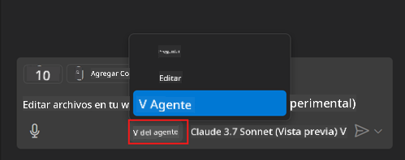
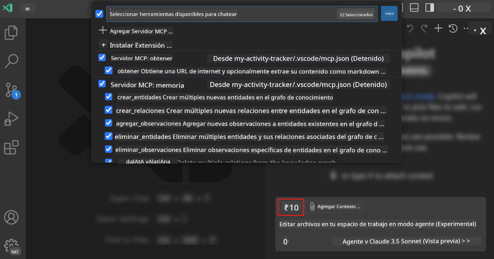
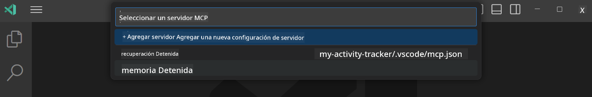
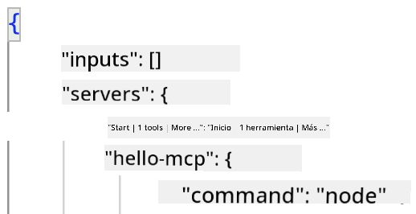

<!--
CO_OP_TRANSLATOR_METADATA:
{
  "original_hash": "d940b5e0af75e3a3a4d1c3179120d1d9",
  "translation_date": "2025-08-26T17:03:45+00:00",
  "source_file": "03-GettingStarted/04-vscode/README.md",
  "language_code": "es"
}
-->
# Consumir un servidor desde el modo Agente de GitHub Copilot

Visual Studio Code y GitHub Copilot pueden actuar como un cliente y consumir un servidor MCP. ¿Por qué querríamos hacer eso, te preguntarás? Bueno, eso significa que las características que tenga el servidor MCP ahora pueden ser utilizadas desde tu IDE. Imagina que agregas, por ejemplo, el servidor MCP de GitHub; esto permitiría controlar GitHub mediante comandos en lenguaje natural en lugar de escribir comandos específicos en el terminal. O imagina cualquier cosa en general que pueda mejorar tu experiencia como desarrollador, todo controlado por lenguaje natural. ¿Empiezas a ver las ventajas, verdad?

## Resumen

Esta lección cubre cómo usar Visual Studio Code y el modo Agente de GitHub Copilot como cliente para tu servidor MCP.

## Objetivos de aprendizaje

Al final de esta lección, serás capaz de:

- Consumir un servidor MCP a través de Visual Studio Code.
- Ejecutar capacidades como herramientas mediante GitHub Copilot.
- Configurar Visual Studio Code para encontrar y gestionar tu servidor MCP.

## Uso

Puedes controlar tu servidor MCP de dos maneras diferentes:

- Interfaz de usuario: verás cómo se hace esto más adelante en este capítulo.
- Terminal: es posible controlar las cosas desde el terminal usando el ejecutable `code`:

  Para agregar un servidor MCP a tu perfil de usuario, utiliza la opción de línea de comandos --add-mcp y proporciona la configuración del servidor JSON en la forma {\"name\":\"server-name\",\"command\":...}.

  ```
  code --add-mcp "{\"name\":\"my-server\",\"command\": \"uvx\",\"args\": [\"mcp-server-fetch\"]}"
  ```

### Capturas de pantalla





Hablemos más sobre cómo usar la interfaz visual en las siguientes secciones.

## Enfoque

Aquí está el enfoque que necesitamos seguir a alto nivel:

- Configurar un archivo para encontrar nuestro servidor MCP.
- Iniciar/Conectar al servidor para que liste sus capacidades.
- Usar dichas capacidades a través de la interfaz de chat de GitHub Copilot.

Genial, ahora que entendemos el flujo, intentemos usar un servidor MCP en Visual Studio Code mediante un ejercicio.

## Ejercicio: Consumir un servidor

En este ejercicio, configuraremos Visual Studio Code para encontrar tu servidor MCP y que pueda ser utilizado desde la interfaz de chat de GitHub Copilot.

### -0- Paso previo: habilitar el descubrimiento del servidor MCP

Es posible que necesites habilitar el descubrimiento de servidores MCP.

1. Ve a `Archivo -> Preferencias -> Configuración` en Visual Studio Code.

1. Busca "MCP" y habilita `chat.mcp.discovery.enabled` en el archivo settings.json.

### -1- Crear archivo de configuración

Comienza creando un archivo de configuración en la raíz de tu proyecto. Necesitarás un archivo llamado MCP.json y colocarlo en una carpeta llamada .vscode. Debería verse así:

```text
.vscode
|-- mcp.json
```

A continuación, veamos cómo agregar una entrada de servidor.

### -2- Configurar un servidor

Agrega el siguiente contenido a *mcp.json*:

```json
{
    "inputs": [],
    "servers": {
       "hello-mcp": {
           "command": "node",
           "args": [
               "build/index.js"
           ]
       }
    }
}
```

El ejemplo anterior muestra cómo iniciar un servidor escrito en Node.js. Para otros entornos de ejecución, especifica el comando adecuado para iniciar el servidor usando `command` y `args`.

### -3- Iniciar el servidor

Ahora que has agregado una entrada, iniciemos el servidor:

1. Localiza tu entrada en *mcp.json* y asegúrate de encontrar el ícono de "play":

    

1. Haz clic en el ícono de "play". Deberías ver que el ícono de herramientas en el chat de GitHub Copilot aumenta el número de herramientas disponibles. Si haces clic en dicho ícono de herramientas, verás una lista de herramientas registradas. Puedes marcar/desmarcar cada herramienta dependiendo de si deseas que GitHub Copilot las use como contexto:

  

1. Para ejecutar una herramienta, escribe un comando que coincida con la descripción de una de tus herramientas, por ejemplo, un comando como "suma 22 y 1":

  

  Deberías ver una respuesta diciendo 23.

## Tarea

Intenta agregar una entrada de servidor a tu archivo *mcp.json* y asegúrate de que puedes iniciar/detener el servidor. También asegúrate de que puedes comunicarte con las herramientas en tu servidor mediante la interfaz de chat de GitHub Copilot.

## Solución

[Solución](./solution/README.md)

## Puntos clave

Los puntos clave de este capítulo son los siguientes:

- Visual Studio Code es un excelente cliente que te permite consumir varios servidores MCP y sus herramientas.
- La interfaz de chat de GitHub Copilot es cómo interactúas con los servidores.
- Puedes solicitar al usuario entradas como claves API que pueden ser pasadas al servidor MCP al configurar la entrada del servidor en el archivo *mcp.json*.

## Ejemplos

- [Calculadora en Java](../samples/java/calculator/README.md)
- [Calculadora en .Net](../../../../03-GettingStarted/samples/csharp)
- [Calculadora en JavaScript](../samples/javascript/README.md)
- [Calculadora en TypeScript](../samples/typescript/README.md)
- [Calculadora en Python](../../../../03-GettingStarted/samples/python)

## Recursos adicionales

- [Documentación de Visual Studio](https://code.visualstudio.com/docs/copilot/chat/mcp-servers)

## Qué sigue

- Siguiente: [Crear un servidor stdio](../05-stdio-server/README.md)

---

**Descargo de responsabilidad**:  
Este documento ha sido traducido utilizando el servicio de traducción automática [Co-op Translator](https://github.com/Azure/co-op-translator). Aunque nos esforzamos por garantizar la precisión, tenga en cuenta que las traducciones automatizadas pueden contener errores o imprecisiones. El documento original en su idioma nativo debe considerarse como la fuente autorizada. Para información crítica, se recomienda una traducción profesional realizada por humanos. No nos hacemos responsables de malentendidos o interpretaciones erróneas que puedan surgir del uso de esta traducción.