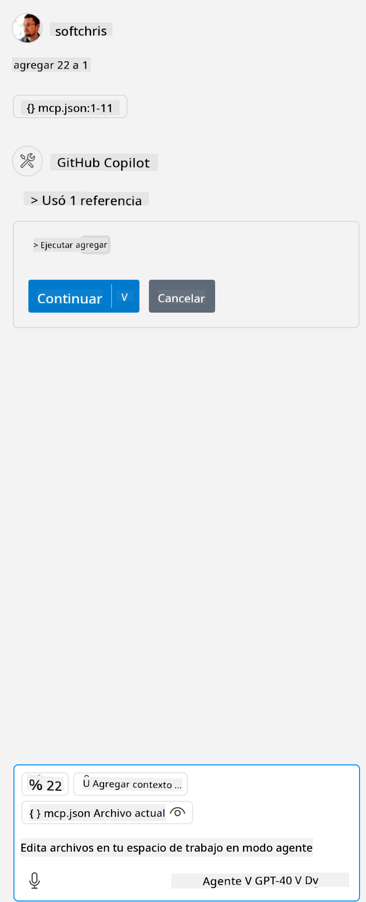

<!--
CO_OP_TRANSLATOR_METADATA:
{
  "original_hash": "5ef8f5821c1a04f7b1fc4f15098ecab8",
  "translation_date": "2025-07-13T19:38:28+00:00",
  "source_file": "03-GettingStarted/04-vscode/solution/README.md",
  "language_code": "es"
}
-->
Esto corresponde a ejecutar un comando como este: `node build/index.js`.

- Cambia esta entrada del servidor para que coincida con la ubicación de tu archivo de servidor o con lo que sea necesario para iniciar tu servidor, dependiendo del entorno de ejecución y la ubicación del servidor que hayas elegido.

## Consumir las funciones en el servidor

- Haz clic en el ícono de `play`, una vez que hayas agregado *mcp.json* a la carpeta *./vscode*,

    Observa cómo el ícono de herramientas cambia para aumentar el número de herramientas disponibles. El ícono de herramientas se encuentra justo encima del campo de chat en GitHub Copilot.

## Ejecutar una herramienta

- Escribe un mensaje en tu ventana de chat que coincida con la descripción de tu herramienta. Por ejemplo, para activar la herramienta `add` escribe algo como "add 3 to 20".

    Deberías ver que se presenta una herramienta encima del cuadro de texto del chat, indicándote que selecciones para ejecutar la herramienta, como en esta imagen:

    

    Seleccionar la herramienta debería producir un resultado numérico que diga "23" si tu mensaje fue como el que mencionamos anteriormente.

**Aviso legal**:  
Este documento ha sido traducido utilizando el servicio de traducción automática [Co-op Translator](https://github.com/Azure/co-op-translator). Aunque nos esforzamos por la precisión, tenga en cuenta que las traducciones automáticas pueden contener errores o inexactitudes. El documento original en su idioma nativo debe considerarse la fuente autorizada. Para información crítica, se recomienda la traducción profesional realizada por humanos. No nos hacemos responsables de malentendidos o interpretaciones erróneas derivadas del uso de esta traducción.