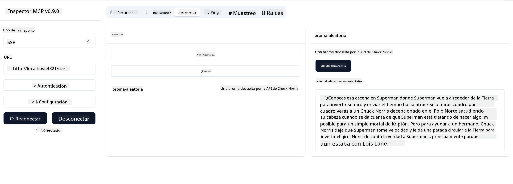

<!--
CO_OP_TRANSLATOR_METADATA:
{
  "original_hash": "64645691bf0985f1760b948123edf269",
  "translation_date": "2025-06-13T10:40:16+00:00",
  "source_file": "03-GettingStarted/05-sse-server/README.md",
  "language_code": "es"
}
-->
Ahora que sabemos un poco más sobre SSE, construyamos un servidor SSE a continuación.

## Ejercicio: Creando un servidor SSE

Para crear nuestro servidor, debemos tener en cuenta dos cosas:

- Necesitamos usar un servidor web para exponer endpoints para la conexión y los mensajes.
- Construir nuestro servidor como normalmente lo hacemos con herramientas, recursos y prompts cuando usábamos stdio.

### -1- Crear una instancia de servidor

Para crear nuestro servidor, usamos los mismos tipos que con stdio. Sin embargo, para el transporte, necesitamos elegir SSE.

Vamos a agregar las rutas necesarias a continuación.

### -2- Agregar rutas

Agreguemos las rutas que manejan la conexión y los mensajes entrantes:

Ahora agreguemos capacidades al servidor.

### -3- Agregando capacidades al servidor

Ahora que tenemos todo lo específico de SSE definido, agreguemos capacidades al servidor como herramientas, prompts y recursos.

Tu código completo debería verse así:

Genial, tenemos un servidor usando SSE, vamos a probarlo a continuación.

## Ejercicio: Depurando un servidor SSE con Inspector

Inspector es una gran herramienta que vimos en una lección anterior [Creando tu primer servidor](/03-GettingStarted/01-first-server/README.md). Veamos si podemos usar Inspector también aquí:

### -1- Ejecutando el inspector

Para ejecutar el inspector, primero debes tener un servidor SSE corriendo, así que hagámoslo a continuación:

1. Ejecuta el servidor

1. Ejecuta el inspector

    > ![NOTE]
    > Ejecuta esto en una ventana de terminal separada de donde está corriendo el servidor. También ten en cuenta que debes ajustar el siguiente comando para que coincida con la URL donde tu servidor está corriendo.

    ```sh
    npx @modelcontextprotocol/inspector --cli http://localhost:8000/sse --method tools/list
    ```

    Ejecutar el inspector es igual en todos los entornos de ejecución. Observa que en lugar de pasar una ruta a nuestro servidor y un comando para iniciarlo, pasamos la URL donde el servidor está corriendo y además especificamos la ruta `/sse`.

### -2- Probando la herramienta

Conéctate al servidor seleccionando SSE en el desplegable y completa el campo de URL donde tu servidor está corriendo, por ejemplo http:localhost:4321/sse. Ahora haz clic en el botón "Connect". Como antes, selecciona listar herramientas, elige una herramienta y proporciona valores de entrada. Deberías ver un resultado como el siguiente:



Genial, puedes trabajar con el inspector, veamos cómo podemos trabajar con Visual Studio Code a continuación.

## Tarea

Intenta ampliar tu servidor con más capacidades. Consulta [esta página](https://api.chucknorris.io/) para, por ejemplo, agregar una herramienta que llame a una API, tú decides cómo debería ser el servidor. ¡Diviértete! :)

## Solución

[Solución](./solution/README.md) Aquí tienes una posible solución con código funcional.

## Puntos clave

Los puntos clave de este capítulo son los siguientes:

- SSE es el segundo tipo de transporte soportado después de stdio.
- Para soportar SSE, necesitas gestionar conexiones entrantes y mensajes usando un framework web.
- Puedes usar tanto Inspector como Visual Studio Code para consumir servidores SSE, igual que con servidores stdio. Nota cómo difiere un poco entre stdio y SSE. Para SSE, necesitas iniciar el servidor por separado y luego ejecutar tu herramienta inspector. Para la herramienta inspector, también hay algunas diferencias en que debes especificar la URL.

## Ejemplos

- [Calculadora en Java](../samples/java/calculator/README.md)
- [Calculadora en .Net](../../../../03-GettingStarted/samples/csharp)
- [Calculadora en JavaScript](../samples/javascript/README.md)
- [Calculadora en TypeScript](../samples/typescript/README.md)
- [Calculadora en Python](../../../../03-GettingStarted/samples/python)

## Recursos adicionales

- [SSE](https://developer.mozilla.org/en-US/docs/Web/API/Server-sent_events)

## Qué sigue

- Siguiente: [Streaming HTTP con MCP (HTTP transmitible)](/03-GettingStarted/06-http-streaming/README.md)

**Descargo de responsabilidad**:  
Este documento ha sido traducido utilizando el servicio de traducción automática [Co-op Translator](https://github.com/Azure/co-op-translator). Aunque nos esforzamos por la precisión, tenga en cuenta que las traducciones automáticas pueden contener errores o inexactitudes. El documento original en su idioma nativo debe considerarse la fuente autorizada. Para información crítica, se recomienda la traducción profesional realizada por humanos. No nos hacemos responsables de ningún malentendido o interpretación errónea derivada del uso de esta traducción.