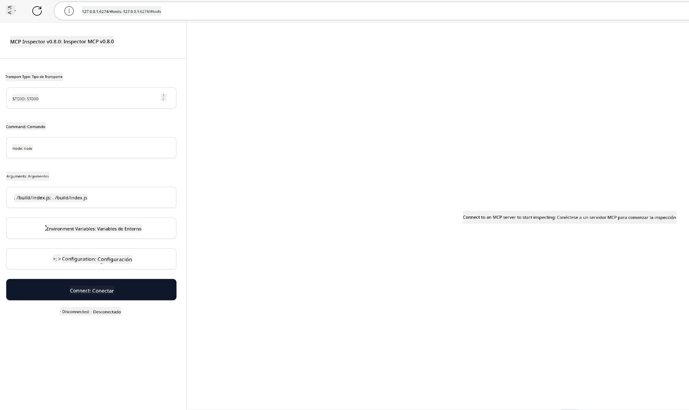

<!--
CO_OP_TRANSLATOR_METADATA:
{
  "original_hash": "4e34e34e84f013e73c7eaa6d09884756",
  "translation_date": "2025-07-13T21:56:26+00:00",
  "source_file": "03-GettingStarted/08-testing/README.md",
  "language_code": "es"
}
-->
## Pruebas y Depuración

Antes de comenzar a probar tu servidor MCP, es importante entender las herramientas disponibles y las mejores prácticas para la depuración. Realizar pruebas efectivas garantiza que tu servidor funcione como se espera y te ayuda a identificar y resolver problemas rápidamente. La siguiente sección describe los enfoques recomendados para validar tu implementación MCP.

## Resumen

Esta lección cubre cómo seleccionar el enfoque de prueba adecuado y la herramienta de prueba más efectiva.

## Objetivos de Aprendizaje

Al finalizar esta lección, podrás:

- Describir varios enfoques para realizar pruebas.
- Usar diferentes herramientas para probar tu código de manera efectiva.

## Pruebas de Servidores MCP

MCP proporciona herramientas para ayudarte a probar y depurar tus servidores:

- **MCP Inspector**: Una herramienta de línea de comandos que puede ejecutarse tanto como CLI como herramienta visual.
- **Pruebas manuales**: Puedes usar una herramienta como curl para realizar solicitudes web, pero cualquier herramienta capaz de ejecutar HTTP servirá.
- **Pruebas unitarias**: Es posible usar tu framework de pruebas preferido para testear las funcionalidades tanto del servidor como del cliente.

### Uso de MCP Inspector

Hemos descrito el uso de esta herramienta en lecciones anteriores, pero hablemos un poco a nivel general. Es una herramienta construida en Node.js y puedes usarla llamando al ejecutable `npx`, que descargará e instalará la herramienta temporalmente y se limpiará una vez que termine de ejecutar tu solicitud.

El [MCP Inspector](https://github.com/modelcontextprotocol/inspector) te ayuda a:

- **Descubrir Capacidades del Servidor**: Detecta automáticamente recursos, herramientas y prompts disponibles.
- **Probar la Ejecución de Herramientas**: Prueba diferentes parámetros y ve las respuestas en tiempo real.
- **Ver Metadatos del Servidor**: Examina la información del servidor, esquemas y configuraciones.

Una ejecución típica de la herramienta se ve así:

```bash
npx @modelcontextprotocol/inspector node build/index.js
```

El comando anterior inicia un MCP y su interfaz visual, y lanza una interfaz web local en tu navegador. Puedes esperar ver un panel que muestra tus servidores MCP registrados, sus herramientas, recursos y prompts disponibles. La interfaz te permite probar interactivamente la ejecución de herramientas, inspeccionar metadatos del servidor y ver respuestas en tiempo real, facilitando la validación y depuración de tus implementaciones MCP.

Así es como puede verse: 

También puedes ejecutar esta herramienta en modo CLI, para lo cual agregas el atributo `--cli`. Aquí tienes un ejemplo de ejecución en modo "CLI" que lista todas las herramientas en el servidor:

```sh
npx @modelcontextprotocol/inspector --cli node build/index.js --method tools/list
```

### Pruebas Manuales

Además de usar la herramienta inspector para probar las capacidades del servidor, otro enfoque similar es usar un cliente capaz de realizar solicitudes HTTP, como por ejemplo curl.

Con curl, puedes probar servidores MCP directamente usando solicitudes HTTP:

```bash
# Example: Test server metadata
curl http://localhost:3000/v1/metadata

# Example: Execute a tool
curl -X POST http://localhost:3000/v1/tools/execute \
  -H "Content-Type: application/json" \
  -d '{"name": "calculator", "parameters": {"expression": "2+2"}}'
```

Como puedes ver en el ejemplo anterior con curl, usas una solicitud POST para invocar una herramienta con una carga útil que consiste en el nombre de la herramienta y sus parámetros. Usa el enfoque que mejor se adapte a ti. Las herramientas CLI en general suelen ser más rápidas de usar y se prestan para ser automatizadas, lo cual puede ser útil en un entorno CI/CD.

### Pruebas Unitarias

Crea pruebas unitarias para tus herramientas y recursos para asegurarte de que funcionen como se espera. Aquí tienes un ejemplo de código para pruebas.

```python
import pytest

from mcp.server.fastmcp import FastMCP
from mcp.shared.memory import (
    create_connected_server_and_client_session as create_session,
)

# Mark the whole module for async tests
pytestmark = pytest.mark.anyio


async def test_list_tools_cursor_parameter():
    """Test that the cursor parameter is accepted for list_tools.

    Note: FastMCP doesn't currently implement pagination, so this test
    only verifies that the cursor parameter is accepted by the client.
    """

 server = FastMCP("test")

    # Create a couple of test tools
    @server.tool(name="test_tool_1")
    async def test_tool_1() -> str:
        """First test tool"""
        return "Result 1"

    @server.tool(name="test_tool_2")
    async def test_tool_2() -> str:
        """Second test tool"""
        return "Result 2"

    async with create_session(server._mcp_server) as client_session:
        # Test without cursor parameter (omitted)
        result1 = await client_session.list_tools()
        assert len(result1.tools) == 2

        # Test with cursor=None
        result2 = await client_session.list_tools(cursor=None)
        assert len(result2.tools) == 2

        # Test with cursor as string
        result3 = await client_session.list_tools(cursor="some_cursor_value")
        assert len(result3.tools) == 2

        # Test with empty string cursor
        result4 = await client_session.list_tools(cursor="")
        assert len(result4.tools) == 2
    
```

El código anterior hace lo siguiente:

- Utiliza el framework pytest, que te permite crear pruebas como funciones y usar sentencias assert.
- Crea un servidor MCP con dos herramientas diferentes.
- Usa la sentencia `assert` para verificar que se cumplan ciertas condiciones.

Consulta el [archivo completo aquí](https://github.com/modelcontextprotocol/python-sdk/blob/main/tests/client/test_list_methods_cursor.py)

Con el archivo anterior, puedes probar tu propio servidor para asegurarte de que las capacidades se creen correctamente.

Todos los SDK principales tienen secciones similares de pruebas, por lo que puedes adaptarlas a tu entorno de ejecución elegido.

## Ejemplos

- [Calculadora Java](../samples/java/calculator/README.md)
- [Calculadora .Net](../../../../03-GettingStarted/samples/csharp)
- [Calculadora JavaScript](../samples/javascript/README.md)
- [Calculadora TypeScript](../samples/typescript/README.md)
- [Calculadora Python](../../../../03-GettingStarted/samples/python)

## Recursos Adicionales

- [Python SDK](https://github.com/modelcontextprotocol/python-sdk)

## Qué Sigue

- Siguiente: [Despliegue](../09-deployment/README.md)

**Aviso legal**:  
Este documento ha sido traducido utilizando el servicio de traducción automática [Co-op Translator](https://github.com/Azure/co-op-translator). Aunque nos esforzamos por la precisión, tenga en cuenta que las traducciones automáticas pueden contener errores o inexactitudes. El documento original en su idioma nativo debe considerarse la fuente autorizada. Para información crítica, se recomienda la traducción profesional realizada por humanos. No nos hacemos responsables de malentendidos o interpretaciones erróneas derivadas del uso de esta traducción.