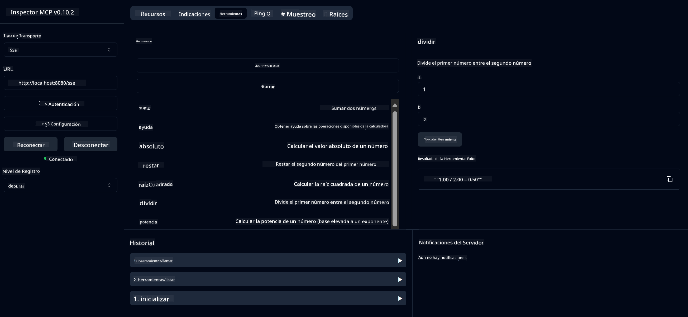

<!--
CO_OP_TRANSLATOR_METADATA:
{
  "original_hash": "13231e9951b68efd9df8c56bd5cdb27e",
  "translation_date": "2025-07-13T22:20:41+00:00",
  "source_file": "03-GettingStarted/samples/java/calculator/README.md",
  "language_code": "es"
}
-->
# Servicio Básico de Calculadora MCP

Este servicio ofrece operaciones básicas de calculadora a través del Protocolo de Contexto de Modelo (MCP) usando Spring Boot con transporte WebFlux. Está diseñado como un ejemplo sencillo para principiantes que están aprendiendo sobre implementaciones MCP.

Para más información, consulta la documentación de referencia de [MCP Server Boot Starter](https://docs.spring.io/spring-ai/reference/api/mcp/mcp-server-boot-starter-docs.html).

## Resumen

El servicio muestra:
- Soporte para SSE (Server-Sent Events)
- Registro automático de herramientas usando la anotación `@Tool` de Spring AI
- Funciones básicas de calculadora:
  - Suma, resta, multiplicación, división
  - Cálculo de potencia y raíz cuadrada
  - Módulo (resto) y valor absoluto
  - Función de ayuda para descripciones de operaciones

## Características

Este servicio de calculadora ofrece las siguientes capacidades:

1. **Operaciones aritméticas básicas**:
   - Suma de dos números
   - Resta de un número a otro
   - Multiplicación de dos números
   - División de un número por otro (con verificación de división por cero)

2. **Operaciones avanzadas**:
   - Cálculo de potencia (elevar una base a un exponente)
   - Cálculo de raíz cuadrada (con verificación de números negativos)
   - Cálculo de módulo (resto)
   - Cálculo de valor absoluto

3. **Sistema de ayuda**:
   - Función de ayuda incorporada que explica todas las operaciones disponibles

## Uso del Servicio

El servicio expone los siguientes endpoints API a través del protocolo MCP:

- `add(a, b)`: Suma dos números
- `subtract(a, b)`: Resta el segundo número del primero
- `multiply(a, b)`: Multiplica dos números
- `divide(a, b)`: Divide el primer número por el segundo (con verificación de cero)
- `power(base, exponent)`: Calcula la potencia de un número
- `squareRoot(number)`: Calcula la raíz cuadrada (con verificación de número negativo)
- `modulus(a, b)`: Calcula el resto de la división
- `absolute(number)`: Calcula el valor absoluto
- `help()`: Obtiene información sobre las operaciones disponibles

## Cliente de Prueba

Se incluye un cliente de prueba simple en el paquete `com.microsoft.mcp.sample.client`. La clase `SampleCalculatorClient` demuestra las operaciones disponibles del servicio de calculadora.

## Uso del Cliente LangChain4j

El proyecto incluye un cliente de ejemplo LangChain4j en `com.microsoft.mcp.sample.client.LangChain4jClient` que muestra cómo integrar el servicio de calculadora con LangChain4j y modelos de GitHub:

### Requisitos Previos

1. **Configuración del Token de GitHub**:
   
   Para usar los modelos de IA de GitHub (como phi-4), necesitas un token de acceso personal de GitHub:

   a. Ve a la configuración de tu cuenta de GitHub: https://github.com/settings/tokens
   
   b. Haz clic en "Generate new token" → "Generate new token (classic)"
   
   c. Dale un nombre descriptivo a tu token
   
   d. Selecciona los siguientes permisos:
      - `repo` (Control total de repositorios privados)
      - `read:org` (Leer membresía de organización y equipo, leer proyectos de organización)
      - `gist` (Crear gists)
      - `user:email` (Acceso a direcciones de correo electrónico del usuario (solo lectura))
   
   e. Haz clic en "Generate token" y copia tu nuevo token
   
   f. Configúralo como variable de entorno:
      
      En Windows:
      ```
      set GITHUB_TOKEN=your-github-token
      ```
      
      En macOS/Linux:
      ```bash
      export GITHUB_TOKEN=your-github-token
      ```

   g. Para configuración persistente, agrégalo a tus variables de entorno mediante la configuración del sistema

2. Añade la dependencia de LangChain4j GitHub a tu proyecto (ya incluida en pom.xml):
   ```xml
   <dependency>
       <groupId>dev.langchain4j</groupId>
       <artifactId>langchain4j-github</artifactId>
       <version>${langchain4j.version}</version>
   </dependency>
   ```

3. Asegúrate de que el servidor de la calculadora esté corriendo en `localhost:8080`

### Ejecutando el Cliente LangChain4j

Este ejemplo demuestra:
- Conexión al servidor MCP de la calculadora mediante transporte SSE
- Uso de LangChain4j para crear un chatbot que aprovecha las operaciones de la calculadora
- Integración con modelos de IA de GitHub (ahora usando el modelo phi-4)

El cliente envía las siguientes consultas de ejemplo para demostrar la funcionalidad:
1. Calcular la suma de dos números
2. Encontrar la raíz cuadrada de un número
3. Obtener información de ayuda sobre las operaciones disponibles de la calculadora

Ejecuta el ejemplo y revisa la salida en consola para ver cómo el modelo de IA usa las herramientas de la calculadora para responder a las consultas.

### Configuración del Modelo GitHub

El cliente LangChain4j está configurado para usar el modelo phi-4 de GitHub con los siguientes ajustes:

```java
ChatLanguageModel model = GitHubChatModel.builder()
    .apiKey(System.getenv("GITHUB_TOKEN"))
    .timeout(Duration.ofSeconds(60))
    .modelName("phi-4")
    .logRequests(true)
    .logResponses(true)
    .build();
```

Para usar otros modelos de GitHub, simplemente cambia el parámetro `modelName` a otro modelo soportado (por ejemplo, "claude-3-haiku-20240307", "llama-3-70b-8192", etc.).

## Dependencias

El proyecto requiere las siguientes dependencias clave:

```xml
<!-- For MCP Server -->
<dependency>
    <groupId>org.springframework.ai</groupId>
    <artifactId>spring-ai-starter-mcp-server-webflux</artifactId>
</dependency>

<!-- For LangChain4j integration -->
<dependency>
    <groupId>dev.langchain4j</groupId>
    <artifactId>langchain4j-mcp</artifactId>
    <version>${langchain4j.version}</version>
</dependency>

<!-- For GitHub models support -->
<dependency>
    <groupId>dev.langchain4j</groupId>
    <artifactId>langchain4j-github</artifactId>
    <version>${langchain4j.version}</version>
</dependency>
```

## Construcción del Proyecto

Construye el proyecto usando Maven:
```bash
./mvnw clean install -DskipTests
```

## Ejecución del Servidor

### Usando Java

```bash
java -jar target/calculator-server-0.0.1-SNAPSHOT.jar
```

### Usando MCP Inspector

El MCP Inspector es una herramienta útil para interactuar con servicios MCP. Para usarlo con este servicio de calculadora:

1. **Instala y ejecuta MCP Inspector** en una nueva ventana de terminal:
   ```bash
   npx @modelcontextprotocol/inspector
   ```

2. **Accede a la interfaz web** haciendo clic en la URL que muestra la aplicación (normalmente http://localhost:6274)

3. **Configura la conexión**:
   - Establece el tipo de transporte a "SSE"
   - Establece la URL al endpoint SSE de tu servidor en ejecución: `http://localhost:8080/sse`
   - Haz clic en "Connect"

4. **Usa las herramientas**:
   - Haz clic en "List Tools" para ver las operaciones disponibles de la calculadora
   - Selecciona una herramienta y haz clic en "Run Tool" para ejecutar una operación



### Usando Docker

El proyecto incluye un Dockerfile para despliegue en contenedor:

1. **Construye la imagen Docker**:
   ```bash
   docker build -t calculator-mcp-service .
   ```

2. **Ejecuta el contenedor Docker**:
   ```bash
   docker run -p 8080:8080 calculator-mcp-service
   ```

Esto hará:
- Construir una imagen Docker multi-etapa con Maven 3.9.9 y Eclipse Temurin 24 JDK
- Crear una imagen optimizada para contenedor
- Exponer el servicio en el puerto 8080
- Iniciar el servicio MCP de calculadora dentro del contenedor

Podrás acceder al servicio en `http://localhost:8080` una vez que el contenedor esté en ejecución.

## Solución de Problemas

### Problemas Comunes con el Token de GitHub

1. **Problemas de permisos del token**: Si recibes un error 403 Forbidden, verifica que tu token tenga los permisos correctos según lo indicado en los requisitos previos.

2. **Token no encontrado**: Si recibes un error "No API key found", asegúrate de que la variable de entorno GITHUB_TOKEN esté correctamente configurada.

3. **Limitación de tasa**: La API de GitHub tiene límites de uso. Si encuentras un error de límite de tasa (código de estado 429), espera unos minutos antes de intentarlo de nuevo.

4. **Expiración del token**: Los tokens de GitHub pueden expirar. Si recibes errores de autenticación después de un tiempo, genera un nuevo token y actualiza tu variable de entorno.

Si necesitas más ayuda, consulta la [documentación de LangChain4j](https://github.com/langchain4j/langchain4j) o la [documentación de la API de GitHub](https://docs.github.com/en/rest).

**Aviso legal**:  
Este documento ha sido traducido utilizando el servicio de traducción automática [Co-op Translator](https://github.com/Azure/co-op-translator). Aunque nos esforzamos por la precisión, tenga en cuenta que las traducciones automáticas pueden contener errores o inexactitudes. El documento original en su idioma nativo debe considerarse la fuente autorizada. Para información crítica, se recomienda la traducción profesional realizada por humanos. No nos hacemos responsables de malentendidos o interpretaciones erróneas derivadas del uso de esta traducción.