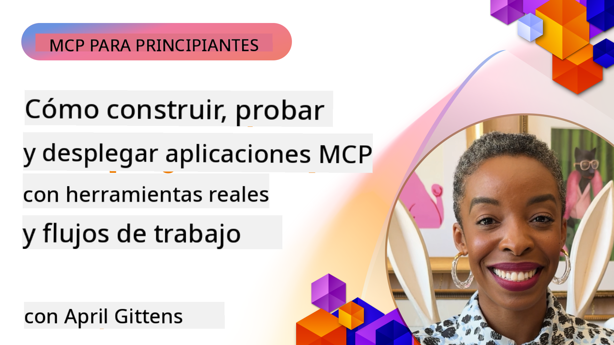

<!--
CO_OP_TRANSLATOR_METADATA:
{
  "original_hash": "83efa75a69bc831277263a6f1ae53669",
  "translation_date": "2025-08-11T10:54:47+00:00",
  "source_file": "04-PracticalImplementation/README.md",
  "language_code": "es"
}
-->
# Implementación Práctica

[](https://youtu.be/vCN9-mKBDfQ)

_(Haz clic en la imagen de arriba para ver el video de esta lección)_

La implementación práctica es donde el poder del Protocolo de Contexto de Modelo (MCP) se vuelve tangible. Aunque entender la teoría y la arquitectura detrás de MCP es importante, el verdadero valor surge cuando aplicas estos conceptos para construir, probar y desplegar soluciones que resuelvan problemas del mundo real. Este capítulo cierra la brecha entre el conocimiento conceptual y el desarrollo práctico, guiándote a través del proceso de dar vida a aplicaciones basadas en MCP.

Ya sea que estés desarrollando asistentes inteligentes, integrando IA en flujos de trabajo empresariales o construyendo herramientas personalizadas para el procesamiento de datos, MCP proporciona una base flexible. Su diseño independiente del lenguaje y los SDK oficiales para lenguajes de programación populares lo hacen accesible para una amplia gama de desarrolladores. Al aprovechar estos SDK, puedes prototipar rápidamente, iterar y escalar tus soluciones en diferentes plataformas y entornos.

En las siguientes secciones, encontrarás ejemplos prácticos, código de muestra y estrategias de despliegue que demuestran cómo implementar MCP en C#, Java con Spring, TypeScript, JavaScript y Python. También aprenderás cómo depurar y probar tus servidores MCP, gestionar APIs y desplegar soluciones en la nube utilizando Azure. Estos recursos prácticos están diseñados para acelerar tu aprendizaje y ayudarte a construir aplicaciones MCP robustas y listas para producción con confianza.

## Resumen

Esta lección se centra en los aspectos prácticos de la implementación de MCP en múltiples lenguajes de programación. Exploraremos cómo usar los SDK de MCP en C#, Java con Spring, TypeScript, JavaScript y Python para construir aplicaciones robustas, depurar y probar servidores MCP, y crear recursos, plantillas y herramientas reutilizables.

## Objetivos de Aprendizaje

Al final de esta lección, serás capaz de:

- Implementar soluciones MCP utilizando los SDK oficiales en varios lenguajes de programación
- Depurar y probar servidores MCP de manera sistemática
- Crear y utilizar características del servidor (Recursos, Plantillas y Herramientas)
- Diseñar flujos de trabajo MCP efectivos para tareas complejas
- Optimizar implementaciones MCP para rendimiento y confiabilidad

## Recursos Oficiales de SDK

El Protocolo de Contexto de Modelo ofrece SDK oficiales para múltiples lenguajes:

- [SDK de C#](https://github.com/modelcontextprotocol/csharp-sdk)
- [SDK de Java con Spring](https://github.com/modelcontextprotocol/java-sdk) **Nota:** requiere dependencia de [Project Reactor](https://projectreactor.io). (Ver [discusión en el issue 246](https://github.com/orgs/modelcontextprotocol/discussions/246).)
- [SDK de TypeScript](https://github.com/modelcontextprotocol/typescript-sdk)
- [SDK de Python](https://github.com/modelcontextprotocol/python-sdk)
- [SDK de Kotlin](https://github.com/modelcontextprotocol/kotlin-sdk)

## Trabajando con los SDK de MCP

Esta sección proporciona ejemplos prácticos de implementación de MCP en múltiples lenguajes de programación. Puedes encontrar código de muestra en el directorio `samples` organizado por lenguaje.

### Ejemplos Disponibles

El repositorio incluye [implementaciones de muestra](../../../04-PracticalImplementation/samples) en los siguientes lenguajes:

- [C#](./samples/csharp/README.md)
- [Java con Spring](./samples/java/containerapp/README.md)
- [TypeScript](./samples/typescript/README.md)
- [JavaScript](./samples/javascript/README.md)
- [Python](./samples/python/README.md)

Cada muestra demuestra conceptos clave de MCP y patrones de implementación para ese lenguaje y ecosistema específico.

## Características Principales del Servidor

Los servidores MCP pueden implementar cualquier combinación de estas características:

### Recursos

Los recursos proporcionan contexto y datos para que los utilice el usuario o el modelo de IA:

- Repositorios de documentos
- Bases de conocimiento
- Fuentes de datos estructurados
- Sistemas de archivos

### Plantillas

Las plantillas son mensajes y flujos de trabajo predefinidos para los usuarios:

- Plantillas de conversación predefinidas
- Patrones de interacción guiada
- Estructuras de diálogo especializadas

### Herramientas

Las herramientas son funciones que el modelo de IA puede ejecutar:

- Utilidades de procesamiento de datos
- Integraciones con APIs externas
- Capacidades computacionales
- Funcionalidad de búsqueda

## Implementaciones de Muestra: Implementación en C#

El repositorio oficial del SDK de C# contiene varias implementaciones de muestra que demuestran diferentes aspectos de MCP:

- **Cliente MCP Básico**: Ejemplo simple que muestra cómo crear un cliente MCP y llamar herramientas
- **Servidor MCP Básico**: Implementación mínima de servidor con registro básico de herramientas
- **Servidor MCP Avanzado**: Servidor completo con registro de herramientas, autenticación y manejo de errores
- **Integración con ASP.NET**: Ejemplos que demuestran la integración con ASP.NET Core
- **Patrones de Implementación de Herramientas**: Varios patrones para implementar herramientas con diferentes niveles de complejidad

El SDK de MCP para C# está en vista previa y las APIs pueden cambiar. Actualizaremos continuamente este blog a medida que el SDK evolucione.

### Características Clave

- [C# MCP Nuget ModelContextProtocol](https://www.nuget.org/packages/ModelContextProtocol)
- Construyendo tu [primer servidor MCP](https://devblogs.microsoft.com/dotnet/build-a-model-context-protocol-mcp-server-in-csharp/).

Para ver muestras completas de implementación en C#, visita el [repositorio oficial de muestras del SDK de C#](https://github.com/modelcontextprotocol/csharp-sdk)

## Implementación de Muestra: Implementación en Java con Spring

El SDK de Java con Spring ofrece opciones robustas de implementación MCP con características de nivel empresarial.

### Características Clave

- Integración con el framework Spring
- Seguridad de tipos fuerte
- Soporte para programación reactiva
- Manejo de errores integral

Para ver una muestra completa de implementación en Java con Spring, consulta [Java con Spring sample](samples/java/containerapp/README.md) en el directorio de muestras.

## Implementación de Muestra: Implementación en JavaScript

El SDK de JavaScript proporciona un enfoque ligero y flexible para la implementación de MCP.

### Características Clave

- Soporte para Node.js y navegadores
- API basada en promesas
- Integración sencilla con Express y otros frameworks
- Soporte para WebSocket para streaming

Para ver una muestra completa de implementación en JavaScript, consulta [JavaScript sample](samples/javascript/README.md) en el directorio de muestras.

## Implementación de Muestra: Implementación en Python

El SDK de Python ofrece un enfoque Pythonic para la implementación de MCP con excelentes integraciones con frameworks de aprendizaje automático.

### Características Clave

- Soporte para async/await con asyncio
- Integración con FastAPI
- Registro sencillo de herramientas
- Integración nativa con bibliotecas populares de aprendizaje automático

Para ver una muestra completa de implementación en Python, consulta [Python sample](samples/python/README.md) en el directorio de muestras.

## Gestión de APIs

Azure API Management es una excelente solución para asegurar servidores MCP. La idea es colocar una instancia de Azure API Management frente a tu servidor MCP y dejar que maneje características que probablemente necesites como:

- limitación de tasa
- gestión de tokens
- monitoreo
- balanceo de carga
- seguridad

### Ejemplo de Azure

Aquí hay un ejemplo de Azure que hace exactamente eso, es decir, [crear un servidor MCP y asegurarlo con Azure API Management](https://github.com/Azure-Samples/remote-mcp-apim-functions-python).

Observa cómo ocurre el flujo de autorización en la imagen a continuación:


En la imagen anterior, ocurre lo siguiente:

- La autenticación/autorización se realiza utilizando Microsoft Entra.
- Azure API Management actúa como un gateway y utiliza políticas para dirigir y gestionar el tráfico.
- Azure Monitor registra todas las solicitudes para un análisis posterior.

#### Flujo de Autorización

Veamos el flujo de autorización con más detalle:


#### Especificación de autorización MCP

Aprende más sobre la [especificación de autorización MCP](https://modelcontextprotocol.io/specification/2025-03-26/basic/authorization#2-10-third-party-authorization-flow)

## Desplegar un Servidor MCP Remoto en Azure

Veamos si podemos desplegar el ejemplo mencionado anteriormente:

1. Clona el repositorio

    ```bash
    git clone https://github.com/Azure-Samples/remote-mcp-apim-functions-python.git
    cd remote-mcp-apim-functions-python
    ```

1. Registra el proveedor de recursos `Microsoft.App`.

   - Si estás usando Azure CLI, ejecuta `az provider register --namespace Microsoft.App --wait`.
   - Si estás usando Azure PowerShell, ejecuta `Register-AzResourceProvider -ProviderNamespace Microsoft.App`. Luego ejecuta `(Get-AzResourceProvider -ProviderNamespace Microsoft.App).RegistrationState` después de un tiempo para verificar si el registro está completo.

1. Ejecuta este comando [azd](https://aka.ms/azd) para aprovisionar el servicio de gestión de API, la función app (con código) y todos los demás recursos de Azure requeridos

    ```shell
    azd up
    ```

    Este comando debería desplegar todos los recursos en la nube en Azure.

### Probar tu servidor con MCP Inspector

1. En una **nueva ventana de terminal**, instala y ejecuta MCP Inspector

    ```shell
    npx @modelcontextprotocol/inspector
    ```

    Deberías ver una interfaz similar a:

    

1. Haz clic con CTRL para cargar la aplicación web MCP Inspector desde la URL mostrada por la aplicación (por ejemplo, [http://127.0.0.1:6274/#resources](http://127.0.0.1:6274/#resources))
1. Configura el tipo de transporte como `SSE`
1. Configura la URL de tu endpoint SSE de gestión de API mostrado después de `azd up` y **Conéctate**:

    ```shell
    https://<apim-servicename-from-azd-output>.azure-api.net/mcp/sse
    ```

1. **Listar Herramientas**. Haz clic en una herramienta y **Ejecutar Herramienta**.

Si todos los pasos han funcionado, ahora deberías estar conectado al servidor MCP y haber podido llamar a una herramienta.

## Servidores MCP para Azure

[Remote-mcp-functions](https://github.com/Azure-Samples/remote-mcp-functions-dotnet): Este conjunto de repositorios son plantillas de inicio rápido para construir y desplegar servidores MCP remotos personalizados utilizando Azure Functions con Python, C# .NET o Node/TypeScript.

Las muestras proporcionan una solución completa que permite a los desarrolladores:

- Construir y ejecutar localmente: Desarrollar y depurar un servidor MCP en una máquina local
- Desplegar en Azure: Desplegar fácilmente en la nube con un simple comando azd up
- Conectar desde clientes: Conectar al servidor MCP desde varios clientes, incluyendo el modo agente de Copilot en VS Code y la herramienta MCP Inspector

### Características Clave

- Seguridad por diseño: El servidor MCP está asegurado utilizando claves y HTTPS
- Opciones de autenticación: Soporta OAuth utilizando autenticación integrada y/o gestión de API
- Aislamiento de red: Permite el aislamiento de red utilizando Redes Virtuales de Azure (VNET)
- Arquitectura sin servidor: Aprovecha Azure Functions para una ejecución escalable y basada en eventos
- Desarrollo local: Soporte integral para desarrollo y depuración local
- Despliegue sencillo: Proceso de despliegue simplificado a Azure

El repositorio incluye todos los archivos de configuración necesarios, código fuente y definiciones de infraestructura para comenzar rápidamente con una implementación de servidor MCP lista para producción.

- [Azure Remote MCP Functions Python](https://github.com/Azure-Samples/remote-mcp-functions-python) - Implementación de muestra de MCP utilizando Azure Functions con Python

- [Azure Remote MCP Functions .NET](https://github.com/Azure-Samples/remote-mcp-functions-dotnet) - Implementación de muestra de MCP utilizando Azure Functions con C# .NET

- [Azure Remote MCP Functions Node/Typescript](https://github.com/Azure-Samples/remote-mcp-functions-typescript) - Implementación de muestra de MCP utilizando Azure Functions con Node/TypeScript.

## Puntos Clave

- Los SDK de MCP proporcionan herramientas específicas para implementar soluciones MCP robustas
- El proceso de depuración y prueba es crítico para aplicaciones MCP confiables
- Las plantillas reutilizables permiten interacciones consistentes con IA
- Los flujos de trabajo bien diseñados pueden orquestar tareas complejas utilizando múltiples herramientas
- Implementar soluciones MCP requiere considerar seguridad, rendimiento y manejo de errores

## Ejercicio

Diseña un flujo de trabajo MCP práctico que aborde un problema real en tu dominio:

1. Identifica 3-4 herramientas que serían útiles para resolver este problema
2. Crea un diagrama de flujo que muestre cómo interactúan estas herramientas
3. Implementa una versión básica de una de las herramientas utilizando tu lenguaje preferido
4. Crea una plantilla que ayude al modelo a utilizar tu herramienta de manera efectiva

## Recursos Adicionales

---

Siguiente: [Temas Avanzados](../05-AdvancedTopics/README.md)

**Descargo de responsabilidad**:  
Este documento ha sido traducido utilizando el servicio de traducción automática [Co-op Translator](https://github.com/Azure/co-op-translator). Aunque nos esforzamos por garantizar la precisión, tenga en cuenta que las traducciones automatizadas pueden contener errores o imprecisiones. El documento original en su idioma nativo debe considerarse como la fuente autorizada. Para información crítica, se recomienda una traducción profesional realizada por humanos. No nos hacemos responsables de ningún malentendido o interpretación errónea que surja del uso de esta traducción.