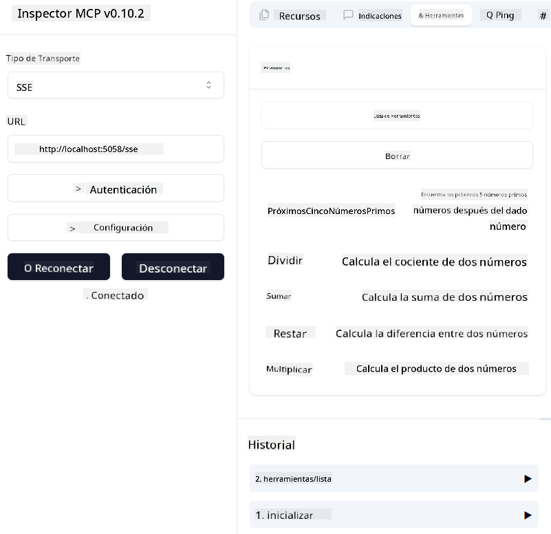
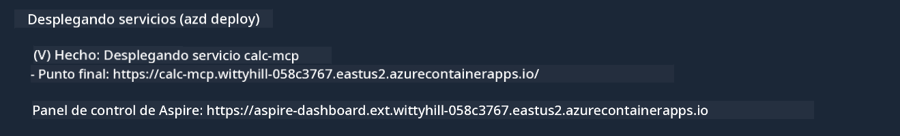

<!--
CO_OP_TRANSLATOR_METADATA:
{
  "original_hash": "5020a3e1a1c7f30c00f9e37f1fa208e3",
  "translation_date": "2025-05-16T15:40:24+00:00",
  "source_file": "04-PracticalImplementation/samples/csharp/README.md",
  "language_code": "es"
}
-->
# Sample

El ejemplo anterior muestra cómo usar un proyecto local de .NET con el tipo `sdio`. Y cómo ejecutar el servidor localmente en un contenedor. Esta es una buena solución en muchas situaciones. Sin embargo, puede ser útil tener el servidor funcionando de forma remota, como en un entorno en la nube. Aquí es donde entra el tipo `http`.

Al observar la solución en la carpeta `04-PracticalImplementation`, puede parecer mucho más compleja que la anterior. Pero en realidad, no lo es. Si miras de cerca el proyecto `src/mcpserver/mcpserver.csproj`, verás que es básicamente el mismo código que en el ejemplo anterior. La única diferencia es que estamos usando una biblioteca diferente `ModelContextProtocol.AspNetCore` para manejar las solicitudes HTTP. Y cambiamos el método `IsPrime` para hacerlo privado, solo para mostrar que puedes tener métodos privados en tu código. El resto del código es igual que antes.

Los otros proyectos son de [.NET Aspire](https://learn.microsoft.com/dotnet/aspire/get-started/aspire-overview). Tener .NET Aspire en la solución mejora la experiencia del desarrollador durante el desarrollo y las pruebas, y ayuda con la observabilidad. No es obligatorio para ejecutar el servidor, pero es una buena práctica incluirlo en tu solución.

## Iniciar el servidor localmente

1. Desde VS Code (con la extensión C# DevKit), abre la solución `04-PracticalImplementation\samples\csharp\src\Calculator-chap4.sln`.
2. Presiona `F5` para iniciar el servidor. Debería abrirse un navegador web con el panel de control de .NET Aspire.

o

1. Desde una terminal, navega a la carpeta `04-PracticalImplementation\samples\csharp\src`
2. Ejecuta el siguiente comando para iniciar el servidor:
   ```bash
    dotnet run --project .\AppHost
   ```

3. Desde el Dashboard, toma nota de la URL `http`. Debería ser algo como `http://localhost:5058/`.

## Test `SSE` con el ModelContext Protocol Inspector.

Si tienes Node.js 22.7.5 o superior, puedes usar el ModelContext Protocol Inspector para probar tu servidor.

Inicia el servidor y ejecuta el siguiente comando en una terminal:

```bash
npx @modelcontextprotocol/inspector@latest
```



- Selecciona `SSE` as the Transport type. SSE stand for Server-Sent Events. 
- In the Url field, enter the URL of the server noted earlier,and append `/sse`. Debería ser `http` (no `https`) something like `http://localhost:5058/sse`.
- select the Connect button.

A nice thing about the Inspector is that it provide a nice visibility on what is happening.

- Try listing the availables tools
- Try some of them, it should works just like before.


## Test `SSE` with Github Copilot Chat in VS Code

To use the `SSE` transport with Github Copilot Chat, change the configuration of the `mcp-calc` servidor creado previamente para que se vea así:

```json
"mcp-calc": {
    "type": "sse",
    "url": "http://localhost:5058/sse"
}
```

Haz algunas pruebas:
- Pide los 3 números primos después del 6780. Observa cómo Copilot usará las nuevas herramientas `NextFivePrimeNumbers` y solo devolverá los primeros 3 números primos.
- Pide los 7 números primos después del 111, para ver qué sucede.

# Desplegar el servidor en Azure

Vamos a desplegar el servidor en Azure para que más personas puedan usarlo.

Desde una terminal, navega a la carpeta `04-PracticalImplementation\samples\csharp\src` y ejecuta el siguiente comando:

```bash
azd init
```

Esto creará algunos archivos localmente para guardar la configuración de los recursos de Azure y tu Infraestructura como código (IaC).

Luego, ejecuta el siguiente comando para desplegar el servidor en Azure:

```bash
azd up
```

Una vez que el despliegue termine, deberías ver un mensaje como este:



Navega al panel de Aspire y toma nota de la URL `HTTP` para usarla en el MCP Inspector y en el Github Copilot Chat.

## ¿Qué sigue?

Probamos diferentes tipos de transporte y herramientas de prueba, y también desplegamos nuestro servidor MCP en Azure. Pero, ¿qué pasa si nuestro servidor necesita acceder a recursos privados? Por ejemplo, una base de datos o una API privada. En el próximo capítulo veremos cómo podemos mejorar la seguridad de nuestro servidor.

**Aviso legal**:  
Este documento ha sido traducido utilizando el servicio de traducción automática [Co-op Translator](https://github.com/Azure/co-op-translator). Aunque nos esforzamos por la precisión, tenga en cuenta que las traducciones automáticas pueden contener errores o inexactitudes. El documento original en su idioma nativo debe considerarse la fuente autorizada. Para información crítica, se recomienda la traducción profesional realizada por humanos. No nos hacemos responsables de ningún malentendido o interpretación errónea derivada del uso de esta traducción.