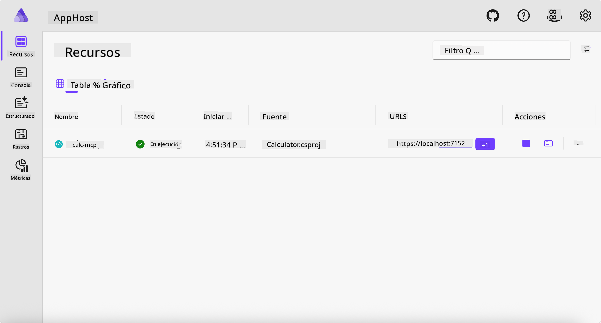
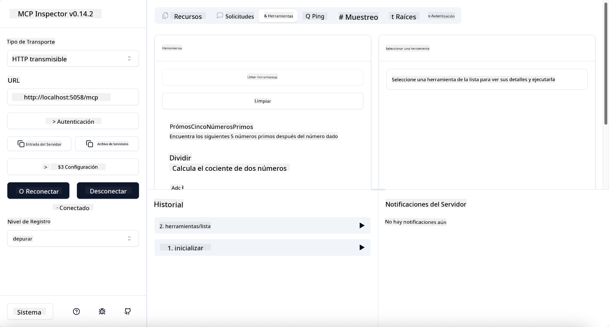
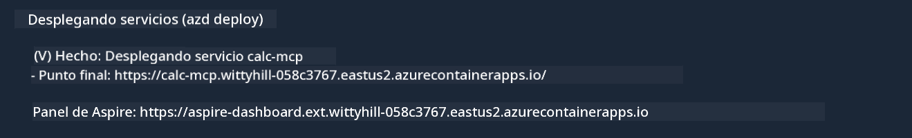

<!--
CO_OP_TRANSLATOR_METADATA:
{
  "original_hash": "0bc7bd48f55f1565f1d95ccb2c16f728",
  "translation_date": "2025-07-13T23:03:17+00:00",
  "source_file": "04-PracticalImplementation/samples/csharp/README.md",
  "language_code": "es"
}
-->
# Ejemplo

El ejemplo anterior muestra cómo usar un proyecto local de .NET con el tipo `stdio`. Y cómo ejecutar el servidor localmente en un contenedor. Esta es una buena solución en muchas situaciones. Sin embargo, puede ser útil tener el servidor funcionando de forma remota, como en un entorno en la nube. Aquí es donde entra el tipo `http`.

Al observar la solución en la carpeta `04-PracticalImplementation`, puede parecer mucho más compleja que la anterior. Pero en realidad, no lo es. Si miras de cerca el proyecto `src/Calculator`, verás que es básicamente el mismo código que en el ejemplo anterior. La única diferencia es que estamos usando una biblioteca diferente, `ModelContextProtocol.AspNetCore`, para manejar las solicitudes HTTP. Y cambiamos el método `IsPrime` para hacerlo privado, solo para mostrar que puedes tener métodos privados en tu código. El resto del código es igual que antes.

Los otros proyectos son de [.NET Aspire](https://learn.microsoft.com/dotnet/aspire/get-started/aspire-overview). Tener .NET Aspire en la solución mejora la experiencia del desarrollador durante el desarrollo y las pruebas, y ayuda con la observabilidad. No es obligatorio para ejecutar el servidor, pero es una buena práctica tenerlo en tu solución.

## Iniciar el servidor localmente

1. Desde VS Code (con la extensión C# DevKit), navega hasta el directorio `04-PracticalImplementation/samples/csharp`.
1. Ejecuta el siguiente comando para iniciar el servidor:

   ```bash
    dotnet watch run --project ./src/AppHost
   ```

1. Cuando un navegador web abra el panel de control de .NET Aspire, toma nota de la URL `http`. Debería ser algo como `http://localhost:5058/`.

   

## Probar Streamable HTTP con el MCP Inspector

Si tienes Node.js 22.7.5 o superior, puedes usar el MCP Inspector para probar tu servidor.

Inicia el servidor y ejecuta el siguiente comando en una terminal:

```bash
npx @modelcontextprotocol/inspector http://localhost:5058
```



- Selecciona `Streamable HTTP` como tipo de transporte.
- En el campo Url, ingresa la URL del servidor anotada anteriormente y añade `/mcp`. Debe ser `http` (no `https`), algo como `http://localhost:5058/mcp`.
- Selecciona el botón Connect.

Una ventaja del Inspector es que ofrece una buena visibilidad de lo que está ocurriendo.

- Intenta listar las herramientas disponibles.
- Prueba algunas de ellas, deberían funcionar igual que antes.

## Probar el servidor MCP con GitHub Copilot Chat en VS Code

Para usar el transporte Streamable HTTP con GitHub Copilot Chat, cambia la configuración del servidor `calc-mcp` creado anteriormente para que quede así:

```jsonc
// .vscode/mcp.json
{
  "servers": {
    "calc-mcp": {
      "type": "http",
      "url": "http://localhost:5058/mcp"
    }
  }
}
```

Haz algunas pruebas:

- Pide "3 números primos después de 6780". Observa cómo Copilot usará las nuevas herramientas `NextFivePrimeNumbers` y solo devolverá los primeros 3 números primos.
- Pide "7 números primos después de 111", para ver qué sucede.
- Pide "John tiene 24 piruletas y quiere repartirlas entre sus 3 hijos. ¿Cuántas piruletas recibe cada hijo?", para ver qué sucede.

## Desplegar el servidor en Azure

Vamos a desplegar el servidor en Azure para que más personas puedan usarlo.

Desde una terminal, navega a la carpeta `04-PracticalImplementation/samples/csharp` y ejecuta el siguiente comando:

```bash
azd up
```

Una vez finalizado el despliegue, deberías ver un mensaje como este:



Toma la URL y úsala en el MCP Inspector y en GitHub Copilot Chat.

```jsonc
// .vscode/mcp.json
{
  "servers": {
    "calc-mcp": {
      "type": "http",
      "url": "https://calc-mcp.gentleriver-3977fbcf.australiaeast.azurecontainerapps.io/mcp"
    }
  }
}
```

## ¿Qué sigue?

Probamos diferentes tipos de transporte y herramientas de prueba. También desplegamos tu servidor MCP en Azure. Pero, ¿qué pasa si nuestro servidor necesita acceder a recursos privados? Por ejemplo, una base de datos o una API privada. En el próximo capítulo, veremos cómo podemos mejorar la seguridad de nuestro servidor.

**Aviso legal**:  
Este documento ha sido traducido utilizando el servicio de traducción automática [Co-op Translator](https://github.com/Azure/co-op-translator). Aunque nos esforzamos por la precisión, tenga en cuenta que las traducciones automáticas pueden contener errores o inexactitudes. El documento original en su idioma nativo debe considerarse la fuente autorizada. Para información crítica, se recomienda la traducción profesional realizada por humanos. No nos hacemos responsables de malentendidos o interpretaciones erróneas derivadas del uso de esta traducción.