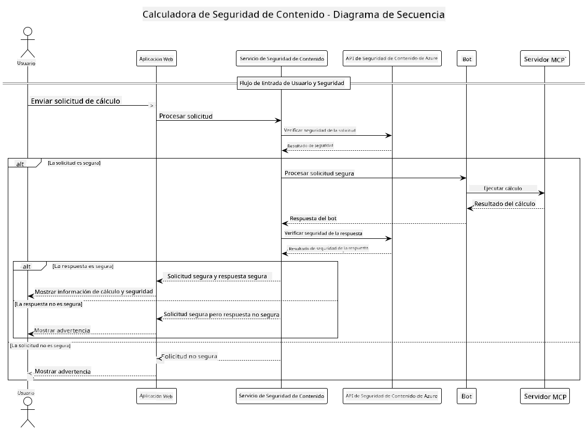

<!--
CO_OP_TRANSLATOR_METADATA:
{
  "original_hash": "e5ea5e7582f70008ea9bec3b3820f20a",
  "translation_date": "2025-07-13T23:11:25+00:00",
  "source_file": "04-PracticalImplementation/samples/java/containerapp/README.md",
  "language_code": "es"
}
-->
## Arquitectura del Sistema

Este proyecto demuestra una aplicación web que utiliza la verificación de seguridad de contenido antes de enviar las indicaciones del usuario a un servicio de calculadora mediante el Model Context Protocol (MCP).



### Cómo Funciona

1. **Entrada del Usuario**: El usuario ingresa una indicación de cálculo en la interfaz web  
2. **Revisión de Seguridad de Contenido (Entrada)**: La indicación es analizada por la API de Azure Content Safety  
3. **Decisión de Seguridad (Entrada)**:  
   - Si el contenido es seguro (severidad < 2 en todas las categorías), se envía a la calculadora  
   - Si el contenido se marca como potencialmente dañino, el proceso se detiene y se devuelve una advertencia  
4. **Integración con la Calculadora**: El contenido seguro es procesado por LangChain4j, que se comunica con el servidor de calculadora MCP  
5. **Revisión de Seguridad de Contenido (Salida)**: La respuesta del bot es analizada por la API de Azure Content Safety  
6. **Decisión de Seguridad (Salida)**:  
   - Si la respuesta del bot es segura, se muestra al usuario  
   - Si la respuesta del bot se marca como potencialmente dañina, se reemplaza con una advertencia  
7. **Respuesta**: Los resultados (si son seguros) se muestran al usuario junto con ambos análisis de seguridad

## Uso del Model Context Protocol (MCP) con Servicios de Calculadora

Este proyecto muestra cómo usar el Model Context Protocol (MCP) para llamar a servicios de calculadora MCP desde LangChain4j. La implementación utiliza un servidor MCP local que se ejecuta en el puerto 8080 para proporcionar operaciones de calculadora.

### Configuración del Servicio Azure Content Safety

Antes de usar las funciones de seguridad de contenido, necesitas crear un recurso del servicio Azure Content Safety:

1. Inicia sesión en el [Azure Portal](https://portal.azure.com)  
2. Haz clic en "Crear un recurso" y busca "Content Safety"  
3. Selecciona "Content Safety" y haz clic en "Crear"  
4. Ingresa un nombre único para tu recurso  
5. Selecciona tu suscripción y grupo de recursos (o crea uno nuevo)  
6. Elige una región compatible (consulta la [Disponibilidad por región](https://azure.microsoft.com/en-us/global-infrastructure/services/?products=cognitive-services) para más detalles)  
7. Selecciona un nivel de precios adecuado  
8. Haz clic en "Crear" para desplegar el recurso  
9. Una vez completado el despliegue, haz clic en "Ir al recurso"  
10. En el panel izquierdo, bajo "Administración de recursos", selecciona "Claves y punto de conexión"  
11. Copia alguna de las claves y la URL del punto de conexión para usarlas en el siguiente paso

### Configuración de Variables de Entorno

Configura la variable de entorno `GITHUB_TOKEN` para la autenticación de modelos de GitHub:  
```sh
export GITHUB_TOKEN=<your_github_token>
```

Para las funciones de seguridad de contenido, configura:  
```sh
export CONTENT_SAFETY_ENDPOINT=<your_content_safety_endpoint>
export CONTENT_SAFETY_KEY=<your_content_safety_key>
```

Estas variables de entorno son usadas por la aplicación para autenticarse con el servicio Azure Content Safety. Si no se configuran, la aplicación usará valores de ejemplo para demostración, pero las funciones de seguridad de contenido no funcionarán correctamente.

### Inicio del Servidor MCP de Calculadora

Antes de ejecutar el cliente, debes iniciar el servidor MCP de calculadora en modo SSE en localhost:8080.

## Descripción del Proyecto

Este proyecto demuestra la integración del Model Context Protocol (MCP) con LangChain4j para llamar a servicios de calculadora. Las características principales incluyen:

- Uso de MCP para conectarse a un servicio de calculadora para operaciones matemáticas básicas  
- Verificación de seguridad de contenido en dos niveles, tanto en las indicaciones del usuario como en las respuestas del bot  
- Integración con el modelo gpt-4.1-nano de GitHub a través de LangChain4j  
- Uso de Server-Sent Events (SSE) para el transporte MCP

## Integración de Seguridad de Contenido

El proyecto incluye funciones completas de seguridad de contenido para asegurar que tanto las entradas del usuario como las respuestas del sistema estén libres de contenido dañino:

1. **Revisión de Entrada**: Todas las indicaciones del usuario se analizan para detectar categorías de contenido dañino como discurso de odio, violencia, autolesiones y contenido sexual antes de ser procesadas.

2. **Revisión de Salida**: Incluso al usar modelos potencialmente sin censura, el sistema verifica todas las respuestas generadas mediante los mismos filtros de seguridad de contenido antes de mostrarlas al usuario.

Este enfoque de doble capa garantiza que el sistema se mantenga seguro sin importar qué modelo de IA se utilice, protegiendo a los usuarios tanto de entradas dañinas como de posibles salidas problemáticas generadas por la IA.

## Cliente Web

La aplicación incluye una interfaz web fácil de usar que permite a los usuarios interactuar con el sistema Content Safety Calculator:

### Características de la Interfaz Web

- Formulario simple e intuitivo para ingresar indicaciones de cálculo  
- Validación de seguridad de contenido en dos niveles (entrada y salida)  
- Retroalimentación en tiempo real sobre la seguridad de la indicación y la respuesta  
- Indicadores de seguridad codificados por colores para facilitar la interpretación  
- Diseño limpio y responsivo que funciona en varios dispositivos  
- Ejemplos de indicaciones seguras para guiar a los usuarios

### Uso del Cliente Web

1. Inicia la aplicación:  
   ```sh
   mvn spring-boot:run
   ```

2. Abre tu navegador y navega a `http://localhost:8087`

3. Ingresa una indicación de cálculo en el área de texto proporcionada (por ejemplo, "Calcula la suma de 24.5 y 17.3")

4. Haz clic en "Enviar" para procesar tu solicitud

5. Visualiza los resultados, que incluirán:  
   - Análisis de seguridad de contenido de tu indicación  
   - El resultado calculado (si la indicación fue segura)  
   - Análisis de seguridad de contenido de la respuesta del bot  
   - Cualquier advertencia de seguridad si la entrada o la salida fueron marcadas

El cliente web maneja automáticamente ambos procesos de verificación de seguridad de contenido, asegurando que todas las interacciones sean seguras y apropiadas sin importar qué modelo de IA se esté utilizando.

**Aviso legal**:  
Este documento ha sido traducido utilizando el servicio de traducción automática [Co-op Translator](https://github.com/Azure/co-op-translator). Aunque nos esforzamos por la precisión, tenga en cuenta que las traducciones automáticas pueden contener errores o inexactitudes. El documento original en su idioma nativo debe considerarse la fuente autorizada. Para información crítica, se recomienda la traducción profesional realizada por humanos. No nos hacemos responsables de malentendidos o interpretaciones erróneas derivadas del uso de esta traducción.