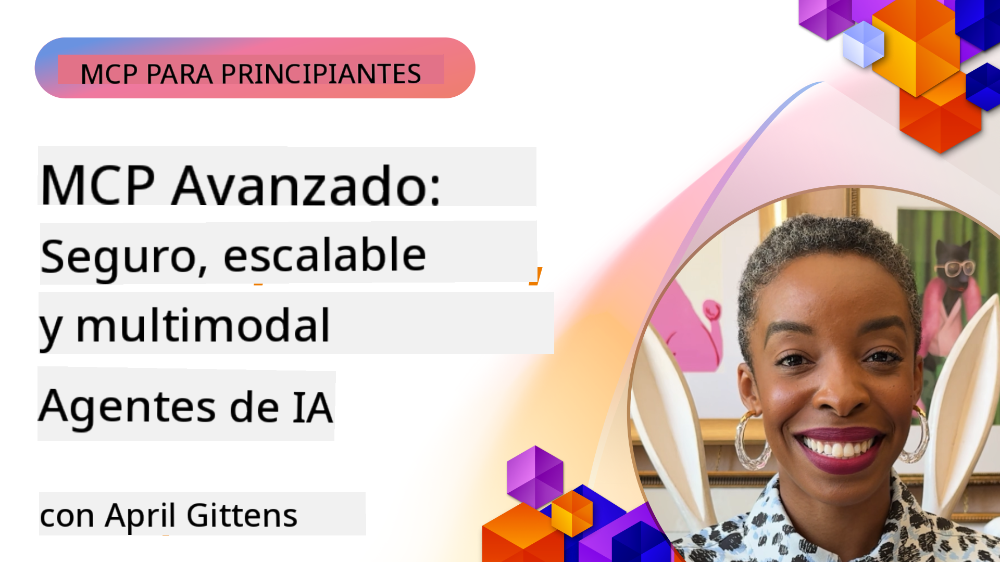

<!--
CO_OP_TRANSLATOR_METADATA:
{
  "original_hash": "d204bc94ea6027d06a703b21b711ca57",
  "translation_date": "2025-07-29T00:48:47+00:00",
  "source_file": "05-AdvancedTopics/README.md",
  "language_code": "es"
}
-->
# Temas Avanzados en MCP

_(Haz clic en la imagen de arriba para ver el video de esta lección)_

Este capítulo cubre una serie de temas avanzados en la implementación del Protocolo de Contexto de Modelo (MCP), incluyendo integración multimodal, escalabilidad, mejores prácticas de seguridad e integración empresarial. Estos temas son cruciales para construir aplicaciones MCP robustas y listas para producción que puedan satisfacer las demandas de los sistemas de IA modernos.

## Resumen

Esta lección explora conceptos avanzados en la implementación del Protocolo de Contexto de Modelo, centrándose en integración multimodal, escalabilidad, mejores prácticas de seguridad e integración empresarial. Estos temas son esenciales para construir aplicaciones MCP de grado de producción que puedan manejar requisitos complejos en entornos empresariales.

## Objetivos de Aprendizaje

Al final de esta lección, podrás:

- Implementar capacidades multimodales dentro de los marcos de MCP
- Diseñar arquitecturas MCP escalables para escenarios de alta demanda
- Aplicar mejores prácticas de seguridad alineadas con los principios de seguridad de MCP
- Integrar MCP con sistemas y marcos de IA empresariales
- Optimizar el rendimiento y la confiabilidad en entornos de producción

## Lecciones y Proyectos de Ejemplo

| Enlace | Título | Descripción |
|--------|--------|-------------|
| [5.1 Integración con Azure](./mcp-integration/README.md) | Integrar con Azure | Aprende cómo integrar tu servidor MCP en Azure |
| [5.2 Ejemplo Multimodal](./mcp-multi-modality/README.md) | Ejemplos Multimodales de MCP | Ejemplos para audio, imágenes y respuestas multimodales |
| [5.3 Ejemplo de OAuth2 en MCP](../../../05-AdvancedTopics/mcp-oauth2-demo) | Demo de OAuth2 en MCP | Aplicación mínima de Spring Boot que muestra OAuth2 con MCP, tanto como Servidor de Autorización como Servidor de Recursos. Demuestra emisión segura de tokens, puntos finales protegidos, implementación en Azure Container Apps e integración con API Management. |
| [5.4 Contextos Raíz](./mcp-root-contexts/README.md) | Contextos Raíz | Aprende más sobre los contextos raíz y cómo implementarlos |
| [5.5 Enrutamiento](./mcp-routing/README.md) | Enrutamiento | Aprende diferentes tipos de enrutamiento |
| [5.6 Muestreo](./mcp-sampling/README.md) | Muestreo | Aprende cómo trabajar con muestreo |
| [5.7 Escalabilidad](./mcp-scaling/README.md) | Escalabilidad | Aprende sobre escalabilidad |
| [5.8 Seguridad](./mcp-security/README.md) | Seguridad | Protege tu servidor MCP |
| [5.9 Ejemplo de Búsqueda Web](./web-search-mcp/README.md) | Búsqueda Web MCP | Servidor y cliente MCP en Python que se integra con SerpAPI para búsqueda web, noticias, productos y preguntas y respuestas en tiempo real. Demuestra orquestación de múltiples herramientas, integración con API externas y manejo robusto de errores. |
| [5.10 Transmisión en Tiempo Real](./mcp-realtimestreaming/README.md) | Transmisión | La transmisión de datos en tiempo real se ha vuelto esencial en el mundo impulsado por datos de hoy, donde las empresas y aplicaciones requieren acceso inmediato a la información para tomar decisiones oportunas. |
| [5.11 Búsqueda Web en Tiempo Real](./mcp-realtimesearch/README.md) | Búsqueda Web | Cómo MCP transforma la búsqueda web en tiempo real proporcionando un enfoque estandarizado para la gestión de contexto entre modelos de IA, motores de búsqueda y aplicaciones. |
| [5.12 Autenticación Entra ID para Servidores MCP](./mcp-security-entra/README.md) | Autenticación Entra ID | Microsoft Entra ID proporciona una solución robusta de gestión de identidad y acceso basada en la nube, ayudando a garantizar que solo usuarios y aplicaciones autorizados puedan interactuar con tu servidor MCP. |
| [5.13 Integración del Agente de Azure AI Foundry](./mcp-foundry-agent-integration/README.md) | Integración con Azure AI Foundry | Aprende cómo integrar servidores MCP con agentes de Azure AI Foundry, habilitando una poderosa orquestación de herramientas y capacidades de IA empresarial con conexiones estandarizadas a fuentes de datos externas. |
| [5.14 Ingeniería de Contexto](./mcp-contextengineering/README.md) | Ingeniería de Contexto | La oportunidad futura de las técnicas de ingeniería de contexto para servidores MCP, incluyendo optimización de contexto, gestión dinámica de contexto y estrategias para una ingeniería de prompts efectiva dentro de los marcos de MCP. |

## Referencias Adicionales

Para obtener la información más actualizada sobre temas avanzados de MCP, consulta:
- [Documentación de MCP](https://modelcontextprotocol.io/)
- [Especificación de MCP](https://spec.modelcontextprotocol.io/)
- [Repositorio de GitHub](https://github.com/modelcontextprotocol)

## Puntos Clave

- Las implementaciones multimodales de MCP amplían las capacidades de IA más allá del procesamiento de texto
- La escalabilidad es esencial para implementaciones empresariales y puede abordarse mediante escalamiento horizontal y vertical
- Medidas de seguridad completas protegen los datos y garantizan un control adecuado de acceso
- La integración empresarial con plataformas como Azure OpenAI y Microsoft AI Foundry mejora las capacidades de MCP
- Las implementaciones avanzadas de MCP se benefician de arquitecturas optimizadas y una gestión cuidadosa de recursos

## Ejercicio

Diseña una implementación MCP de grado empresarial para un caso de uso específico:

1. Identifica los requisitos multimodales para tu caso de uso
2. Esboza los controles de seguridad necesarios para proteger datos sensibles
3. Diseña una arquitectura escalable que pueda manejar cargas variables
4. Planifica puntos de integración con sistemas de IA empresariales
5. Documenta posibles cuellos de botella de rendimiento y estrategias de mitigación

## Recursos Adicionales

- [Documentación de Azure OpenAI](https://learn.microsoft.com/en-us/azure/ai-services/openai/)
- [Documentación de Microsoft AI Foundry](https://learn.microsoft.com/en-us/ai-services/)

---

## Qué sigue

- [5.1 Integración MCP](./mcp-integration/README.md)

**Descargo de responsabilidad**:  
Este documento ha sido traducido utilizando el servicio de traducción automática [Co-op Translator](https://github.com/Azure/co-op-translator). Aunque nos esforzamos por garantizar la precisión, tenga en cuenta que las traducciones automatizadas pueden contener errores o imprecisiones. El documento original en su idioma nativo debe considerarse la fuente autorizada. Para información crítica, se recomienda una traducción profesional realizada por humanos. No nos hacemos responsables de malentendidos o interpretaciones erróneas que puedan surgir del uso de esta traducción.