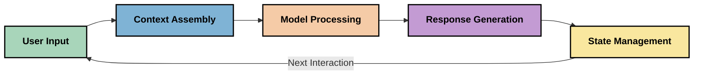
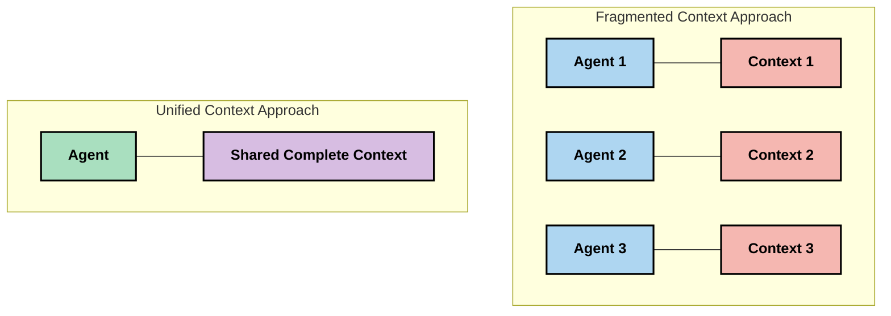
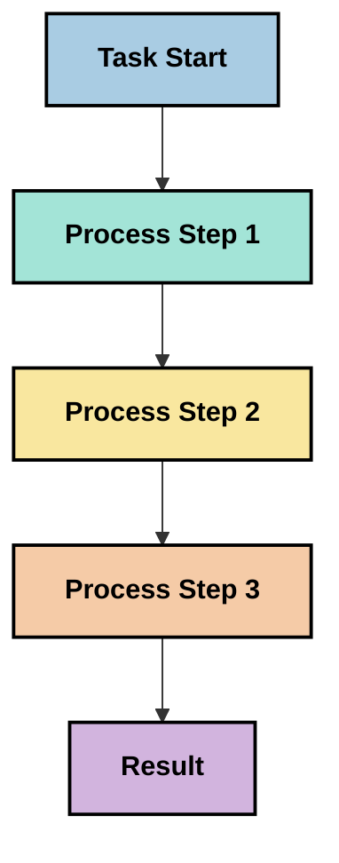
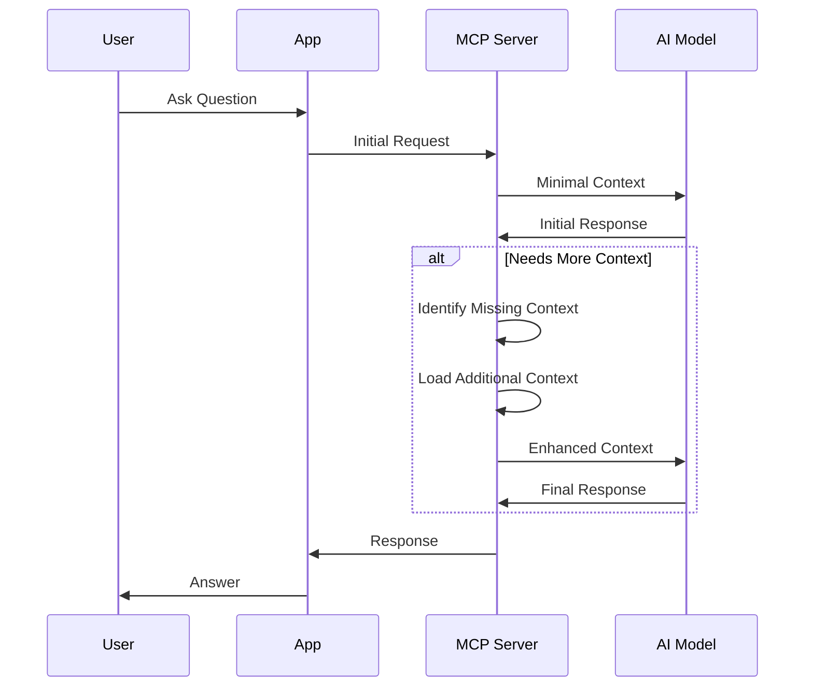
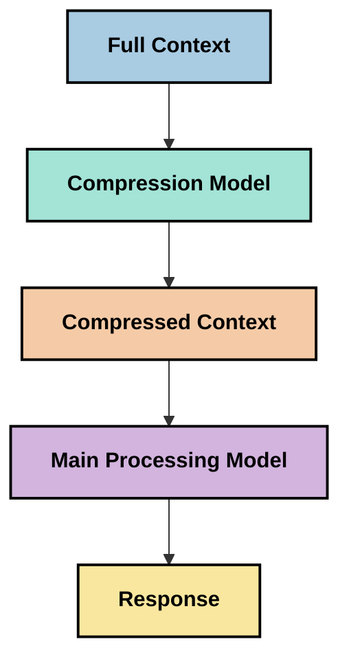
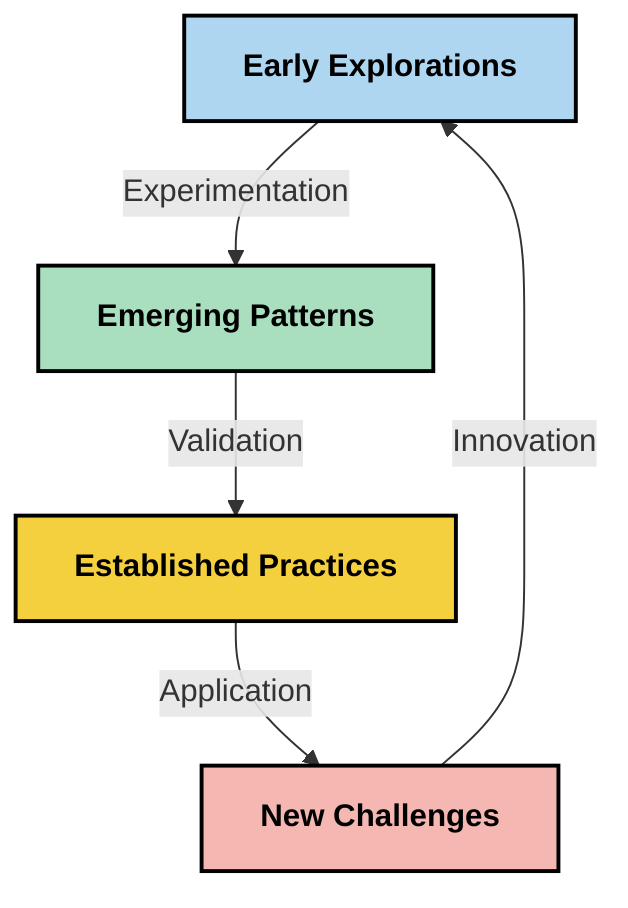

<!--
CO_OP_TRANSLATOR_METADATA:
{
  "original_hash": "5762e8e74dd99d8b7dbb31e69a82561e",
  "translation_date": "2025-07-16T23:00:29+00:00",
  "source_file": "05-AdvancedTopics/mcp-contextengineering/README.md",
  "language_code": "es"
}
-->
# Ingeniería de Contexto: Un Concepto Emergente en el Ecosistema MCP

## Visión General

La ingeniería de contexto es un concepto emergente en el ámbito de la IA que explora cómo se estructura, entrega y mantiene la información a lo largo de las interacciones entre clientes y servicios de IA. A medida que evoluciona el ecosistema del Model Context Protocol (MCP), comprender cómo gestionar el contexto de manera efectiva se vuelve cada vez más importante. Este módulo introduce el concepto de ingeniería de contexto y explora sus posibles aplicaciones en implementaciones MCP.

## Objetivos de Aprendizaje

Al finalizar este módulo, podrás:

- Comprender el concepto emergente de ingeniería de contexto y su posible papel en aplicaciones MCP
- Identificar los principales desafíos en la gestión del contexto que aborda el diseño del protocolo MCP
- Explorar técnicas para mejorar el rendimiento del modelo mediante una mejor gestión del contexto
- Considerar enfoques para medir y evaluar la efectividad del contexto
- Aplicar estos conceptos emergentes para mejorar las experiencias de IA a través del marco MCP

## Introducción a la Ingeniería de Contexto

La ingeniería de contexto es un concepto emergente centrado en el diseño y gestión deliberada del flujo de información entre usuarios, aplicaciones y modelos de IA. A diferencia de campos establecidos como la ingeniería de prompts, la ingeniería de contexto aún está siendo definida por los profesionales mientras trabajan para resolver los desafíos únicos de proporcionar a los modelos de IA la información adecuada en el momento adecuado.

A medida que los grandes modelos de lenguaje (LLMs) han evolucionado, la importancia del contexto se ha vuelto cada vez más evidente. La calidad, relevancia y estructura del contexto que proporcionamos impacta directamente en las salidas del modelo. La ingeniería de contexto explora esta relación y busca desarrollar principios para una gestión efectiva del contexto.

> "En 2025, los modelos existentes son extremadamente inteligentes. Pero ni siquiera el humano más inteligente podrá hacer su trabajo de manera efectiva sin el contexto de lo que se le está pidiendo... 'La ingeniería de contexto' es el siguiente nivel de la ingeniería de prompts. Se trata de hacer esto automáticamente en un sistema dinámico." — Walden Yan, Cognition AI

La ingeniería de contexto podría abarcar:

1. **Selección de Contexto**: Determinar qué información es relevante para una tarea dada  
2. **Estructuración del Contexto**: Organizar la información para maximizar la comprensión del modelo  
3. **Entrega del Contexto**: Optimizar cómo y cuándo se envía la información a los modelos  
4. **Mantenimiento del Contexto**: Gestionar el estado y la evolución del contexto a lo largo del tiempo  
5. **Evaluación del Contexto**: Medir y mejorar la efectividad del contexto  

Estas áreas de enfoque son particularmente relevantes para el ecosistema MCP, que proporciona una forma estandarizada para que las aplicaciones suministren contexto a los LLMs.

## La Perspectiva del Viaje del Contexto

Una forma de visualizar la ingeniería de contexto es trazar el recorrido que sigue la información a través de un sistema MCP:



### Etapas Clave en el Viaje del Contexto:

1. **Entrada del Usuario**: Información cruda del usuario (texto, imágenes, documentos)  
2. **Ensamblaje del Contexto**: Combinar la entrada del usuario con el contexto del sistema, el historial de conversación y otra información recuperada  
3. **Procesamiento del Modelo**: El modelo de IA procesa el contexto ensamblado  
4. **Generación de Respuesta**: El modelo produce salidas basadas en el contexto proporcionado  
5. **Gestión del Estado**: El sistema actualiza su estado interno según la interacción  

Esta perspectiva resalta la naturaleza dinámica del contexto en los sistemas de IA y plantea preguntas importantes sobre cómo gestionar mejor la información en cada etapa.

## Principios Emergentes en la Ingeniería de Contexto

A medida que el campo de la ingeniería de contexto toma forma, algunos principios iniciales comienzan a emerger de los profesionales. Estos principios pueden ayudar a informar las decisiones de implementación MCP:

### Principio 1: Compartir el Contexto Completamente

El contexto debe compartirse de forma completa entre todos los componentes de un sistema en lugar de fragmentarse entre múltiples agentes o procesos. Cuando el contexto está distribuido, las decisiones tomadas en una parte del sistema pueden entrar en conflicto con las tomadas en otra.



En aplicaciones MCP, esto sugiere diseñar sistemas donde el contexto fluya sin interrupciones a lo largo de toda la cadena en lugar de estar compartimentado.

### Principio 2: Reconocer que las Acciones Llevan Decisiones Implícitas

Cada acción que toma un modelo encarna decisiones implícitas sobre cómo interpretar el contexto. Cuando múltiples componentes actúan sobre contextos diferentes, estas decisiones implícitas pueden entrar en conflicto, generando resultados inconsistentes.

Este principio tiene implicaciones importantes para las aplicaciones MCP:  
- Preferir el procesamiento lineal de tareas complejas sobre la ejecución paralela con contexto fragmentado  
- Asegurar que todos los puntos de decisión tengan acceso a la misma información contextual  
- Diseñar sistemas donde los pasos posteriores puedan ver el contexto completo de decisiones anteriores  

### Principio 3: Equilibrar la Profundidad del Contexto con las Limitaciones de la Ventana

A medida que las conversaciones y procesos se alargan, las ventanas de contexto eventualmente se saturan. La ingeniería de contexto efectiva explora enfoques para manejar esta tensión entre un contexto completo y las limitaciones técnicas.

Los enfoques potenciales que se están explorando incluyen:  
- Compresión de contexto que mantiene la información esencial mientras reduce el uso de tokens  
- Carga progresiva del contexto basada en la relevancia para las necesidades actuales  
- Resumen de interacciones previas preservando decisiones y hechos clave  

## Desafíos del Contexto y Diseño del Protocolo MCP

El Model Context Protocol (MCP) fue diseñado con conciencia de los desafíos únicos de la gestión del contexto. Comprender estos desafíos ayuda a explicar aspectos clave del diseño del protocolo MCP:

### Desafío 1: Limitaciones de la Ventana de Contexto  
La mayoría de los modelos de IA tienen tamaños fijos de ventana de contexto, limitando la cantidad de información que pueden procesar a la vez.

**Respuesta del Diseño MCP:**  
- El protocolo soporta contexto estructurado basado en recursos que pueden ser referenciados eficientemente  
- Los recursos pueden paginarse y cargarse progresivamente  

### Desafío 2: Determinación de Relevancia  
Determinar qué información es más relevante para incluir en el contexto es difícil.

**Respuesta del Diseño MCP:**  
- Herramientas flexibles permiten la recuperación dinámica de información según la necesidad  
- Prompts estructurados permiten una organización consistente del contexto  

### Desafío 3: Persistencia del Contexto  
Gestionar el estado a lo largo de las interacciones requiere un seguimiento cuidadoso del contexto.

**Respuesta del Diseño MCP:**  
- Gestión estandarizada de sesiones  
- Patrones de interacción claramente definidos para la evolución del contexto  

### Desafío 4: Contexto Multimodal  
Diferentes tipos de datos (texto, imágenes, datos estructurados) requieren un manejo distinto.

**Respuesta del Diseño MCP:**  
- El diseño del protocolo acomoda varios tipos de contenido  
- Representación estandarizada de información multimodal  

### Desafío 5: Seguridad y Privacidad  
El contexto a menudo contiene información sensible que debe protegerse.

**Respuesta del Diseño MCP:**  
- Límites claros entre responsabilidades del cliente y del servidor  
- Opciones de procesamiento local para minimizar la exposición de datos  

Comprender estos desafíos y cómo MCP los aborda proporciona una base para explorar técnicas más avanzadas de ingeniería de contexto.

## Enfoques Emergentes en Ingeniería de Contexto

A medida que el campo de la ingeniería de contexto se desarrolla, surgen varios enfoques prometedores. Estos representan el pensamiento actual más que prácticas establecidas, y probablemente evolucionarán conforme ganemos más experiencia con implementaciones MCP.

### 1. Procesamiento Lineal de Hilo Único

En contraste con arquitecturas multi-agente que distribuyen el contexto, algunos profesionales encuentran que el procesamiento lineal de hilo único produce resultados más consistentes. Esto se alinea con el principio de mantener un contexto unificado.



Aunque este enfoque puede parecer menos eficiente que el procesamiento paralelo, a menudo produce resultados más coherentes y fiables porque cada paso se basa en una comprensión completa de decisiones previas.

### 2. Fragmentación y Priorización del Contexto

Dividir contextos grandes en partes manejables y priorizar lo más importante.

```python
# Conceptual Example: Context Chunking and Prioritization
def process_with_chunked_context(documents, query):
    # 1. Break documents into smaller chunks
    chunks = chunk_documents(documents)
    
    # 2. Calculate relevance scores for each chunk
    scored_chunks = [(chunk, calculate_relevance(chunk, query)) for chunk in chunks]
    
    # 3. Sort chunks by relevance score
    sorted_chunks = sorted(scored_chunks, key=lambda x: x[1], reverse=True)
    
    # 4. Use the most relevant chunks as context
    context = create_context_from_chunks([chunk for chunk, score in sorted_chunks[:5]])
    
    # 5. Process with the prioritized context
    return generate_response(context, query)
```

El concepto anterior ilustra cómo podríamos dividir documentos extensos en partes manejables y seleccionar solo las secciones más relevantes para el contexto. Este enfoque puede ayudar a trabajar dentro de las limitaciones de la ventana de contexto mientras se aprovechan grandes bases de conocimiento.

### 3. Carga Progresiva del Contexto

Cargar el contexto progresivamente según sea necesario en lugar de todo de una vez.



La carga progresiva del contexto comienza con un contexto mínimo y se expande solo cuando es necesario. Esto puede reducir significativamente el uso de tokens para consultas simples mientras mantiene la capacidad de manejar preguntas complejas.

### 4. Compresión y Resumen del Contexto

Reducir el tamaño del contexto preservando la información esencial.



La compresión del contexto se enfoca en:  
- Eliminar información redundante  
- Resumir contenido extenso  
- Extraer hechos y detalles clave  
- Preservar elementos críticos del contexto  
- Optimizar la eficiencia en el uso de tokens  

Este enfoque puede ser especialmente valioso para mantener conversaciones largas dentro de las ventanas de contexto o para procesar documentos grandes de manera eficiente. Algunos profesionales usan modelos especializados específicamente para la compresión y resumen del historial de conversación.

## Consideraciones Exploratorias en Ingeniería de Contexto

Al explorar el campo emergente de la ingeniería de contexto, hay varias consideraciones que vale la pena tener en cuenta al trabajar con implementaciones MCP. No son prácticas recomendadas prescriptivas, sino áreas de exploración que pueden aportar mejoras en tu caso de uso específico.

### Considera tus Objetivos de Contexto

Antes de implementar soluciones complejas de gestión de contexto, articula claramente qué intentas lograr:  
- ¿Qué información específica necesita el modelo para tener éxito?  
- ¿Qué información es esencial y cuál es complementaria?  
- ¿Cuáles son tus limitaciones de rendimiento (latencia, límites de tokens, costos)?  

### Explora Enfoques de Contexto en Capas

Algunos profesionales encuentran éxito con el contexto organizado en capas conceptuales:  
- **Capa Central**: Información esencial que el modelo siempre necesita  
- **Capa Situacional**: Contexto específico de la interacción actual  
- **Capa de Apoyo**: Información adicional que puede ser útil  
- **Capa de Reserva**: Información accesible solo cuando se necesita  

### Investiga Estrategias de Recuperación

La efectividad de tu contexto a menudo depende de cómo recuperas la información:  
- Búsqueda semántica y embeddings para encontrar información conceptualmente relevante  
- Búsqueda basada en palabras clave para detalles factuales específicos  
- Enfoques híbridos que combinan múltiples métodos de recuperación  
- Filtrado por metadatos para limitar el alcance según categorías, fechas o fuentes  

### Experimenta con la Coherencia del Contexto

La estructura y el flujo de tu contexto pueden afectar la comprensión del modelo:  
- Agrupar información relacionada  
- Usar formato y organización consistentes  
- Mantener un orden lógico o cronológico cuando sea apropiado  
- Evitar información contradictoria  

### Evalúa los Pros y Contras de las Arquitecturas Multi-Agente

Aunque las arquitecturas multi-agente son populares en muchos marcos de IA, presentan desafíos significativos para la gestión del contexto:  
- La fragmentación del contexto puede llevar a decisiones inconsistentes entre agentes  
- El procesamiento paralelo puede introducir conflictos difíciles de resolver  
- La sobrecarga de comunicación entre agentes puede contrarrestar las ganancias de rendimiento  
- Se requiere una gestión compleja del estado para mantener la coherencia  

En muchos casos, un enfoque de agente único con gestión integral del contexto puede producir resultados más fiables que múltiples agentes especializados con contexto fragmentado.

### Desarrolla Métodos de Evaluación

Para mejorar la ingeniería de contexto con el tiempo, considera cómo medirás el éxito:  
- Pruebas A/B con diferentes estructuras de contexto  
- Monitoreo del uso de tokens y tiempos de respuesta  
- Seguimiento de la satisfacción del usuario y tasas de finalización de tareas  
- Análisis de cuándo y por qué fallan las estrategias de contexto  

Estas consideraciones representan áreas activas de exploración en el espacio de la ingeniería de contexto. A medida que el campo madure, probablemente emerjan patrones y prácticas más definitivas.

## Medición de la Efectividad del Contexto: Un Marco en Evolución

A medida que la ingeniería de contexto emerge como concepto, los profesionales comienzan a explorar cómo podríamos medir su efectividad. Aún no existe un marco establecido, pero se están considerando varias métricas que podrían guiar el trabajo futuro.

### Dimensiones Potenciales de Medición

#### 1. Consideraciones de Eficiencia de Entrada

- **Relación Contexto-Respuesta**: ¿Cuánto contexto se necesita en relación con el tamaño de la respuesta?  
- **Utilización de Tokens**: ¿Qué porcentaje de los tokens del contexto proporcionado influye en la respuesta?  
- **Reducción del Contexto**: ¿Qué tan efectivamente podemos comprimir la información cruda?  

#### 2. Consideraciones de Rendimiento

- **Impacto en la Latencia**: ¿Cómo afecta la gestión del contexto al tiempo de respuesta?  
- **Economía de Tokens**: ¿Estamos optimizando el uso de tokens de manera efectiva?  
- **Precisión en la Recuperación**: ¿Qué tan relevante es la información recuperada?  
- **Utilización de Recursos**: ¿Qué recursos computacionales se requieren?  

#### 3. Consideraciones de Calidad

- **Relevancia de la Respuesta**: ¿Qué tan bien responde la salida a la consulta?  
- **Exactitud Factual**: ¿Mejora la gestión del contexto la corrección factual?  
- **Consistencia**: ¿Son consistentes las respuestas en consultas similares?  
- **Tasa de Alucinaciones**: ¿Reduce un mejor contexto las alucinaciones del modelo?  

#### 4. Consideraciones de Experiencia de Usuario

- **Tasa de Seguimiento**: ¿Con qué frecuencia los usuarios necesitan aclaraciones?  
- **Finalización de Tareas**: ¿Logran los usuarios sus objetivos con éxito?  
- **Indicadores de Satisfacción**: ¿Cómo califican los usuarios su experiencia?  

### Enfoques Exploratorios para la Medición

Al experimentar con la ingeniería de contexto en implementaciones MCP, considera estos enfoques exploratorios:

1. **Comparaciones de Línea Base**: Establece una línea base con enfoques simples de contexto antes de probar métodos más sofisticados  
2. **Cambios Incrementales**: Modifica un aspecto de la gestión del contexto a la vez para aislar sus efectos  
3. **Evaluación Centrada en el Usuario**: Combina métricas cuantitativas con retroalimentación cualitativa de usuarios  
4. **Análisis de Fallos**: Examina casos donde las estrategias de contexto fallan para entender posibles mejoras  
5. **Evaluación Multidimensional**: Considera los compromisos entre eficiencia, calidad y experiencia de usuario  

Este enfoque experimental y multifacético para la medición está alineado con la naturaleza emergente de la ingeniería de contexto.

## Reflexiones Finales

La ingeniería de contexto es un área emergente de exploración que podría resultar central para aplicaciones MCP efectivas. Al considerar cuidadosamente cómo fluye la información a través de tu sistema, puedes crear experiencias de IA más eficientes, precisas y valiosas para los usuarios.

Las técnicas y enfoques descritos en este módulo representan un pensamiento inicial en este campo, no prácticas establecidas. La ingeniería de contexto podría desarrollarse en una disciplina más definida a medida que evolucionen las capacidades de la IA y profundicemos nuestro entendimiento. Por ahora, la experimentación combinada con una medición cuidadosa parece ser el enfoque más productivo.

## Direcciones Futuras Potenciales

El campo de la ingeniería de contexto aún está en sus primeras etapas, pero surgen varias direcciones prometedoras:

- Los principios de ingeniería de contexto podrían impactar significativamente el rendimiento del modelo, la eficiencia, la experiencia del usuario y la fiabilidad  
- Los enfoques de hilo único con gestión integral del contexto podrían superar a las arquitecturas multi-agente en muchos casos de uso  
- Los modelos especializados en compresión de contexto podrían convertirse en componentes estándar en las cadenas de IA  
- La tensión entre la completitud del contexto y las limitaciones de tokens probablemente impulsará la innovación en el manejo del contexto  
- A medida que los modelos sean más capaces de comunicarse de manera eficiente y humana, la colaboración multi-agente verdadera podría volverse más viable  
- Las implementaciones MCP podrían evolucionar para estandarizar patrones de gestión de contexto que surjan de la experimentación actual  



## Recursos

### Recursos Oficiales MCP
- [Model Context Protocol Website](https://modelcontextprotocol.io/)
- [Model Context Protocol Specification](https://github.com/modelcontextprotocol/modelcontextprotocol)
- [MCP Documentation](https://modelcontextprotocol.io/docs)
- [MCP C# SDK](https://github.com/modelcontextprotocol/csharp-sdk)
- [MCP Python SDK](https://github.com/modelcontextprotocol/python-sdk)
- [MCP TypeScript SDK](https://github.com/modelcontextprotocol/typescript-sdk)
- [MCP Inspector](https://github.com/modelcontextprotocol/inspector) - Herramienta visual para pruebas de servidores MCP

### Artículos sobre Ingeniería de Contexto
- [No Construyas Multi-Agentes: Principios de la Ingeniería de Contexto](https://cognition.ai/blog/dont-build-multi-agents) - Perspectivas de Walden Yan sobre los principios de la ingeniería de contexto
- [Guía Práctica para Construir Agentes](https://cdn.openai.com/business-guides-and-resources/a-practical-guide-to-building-agents.pdf) - Guía de OpenAI sobre diseño efectivo de agentes
- [Construyendo Agentes Efectivos](https://www.anthropic.com/engineering/building-effective-agents) - Enfoque de Anthropic para el desarrollo de agentes

### Investigación Relacionada
- [Aumento Dinámico de Recuperación para Modelos de Lenguaje Grandes](https://arxiv.org/abs/2310.01487) - Investigación sobre enfoques dinámicos de recuperación
- [Perdidos en el Medio: Cómo los Modelos de Lenguaje Usan Contextos Largos](https://arxiv.org/abs/2307.03172) - Investigación importante sobre patrones de procesamiento de contexto
- [Generación Jerárquica de Imágenes Condicionada por Texto con Latentes CLIP](https://arxiv.org/abs/2204.06125) - Artículo de DALL-E 2 con ideas sobre estructuración del contexto
- [Explorando el Papel del Contexto en las Arquitecturas de Modelos de Lenguaje Grandes](https://aclanthology.org/2023.findings-emnlp.124/) - Investigación reciente sobre manejo del contexto
- [Colaboración Multi-Agente: Una Revisión](https://arxiv.org/abs/2304.03442) - Investigación sobre sistemas multi-agente y sus desafíos

### Recursos Adicionales
- [Técnicas de Optimización de la Ventana de Contexto](https://learn.microsoft.com/en-us/azure/ai-services/openai/concepts/context-window)
- [Técnicas Avanzadas de RAG](https://www.microsoft.com/en-us/research/blog/retrieval-augmented-generation-rag-and-frontier-models/)
- [Documentación de Semantic Kernel](https://github.com/microsoft/semantic-kernel)
- [Kit de Herramientas de IA para Gestión de Contexto](https://github.com/microsoft/aitoolkit)

## Qué Sigue
- [6. Contribuciones de la Comunidad](../../06-CommunityContributions/README.md)

**Aviso legal**:  
Este documento ha sido traducido utilizando el servicio de traducción automática [Co-op Translator](https://github.com/Azure/co-op-translator). Aunque nos esforzamos por la precisión, tenga en cuenta que las traducciones automáticas pueden contener errores o inexactitudes. El documento original en su idioma nativo debe considerarse la fuente autorizada. Para información crítica, se recomienda la traducción profesional realizada por humanos. No nos hacemos responsables de malentendidos o interpretaciones erróneas derivadas del uso de esta traducción.