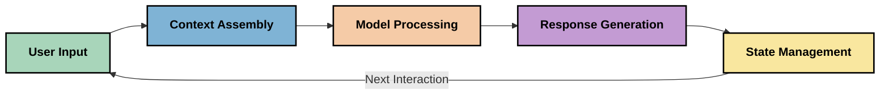
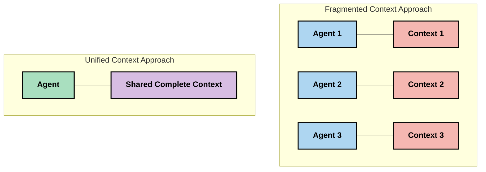
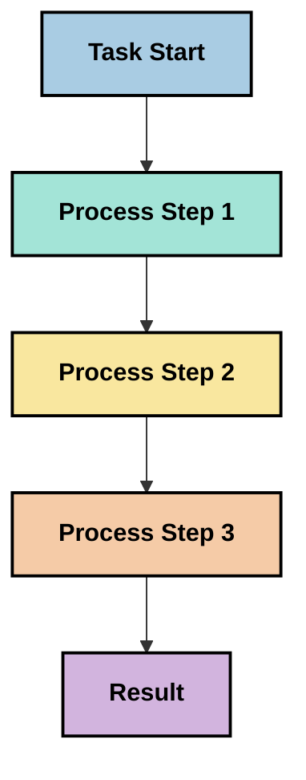
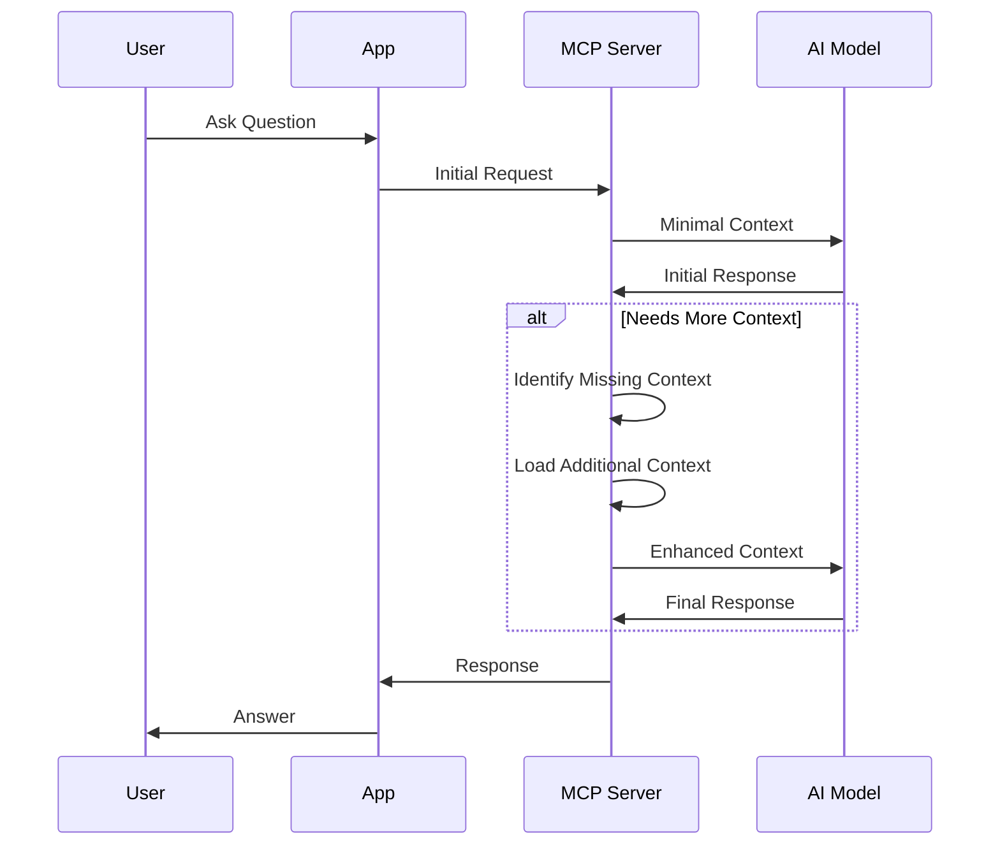
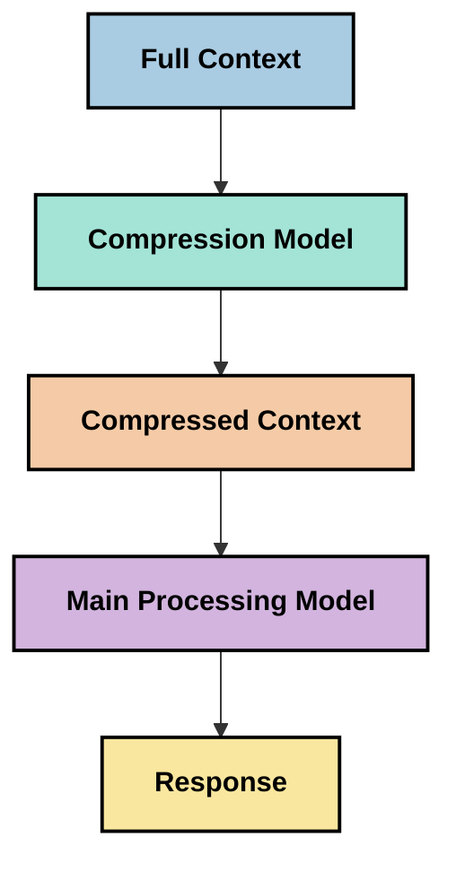
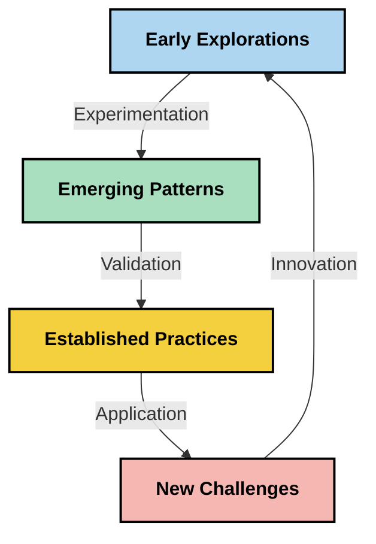

<!--
CO_OP_TRANSLATOR_METADATA:
{
  "original_hash": "fd169ca3071b81b5ee282e194bc823df",
  "translation_date": "2025-09-15T19:38:21+00:00",
  "source_file": "05-AdvancedTopics/mcp-contextengineering/README.md",
  "language_code": "es"
}
-->
# Ingeniería de Contexto: Un Concepto Emergente en el Ecosistema MCP

## Resumen

La ingeniería de contexto es un concepto emergente en el ámbito de la inteligencia artificial que explora cómo se estructura, entrega y mantiene la información durante las interacciones entre clientes y servicios de IA. A medida que el ecosistema del Protocolo de Contexto de Modelos (MCP) evoluciona, comprender cómo gestionar eficazmente el contexto se vuelve cada vez más importante. Este módulo introduce el concepto de ingeniería de contexto y explora sus posibles aplicaciones en implementaciones de MCP.

## Objetivos de Aprendizaje

Al finalizar este módulo, podrás:

- Comprender el concepto emergente de ingeniería de contexto y su posible rol en aplicaciones MCP
- Identificar los desafíos clave en la gestión de contexto que aborda el diseño del protocolo MCP
- Explorar técnicas para mejorar el rendimiento de los modelos mediante una mejor gestión del contexto
- Considerar enfoques para medir y evaluar la efectividad del contexto
- Aplicar estos conceptos emergentes para mejorar las experiencias de IA a través del marco MCP

## Introducción a la Ingeniería de Contexto

La ingeniería de contexto es un concepto emergente centrado en el diseño y la gestión deliberada del flujo de información entre usuarios, aplicaciones y modelos de IA. A diferencia de campos establecidos como la ingeniería de prompts, la ingeniería de contexto aún está siendo definida por los profesionales mientras trabajan para resolver los desafíos únicos de proporcionar a los modelos de IA la información adecuada en el momento adecuado.

A medida que los modelos de lenguaje grande (LLMs) han evolucionado, la importancia del contexto se ha vuelto cada vez más evidente. La calidad, relevancia y estructura del contexto que proporcionamos impacta directamente en los resultados de los modelos. La ingeniería de contexto explora esta relación y busca desarrollar principios para una gestión efectiva del contexto.

> "En 2025, los modelos disponibles son extremadamente inteligentes. Pero incluso la persona más inteligente no podrá hacer su trabajo de manera efectiva sin el contexto de lo que se le pide que haga... 'Ingeniería de contexto' es el siguiente nivel de la ingeniería de prompts. Se trata de hacerlo automáticamente en un sistema dinámico." — Walden Yan, Cognition AI

La ingeniería de contexto puede abarcar:

1. **Selección de Contexto**: Determinar qué información es relevante para una tarea específica
2. **Estructuración de Contexto**: Organizar la información para maximizar la comprensión del modelo
3. **Entrega de Contexto**: Optimizar cómo y cuándo se envía la información a los modelos
4. **Mantenimiento de Contexto**: Gestionar el estado y la evolución del contexto a lo largo del tiempo
5. **Evaluación de Contexto**: Medir y mejorar la efectividad del contexto

Estas áreas de enfoque son particularmente relevantes para el ecosistema MCP, que proporciona una forma estandarizada para que las aplicaciones ofrezcan contexto a los LLMs.

## La Perspectiva del Viaje del Contexto

Una forma de visualizar la ingeniería de contexto es rastrear el viaje que la información toma a través de un sistema MCP:



### Etapas Clave en el Viaje del Contexto:

1. **Entrada del Usuario**: Información en bruto del usuario (texto, imágenes, documentos)
2. **Ensamblaje de Contexto**: Combinación de la entrada del usuario con el contexto del sistema, historial de conversación y otra información recuperada
3. **Procesamiento del Modelo**: El modelo de IA procesa el contexto ensamblado
4. **Generación de Respuesta**: El modelo produce resultados basados en el contexto proporcionado
5. **Gestión del Estado**: El sistema actualiza su estado interno basado en la interacción

Esta perspectiva destaca la naturaleza dinámica del contexto en los sistemas de IA y plantea preguntas importantes sobre cómo gestionar mejor la información en cada etapa.

## Principios Emergentes en la Ingeniería de Contexto

A medida que el campo de la ingeniería de contexto toma forma, algunos principios iniciales están comenzando a surgir entre los profesionales. Estos principios pueden ayudar a informar las decisiones de implementación de MCP:

### Principio 1: Compartir el Contexto Completamente

El contexto debe compartirse completamente entre todos los componentes de un sistema en lugar de fragmentarse entre múltiples agentes o procesos. Cuando el contexto se distribuye, las decisiones tomadas en una parte del sistema pueden entrar en conflicto con las tomadas en otra.



En las aplicaciones MCP, esto sugiere diseñar sistemas donde el contexto fluya sin problemas a través de toda la canalización en lugar de estar compartimentado.

### Principio 2: Reconocer que las Acciones Implican Decisiones Implícitas

Cada acción que toma un modelo incorpora decisiones implícitas sobre cómo interpretar el contexto. Cuando múltiples componentes actúan sobre diferentes contextos, estas decisiones implícitas pueden entrar en conflicto, llevando a resultados inconsistentes.

Este principio tiene importantes implicaciones para las aplicaciones MCP:
- Preferir el procesamiento lineal de tareas complejas sobre la ejecución paralela con contexto fragmentado
- Asegurar que todos los puntos de decisión tengan acceso a la misma información contextual
- Diseñar sistemas donde los pasos posteriores puedan ver el contexto completo de las decisiones anteriores

### Principio 3: Equilibrar la Profundidad del Contexto con las Limitaciones de la Ventana

A medida que las conversaciones y los procesos se alargan, las ventanas de contexto eventualmente se desbordan. La ingeniería de contexto efectiva explora enfoques para gestionar esta tensión entre un contexto completo y las limitaciones técnicas.

Enfoques potenciales que se están explorando incluyen:
- Compresión de contexto que mantiene información esencial mientras reduce el uso de tokens
- Carga progresiva de contexto basada en la relevancia para las necesidades actuales
- Resumen de interacciones previas mientras se preservan decisiones y hechos clave

## Desafíos de Contexto y Diseño del Protocolo MCP

El Protocolo de Contexto de Modelos (MCP) fue diseñado con una conciencia de los desafíos únicos de la gestión de contexto. Comprender estos desafíos ayuda a explicar aspectos clave del diseño del protocolo MCP:

### Desafío 1: Limitaciones de la Ventana de Contexto
La mayoría de los modelos de IA tienen tamaños de ventana de contexto fijos, lo que limita la cantidad de información que pueden procesar a la vez.

**Respuesta del Diseño MCP:** 
- El protocolo admite contexto estructurado basado en recursos que puede referenciarse eficientemente
- Los recursos pueden paginarse y cargarse progresivamente

### Desafío 2: Determinación de Relevancia
Determinar qué información es más relevante para incluir en el contexto es difícil.

**Respuesta del Diseño MCP:**
- Herramientas flexibles permiten la recuperación dinámica de información según sea necesario
- Prompts estructurados habilitan una organización consistente del contexto

### Desafío 3: Persistencia del Contexto
Gestionar el estado a través de interacciones requiere un seguimiento cuidadoso del contexto.

**Respuesta del Diseño MCP:**
- Gestión de sesiones estandarizada
- Patrones de interacción claramente definidos para la evolución del contexto

### Desafío 4: Contexto Multimodal
Diferentes tipos de datos (texto, imágenes, datos estructurados) requieren un manejo diferente.

**Respuesta del Diseño MCP:**
- El diseño del protocolo acomoda varios tipos de contenido
- Representación estandarizada de información multimodal

### Desafío 5: Seguridad y Privacidad
El contexto a menudo contiene información sensible que debe protegerse.

**Respuesta del Diseño MCP:**
- Límites claros entre las responsabilidades del cliente y el servidor
- Opciones de procesamiento local para minimizar la exposición de datos

Comprender estos desafíos y cómo MCP los aborda proporciona una base para explorar técnicas más avanzadas de ingeniería de contexto.

## Enfoques Emergentes en Ingeniería de Contexto

A medida que el campo de la ingeniería de contexto se desarrolla, están surgiendo varios enfoques prometedores. Estos representan el pensamiento actual más que prácticas establecidas, y probablemente evolucionarán a medida que ganemos más experiencia con las implementaciones de MCP.

### 1. Procesamiento Lineal de Hilo Único

En contraste con las arquitecturas de múltiples agentes que distribuyen el contexto, algunos profesionales están descubriendo que el procesamiento lineal de hilo único produce resultados más consistentes. Esto se alinea con el principio de mantener un contexto unificado.



Aunque este enfoque puede parecer menos eficiente que el procesamiento paralelo, a menudo produce resultados más coherentes y confiables porque cada paso se basa en una comprensión completa de las decisiones anteriores.

### 2. Fragmentación y Priorización del Contexto

Dividir contextos grandes en piezas manejables y priorizar lo más importante.

```python
# Conceptual Example: Context Chunking and Prioritization
def process_with_chunked_context(documents, query):
    # 1. Break documents into smaller chunks
    chunks = chunk_documents(documents)
    
    # 2. Calculate relevance scores for each chunk
    scored_chunks = [(chunk, calculate_relevance(chunk, query)) for chunk in chunks]
    
    # 3. Sort chunks by relevance score
    sorted_chunks = sorted(scored_chunks, key=lambda x: x[1], reverse=True)
    
    # 4. Use the most relevant chunks as context
    context = create_context_from_chunks([chunk for chunk, score in sorted_chunks[:5]])
    
    # 5. Process with the prioritized context
    return generate_response(context, query)
```

El concepto anterior ilustra cómo podríamos dividir documentos grandes en piezas manejables y seleccionar solo las partes más relevantes para el contexto. Este enfoque puede ayudar a trabajar dentro de las limitaciones de la ventana de contexto mientras se aprovechan grandes bases de conocimiento.

### 3. Carga Progresiva de Contexto

Cargar el contexto progresivamente según sea necesario en lugar de todo de una vez.



La carga progresiva de contexto comienza con un contexto mínimo y se expande solo cuando es necesario. Esto puede reducir significativamente el uso de tokens para consultas simples mientras se mantiene la capacidad de manejar preguntas complejas.

### 4. Compresión y Resumen del Contexto

Reducir el tamaño del contexto mientras se preserva la información esencial.



La compresión de contexto se centra en:
- Eliminar información redundante
- Resumir contenido extenso
- Extraer hechos y detalles clave
- Preservar elementos críticos del contexto
- Optimizar para la eficiencia de tokens

Este enfoque puede ser particularmente valioso para mantener conversaciones largas dentro de las ventanas de contexto o para procesar documentos grandes de manera eficiente. Algunos profesionales están utilizando modelos especializados específicamente para la compresión de contexto y el resumen del historial de conversaciones.

## Consideraciones Exploratorias en Ingeniería de Contexto

A medida que exploramos el campo emergente de la ingeniería de contexto, varias consideraciones son importantes al trabajar con implementaciones de MCP. Estas no son prácticas prescriptivas, sino áreas de exploración que pueden generar mejoras en tu caso de uso específico.

### Considera tus Objetivos de Contexto

Antes de implementar soluciones complejas de gestión de contexto, articula claramente lo que estás tratando de lograr:
- ¿Qué información específica necesita el modelo para tener éxito?
- ¿Qué información es esencial versus suplementaria?
- ¿Cuáles son tus restricciones de rendimiento (latencia, límites de tokens, costos)?

### Explora Enfoques de Contexto en Capas

Algunos profesionales están encontrando éxito con el contexto organizado en capas conceptuales:
- **Capa Central**: Información esencial que el modelo siempre necesita
- **Capa Situacional**: Contexto específico de la interacción actual
- **Capa de Apoyo**: Información adicional que puede ser útil
- **Capa de Respaldo**: Información accesada solo cuando es necesaria

### Investiga Estrategias de Recuperación

La efectividad de tu contexto a menudo depende de cómo recuperas la información:
- Búsqueda semántica y embeddings para encontrar información conceptualmente relevante
- Búsqueda basada en palabras clave para detalles fácticos específicos
- Enfoques híbridos que combinan múltiples métodos de recuperación
- Filtrado por metadatos para reducir el alcance basado en categorías, fechas o fuentes

### Experimenta con la Coherencia del Contexto

La estructura y el flujo de tu contexto pueden afectar la comprensión del modelo:
- Agrupar información relacionada
- Usar un formato y organización consistentes
- Mantener un orden lógico o cronológico donde sea apropiado
- Evitar información contradictoria

### Sopesar los Pros y Contras de las Arquitecturas de Múltiples Agentes

Aunque las arquitecturas de múltiples agentes son populares en muchos marcos de IA, vienen con desafíos significativos para la gestión de contexto:
- La fragmentación del contexto puede llevar a decisiones inconsistentes entre agentes
- El procesamiento paralelo puede introducir conflictos difíciles de reconciliar
- La sobrecarga de comunicación entre agentes puede compensar las ganancias de rendimiento
- Se requiere una gestión de estado compleja para mantener la coherencia

En muchos casos, un enfoque de agente único con gestión de contexto integral puede producir resultados más confiables que múltiples agentes especializados con contexto fragmentado.

### Desarrolla Métodos de Evaluación

Para mejorar la ingeniería de contexto con el tiempo, considera cómo medirás el éxito:
- Pruebas A/B de diferentes estructuras de contexto
- Monitoreo del uso de tokens y tiempos de respuesta
- Seguimiento de la satisfacción del usuario y tasas de finalización de tareas
- Análisis de cuándo y por qué fallan las estrategias de contexto

Estas consideraciones representan áreas activas de exploración en el espacio de la ingeniería de contexto. A medida que el campo madure, probablemente emergerán patrones y prácticas más definitivos.

## Medir la Efectividad del Contexto: Un Marco en Evolución

A medida que la ingeniería de contexto emerge como concepto, los profesionales están comenzando a explorar cómo podríamos medir su efectividad. Aún no existe un marco establecido, pero se están considerando varias métricas que podrían ayudar a guiar el trabajo futuro.

### Dimensiones Potenciales de Medición

#### 1. Consideraciones de Eficiencia de Entrada

- **Relación Contexto-Respuesta**: ¿Cuánto contexto se necesita en relación con el tamaño de la respuesta?
- **Utilización de Tokens**: ¿Qué porcentaje de los tokens de contexto proporcionados parecen influir en la respuesta?
- **Reducción de Contexto**: ¿Qué tan eficazmente podemos comprimir la información en bruto?

#### 2. Consideraciones de Rendimiento

- **Impacto en la Latencia**: ¿Cómo afecta la gestión de contexto al tiempo de respuesta?
- **Economía de Tokens**: ¿Estamos optimizando el uso de tokens de manera efectiva?
- **Precisión de Recuperación**: ¿Qué tan relevante es la información recuperada?
- **Utilización de Recursos**: ¿Qué recursos computacionales se requieren?

#### 3. Consideraciones de Calidad

- **Relevancia de la Respuesta**: ¿Qué tan bien aborda la respuesta la consulta?
- **Precisión Factual**: ¿Mejora la gestión de contexto la corrección factual?
- **Consistencia**: ¿Son las respuestas consistentes en consultas similares?
- **Tasa de Alucinaciones**: ¿Reduce un mejor contexto las alucinaciones del modelo?

#### 4. Consideraciones de Experiencia del Usuario

- **Tasa de Seguimiento**: ¿Con qué frecuencia los usuarios necesitan aclaraciones?
- **Finalización de Tareas**: ¿Logran los usuarios cumplir sus objetivos con éxito?
- **Indicadores de Satisfacción**: ¿Cómo califican los usuarios su experiencia?

### Enfoques Exploratorios para la Medición

Al experimentar con la ingeniería de contexto en implementaciones MCP, considera estos enfoques exploratorios:

1. **Comparaciones de Línea Base**: Establece una línea base con enfoques simples de contexto antes de probar métodos más sofisticados

2. **Cambios Incrementales**: Cambia un aspecto de la gestión de contexto a la vez para aislar sus efectos

3. **Evaluación Centrada en el Usuario**: Combina métricas cuantitativas con comentarios cualitativos de los usuarios

4. **Análisis de Fallos**: Examina casos donde las estrategias de contexto fallan para entender posibles mejoras

5. **Evaluación Multidimensional**: Considera los compromisos entre eficiencia, calidad y experiencia del usuario

Este enfoque experimental y multifacético para la medición se alinea con la naturaleza emergente de la ingeniería de contexto.

## Reflexiones Finales

La ingeniería de contexto es un área emergente de exploración que puede resultar central para las aplicaciones efectivas de MCP. Al considerar cuidadosamente cómo fluye la información a través de tu sistema, puedes crear experiencias de IA más eficientes, precisas y valiosas para los usuarios.

Las técnicas y enfoques descritos en este módulo representan un pensamiento inicial en este espacio, no prácticas establecidas. La ingeniería de contexto puede desarrollarse en una disciplina más definida a medida que las capacidades de IA evolucionen y nuestra comprensión se profundice. Por ahora, la experimentación combinada con una medición cuidadosa parece ser el enfoque más productivo.

## Direcciones Futuras Potenciales

El campo de la ingeniería de contexto aún está en sus primeras etapas, pero están surgiendo varias direcciones prometedoras:

- Los principios de ingeniería de contexto pueden impactar significativamente el rendimiento del modelo, la eficiencia, la experiencia del usuario y la confiabilidad
- Los enfoques de hilo único con gestión integral de contexto pueden superar a las arquitecturas de múltiples agentes en muchos casos de uso
- Los modelos especializados de compresión de contexto pueden convertirse en componentes estándar en las canalizaciones de IA
- La tensión entre la completitud del contexto y las limitaciones de tokens probablemente impulsará la innovación en el manejo del contexto
- A medida que los modelos se vuelvan más capaces de comunicarse de manera eficiente como humanos, la colaboración verdadera entre múltiples agentes puede volverse más viable
- Las implementaciones de MCP pueden evolucionar para estandarizar patrones de gestión de contexto que surjan de la experimentación actual



## Recursos

### Recursos Oficiales de MCP
- [Sitio web del Protocolo de Contexto de Modelo](https://modelcontextprotocol.io/)
- [Especificación del Protocolo de Contexto de Modelo](https://github.com/modelcontextprotocol/modelcontextprotocol)
- [Documentación de MCP](https://modelcontextprotocol.io/docs)
- [SDK de MCP para C#](https://github.com/modelcontextprotocol/csharp-sdk)
- [SDK de MCP para Python](https://github.com/modelcontextprotocol/python-sdk)
- [SDK de MCP para TypeScript](https://github.com/modelcontextprotocol/typescript-sdk)
- [Inspector de MCP](https://github.com/modelcontextprotocol/inspector) - Herramienta visual para pruebas de servidores MCP

### Artículos sobre Ingeniería de Contexto
- [No construyas multi-agentes: Principios de la ingeniería de contexto](https://cognition.ai/blog/dont-build-multi-agents) - Perspectivas de Walden Yan sobre los principios de ingeniería de contexto
- [Guía práctica para construir agentes](https://cdn.openai.com/business-guides-and-resources/a-practical-guide-to-building-agents.pdf) - Guía de OpenAI sobre diseño efectivo de agentes
- [Construyendo agentes efectivos](https://www.anthropic.com/engineering/building-effective-agents) - Enfoque de Anthropic para el desarrollo de agentes

### Investigación relacionada
- [Aumento dinámico de recuperación para modelos de lenguaje grandes](https://arxiv.org/abs/2310.01487) - Investigación sobre enfoques dinámicos de recuperación
- [Perdidos en el medio: Cómo los modelos de lenguaje usan contextos largos](https://arxiv.org/abs/2307.03172) - Investigación importante sobre patrones de procesamiento de contexto
- [Generación de imágenes condicionadas por texto jerárquico con latentes de CLIP](https://arxiv.org/abs/2204.06125) - Artículo de DALL-E 2 con ideas sobre estructuración de contexto
- [Explorando el papel del contexto en arquitecturas de modelos de lenguaje grandes](https://aclanthology.org/2023.findings-emnlp.124/) - Investigación reciente sobre manejo de contexto
- [Colaboración multi-agente: Una encuesta](https://arxiv.org/abs/2304.03442) - Investigación sobre sistemas multi-agente y sus desafíos

### Recursos adicionales
- [Técnicas de optimización de ventanas de contexto](https://learn.microsoft.com/en-us/azure/ai-services/openai/concepts/context-window)
- [Técnicas avanzadas de RAG](https://www.microsoft.com/en-us/research/blog/retrieval-augmented-generation-rag-and-frontier-models/)
- [Documentación de Semantic Kernel](https://github.com/microsoft/semantic-kernel)
- [Kit de herramientas de IA para gestión de contexto](https://github.com/microsoft/aitoolkit)

## Qué sigue

- [5.15 Transporte personalizado de MCP](../mcp-transport/README.md)

---

**Descargo de responsabilidad**:  
Este documento ha sido traducido utilizando el servicio de traducción automática [Co-op Translator](https://github.com/Azure/co-op-translator). Aunque nos esforzamos por garantizar la precisión, tenga en cuenta que las traducciones automáticas pueden contener errores o imprecisiones. El documento original en su idioma nativo debe considerarse como la fuente autorizada. Para información crítica, se recomienda una traducción profesional realizada por humanos. No nos hacemos responsables de malentendidos o interpretaciones erróneas que puedan surgir del uso de esta traducción.