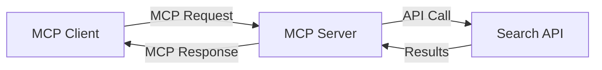
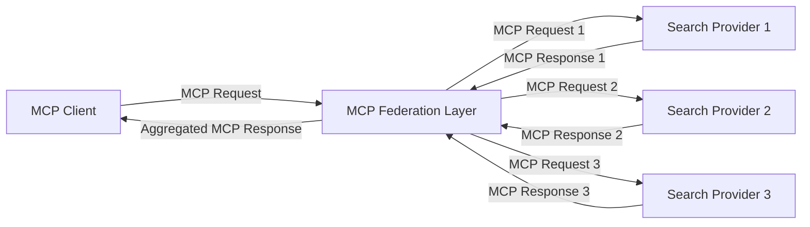
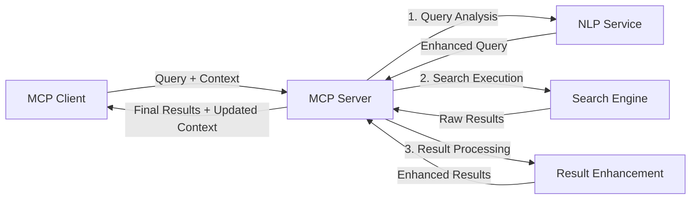

<!--
CO_OP_TRANSLATOR_METADATA:
{
  "original_hash": "eb12652eb7bd17f2193b835a344425c6",
  "translation_date": "2025-06-26T13:35:04+00:00",
  "source_file": "05-AdvancedTopics/mcp-realtimesearch/README.md",
  "language_code": "es"
}
-->
## Aviso sobre los ejemplos de código

> **Nota importante**: Los ejemplos de código a continuación demuestran la integración del Model Context Protocol (MCP) con la funcionalidad de búsqueda web. Aunque siguen los patrones y estructuras de los SDK oficiales de MCP, han sido simplificados con fines educativos.
> 
> Estos ejemplos muestran:
> 
> 1. **Implementación en Python**: Una implementación de servidor FastMCP que ofrece una herramienta de búsqueda web y se conecta a una API externa de búsqueda. Este ejemplo demuestra la gestión adecuada del ciclo de vida, manejo del contexto e implementación de herramientas siguiendo los patrones del [SDK oficial de MCP para Python](https://github.com/modelcontextprotocol/python-sdk). El servidor utiliza el transporte HTTP Streamable recomendado, que ha reemplazado al transporte SSE para implementaciones en producción.
> 
> 2. **Implementación en JavaScript**: Una implementación en TypeScript/JavaScript usando el patrón FastMCP del [SDK oficial de MCP para TypeScript](https://github.com/modelcontextprotocol/typescript-sdk) para crear un servidor de búsqueda con definiciones correctas de herramientas y conexiones cliente. Sigue los patrones más recientes recomendados para la gestión de sesiones y preservación del contexto.
> 
> Estos ejemplos requieren manejo adicional de errores, autenticación y código específico de integración con APIs para uso en producción. Los endpoints de API de búsqueda mostrados (`https://api.search-service.example/search`) son marcadores de posición y deben ser reemplazados por endpoints reales de servicios de búsqueda.
> 
> Para detalles completos de implementación y los enfoques más actualizados, consulte la [especificación oficial de MCP](https://spec.modelcontextprotocol.io/) y la documentación de los SDK.

## Conceptos clave

### El marco del Model Context Protocol (MCP)

En su base, el Model Context Protocol proporciona una forma estandarizada para que modelos de IA, aplicaciones y servicios intercambien contexto. En la búsqueda web en tiempo real, este marco es esencial para crear experiencias de búsqueda coherentes y de múltiples interacciones. Los componentes clave incluyen:

1. **Arquitectura cliente-servidor**: MCP establece una separación clara entre clientes de búsqueda (solicitantes) y servidores de búsqueda (proveedores), permitiendo modelos de despliegue flexibles.

2. **Comunicación JSON-RPC**: El protocolo usa JSON-RPC para el intercambio de mensajes, haciéndolo compatible con tecnologías web y fácil de implementar en diferentes plataformas.

3. **Gestión del contexto**: MCP define métodos estructurados para mantener, actualizar y aprovechar el contexto de búsqueda a lo largo de múltiples interacciones.

4. **Definiciones de herramientas**: Las capacidades de búsqueda se exponen como herramientas estandarizadas con parámetros y valores de retorno bien definidos.

5. **Soporte para streaming**: El protocolo soporta la transmisión continua de resultados, esencial para la búsqueda en tiempo real donde los resultados pueden llegar progresivamente.

### Patrones de integración de búsqueda web

Al integrar MCP con búsqueda web, surgen varios patrones:

#### 1. Integración directa con proveedor de búsqueda

En este patrón, el servidor MCP se conecta directamente con una o varias APIs de búsqueda, traduciendo las solicitudes MCP en llamadas específicas a la API y formateando los resultados como respuestas MCP.

#### 2. Búsqueda federada con preservación del contexto

Este patrón distribuye las consultas de búsqueda a múltiples proveedores compatibles con MCP, cada uno posiblemente especializado en diferentes tipos de contenido o capacidades de búsqueda, manteniendo un contexto unificado.

#### 3. Cadena de búsqueda mejorada con contexto

En este patrón, el proceso de búsqueda se divide en múltiples etapas, enriqueciendo el contexto en cada paso, lo que resulta en resultados progresivamente más relevantes.

### Componentes del contexto de búsqueda

En la búsqueda web basada en MCP, el contexto típicamente incluye:

- **Historial de consultas**: Consultas previas en la sesión
- **Preferencias del usuario**: Idioma, región, configuración de búsqueda segura
- **Historial de interacción**: Resultados clicados, tiempo dedicado a resultados
- **Parámetros de búsqueda**: Filtros, órdenes de clasificación y otros modificadores
- **Conocimiento del dominio**: Contexto específico relevante para la búsqueda
- **Contexto temporal**: Factores de relevancia basados en el tiempo
- **Preferencias de fuentes**: Fuentes de información confiables o preferidas

## Casos de uso y aplicaciones

### Investigación y recopilación de información

MCP mejora los flujos de trabajo de investigación al:

- Preservar el contexto de investigación a través de sesiones de búsqueda
- Permitir consultas más sofisticadas y contextualmente relevantes
- Soportar federación de búsqueda multi-fuente
- Facilitar la extracción de conocimiento a partir de resultados de búsqueda

### Monitoreo de noticias y tendencias en tiempo real

La búsqueda potenciada por MCP ofrece ventajas para el monitoreo de noticias:

- Descubrimiento casi en tiempo real de noticias emergentes
- Filtrado contextual de información relevante
- Seguimiento de temas y entidades a través de múltiples fuentes
- Alertas personalizadas de noticias basadas en el contexto del usuario

### Navegación e investigación aumentadas por IA

MCP crea nuevas posibilidades para la navegación aumentada por IA:

- Sugerencias de búsqueda contextuales basadas en la actividad actual del navegador
- Integración fluida de búsqueda web con asistentes potentes basados en LLM
- Refinamiento de búsqueda de múltiples interacciones manteniendo el contexto
- Mejoras en la verificación de hechos y validación de información

## Tendencias e innovaciones futuras

### Evolución de MCP en la búsqueda web

De cara al futuro, anticipamos que MCP evolucionará para abordar:

- **Búsqueda multimodal**: Integración de búsqueda de texto, imagen, audio y video con contexto preservado
- **Búsqueda descentralizada**: Soporte para ecosistemas de búsqueda distribuidos y federados
- **Privacidad en la búsqueda**: Mecanismos contextuales para preservar la privacidad en la búsqueda
- **Comprensión de consultas**: Análisis semántico profundo de consultas en lenguaje natural

### Avances tecnológicos potenciales

Tecnologías emergentes que moldearán el futuro de la búsqueda MCP:

1. **Arquitecturas de búsqueda neuronal**: Sistemas de búsqueda basados en embeddings optimizados para MCP
2. **Contexto de búsqueda personalizado**: Aprendizaje de patrones individuales de búsqueda de usuarios a lo largo del tiempo
3. **Integración de grafos de conocimiento**: Búsqueda contextual mejorada con grafos de conocimiento específicos de dominio
4. **Contexto multimodal**: Mantenimiento de contexto a través de diferentes modalidades de búsqueda

## Ejercicios prácticos

### Ejercicio 1: Configurar una canalización básica de búsqueda MCP

En este ejercicio aprenderás a:
- Configurar un entorno básico de búsqueda MCP
- Implementar manejadores de contexto para búsqueda web
- Probar y validar la preservación del contexto a través de iteraciones de búsqueda

### Ejercicio 2: Construir un asistente de investigación con búsqueda MCP

Crea una aplicación completa que:
- Procese preguntas de investigación en lenguaje natural
- Realice búsquedas web conscientes del contexto
- Sintetice información de múltiples fuentes
- Presente hallazgos organizados de la investigación

### Ejercicio 3: Implementar federación de búsqueda multi-fuente con MCP

Ejercicio avanzado que cubre:
- Envío de consultas conscientes del contexto a múltiples motores de búsqueda
- Clasificación y agregación de resultados
- Deducción contextual de resultados duplicados
- Manejo de metadatos específicos de cada fuente

## Recursos adicionales

- [Especificación del Model Context Protocol](https://spec.modelcontextprotocol.io/) - Especificación oficial y documentación detallada del protocolo MCP
- [Documentación del Model Context Protocol](https://modelcontextprotocol.io/) - Tutoriales detallados y guías de implementación
- [SDK Python MCP](https://github.com/modelcontextprotocol/python-sdk) - Implementación oficial en Python del protocolo MCP
- [SDK TypeScript MCP](https://github.com/modelcontextprotocol/typescript-sdk) - Implementación oficial en TypeScript del protocolo MCP
- [Servidores de referencia MCP](https://github.com/modelcontextprotocol/servers) - Implementaciones de referencia de servidores MCP
- [Documentación Bing Web Search API](https://learn.microsoft.com/en-us/bing/search-apis/bing-web-search/overview) - API de búsqueda web de Microsoft
- [Google Custom Search JSON API](https://developers.google.com/custom-search/v1/overview) - Motor de búsqueda programable de Google
- [Documentación SerpAPI](https://serpapi.com/search-api) - API para páginas de resultados de motores de búsqueda
- [Documentación Meilisearch](https://www.meilisearch.com/docs) - Motor de búsqueda de código abierto
- [Documentación Elasticsearch](https://www.elastic.co/guide/index.html) - Motor distribuido de búsqueda y análisis
- [Documentación LangChain](https://python.langchain.com/docs/get_started/introduction) - Construcción de aplicaciones con LLMs

## Resultados de aprendizaje

Al completar este módulo, podrás:

- Entender los fundamentos de la búsqueda web en tiempo real y sus desafíos
- Explicar cómo el Model Context Protocol (MCP) mejora las capacidades de búsqueda en tiempo real
- Implementar soluciones de búsqueda basadas en MCP usando frameworks y APIs populares
- Diseñar y desplegar arquitecturas de búsqueda escalables y de alto rendimiento con MCP
- Aplicar conceptos MCP a diversos casos de uso, incluyendo búsqueda semántica, asistencia en investigación y navegación aumentada por IA
- Evaluar tendencias emergentes e innovaciones futuras en tecnologías de búsqueda basadas en MCP

### Consideraciones de confianza y seguridad

Al implementar soluciones de búsqueda web basadas en MCP, recuerda estos principios importantes de la especificación MCP:

1. **Consentimiento y control del usuario**: Los usuarios deben consentir explícitamente y comprender todo acceso y operación de datos. Esto es especialmente importante para implementaciones de búsqueda web que puedan acceder a fuentes externas.

2. **Privacidad de datos**: Asegura un manejo adecuado de consultas y resultados de búsqueda, especialmente si pueden contener información sensible. Implementa controles de acceso apropiados para proteger los datos del usuario.

3. **Seguridad de las herramientas**: Implementa autorización y validación adecuadas para las herramientas de búsqueda, ya que representan riesgos de seguridad por la ejecución arbitraria de código. Las descripciones del comportamiento de las herramientas deben considerarse no confiables a menos que provengan de un servidor confiable.

4. **Documentación clara**: Proporciona documentación clara sobre las capacidades, limitaciones y consideraciones de seguridad de tu implementación de búsqueda basada en MCP, siguiendo las pautas de implementación de la especificación MCP.

5. **Flujos robustos de consentimiento**: Construye flujos robustos de consentimiento y autorización que expliquen claramente qué hace cada herramienta antes de autorizar su uso, especialmente para herramientas que interactúan con recursos web externos.

Para detalles completos sobre seguridad y consideraciones de confianza en MCP, consulta la [documentación oficial](https://modelcontextprotocol.io/specification/2025-03-26#security-and-trust-%26-safety).

## ¿Qué sigue?

- [5.11 Autenticación Entra ID para servidores Model Context Protocol](../mcp-security-entra/README.md)

**Aviso Legal**:  
Este documento ha sido traducido utilizando el servicio de traducción automática [Co-op Translator](https://github.com/Azure/co-op-translator). Aunque nos esforzamos por la precisión, tenga en cuenta que las traducciones automáticas pueden contener errores o inexactitudes. El documento original en su idioma nativo debe considerarse la fuente autorizada. Para información crítica, se recomienda una traducción profesional realizada por humanos. No nos responsabilizamos por malentendidos o interpretaciones erróneas derivadas del uso de esta traducción.