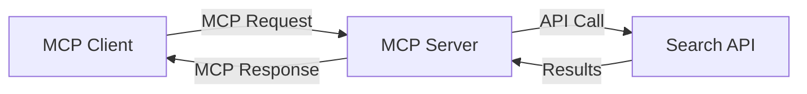
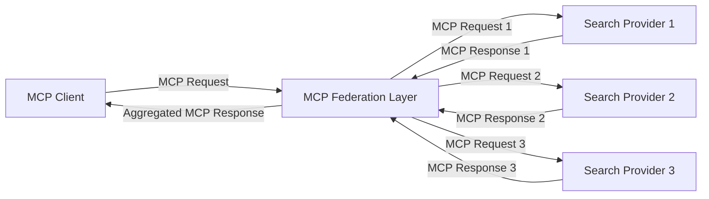
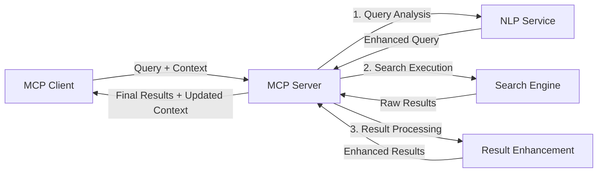

<!--
CO_OP_TRANSLATOR_METADATA:
{
  "original_hash": "333a03e51f90bdf3e6f1ba1694c73f36",
  "translation_date": "2025-07-16T22:07:02+00:00",
  "source_file": "05-AdvancedTopics/mcp-realtimesearch/README.md",
  "language_code": "es"
}
-->
## Descargo de Responsabilidad sobre los Ejemplos de Código

> **Nota Importante**: Los ejemplos de código a continuación demuestran la integración del Model Context Protocol (MCP) con la funcionalidad de búsqueda web. Aunque siguen los patrones y estructuras de los SDK oficiales de MCP, han sido simplificados con fines educativos.
> 
> Estos ejemplos muestran:
> 
> 1. **Implementación en Python**: Una implementación de servidor FastMCP que proporciona una herramienta de búsqueda web y se conecta a una API externa de búsqueda. Este ejemplo demuestra la gestión adecuada del ciclo de vida, el manejo del contexto y la implementación de herramientas siguiendo los patrones del [SDK oficial de MCP para Python](https://github.com/modelcontextprotocol/python-sdk). El servidor utiliza el transporte HTTP Streamable recomendado, que ha reemplazado al transporte SSE para despliegues en producción.
> 
> 2. **Implementación en JavaScript**: Una implementación en TypeScript/JavaScript usando el patrón FastMCP del [SDK oficial de MCP para TypeScript](https://github.com/modelcontextprotocol/typescript-sdk) para crear un servidor de búsqueda con definiciones de herramientas y conexiones de cliente adecuadas. Sigue los patrones más recientes recomendados para la gestión de sesiones y preservación del contexto.
> 
> Estos ejemplos requerirían manejo adicional de errores, autenticación y código específico de integración de API para uso en producción. Los endpoints de la API de búsqueda mostrados (`https://api.search-service.example/search`) son marcadores de posición y deberían reemplazarse por endpoints reales de servicios de búsqueda.
> 
> Para detalles completos de implementación y los enfoques más actualizados, por favor consulte la [especificación oficial de MCP](https://spec.modelcontextprotocol.io/) y la documentación de los SDK.

## Conceptos Fundamentales

### El Marco del Model Context Protocol (MCP)

En su base, el Model Context Protocol proporciona una forma estandarizada para que modelos de IA, aplicaciones y servicios intercambien contexto. En la búsqueda web en tiempo real, este marco es esencial para crear experiencias de búsqueda coherentes y de múltiples interacciones. Los componentes clave incluyen:

1. **Arquitectura Cliente-Servidor**: MCP establece una separación clara entre clientes de búsqueda (solicitantes) y servidores de búsqueda (proveedores), permitiendo modelos de despliegue flexibles.

2. **Comunicación JSON-RPC**: El protocolo utiliza JSON-RPC para el intercambio de mensajes, haciéndolo compatible con tecnologías web y fácil de implementar en diferentes plataformas.

3. **Gestión de Contexto**: MCP define métodos estructurados para mantener, actualizar y aprovechar el contexto de búsqueda a lo largo de múltiples interacciones.

4. **Definiciones de Herramientas**: Las capacidades de búsqueda se exponen como herramientas estandarizadas con parámetros y valores de retorno bien definidos.

5. **Soporte para Streaming**: El protocolo soporta la transmisión continua de resultados, esencial para la búsqueda en tiempo real donde los resultados pueden llegar progresivamente.

### Patrones de Integración para Búsqueda Web

Al integrar MCP con la búsqueda web, emergen varios patrones:

#### 1. Integración Directa con Proveedores de Búsqueda

En este patrón, el servidor MCP se conecta directamente con una o más APIs de búsqueda, traduciendo las solicitudes MCP en llamadas específicas a la API y formateando los resultados como respuestas MCP.

#### 2. Búsqueda Federada con Preservación de Contexto

Este patrón distribuye las consultas de búsqueda entre múltiples proveedores compatibles con MCP, cada uno potencialmente especializado en diferentes tipos de contenido o capacidades de búsqueda, manteniendo un contexto unificado.

#### 3. Cadena de Búsqueda Mejorada con Contexto

En este patrón, el proceso de búsqueda se divide en múltiples etapas, enriqueciendo el contexto en cada paso, lo que resulta en resultados progresivamente más relevantes.

### Componentes del Contexto de Búsqueda

En la búsqueda web basada en MCP, el contexto típicamente incluye:

- **Historial de Consultas**: Consultas de búsqueda previas en la sesión
- **Preferencias del Usuario**: Idioma, región, configuraciones de búsqueda segura
- **Historial de Interacciones**: Resultados clicados, tiempo dedicado en resultados
- **Parámetros de Búsqueda**: Filtros, órdenes de clasificación y otros modificadores de búsqueda
- **Conocimiento de Dominio**: Contexto específico del tema relevante para la búsqueda
- **Contexto Temporal**: Factores de relevancia basados en el tiempo
- **Preferencias de Fuente**: Fuentes de información confiables o preferidas

## Casos de Uso y Aplicaciones

### Investigación y Recolección de Información

MCP mejora los flujos de trabajo de investigación al:

- Preservar el contexto de investigación a lo largo de sesiones de búsqueda
- Permitir consultas más sofisticadas y contextualmente relevantes
- Soportar federación de búsqueda multi-fuente
- Facilitar la extracción de conocimiento a partir de resultados de búsqueda

### Monitoreo de Noticias y Tendencias en Tiempo Real

La búsqueda potenciada por MCP ofrece ventajas para el monitoreo de noticias:

- Descubrimiento casi en tiempo real de noticias emergentes
- Filtrado contextual de información relevante
- Seguimiento de temas y entidades a través de múltiples fuentes
- Alertas personalizadas de noticias basadas en el contexto del usuario

### Navegación e Investigación Aumentada por IA

MCP crea nuevas posibilidades para la navegación aumentada por IA:

- Sugerencias de búsqueda contextuales basadas en la actividad actual del navegador
- Integración fluida de la búsqueda web con asistentes potenciados por LLM
- Refinamiento de búsqueda en múltiples interacciones con contexto mantenido
- Mejora en la verificación de hechos y validación de información

## Tendencias e Innovaciones Futuras

### Evolución de MCP en la Búsqueda Web

De cara al futuro, anticipamos que MCP evolucionará para abordar:

- **Búsqueda Multimodal**: Integración de búsqueda de texto, imagen, audio y video con contexto preservado
- **Búsqueda Descentralizada**: Soporte para ecosistemas de búsqueda distribuidos y federados
- **Privacidad en la Búsqueda**: Mecanismos de búsqueda que preservan la privacidad y son conscientes del contexto  
- **Comprensión de Consultas**: Análisis semántico profundo de consultas de búsqueda en lenguaje natural

### Avances Potenciales en la Tecnología

Tecnologías emergentes que moldearán el futuro de la búsqueda MCP:

1. **Arquitecturas de Búsqueda Neuronal**: Sistemas de búsqueda basados en embeddings optimizados para MCP  
2. **Contexto de Búsqueda Personalizado**: Aprendizaje de patrones de búsqueda individuales a lo largo del tiempo  
3. **Integración de Grafos de Conocimiento**: Búsqueda contextual mejorada con grafos de conocimiento específicos de dominio  
4. **Contexto Multimodal**: Mantener el contexto a través de diferentes modalidades de búsqueda

## Ejercicios Prácticos

### Ejercicio 1: Configuración de una Pipeline Básica de Búsqueda MCP

En este ejercicio aprenderás a:  
- Configurar un entorno básico de búsqueda MCP  
- Implementar manejadores de contexto para búsqueda web  
- Probar y validar la preservación del contexto a lo largo de iteraciones de búsqueda

### Ejercicio 2: Construcción de un Asistente de Investigación con Búsqueda MCP

Crea una aplicación completa que:  
- Procese preguntas de investigación en lenguaje natural  
- Realice búsquedas web conscientes del contexto  
- Sintetice información de múltiples fuentes  
- Presente hallazgos de investigación organizados

### Ejercicio 3: Implementación de Federación de Búsqueda Multi-Fuente con MCP

Ejercicio avanzado que cubre:  
- Envío de consultas conscientes del contexto a múltiples motores de búsqueda  
- Clasificación y agregación de resultados  
- Deducción contextual de resultados duplicados  
- Manejo de metadatos específicos de cada fuente

## Recursos Adicionales

- [Model Context Protocol Specification](https://spec.modelcontextprotocol.io/) - Especificación oficial de MCP y documentación detallada del protocolo  
- [Model Context Protocol Documentation](https://modelcontextprotocol.io/) - Tutoriales detallados y guías de implementación  
- [MCP Python SDK](https://github.com/modelcontextprotocol/python-sdk) - Implementación oficial en Python del protocolo MCP  
- [MCP TypeScript SDK](https://github.com/modelcontextprotocol/typescript-sdk) - Implementación oficial en TypeScript del protocolo MCP  
- [MCP Reference Servers](https://github.com/modelcontextprotocol/servers) - Implementaciones de referencia de servidores MCP  
- [Bing Web Search API Documentation](https://learn.microsoft.com/en-us/bing/search-apis/bing-web-search/overview) - API de búsqueda web de Microsoft  
- [Google Custom Search JSON API](https://developers.google.com/custom-search/v1/overview) - Motor de búsqueda programable de Google  
- [SerpAPI Documentation](https://serpapi.com/search-api) - API para páginas de resultados de motores de búsqueda  
- [Meilisearch Documentation](https://www.meilisearch.com/docs) - Motor de búsqueda de código abierto  
- [Elasticsearch Documentation](https://www.elastic.co/guide/index.html) - Motor distribuido de búsqueda y análisis  
- [LangChain Documentation](https://python.langchain.com/docs/get_started/introduction) - Construcción de aplicaciones con LLMs

## Resultados de Aprendizaje

Al completar este módulo, serás capaz de:

- Entender los fundamentos de la búsqueda web en tiempo real y sus desafíos  
- Explicar cómo el Model Context Protocol (MCP) mejora las capacidades de búsqueda web en tiempo real  
- Implementar soluciones de búsqueda basadas en MCP usando frameworks y APIs populares  
- Diseñar y desplegar arquitecturas de búsqueda escalables y de alto rendimiento con MCP  
- Aplicar conceptos de MCP a diversos casos de uso, incluyendo búsqueda semántica, asistencia en investigación y navegación aumentada por IA  
- Evaluar tendencias emergentes e innovaciones futuras en tecnologías de búsqueda basadas en MCP

### Consideraciones de Confianza y Seguridad

Al implementar soluciones de búsqueda web basadas en MCP, recuerda estos principios importantes de la especificación MCP:

1. **Consentimiento y Control del Usuario**: Los usuarios deben dar su consentimiento explícito y comprender todas las operaciones y accesos a datos. Esto es especialmente importante en implementaciones de búsqueda web que puedan acceder a fuentes de datos externas.

2. **Privacidad de Datos**: Asegura un manejo adecuado de las consultas y resultados de búsqueda, especialmente cuando puedan contener información sensible. Implementa controles de acceso apropiados para proteger los datos del usuario.

3. **Seguridad de las Herramientas**: Implementa autorización y validación adecuadas para las herramientas de búsqueda, ya que representan riesgos de seguridad por la ejecución arbitraria de código. Las descripciones del comportamiento de las herramientas deben considerarse no confiables a menos que provengan de un servidor de confianza.

4. **Documentación Clara**: Proporciona documentación clara sobre las capacidades, limitaciones y consideraciones de seguridad de tu implementación de búsqueda basada en MCP, siguiendo las directrices de la especificación MCP.

5. **Flujos Robustos de Consentimiento**: Construye flujos robustos de consentimiento y autorización que expliquen claramente qué hace cada herramienta antes de autorizar su uso, especialmente para herramientas que interactúan con recursos web externos.

Para detalles completos sobre seguridad y consideraciones de confianza en MCP, consulta la [documentación oficial](https://modelcontextprotocol.io/specification/2025-03-26#security-and-trust-%26-safety).

## Qué sigue

- [5.12 Autenticación Entra ID para Servidores Model Context Protocol](../mcp-security-entra/README.md)

**Aviso legal**:  
Este documento ha sido traducido utilizando el servicio de traducción automática [Co-op Translator](https://github.com/Azure/co-op-translator). Aunque nos esforzamos por la precisión, tenga en cuenta que las traducciones automáticas pueden contener errores o inexactitudes. El documento original en su idioma nativo debe considerarse la fuente autorizada. Para información crítica, se recomienda la traducción profesional realizada por humanos. No nos hacemos responsables de malentendidos o interpretaciones erróneas derivadas del uso de esta traducción.