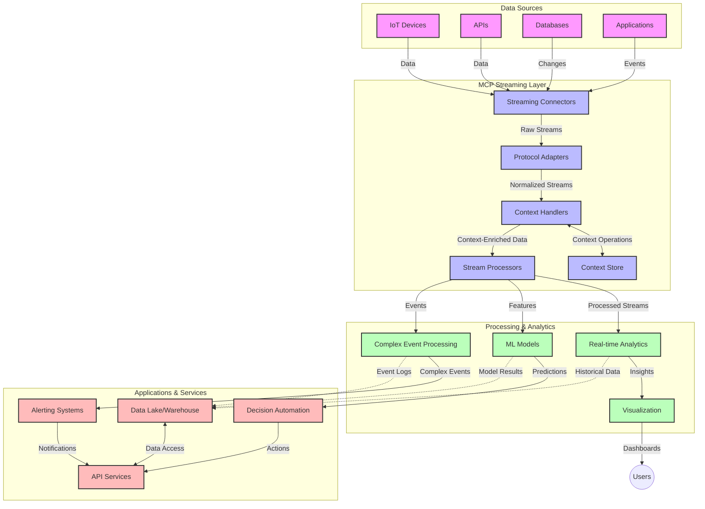

<!--
CO_OP_TRANSLATOR_METADATA:
{
  "original_hash": "195f7287638b77a549acadd96c8f981c",
  "translation_date": "2025-07-14T01:25:02+00:00",
  "source_file": "05-AdvancedTopics/mcp-realtimestreaming/README.md",
  "language_code": "es"
}
-->
# Protocolo de Contexto de Modelo para Transmisión de Datos en Tiempo Real

## Visión General

La transmisión de datos en tiempo real se ha vuelto esencial en el mundo actual impulsado por datos, donde las empresas y aplicaciones requieren acceso inmediato a la información para tomar decisiones oportunas. El Protocolo de Contexto de Modelo (MCP) representa un avance significativo en la optimización de estos procesos de transmisión en tiempo real, mejorando la eficiencia del procesamiento de datos, manteniendo la integridad contextual y elevando el rendimiento general del sistema.

Este módulo explora cómo MCP transforma la transmisión de datos en tiempo real al proporcionar un enfoque estandarizado para la gestión del contexto entre modelos de IA, plataformas de streaming y aplicaciones.

## Introducción a la Transmisión de Datos en Tiempo Real

La transmisión de datos en tiempo real es un paradigma tecnológico que permite la transferencia, procesamiento y análisis continuo de datos a medida que se generan, permitiendo que los sistemas reaccionen de inmediato a nueva información. A diferencia del procesamiento por lotes tradicional que opera sobre conjuntos de datos estáticos, el streaming procesa datos en movimiento, entregando insights y acciones con mínima latencia.

### Conceptos Clave de la Transmisión de Datos en Tiempo Real:

- **Flujo Continuo de Datos**: Los datos se procesan como un flujo continuo e interminable de eventos o registros.
- **Procesamiento de Baja Latencia**: Los sistemas están diseñados para minimizar el tiempo entre la generación y el procesamiento de datos.
- **Escalabilidad**: Las arquitecturas de streaming deben manejar volúmenes y velocidades variables de datos.
- **Tolerancia a Fallos**: Los sistemas deben ser resilientes ante fallos para asegurar un flujo de datos ininterrumpido.
- **Procesamiento Stateful**: Mantener el contexto a lo largo de los eventos es crucial para un análisis significativo.

### El Protocolo de Contexto de Modelo y el Streaming en Tiempo Real

El Protocolo de Contexto de Modelo (MCP) aborda varios desafíos críticos en entornos de streaming en tiempo real:

1. **Continuidad Contextual**: MCP estandariza cómo se mantiene el contexto a través de componentes distribuidos de streaming, asegurando que los modelos de IA y nodos de procesamiento tengan acceso al contexto histórico y ambiental relevante.

2. **Gestión Eficiente del Estado**: Al proporcionar mecanismos estructurados para la transmisión del contexto, MCP reduce la sobrecarga en la gestión del estado en las canalizaciones de streaming.

3. **Interoperabilidad**: MCP crea un lenguaje común para compartir contexto entre diversas tecnologías de streaming y modelos de IA, permitiendo arquitecturas más flexibles y extensibles.

4. **Contexto Optimizado para Streaming**: Las implementaciones de MCP pueden priorizar qué elementos del contexto son más relevantes para la toma de decisiones en tiempo real, optimizando tanto el rendimiento como la precisión.

5. **Procesamiento Adaptativo**: Con una gestión adecuada del contexto a través de MCP, los sistemas de streaming pueden ajustar dinámicamente el procesamiento según las condiciones y patrones cambiantes en los datos.

En aplicaciones modernas que van desde redes de sensores IoT hasta plataformas de trading financiero, la integración de MCP con tecnologías de streaming permite un procesamiento más inteligente y consciente del contexto, capaz de responder adecuadamente a situaciones complejas y en evolución en tiempo real.

## Objetivos de Aprendizaje

Al finalizar esta lección, podrás:

- Comprender los fundamentos de la transmisión de datos en tiempo real y sus desafíos
- Explicar cómo el Protocolo de Contexto de Modelo (MCP) mejora la transmisión de datos en tiempo real
- Implementar soluciones de streaming basadas en MCP usando frameworks populares como Kafka y Pulsar
- Diseñar y desplegar arquitecturas de streaming tolerantes a fallos y de alto rendimiento con MCP
- Aplicar conceptos de MCP a casos de uso en IoT, trading financiero y análisis impulsado por IA
- Evaluar tendencias emergentes e innovaciones futuras en tecnologías de streaming basadas en MCP

### Definición y Relevancia

La transmisión de datos en tiempo real implica la generación, procesamiento y entrega continua de datos con mínima latencia. A diferencia del procesamiento por lotes, donde los datos se recopilan y procesan en grupos, los datos en streaming se procesan de forma incremental a medida que llegan, permitiendo insights y acciones inmediatas.

Características clave de la transmisión de datos en tiempo real incluyen:

- **Baja Latencia**: Procesar y analizar datos en milisegundos a segundos
- **Flujo Continuo**: Streams ininterrumpidos de datos provenientes de diversas fuentes
- **Procesamiento Inmediato**: Analizar datos a medida que llegan en lugar de en lotes
- **Arquitectura Orientada a Eventos**: Responder a eventos conforme ocurren

### Desafíos en la Transmisión de Datos Tradicional

Los enfoques tradicionales de transmisión de datos enfrentan varias limitaciones:

1. **Pérdida de Contexto**: Dificultad para mantener el contexto en sistemas distribuidos
2. **Problemas de Escalabilidad**: Retos para escalar y manejar datos de alto volumen y velocidad
3. **Complejidad de Integración**: Problemas de interoperabilidad entre diferentes sistemas
4. **Gestión de Latencia**: Equilibrar el rendimiento con el tiempo de procesamiento
5. **Consistencia de Datos**: Asegurar precisión y completitud de datos a lo largo del stream

## Entendiendo el Protocolo de Contexto de Modelo (MCP)

### ¿Qué es MCP?

El Protocolo de Contexto de Modelo (MCP) es un protocolo de comunicación estandarizado diseñado para facilitar la interacción eficiente entre modelos de IA y aplicaciones. En el contexto de la transmisión de datos en tiempo real, MCP proporciona un marco para:

- Preservar el contexto a lo largo de la canalización de datos
- Estandarizar formatos de intercambio de datos
- Optimizar la transmisión de grandes conjuntos de datos
- Mejorar la comunicación entre modelos y entre modelos y aplicaciones

### Componentes Clave y Arquitectura

La arquitectura MCP para streaming en tiempo real consta de varios componentes principales:

1. **Manejadores de Contexto**: Gestionan y mantienen la información contextual a lo largo de la canalización de streaming
2. **Procesadores de Stream**: Procesan flujos de datos entrantes usando técnicas conscientes del contexto
3. **Adaptadores de Protocolo**: Convierten entre diferentes protocolos de streaming preservando el contexto
4. **Almacén de Contexto**: Guarda y recupera información contextual de manera eficiente
5. **Conectores de Streaming**: Se conectan a diversas plataformas de streaming (Kafka, Pulsar, Kinesis, etc.)



### Cómo MCP Mejora el Manejo de Datos en Tiempo Real

MCP aborda los desafíos tradicionales del streaming mediante:

- **Integridad Contextual**: Mantener las relaciones entre puntos de datos a lo largo de toda la canalización
- **Transmisión Optimizada**: Reducir redundancias en el intercambio de datos mediante gestión inteligente del contexto
- **Interfaces Estandarizadas**: Proveer APIs consistentes para componentes de streaming
- **Reducción de Latencia**: Minimizar la sobrecarga de procesamiento mediante manejo eficiente del contexto
- **Escalabilidad Mejorada**: Soportar escalado horizontal preservando el contexto

## Integración e Implementación

Los sistemas de transmisión de datos en tiempo real requieren un diseño arquitectónico cuidadoso y una implementación que mantenga tanto el rendimiento como la integridad contextual. El Protocolo de Contexto de Modelo ofrece un enfoque estandarizado para integrar modelos de IA y tecnologías de streaming, permitiendo canalizaciones de procesamiento más sofisticadas y conscientes del contexto.

### Visión General de la Integración de MCP en Arquitecturas de Streaming

Implementar MCP en entornos de streaming en tiempo real implica varias consideraciones clave:

1. **Serialización y Transporte del Contexto**: MCP proporciona mecanismos eficientes para codificar la información contextual dentro de los paquetes de datos de streaming, asegurando que el contexto esencial acompañe a los datos a lo largo de la canalización de procesamiento. Esto incluye formatos de serialización estandarizados optimizados para transporte en streaming.

2. **Procesamiento Stateful de Streams**: MCP permite un procesamiento stateful más inteligente al mantener una representación consistente del contexto entre nodos de procesamiento. Esto es especialmente valioso en arquitecturas distribuidas donde la gestión del estado es tradicionalmente compleja.

3. **Tiempo de Evento vs. Tiempo de Procesamiento**: Las implementaciones de MCP en sistemas de streaming deben abordar el desafío común de diferenciar cuándo ocurrieron los eventos y cuándo se procesan. El protocolo puede incorporar contexto temporal que preserve la semántica del tiempo de evento.

4. **Gestión de Backpressure**: Al estandarizar el manejo del contexto, MCP ayuda a gestionar el backpressure en sistemas de streaming, permitiendo que los componentes comuniquen sus capacidades de procesamiento y ajusten el flujo en consecuencia.

5. **Ventanas de Contexto y Agregación**: MCP facilita operaciones de windowing más sofisticadas al proporcionar representaciones estructuradas de contextos temporales y relacionales, permitiendo agregaciones más significativas a través de flujos de eventos.

6. **Procesamiento Exactly-Once**: En sistemas de streaming que requieren semánticas exactly-once, MCP puede incorporar metadatos de procesamiento para ayudar a rastrear y verificar el estado del procesamiento en componentes distribuidos.

La implementación de MCP en diversas tecnologías de streaming crea un enfoque unificado para la gestión del contexto, reduciendo la necesidad de código de integración personalizado y mejorando la capacidad del sistema para mantener un contexto significativo a medida que los datos fluyen por la canalización.

### MCP en Diversos Frameworks de Transmisión de Datos

Estos ejemplos siguen la especificación actual de MCP, que se basa en un protocolo JSON-RPC con mecanismos de transporte distintos. El código demuestra cómo implementar transportes personalizados que integran plataformas de streaming como Kafka y Pulsar, manteniendo plena compatibilidad con el protocolo MCP.

Los ejemplos están diseñados para mostrar cómo las plataformas de streaming pueden integrarse con MCP para proporcionar procesamiento de datos en tiempo real mientras se preserva la conciencia contextual que es central en MCP. Este enfoque asegura que los ejemplos reflejen con precisión el estado actual de la especificación MCP a junio de 2025.

MCP puede integrarse con frameworks de streaming populares, incluyendo:

#### Integración con Apache Kafka

```python
import asyncio
import json
from typing import Dict, Any, Optional
from confluent_kafka import Consumer, Producer, KafkaError
from mcp.client import Client, ClientCapabilities
from mcp.core.message import JsonRpcMessage
from mcp.core.transports import Transport

# Custom transport class to bridge MCP with Kafka
class KafkaMCPTransport(Transport):
    def __init__(self, bootstrap_servers: str, input_topic: str, output_topic: str):
        self.bootstrap_servers = bootstrap_servers
        self.input_topic = input_topic
        self.output_topic = output_topic
        self.producer = Producer({'bootstrap.servers': bootstrap_servers})
        self.consumer = Consumer({
            'bootstrap.servers': bootstrap_servers,
            'group.id': 'mcp-client-group',
            'auto.offset.reset': 'earliest'
        })
        self.message_queue = asyncio.Queue()
        self.running = False
        self.consumer_task = None
        
    async def connect(self):
        """Connect to Kafka and start consuming messages"""
        self.consumer.subscribe([self.input_topic])
        self.running = True
        self.consumer_task = asyncio.create_task(self._consume_messages())
        return self
        
    async def _consume_messages(self):
        """Background task to consume messages from Kafka and queue them for processing"""
        while self.running:
            try:
                msg = self.consumer.poll(1.0)
                if msg is None:
                    await asyncio.sleep(0.1)
                    continue
                
                if msg.error():
                    if msg.error().code() == KafkaError._PARTITION_EOF:
                        continue
                    print(f"Consumer error: {msg.error()}")
                    continue
                
                # Parse the message value as JSON-RPC
                try:
                    message_str = msg.value().decode('utf-8')
                    message_data = json.loads(message_str)
                    mcp_message = JsonRpcMessage.from_dict(message_data)
                    await self.message_queue.put(mcp_message)
                except Exception as e:
                    print(f"Error parsing message: {e}")
            except Exception as e:
                print(f"Error in consumer loop: {e}")
                await asyncio.sleep(1)
    
    async def read(self) -> Optional[JsonRpcMessage]:
        """Read the next message from the queue"""
        try:
            message = await self.message_queue.get()
            return message
        except Exception as e:
            print(f"Error reading message: {e}")
            return None
    
    async def write(self, message: JsonRpcMessage) -> None:
        """Write a message to the Kafka output topic"""
        try:
            message_json = json.dumps(message.to_dict())
            self.producer.produce(
                self.output_topic,
                message_json.encode('utf-8'),
                callback=self._delivery_report
            )
            self.producer.poll(0)  # Trigger callbacks
        except Exception as e:
            print(f"Error writing message: {e}")
    
    def _delivery_report(self, err, msg):
        """Kafka producer delivery callback"""
        if err is not None:
            print(f'Message delivery failed: {err}')
        else:
            print(f'Message delivered to {msg.topic()} [{msg.partition()}]')
    
    async def close(self) -> None:
        """Close the transport"""
        self.running = False
        if self.consumer_task:
            self.consumer_task.cancel()
            try:
                await self.consumer_task
            except asyncio.CancelledError:
                pass
        self.consumer.close()
        self.producer.flush()

# Example usage of the Kafka MCP transport
async def kafka_mcp_example():
    # Create MCP client with Kafka transport
    client = Client(
        {"name": "kafka-mcp-client", "version": "1.0.0"},
        ClientCapabilities({})
    )
    
    # Create and connect the Kafka transport
    transport = KafkaMCPTransport(
        bootstrap_servers="localhost:9092",
        input_topic="mcp-responses",
        output_topic="mcp-requests"
    )
    
    await client.connect(transport)
    
    try:
        # Initialize the MCP session
        await client.initialize()
        
        # Example of executing a tool via MCP
        response = await client.execute_tool(
            "process_data",
            {
                "data": "sample data",
                "metadata": {
                    "source": "sensor-1",
                    "timestamp": "2025-06-12T10:30:00Z"
                }
            }
        )
        
        print(f"Tool execution response: {response}")
        
        # Clean shutdown
        await client.shutdown()
    finally:
        await transport.close()

# Run the example
if __name__ == "__main__":
    asyncio.run(kafka_mcp_example())
```

#### Implementación con Apache Pulsar

```python
import asyncio
import json
import pulsar
from typing import Dict, Any, Optional
from mcp.core.message import JsonRpcMessage
from mcp.core.transports import Transport
from mcp.server import Server, ServerOptions
from mcp.server.tools import Tool, ToolExecutionContext, ToolMetadata

# Create a custom MCP transport that uses Pulsar
class PulsarMCPTransport(Transport):
    def __init__(self, service_url: str, request_topic: str, response_topic: str):
        self.service_url = service_url
        self.request_topic = request_topic
        self.response_topic = response_topic
        self.client = pulsar.Client(service_url)
        self.producer = self.client.create_producer(response_topic)
        self.consumer = self.client.subscribe(
            request_topic,
            "mcp-server-subscription",
            consumer_type=pulsar.ConsumerType.Shared
        )
        self.message_queue = asyncio.Queue()
        self.running = False
        self.consumer_task = None
    
    async def connect(self):
        """Connect to Pulsar and start consuming messages"""
        self.running = True
        self.consumer_task = asyncio.create_task(self._consume_messages())
        return self
    
    async def _consume_messages(self):
        """Background task to consume messages from Pulsar and queue them for processing"""
        while self.running:
            try:
                # Non-blocking receive with timeout
                msg = self.consumer.receive(timeout_millis=500)
                
                # Process the message
                try:
                    message_str = msg.data().decode('utf-8')
                    message_data = json.loads(message_str)
                    mcp_message = JsonRpcMessage.from_dict(message_data)
                    await self.message_queue.put(mcp_message)
                    
                    # Acknowledge the message
                    self.consumer.acknowledge(msg)
                except Exception as e:
                    print(f"Error processing message: {e}")
                    # Negative acknowledge if there was an error
                    self.consumer.negative_acknowledge(msg)
            except Exception as e:
                # Handle timeout or other exceptions
                await asyncio.sleep(0.1)
    
    async def read(self) -> Optional[JsonRpcMessage]:
        """Read the next message from the queue"""
        try:
            message = await self.message_queue.get()
            return message
        except Exception as e:
            print(f"Error reading message: {e}")
            return None
    
    async def write(self, message: JsonRpcMessage) -> None:
        """Write a message to the Pulsar output topic"""
        try:
            message_json = json.dumps(message.to_dict())
            self.producer.send(message_json.encode('utf-8'))
        except Exception as e:
            print(f"Error writing message: {e}")
    
    async def close(self) -> None:
        """Close the transport"""
        self.running = False
        if self.consumer_task:
            self.consumer_task.cancel()
            try:
                await self.consumer_task
            except asyncio.CancelledError:
                pass
        self.consumer.close()
        self.producer.close()
        self.client.close()

# Define a sample MCP tool that processes streaming data
@Tool(
    name="process_streaming_data",
    description="Process streaming data with context preservation",
    metadata=ToolMetadata(
        required_capabilities=["streaming"]
    )
)
async def process_streaming_data(
    ctx: ToolExecutionContext,
    data: str,
    source: str,
    priority: str = "medium"
) -> Dict[str, Any]:
    """
    Process streaming data while preserving context
    
    Args:
        ctx: Tool execution context
        data: The data to process
        source: The source of the data
        priority: Priority level (low, medium, high)
        
    Returns:
        Dict containing processed results and context information
    """
    # Example processing that leverages MCP context
    print(f"Processing data from {source} with priority {priority}")
    
    # Access conversation context from MCP
    conversation_id = ctx.conversation_id if hasattr(ctx, 'conversation_id') else "unknown"
    
    # Return results with enhanced context
    return {
        "processed_data": f"Processed: {data}",
        "context": {
            "conversation_id": conversation_id,
            "source": source,
            "priority": priority,
            "processing_timestamp": ctx.get_current_time_iso()
        }
    }

# Example MCP server implementation using Pulsar transport
async def run_mcp_server_with_pulsar():
    # Create MCP server
    server = Server(
        {"name": "pulsar-mcp-server", "version": "1.0.0"},
        ServerOptions(
            capabilities={"streaming": True}
        )
    )
    
    # Register our tool
    server.register_tool(process_streaming_data)
    
    # Create and connect Pulsar transport
    transport = PulsarMCPTransport(
        service_url="pulsar://localhost:6650",
        request_topic="mcp-requests",
        response_topic="mcp-responses"
    )
    
    try:
        # Start the server with the Pulsar transport
        await server.run(transport)
    finally:
        await transport.close()

# Run the server
if __name__ == "__main__":
    asyncio.run(run_mcp_server_with_pulsar())
```

### Mejores Prácticas para el Despliegue

Al implementar MCP para streaming en tiempo real:

1. **Diseñar para Tolerancia a Fallos**:
   - Implementar manejo adecuado de errores
   - Usar colas dead-letter para mensajes fallidos
   - Diseñar procesadores idempotentes

2. **Optimizar para Rendimiento**:
   - Configurar tamaños de buffer apropiados
   - Usar batching cuando sea adecuado
   - Implementar mecanismos de backpressure

3. **Monitorear y Observar**:
   - Rastrear métricas de procesamiento de streams
   - Monitorear la propagación del contexto
   - Configurar alertas para anomalías

4. **Asegurar tus Streams**:
   - Implementar cifrado para datos sensibles
   - Usar autenticación y autorización
   - Aplicar controles de acceso adecuados

### MCP en IoT y Computación en el Borde

MCP mejora el streaming en IoT al:

- Preservar el contexto del dispositivo a lo largo de la canalización de procesamiento
- Permitir streaming eficiente de datos desde el edge hacia la nube
- Soportar análisis en tiempo real sobre flujos de datos IoT
- Facilitar la comunicación dispositivo a dispositivo con contexto

Ejemplo: Redes de Sensores en Ciudades Inteligentes  
```
Sensors → Edge Gateways → MCP Stream Processors → Real-time Analytics → Automated Responses
```

### Rol en Transacciones Financieras y Trading de Alta Frecuencia

MCP ofrece ventajas significativas para la transmisión de datos financieros:

- Procesamiento de ultra baja latencia para decisiones de trading
- Mantener el contexto de transacciones durante todo el procesamiento
- Soportar procesamiento complejo de eventos con conciencia contextual
- Asegurar la consistencia de datos en sistemas de trading distribuidos

### Mejorando el Análisis de Datos Impulsado por IA

MCP abre nuevas posibilidades para el análisis en streaming:

- Entrenamiento e inferencia de modelos en tiempo real
- Aprendizaje continuo a partir de datos en streaming
- Extracción de características consciente del contexto
- Canalizaciones de inferencia multi-modelo con contexto preservado

## Tendencias Futuras e Innovaciones

### Evolución de MCP en Entornos en Tiempo Real

De cara al futuro, anticipamos que MCP evolucionará para abordar:

- **Integración con Computación Cuántica**: Preparación para sistemas de streaming basados en computación cuántica
- **Procesamiento Nativo en el Edge**: Llevar más procesamiento consciente del contexto a dispositivos edge
- **Gestión Autónoma de Streams**: Canalizaciones de streaming auto-optimizables
- **Streaming Federado**: Procesamiento distribuido preservando la privacidad

### Avances Potenciales en Tecnología

Tecnologías emergentes que moldearán el futuro del streaming con MCP:

1. **Protocolos de Streaming Optimizados para IA**: Protocolos personalizados diseñados específicamente para cargas de trabajo de IA
2. **Integración con Computación Neuromórfica**: Computación inspirada en el cerebro para procesamiento de streams
3. **Streaming Serverless**: Streaming escalable y orientado a eventos sin gestión de infraestructura
4. **Almacenes de Contexto Distribuidos**: Gestión de contexto globalmente distribuida pero altamente consistente

## Ejercicios Prácticos

### Ejercicio 1: Configuración de una Canalización Básica de Streaming MCP

En este ejercicio aprenderás a:  
- Configurar un entorno básico de streaming MCP  
- Implementar manejadores de contexto para el procesamiento de streams  
- Probar y validar la preservación del contexto

### Ejercicio 2: Construcción de un Dashboard de Análisis en Tiempo Real

Crea una aplicación completa que:  
- Ingesta datos en streaming usando MCP  
- Procesa el stream manteniendo el contexto  
- Visualiza resultados en tiempo real

### Ejercicio 3: Implementación de Procesamiento Complejo de Eventos con MCP

Ejercicio avanzado que cubre:  
- Detección de patrones en streams  
- Correlación contextual entre múltiples streams  
- Generación de eventos complejos con contexto preservado

## Recursos Adicionales

- [Model Context Protocol Specification](https://github.com/modelcontextprotocol) - Especificación oficial y documentación de MCP  
- [Apache Kafka Documentation](https://kafka.apache.org/documentation/) - Aprende sobre Kafka para procesamiento de streams  
- [Apache Pulsar](https://pulsar.apache.org/) - Plataforma unificada de mensajería y streaming  
- [Streaming Systems: The What, Where, When, and How of Large-Scale Data Processing](https://www.oreilly.com/library/view/streaming-systems/9781491983867/) - Libro completo sobre arquitecturas de streaming  
- [Microsoft Azure Event Hubs](https://learn.microsoft.com/azure/event-hubs/event-hubs-about) - Servicio gestionado de streaming de eventos  
- [MLflow Documentation](https://mlflow.org/docs/latest/index.html) - Para seguimiento y despliegue de modelos ML  
- [Real-Time Analytics with Apache Storm](https://storm.apache.org/releases/current/index.html) - Framework para computación en tiempo real  
- [Flink ML](https://nightlies.apache.org/flink/flink-ml-docs-master/) - Biblioteca de machine learning para Apache Flink  
- [LangChain Documentation](https://python.langchain.com/docs/get_started/introduction) - Construcción de aplicaciones con LLMs

## Resultados de Aprendizaje

Al completar este módulo, serás capaz de:

- Comprender los fundamentos de la transmisión de datos en tiempo real y sus desafíos  
- Explicar cómo el Protocolo de Contexto de Modelo (MCP) mejora la transmisión de datos en tiempo real  
- Implementar soluciones de streaming basadas en MCP usando frameworks populares como Kafka y Pulsar  
- Diseñar y desplegar arquitecturas de streaming tolerantes a fallos y de alto rendimiento con MCP  
- Aplicar conceptos de MCP a casos de uso en IoT, trading financiero y análisis impulsado por IA  
- Evaluar tendencias emergentes e innovaciones futuras en tecnologías de streaming basadas en MCP

## Qué sigue

- [5.11 Realtime Search](../mcp-realtimesearch/README.md)

**Aviso legal**:  
Este documento ha sido traducido utilizando el servicio de traducción automática [Co-op Translator](https://github.com/Azure/co-op-translator). Aunque nos esforzamos por la precisión, tenga en cuenta que las traducciones automáticas pueden contener errores o inexactitudes. El documento original en su idioma nativo debe considerarse la fuente autorizada. Para información crítica, se recomienda la traducción profesional realizada por humanos. No nos hacemos responsables de ningún malentendido o interpretación errónea derivada del uso de esta traducción.