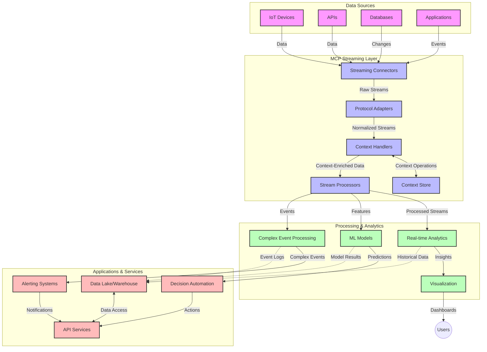

<!--
CO_OP_TRANSLATOR_METADATA:
{
  "original_hash": "68c518dbff8a3b127ed2aa934054c56c",
  "translation_date": "2025-06-11T16:54:05+00:00",
  "source_file": "05-AdvancedTopics/mcp-realtimestreaming/README.md",
  "language_code": "es"
}
-->
# Protocolo de Contexto de Modelo para Transmisión de Datos en Tiempo Real

## Visión General

La transmisión de datos en tiempo real se ha vuelto esencial en el mundo actual impulsado por datos, donde empresas y aplicaciones requieren acceso inmediato a la información para tomar decisiones oportunas. El Protocolo de Contexto de Modelo (MCP) representa un avance significativo en la optimización de estos procesos de transmisión en tiempo real, mejorando la eficiencia del procesamiento de datos, manteniendo la integridad contextual y elevando el rendimiento general del sistema.

Este módulo explora cómo MCP transforma la transmisión de datos en tiempo real al proporcionar un enfoque estandarizado para la gestión del contexto entre modelos de IA, plataformas de transmisión y aplicaciones.

## Introducción a la Transmisión de Datos en Tiempo Real

La transmisión de datos en tiempo real es un paradigma tecnológico que permite la transferencia, procesamiento y análisis continuo de datos a medida que se generan, permitiendo que los sistemas reaccionen inmediatamente a nueva información. A diferencia del procesamiento por lotes tradicional que opera sobre conjuntos de datos estáticos, la transmisión procesa datos en movimiento, entregando insights y acciones con mínima latencia.

### Conceptos Clave de la Transmisión de Datos en Tiempo Real:

- **Flujo Continuo de Datos**: Los datos se procesan como un flujo continuo e interminable de eventos o registros.
- **Procesamiento de Baja Latencia**: Los sistemas están diseñados para minimizar el tiempo entre la generación y el procesamiento de datos.
- **Escalabilidad**: Las arquitecturas de transmisión deben manejar volúmenes y velocidades variables de datos.
- **Tolerancia a Fallos**: Los sistemas deben ser resilientes ante fallos para asegurar un flujo de datos ininterrumpido.
- **Procesamiento con Estado**: Mantener el contexto a través de eventos es crucial para un análisis significativo.

### El Protocolo de Contexto de Modelo y la Transmisión en Tiempo Real

El Protocolo de Contexto de Modelo (MCP) aborda varios desafíos críticos en entornos de transmisión en tiempo real:

1. **Continuidad Contextual**: MCP estandariza cómo se mantiene el contexto entre componentes distribuidos de transmisión, asegurando que los modelos de IA y nodos de procesamiento tengan acceso al contexto histórico y ambiental relevante.

2. **Gestión Eficiente del Estado**: Al proporcionar mecanismos estructurados para la transmisión del contexto, MCP reduce la sobrecarga en la gestión del estado en las canalizaciones de transmisión.

3. **Interoperabilidad**: MCP crea un lenguaje común para compartir contexto entre diversas tecnologías de transmisión y modelos de IA, permitiendo arquitecturas más flexibles y extensibles.

4. **Contexto Optimizado para Streaming**: Las implementaciones de MCP pueden priorizar qué elementos de contexto son más relevantes para la toma de decisiones en tiempo real, optimizando tanto el rendimiento como la precisión.

5. **Procesamiento Adaptativo**: Con una gestión adecuada del contexto a través de MCP, los sistemas de transmisión pueden ajustar dinámicamente el procesamiento basado en condiciones y patrones cambiantes en los datos.

En aplicaciones modernas que van desde redes de sensores IoT hasta plataformas de comercio financiero, la integración de MCP con tecnologías de transmisión permite un procesamiento más inteligente y consciente del contexto que responde adecuadamente a situaciones complejas y cambiantes en tiempo real.

## Objetivos de Aprendizaje

Al finalizar esta lección, podrás:

- Comprender los fundamentos de la transmisión de datos en tiempo real y sus desafíos
- Explicar cómo el Protocolo de Contexto de Modelo (MCP) mejora la transmisión de datos en tiempo real
- Implementar soluciones de transmisión basadas en MCP usando frameworks populares como Kafka y Pulsar
- Diseñar y desplegar arquitecturas de transmisión tolerantes a fallos y de alto rendimiento con MCP
- Aplicar conceptos de MCP en casos de uso de IoT, comercio financiero y análisis impulsado por IA
- Evaluar tendencias emergentes e innovaciones futuras en tecnologías de transmisión basadas en MCP

### Definición y Relevancia

La transmisión de datos en tiempo real implica la generación, procesamiento y entrega continua de datos con mínima latencia. A diferencia del procesamiento por lotes, donde los datos se recopilan y procesan en grupos, los datos en streaming se procesan incrementalmente a medida que llegan, permitiendo insights y acciones inmediatas.

Características clave de la transmisión de datos en tiempo real incluyen:

- **Baja Latencia**: Procesar y analizar datos en milisegundos a segundos
- **Flujo Continuo**: Transmisiones ininterrumpidas de datos desde diversas fuentes
- **Procesamiento Inmediato**: Analizar datos al momento de su llegada en lugar de en lotes
- **Arquitectura Orientada a Eventos**: Responder a eventos conforme ocurren

### Desafíos en la Transmisión de Datos Tradicional

Los enfoques tradicionales de transmisión de datos enfrentan varias limitaciones:

1. **Pérdida de Contexto**: Dificultad para mantener el contexto entre sistemas distribuidos
2. **Problemas de Escalabilidad**: Retos para escalar y manejar datos de alto volumen y velocidad
3. **Complejidad de Integración**: Problemas de interoperabilidad entre diferentes sistemas
4. **Gestión de Latencia**: Equilibrar el rendimiento con el tiempo de procesamiento
5. **Consistencia de Datos**: Asegurar la precisión y completitud de los datos a lo largo del flujo

## Entendiendo el Protocolo de Contexto de Modelo (MCP)

### ¿Qué es MCP?

El Protocolo de Contexto de Modelo (MCP) es un protocolo de comunicación estandarizado diseñado para facilitar la interacción eficiente entre modelos de IA y aplicaciones. En el contexto de la transmisión de datos en tiempo real, MCP proporciona un marco para:

- Preservar el contexto a lo largo de la canalización de datos
- Estandarizar los formatos de intercambio de datos
- Optimizar la transmisión de grandes conjuntos de datos
- Mejorar la comunicación entre modelos y entre modelos y aplicaciones

### Componentes Clave y Arquitectura

La arquitectura MCP para transmisión en tiempo real consta de varios componentes principales:

1. **Manejadores de Contexto**: Gestionan y mantienen la información contextual a lo largo de la canalización de transmisión
2. **Procesadores de Stream**: Procesan flujos de datos entrantes usando técnicas conscientes del contexto
3. **Adaptadores de Protocolo**: Convierten entre diferentes protocolos de transmisión preservando el contexto
4. **Almacenamiento de Contexto**: Guarda y recupera información contextual de manera eficiente
5. **Conectores de Streaming**: Se conectan a diversas plataformas de transmisión (Kafka, Pulsar, Kinesis, etc.)



### Cómo MCP Mejora el Manejo de Datos en Tiempo Real

MCP aborda los desafíos tradicionales de streaming mediante:

- **Integridad Contextual**: Mantener las relaciones entre puntos de datos a lo largo de toda la canalización
- **Transmisión Optimizada**: Reducir redundancias en el intercambio de datos mediante gestión inteligente del contexto
- **Interfaces Estandarizadas**: Proporcionar APIs consistentes para componentes de streaming
- **Reducción de Latencia**: Minimizar la sobrecarga de procesamiento mediante manejo eficiente del contexto
- **Escalabilidad Mejorada**: Soportar escalado horizontal preservando el contexto

## Integración e Implementación

Los sistemas de transmisión de datos en tiempo real requieren un diseño arquitectónico cuidadoso y una implementación que mantenga tanto el rendimiento como la integridad contextual. El Protocolo de Contexto de Modelo ofrece un enfoque estandarizado para integrar modelos de IA y tecnologías de streaming, permitiendo canalizaciones de procesamiento más sofisticadas y conscientes del contexto.

### Visión General de la Integración de MCP en Arquitecturas de Streaming

Implementar MCP en entornos de transmisión en tiempo real implica varias consideraciones clave:

1. **Serialización y Transporte de Contexto**: MCP proporciona mecanismos eficientes para codificar la información contextual dentro de los paquetes de datos de streaming, asegurando que el contexto esencial acompañe los datos a lo largo de la canalización de procesamiento. Esto incluye formatos de serialización estandarizados optimizados para transporte en streaming.

2. **Procesamiento Stateful en Streams**: MCP permite un procesamiento con estado más inteligente al mantener una representación consistente del contexto entre nodos de procesamiento. Esto es especialmente valioso en arquitecturas distribuidas donde la gestión del estado es tradicionalmente compleja.

3. **Tiempo de Evento vs. Tiempo de Procesamiento**: Las implementaciones de MCP en sistemas de streaming deben abordar el desafío común de diferenciar cuándo ocurrieron los eventos y cuándo se procesan. El protocolo puede incorporar contexto temporal que preserve la semántica del tiempo de evento.

4. **Gestión de Backpressure**: Al estandarizar el manejo del contexto, MCP ayuda a gestionar el backpressure en sistemas de streaming, permitiendo que los componentes comuniquen sus capacidades de procesamiento y ajusten el flujo en consecuencia.

5. **Ventanas de Contexto y Agregación**: MCP facilita operaciones de ventana más sofisticadas al proporcionar representaciones estructuradas de contextos temporales y relacionales, permitiendo agregaciones más significativas a través de flujos de eventos.

6. **Procesamiento Exactly-Once**: En sistemas de streaming que requieren semánticas exactly-once, MCP puede incorporar metadatos de procesamiento para ayudar a rastrear y verificar el estado del procesamiento entre componentes distribuidos.

La implementación de MCP en diversas tecnologías de streaming crea un enfoque unificado para la gestión del contexto, reduciendo la necesidad de código de integración personalizado y mejorando la capacidad del sistema para mantener un contexto significativo mientras los datos fluyen a través de la canalización.

### MCP en Diversos Frameworks de Transmisión de Datos

MCP puede integrarse con frameworks populares de streaming, incluyendo:

#### Integración con Apache Kafka

```python
from mcp_streaming import MCPKafkaConnector

# Initialize MCP Kafka connector
connector = MCPKafkaConnector(
    bootstrap_servers='localhost:9092',
    context_preservation=True
)

# Create a context-aware consumer
consumer = connector.create_consumer('input-topic')

# Process streaming data with context
for message in consumer:
    context = message.get_context()
    data = message.get_value()
    
    # Process with context awareness
    result = process_with_context(data, context)
    
    # Produce output with preserved context
    connector.produce('output-topic', result, context=context)
```

#### Implementación en Apache Pulsar

```python
from mcp_streaming import MCPPulsarClient

# Initialize MCP Pulsar client
client = MCPPulsarClient('pulsar://localhost:6650')

# Subscribe with context awareness
consumer = client.subscribe('input-topic', 'subscription-name', 
                           context_enabled=True)

# Process messages with context preservation
while True:
    message = consumer.receive()
    context = message.get_context()
    
    # Process with context
    result = process_with_context(message.data(), context)
    
    # Acknowledge the message
    consumer.acknowledge(message)
    
    # Send result with preserved context
    producer = client.create_producer('output-topic')
    producer.send(result, context=context)
```

### Mejores Prácticas para el Despliegue

Al implementar MCP para transmisión en tiempo real:

1. **Diseñar para Tolerancia a Fallos**:
   - Implementar manejo adecuado de errores
   - Usar colas dead-letter para mensajes fallidos
   - Diseñar procesadores idempotentes

2. **Optimizar para Rendimiento**:
   - Configurar tamaños de búfer apropiados
   - Usar batching cuando sea adecuado
   - Implementar mecanismos de backpressure

3. **Monitorear y Observar**:
   - Rastrear métricas de procesamiento de streams
   - Monitorear la propagación del contexto
   - Configurar alertas para anomalías

4. **Asegurar tus Streams**:
   - Implementar cifrado para datos sensibles
   - Usar autenticación y autorización
   - Aplicar controles de acceso adecuados

### MCP en IoT y Edge Computing

MCP mejora la transmisión en IoT al:

- Preservar el contexto de dispositivos a lo largo de la canalización de procesamiento
- Permitir transmisión eficiente de datos desde el edge hacia la nube
- Soportar análisis en tiempo real de flujos de datos IoT
- Facilitar la comunicación entre dispositivos con contexto

Ejemplo: Redes de Sensores en Ciudades Inteligentes  
```
Sensors → Edge Gateways → MCP Stream Processors → Real-time Analytics → Automated Responses
```

### Rol en Transacciones Financieras y Trading de Alta Frecuencia

MCP ofrece ventajas significativas para la transmisión de datos financieros:

- Procesamiento de ultra baja latencia para decisiones de trading
- Mantener el contexto de transacciones durante todo el procesamiento
- Soportar procesamiento complejo de eventos con conciencia contextual
- Garantizar consistencia de datos en sistemas de trading distribuidos

### Potenciando el Análisis de Datos Impulsado por IA

MCP abre nuevas posibilidades para el análisis en streaming:

- Entrenamiento e inferencia de modelos en tiempo real
- Aprendizaje continuo a partir de datos en streaming
- Extracción de características consciente del contexto
- Pipelines de inferencia multi-modelo con contexto preservado

## Tendencias Futuras e Innovaciones

### Evolución de MCP en Entornos en Tiempo Real

De cara al futuro, anticipamos que MCP evolucionará para abordar:

- **Integración con Computación Cuántica**: Preparación para sistemas de streaming basados en computación cuántica
- **Procesamiento Nativo en Edge**: Llevar más procesamiento consciente del contexto a dispositivos edge
- **Gestión Autónoma de Streams**: Canalizaciones de streaming auto-optimizables
- **Streaming Federado**: Procesamiento distribuido preservando la privacidad

### Avances Potenciales en Tecnología

Tecnologías emergentes que moldearán el futuro del streaming con MCP:

1. **Protocolos de Streaming Optimizados para IA**: Protocolos personalizados diseñados específicamente para cargas de trabajo de IA
2. **Integración con Computación Neuromórfica**: Computación inspirada en el cerebro para procesamiento de streams
3. **Streaming Serverless**: Streaming escalable y orientado a eventos sin gestión de infraestructura
4. **Almacenamientos de Contexto Distribuidos**: Gestión de contexto globalmente distribuida y altamente consistente

## Ejercicios Prácticos

### Ejercicio 1: Configuración de una Canalización Básica de Streaming con MCP

En este ejercicio aprenderás a:  
- Configurar un entorno básico de streaming con MCP  
- Implementar manejadores de contexto para procesamiento de streams  
- Probar y validar la preservación del contexto

### Ejercicio 2: Construcción de un Dashboard de Análisis en Tiempo Real

Crea una aplicación completa que:  
- Ingesta datos en streaming usando MCP  
- Procesa el stream manteniendo el contexto  
- Visualiza resultados en tiempo real

### Ejercicio 3: Implementación de Procesamiento Complejo de Eventos con MCP

Ejercicio avanzado que cubre:  
- Detección de patrones en streams  
- Correlación contextual a través de múltiples streams  
- Generación de eventos complejos con contexto preservado

## Recursos Adicionales

- [Model Context Protocol Specification](https://github.com/microsoft/model-context-protocol) - Especificación oficial y documentación de MCP  
- [Apache Kafka Documentation](https://kafka.apache.org/documentation/) - Aprende sobre Kafka para procesamiento de streams  
- [Apache Pulsar](https://pulsar.apache.org/) - Plataforma unificada de mensajería y streaming  
- [Streaming Systems: The What, Where, When, and How of Large-Scale Data Processing](https://www.oreilly.com/library/view/streaming-systems/9781491983867/) - Libro completo sobre arquitecturas de streaming  
- [Microsoft Azure Event Hubs](https://learn.microsoft.com/en-us/azure/event-hubs/event-hubs-about) - Servicio gestionado de streaming de eventos  
- [MLflow Documentation](https://mlflow.org/docs/latest/index.html) - Para seguimiento y despliegue de modelos ML  
- [Real-Time Analytics with Apache Storm](https://storm.apache.org/releases/current/index.html) - Framework para computación en tiempo real  
- [Flink ML](https://nightlies.apache.org/flink/flink-ml-docs-master/) - Biblioteca de machine learning para Apache Flink  
- [LangChain Documentation](https://python.langchain.com/docs/get_started/introduction) - Construcción de aplicaciones con LLMs

## Resultados de Aprendizaje

Al completar este módulo, serás capaz de:

- Comprender los fundamentos de la transmisión de datos en tiempo real y sus desafíos  
- Explicar cómo el Protocolo de Contexto de Modelo (MCP) mejora la transmisión de datos en tiempo real  
- Implementar soluciones de streaming basadas en MCP usando frameworks populares como Kafka y Pulsar  
- Diseñar y desplegar arquitecturas de streaming tolerantes a fallos y de alto rendimiento con MCP  
- Aplicar conceptos de MCP en casos de uso de IoT, comercio financiero y análisis impulsado por IA  
- Evaluar tendencias emergentes e innovaciones futuras en tecnologías de streaming basadas en MCP

## Qué sigue

- [6. Community Contributions](../../06-CommunityContributions/README.md)

**Aviso legal**:  
Este documento ha sido traducido utilizando el servicio de traducción automática [Co-op Translator](https://github.com/Azure/co-op-translator). Aunque nos esforzamos por la precisión, tenga en cuenta que las traducciones automáticas pueden contener errores o inexactitudes. El documento original en su idioma nativo debe considerarse la fuente autorizada. Para información crítica, se recomienda una traducción profesional realizada por humanos. No nos hacemos responsables de malentendidos o interpretaciones erróneas derivadas del uso de esta traducción.