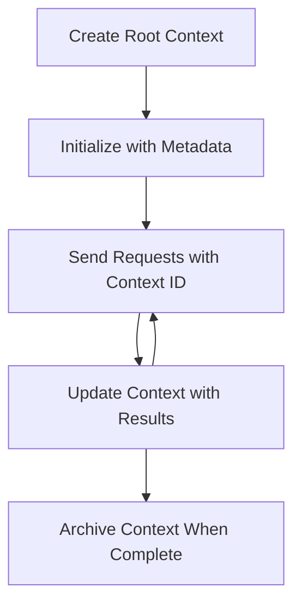

<!--
CO_OP_TRANSLATOR_METADATA:
{
  "original_hash": "ebdb86db46113f1cbd59ce4c74caaa79",
  "translation_date": "2025-07-16T22:05:42+00:00",
  "source_file": "05-AdvancedTopics/mcp-root-contexts/README.md",
  "language_code": "es"
}
-->
# Contextos Raíz de MCP

Los contextos raíz son un concepto fundamental en el Model Context Protocol que proporcionan una capa persistente para mantener el historial de conversación y el estado compartido a lo largo de múltiples solicitudes y sesiones.

## Introducción

En esta lección, exploraremos cómo crear, gestionar y utilizar contextos raíz en MCP.

## Objetivos de Aprendizaje

Al finalizar esta lección, serás capaz de:

- Entender el propósito y la estructura de los contextos raíz
- Crear y gestionar contextos raíz usando las bibliotecas cliente de MCP
- Implementar contextos raíz en aplicaciones .NET, Java, JavaScript y Python
- Utilizar contextos raíz para conversaciones de múltiples turnos y gestión de estado
- Aplicar las mejores prácticas para la gestión de contextos raíz

## Entendiendo los Contextos Raíz

Los contextos raíz funcionan como contenedores que almacenan el historial y el estado de una serie de interacciones relacionadas. Permiten:

- **Persistencia de la Conversación**: Mantener conversaciones coherentes de múltiples turnos
- **Gestión de Memoria**: Almacenar y recuperar información a lo largo de las interacciones
- **Gestión de Estado**: Rastrear el progreso en flujos de trabajo complejos
- **Compartición de Contexto**: Permitir que múltiples clientes accedan al mismo estado de conversación

En MCP, los contextos raíz tienen estas características clave:

- Cada contexto raíz tiene un identificador único.
- Pueden contener historial de conversación, preferencias del usuario y otros metadatos.
- Pueden ser creados, accedidos y archivados según sea necesario.
- Soportan control de acceso y permisos detallados.

## Ciclo de Vida del Contexto Raíz



## Trabajando con Contextos Raíz

Aquí tienes un ejemplo de cómo crear y gestionar contextos raíz.

### Implementación en C#

```csharp
// .NET Example: Root Context Management
using Microsoft.Mcp.Client;
using System;
using System.Threading.Tasks;
using System.Collections.Generic;

public class RootContextExample
{
    private readonly IMcpClient _client;
    private readonly IRootContextManager _contextManager;
    
    public RootContextExample(IMcpClient client, IRootContextManager contextManager)
    {
        _client = client;
        _contextManager = contextManager;
    }
    
    public async Task DemonstrateRootContextAsync()
    {
        // 1. Create a new root context
        var contextResult = await _contextManager.CreateRootContextAsync(new RootContextCreateOptions
        {
            Name = "Customer Support Session",
            Metadata = new Dictionary<string, string>
            {
                ["CustomerName"] = "Acme Corporation",
                ["PriorityLevel"] = "High",
                ["Domain"] = "Cloud Services"
            }
        });
        
        string contextId = contextResult.ContextId;
        Console.WriteLine($"Created root context with ID: {contextId}");
        
        // 2. First interaction using the context
        var response1 = await _client.SendPromptAsync(
            "I'm having issues scaling my web service deployment in the cloud.", 
            new SendPromptOptions { RootContextId = contextId }
        );
        
        Console.WriteLine($"First response: {response1.GeneratedText}");
        
        // Second interaction - the model will have access to the previous conversation
        var response2 = await _client.SendPromptAsync(
            "Yes, we're using containerized deployments with Kubernetes.", 
            new SendPromptOptions { RootContextId = contextId }
        );
        
        Console.WriteLine($"Second response: {response2.GeneratedText}");
        
        // 3. Add metadata to the context based on conversation
        await _contextManager.UpdateContextMetadataAsync(contextId, new Dictionary<string, string>
        {
            ["TechnicalEnvironment"] = "Kubernetes",
            ["IssueType"] = "Scaling"
        });
        
        // 4. Get context information
        var contextInfo = await _contextManager.GetRootContextInfoAsync(contextId);
        
        Console.WriteLine("Context Information:");
        Console.WriteLine($"- Name: {contextInfo.Name}");
        Console.WriteLine($"- Created: {contextInfo.CreatedAt}");
        Console.WriteLine($"- Messages: {contextInfo.MessageCount}");
        
        // 5. When the conversation is complete, archive the context
        await _contextManager.ArchiveRootContextAsync(contextId);
        Console.WriteLine($"Archived context {contextId}");
    }
}
```

En el código anterior hemos:

1. Creado un contexto raíz para una sesión de soporte al cliente.
1. Enviado múltiples mensajes dentro de ese contexto, permitiendo que el modelo mantenga el estado.
1. Actualizado el contexto con metadatos relevantes basados en la conversación.
1. Recuperado información del contexto para entender el historial de la conversación.
1. Archivado el contexto cuando la conversación finalizó.

## Ejemplo: Implementación de Contexto Raíz para análisis financiero

En este ejemplo, crearemos un contexto raíz para una sesión de análisis financiero, demostrando cómo mantener el estado a lo largo de múltiples interacciones.

### Implementación en Java

```java
// Java Example: Root Context Implementation
package com.example.mcp.contexts;

import com.mcp.client.McpClient;
import com.mcp.client.ContextManager;
import com.mcp.models.RootContext;
import com.mcp.models.McpResponse;

import java.util.HashMap;
import java.util.Map;
import java.util.UUID;

public class RootContextsDemo {
    private final McpClient client;
    private final ContextManager contextManager;
    
    public RootContextsDemo(String serverUrl) {
        this.client = new McpClient.Builder()
            .setServerUrl(serverUrl)
            .build();
            
        this.contextManager = new ContextManager(client);
    }
    
    public void demonstrateRootContext() throws Exception {
        // Create context metadata
        Map<String, String> metadata = new HashMap<>();
        metadata.put("projectName", "Financial Analysis");
        metadata.put("userRole", "Financial Analyst");
        metadata.put("dataSource", "Q1 2025 Financial Reports");
        
        // 1. Create a new root context
        RootContext context = contextManager.createRootContext("Financial Analysis Session", metadata);
        String contextId = context.getId();
        
        System.out.println("Created context: " + contextId);
        
        // 2. First interaction
        McpResponse response1 = client.sendPrompt(
            "Analyze the trends in Q1 financial data for our technology division",
            contextId
        );
        
        System.out.println("First response: " + response1.getGeneratedText());
        
        // 3. Update context with important information gained from response
        contextManager.addContextMetadata(contextId, 
            Map.of("identifiedTrend", "Increasing cloud infrastructure costs"));
        
        // Second interaction - using the same context
        McpResponse response2 = client.sendPrompt(
            "What's driving the increase in cloud infrastructure costs?",
            contextId
        );
        
        System.out.println("Second response: " + response2.getGeneratedText());
        
        // 4. Generate a summary of the analysis session
        McpResponse summaryResponse = client.sendPrompt(
            "Summarize our analysis of the technology division financials in 3-5 key points",
            contextId
        );
        
        // Store the summary in context metadata
        contextManager.addContextMetadata(contextId, 
            Map.of("analysisSummary", summaryResponse.getGeneratedText()));
            
        // Get updated context information
        RootContext updatedContext = contextManager.getRootContext(contextId);
        
        System.out.println("Context Information:");
        System.out.println("- Created: " + updatedContext.getCreatedAt());
        System.out.println("- Last Updated: " + updatedContext.getLastUpdatedAt());
        System.out.println("- Analysis Summary: " + 
            updatedContext.getMetadata().get("analysisSummary"));
            
        // 5. Archive context when done
        contextManager.archiveContext(contextId);
        System.out.println("Context archived");
    }
}
```

En el código anterior, hemos:

1. Creado un contexto raíz para una sesión de análisis financiero.
2. Enviado múltiples mensajes dentro de ese contexto, permitiendo que el modelo mantenga el estado.
3. Actualizado el contexto con metadatos relevantes basados en la conversación.
4. Generado un resumen de la sesión de análisis y almacenado en los metadatos del contexto.
5. Archivado el contexto cuando la conversación finalizó.

## Ejemplo: Gestión de Contextos Raíz

Gestionar los contextos raíz de manera efectiva es crucial para mantener el historial y el estado de la conversación. A continuación, un ejemplo de cómo implementar la gestión de contextos raíz.

### Implementación en JavaScript

```javascript
// JavaScript Example: Managing MCP Root Contexts
const { McpClient, RootContextManager } = require('@mcp/client');

class ContextSession {
  constructor(serverUrl, apiKey = null) {
    // Initialize the MCP client
    this.client = new McpClient({
      serverUrl,
      apiKey
    });
    
    // Initialize context manager
    this.contextManager = new RootContextManager(this.client);
  }
  
  /**
   * Create a new conversation context
   * @param {string} sessionName - Name of the conversation session
   * @param {Object} metadata - Additional metadata for the context
   * @returns {Promise<string>} - Context ID
   */
  async createConversationContext(sessionName, metadata = {}) {
    try {
      const contextResult = await this.contextManager.createRootContext({
        name: sessionName,
        metadata: {
          ...metadata,
          createdAt: new Date().toISOString(),
          status: 'active'
        }
      });
      
      console.log(`Created root context '${sessionName}' with ID: ${contextResult.id}`);
      return contextResult.id;
    } catch (error) {
      console.error('Error creating root context:', error);
      throw error;
    }
  }
  
  /**
   * Send a message in an existing context
   * @param {string} contextId - The root context ID
   * @param {string} message - The user's message
   * @param {Object} options - Additional options
   * @returns {Promise<Object>} - Response data
   */
  async sendMessage(contextId, message, options = {}) {
    try {
      // Send the message using the specified context
      const response = await this.client.sendPrompt(message, {
        rootContextId: contextId,
        temperature: options.temperature || 0.7,
        allowedTools: options.allowedTools || []
      });
      
      // Optionally store important insights from the conversation
      if (options.storeInsights) {
        await this.storeConversationInsights(contextId, message, response.generatedText);
      }
      
      return {
        message: response.generatedText,
        toolCalls: response.toolCalls || [],
        contextId
      };
    } catch (error) {
      console.error(`Error sending message in context ${contextId}:`, error);
      throw error;
    }
  }
  
  /**
   * Store important insights from a conversation
   * @param {string} contextId - The root context ID
   * @param {string} userMessage - User's message
   * @param {string} aiResponse - AI's response
   */
  async storeConversationInsights(contextId, userMessage, aiResponse) {
    try {
      // Extract potential insights (in a real app, this would be more sophisticated)
      const combinedText = userMessage + "\n" + aiResponse;
      
      // Simple heuristic to identify potential insights
      const insightWords = ["important", "key point", "remember", "significant", "crucial"];
      
      const potentialInsights = combinedText
        .split(".")
        .filter(sentence => 
          insightWords.some(word => sentence.toLowerCase().includes(word))
        )
        .map(sentence => sentence.trim())
        .filter(sentence => sentence.length > 10);
      
      // Store insights in context metadata
      if (potentialInsights.length > 0) {
        const insights = {};
        potentialInsights.forEach((insight, index) => {
          insights[`insight_${Date.now()}_${index}`] = insight;
        });
        
        await this.contextManager.updateContextMetadata(contextId, insights);
        console.log(`Stored ${potentialInsights.length} insights in context ${contextId}`);
      }
    } catch (error) {
      console.warn('Error storing conversation insights:', error);
      // Non-critical error, so just log warning
    }
  }
  
  /**
   * Get summary information about a context
   * @param {string} contextId - The root context ID
   * @returns {Promise<Object>} - Context information
   */
  async getContextInfo(contextId) {
    try {
      const contextInfo = await this.contextManager.getContextInfo(contextId);
      
      return {
        id: contextInfo.id,
        name: contextInfo.name,
        created: new Date(contextInfo.createdAt).toLocaleString(),
        lastUpdated: new Date(contextInfo.lastUpdatedAt).toLocaleString(),
        messageCount: contextInfo.messageCount,
        metadata: contextInfo.metadata,
        status: contextInfo.status
      };
    } catch (error) {
      console.error(`Error getting context info for ${contextId}:`, error);
      throw error;
    }
  }
  
  /**
   * Generate a summary of the conversation in a context
   * @param {string} contextId - The root context ID
   * @returns {Promise<string>} - Generated summary
   */
  async generateContextSummary(contextId) {
    try {
      // Ask the model to generate a summary of the conversation so far
      const response = await this.client.sendPrompt(
        "Please summarize our conversation so far in 3-4 sentences, highlighting the main points discussed.",
        { rootContextId: contextId, temperature: 0.3 }
      );
      
      // Store the summary in context metadata
      await this.contextManager.updateContextMetadata(contextId, {
        conversationSummary: response.generatedText,
        summarizedAt: new Date().toISOString()
      });
      
      return response.generatedText;
    } catch (error) {
      console.error(`Error generating context summary for ${contextId}:`, error);
      throw error;
    }
  }
  
  /**
   * Archive a context when it's no longer needed
   * @param {string} contextId - The root context ID
   * @returns {Promise<Object>} - Result of the archive operation
   */
  async archiveContext(contextId) {
    try {
      // Generate a final summary before archiving
      const summary = await this.generateContextSummary(contextId);
      
      // Archive the context
      await this.contextManager.archiveContext(contextId);
      
      return {
        status: "archived",
        contextId,
        summary
      };
    } catch (error) {
      console.error(`Error archiving context ${contextId}:`, error);
      throw error;
    }
  }
}

// Example usage
async function demonstrateContextSession() {
  const session = new ContextSession('https://mcp-server-example.com');
  
  try {
    // 1. Create a new context for a product support conversation
    const contextId = await session.createConversationContext(
      'Product Support - Database Performance',
      {
        customer: 'Globex Corporation',
        product: 'Enterprise Database',
        severity: 'Medium',
        supportAgent: 'AI Assistant'
      }
    );
    
    // 2. First message in the conversation
    const response1 = await session.sendMessage(
      contextId,
      "I'm experiencing slow query performance on our database cluster after the latest update.",
      { storeInsights: true }
    );
    console.log('Response 1:', response1.message);
    
    // Follow-up message in the same context
    const response2 = await session.sendMessage(
      contextId,
      "Yes, we've already checked the indexes and they seem to be properly configured.",
      { storeInsights: true }
    );
    console.log('Response 2:', response2.message);
    
    // 3. Get information about the context
    const contextInfo = await session.getContextInfo(contextId);
    console.log('Context Information:', contextInfo);
    
    // 4. Generate and display conversation summary
    const summary = await session.generateContextSummary(contextId);
    console.log('Conversation Summary:', summary);
    
    // 5. Archive the context when done
    const archiveResult = await session.archiveContext(contextId);
    console.log('Archive Result:', archiveResult);
    
    // 6. Handle any errors gracefully
  } catch (error) {
    console.error('Error in context session demonstration:', error);
  }
}

demonstrateContextSession();
```

En el código anterior hemos:

1. Creado un contexto raíz para una conversación de soporte de producto con la función `createConversationContext`. En este caso, el contexto trata sobre problemas de rendimiento en bases de datos.

1. Enviado múltiples mensajes dentro de ese contexto, permitiendo que el modelo mantenga el estado con la función `sendMessage`. Los mensajes enviados tratan sobre lentitud en consultas y configuración de índices.

1. Actualizado el contexto con metadatos relevantes basados en la conversación.

1. Generado un resumen de la conversación y almacenado en los metadatos del contexto con la función `generateContextSummary`.

1. Archivado el contexto cuando la conversación finalizó con la función `archiveContext`.

1. Manejado errores de forma adecuada para asegurar la robustez.

## Contexto Raíz para Asistencia de Múltiples Turnos

En este ejemplo, crearemos un contexto raíz para una sesión de asistencia de múltiples turnos, demostrando cómo mantener el estado a lo largo de varias interacciones.

### Implementación en Python

```python
# Python Example: Root Context for Multi-Turn Assistance
import asyncio
from datetime import datetime
from mcp_client import McpClient, RootContextManager

class AssistantSession:
    def __init__(self, server_url, api_key=None):
        self.client = McpClient(server_url=server_url, api_key=api_key)
        self.context_manager = RootContextManager(self.client)
    
    async def create_session(self, name, user_info=None):
        """Create a new root context for an assistant session"""
        metadata = {
            "session_type": "assistant",
            "created_at": datetime.now().isoformat(),
        }
        
        # Add user information if provided
        if user_info:
            metadata.update({f"user_{k}": v for k, v in user_info.items()})
            
        # Create the root context
        context = await self.context_manager.create_root_context(name, metadata)
        return context.id
    
    async def send_message(self, context_id, message, tools=None):
        """Send a message within a root context"""
        # Create options with context ID
        options = {
            "root_context_id": context_id
        }
        
        # Add tools if specified
        if tools:
            options["allowed_tools"] = tools
        
        # Send the prompt within the context
        response = await self.client.send_prompt(message, options)
        
        # Update context metadata with conversation progress
        await self.context_manager.update_context_metadata(
            context_id,
            {
                f"message_{datetime.now().timestamp()}": message[:50] + "...",
                "last_interaction": datetime.now().isoformat()
            }
        )
        
        return response
    
    async def get_conversation_history(self, context_id):
        """Retrieve conversation history from a context"""
        context_info = await self.context_manager.get_context_info(context_id)
        messages = await self.client.get_context_messages(context_id)
        
        return {
            "context_info": context_info,
            "messages": messages
        }
    
    async def end_session(self, context_id):
        """End an assistant session by archiving the context"""
        # Generate a summary prompt first
        summary_response = await self.client.send_prompt(
            "Please summarize our conversation and any key points or decisions made.",
            {"root_context_id": context_id}
        )
        
        # Store summary in metadata
        await self.context_manager.update_context_metadata(
            context_id,
            {
                "summary": summary_response.generated_text,
                "ended_at": datetime.now().isoformat(),
                "status": "completed"
            }
        )
        
        # Archive the context
        await self.context_manager.archive_context(context_id)
        
        return {
            "status": "completed",
            "summary": summary_response.generated_text
        }

# Example usage
async def demo_assistant_session():
    assistant = AssistantSession("https://mcp-server-example.com")
    
    # 1. Create session
    context_id = await assistant.create_session(
        "Technical Support Session",
        {"name": "Alex", "technical_level": "advanced", "product": "Cloud Services"}
    )
    print(f"Created session with context ID: {context_id}")
    
    # 2. First interaction
    response1 = await assistant.send_message(
        context_id, 
        "I'm having trouble with the auto-scaling feature in your cloud platform.",
        ["documentation_search", "diagnostic_tool"]
    )
    print(f"Response 1: {response1.generated_text}")
    
    # Second interaction in the same context
    response2 = await assistant.send_message(
        context_id,
        "Yes, I've already checked the configuration settings you mentioned, but it's still not working."
    )
    print(f"Response 2: {response2.generated_text}")
    
    # 3. Get history
    history = await assistant.get_conversation_history(context_id)
    print(f"Session has {len(history['messages'])} messages")
    
    # 4. End session
    end_result = await assistant.end_session(context_id)
    print(f"Session ended with summary: {end_result['summary']}")

if __name__ == "__main__":
    asyncio.run(demo_assistant_session())
```

En el código anterior hemos:

1. Creado un contexto raíz para una sesión de soporte técnico con la función `create_session`. El contexto incluye información del usuario como nombre y nivel técnico.

1. Enviado múltiples mensajes dentro de ese contexto, permitiendo que el modelo mantenga el estado con la función `send_message`. Los mensajes enviados tratan sobre problemas con la función de autoescalado.

1. Recuperado el historial de conversación usando la función `get_conversation_history`, que proporciona información del contexto y mensajes.

1. Finalizado la sesión archivando el contexto y generando un resumen con la función `end_session`. El resumen captura los puntos clave de la conversación.

## Mejores Prácticas para Contextos Raíz

Aquí algunas mejores prácticas para gestionar contextos raíz de forma efectiva:

- **Crear Contextos Enfocados**: Crea contextos raíz separados para diferentes propósitos o dominios de conversación para mantener claridad.

- **Establecer Políticas de Expiración**: Implementa políticas para archivar o eliminar contextos antiguos para gestionar almacenamiento y cumplir con políticas de retención de datos.

- **Almacenar Metadatos Relevantes**: Usa los metadatos del contexto para guardar información importante sobre la conversación que pueda ser útil más adelante.

- **Usar IDs de Contexto Consistentemente**: Una vez creado un contexto, usa su ID de forma consistente para todas las solicitudes relacionadas para mantener la continuidad.

- **Generar Resúmenes**: Cuando un contexto crece mucho, considera generar resúmenes para capturar la información esencial mientras gestionas el tamaño del contexto.

- **Implementar Control de Acceso**: Para sistemas multiusuario, implementa controles de acceso adecuados para garantizar la privacidad y seguridad de los contextos de conversación.

- **Manejar Limitaciones del Contexto**: Ten en cuenta las limitaciones de tamaño del contexto e implementa estrategias para manejar conversaciones muy largas.

- **Archivar Cuando se Complete**: Archiva los contextos cuando las conversaciones finalicen para liberar recursos preservando el historial de la conversación.

## Qué sigue

- [5.5 Routing](../mcp-routing/README.md)

**Aviso legal**:  
Este documento ha sido traducido utilizando el servicio de traducción automática [Co-op Translator](https://github.com/Azure/co-op-translator). Aunque nos esforzamos por la precisión, tenga en cuenta que las traducciones automáticas pueden contener errores o inexactitudes. El documento original en su idioma nativo debe considerarse la fuente autorizada. Para información crítica, se recomienda la traducción profesional realizada por humanos. No nos hacemos responsables de malentendidos o interpretaciones erróneas derivadas del uso de esta traducción.