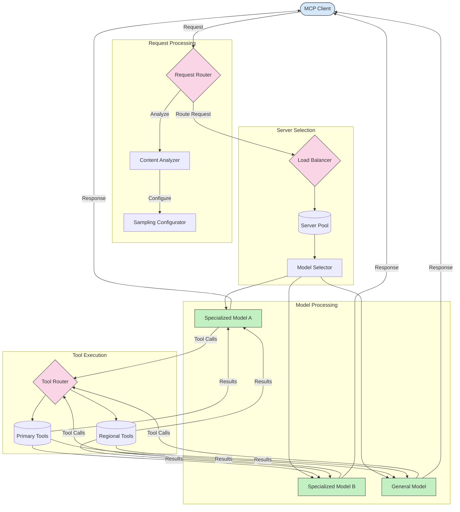

<!--
CO_OP_TRANSLATOR_METADATA:
{
  "original_hash": "a621fc52c7daec552eb8b3b48c0361dd",
  "translation_date": "2025-06-02T19:41:23+00:00",
  "source_file": "05-AdvancedTopics/mcp-routing/README.md",
  "language_code": "es"
}
-->
## Arquitectura de Muestreo y Enrutamiento en MCP

El muestreo es un componente crítico del Protocolo de Contexto de Modelo (MCP) que permite un procesamiento y enrutamiento eficiente de las solicitudes. Consiste en analizar las solicitudes entrantes para determinar el modelo o servicio más adecuado para manejarlas, basándose en diversos criterios como el tipo de contenido, el contexto del usuario y la carga del sistema.

El muestreo y el enrutamiento pueden combinarse para crear una arquitectura robusta que optimice la utilización de recursos y garantice alta disponibilidad. El proceso de muestreo puede usarse para clasificar las solicitudes, mientras que el enrutamiento las dirige a los modelos o servicios correspondientes.

El diagrama a continuación ilustra cómo el muestreo y el enrutamiento trabajan juntos en una arquitectura integral de MCP:

## Qué sigue

- [Muestreo](../mcp-sampling/README.md)

**Descargo de responsabilidad**:  
Este documento ha sido traducido utilizando el servicio de traducción automática [Co-op Translator](https://github.com/Azure/co-op-translator). Aunque nos esforzamos por la precisión, tenga en cuenta que las traducciones automáticas pueden contener errores o inexactitudes. El documento original en su idioma nativo debe considerarse la fuente autorizada. Para información crítica, se recomienda una traducción profesional realizada por humanos. No nos hacemos responsables de malentendidos o interpretaciones erróneas derivadas del uso de esta traducción.