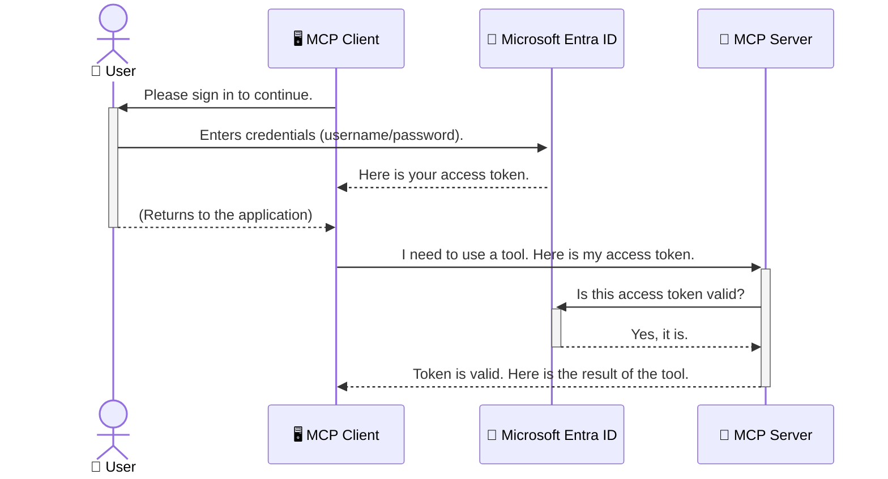

<!--
CO_OP_TRANSLATOR_METADATA:
{
  "original_hash": "6e562d7e5a77c8982da4aa8f762ad1d8",
  "translation_date": "2025-07-02T08:49:48+00:00",
  "source_file": "05-AdvancedTopics/mcp-security-entra/README.md",
  "language_code": "es"
}
-->
# Asegurando los Flujos de Trabajo de IA: Autenticación Entra ID para Servidores Model Context Protocol

## Introducción
Proteger tu servidor Model Context Protocol (MCP) es tan importante como cerrar con llave la puerta de tu casa. Dejar tu servidor MCP abierto expone tus herramientas y datos a accesos no autorizados, lo que puede derivar en brechas de seguridad. Microsoft Entra ID ofrece una solución robusta en la nube para la gestión de identidades y accesos, ayudando a garantizar que solo los usuarios y aplicaciones autorizados puedan interactuar con tu servidor MCP. En esta sección, aprenderás cómo proteger tus flujos de trabajo de IA usando la autenticación de Entra ID.

## Objetivos de Aprendizaje
Al finalizar esta sección, podrás:

- Comprender la importancia de asegurar los servidores MCP.
- Explicar los conceptos básicos de Microsoft Entra ID y la autenticación OAuth 2.0.
- Reconocer la diferencia entre clientes públicos y confidenciales.
- Implementar la autenticación Entra ID en escenarios de servidores MCP locales (cliente público) y remotos (cliente confidencial).
- Aplicar las mejores prácticas de seguridad al desarrollar flujos de trabajo de IA.

## Seguridad y MCP

Así como no dejarías la puerta de tu casa sin llave, no deberías dejar tu servidor MCP abierto para que cualquiera pueda acceder. Asegurar tus flujos de trabajo de IA es esencial para construir aplicaciones robustas, confiables y seguras. Este capítulo te introducirá al uso de Microsoft Entra ID para proteger tus servidores MCP, asegurando que solo usuarios y aplicaciones autorizados puedan interactuar con tus herramientas y datos.

## Por Qué la Seguridad es Importante para los Servidores MCP

Imagina que tu servidor MCP tiene una herramienta que puede enviar correos electrónicos o acceder a una base de datos de clientes. Un servidor sin seguridad permitiría que cualquiera use esa herramienta, lo que podría derivar en acceso no autorizado a datos, spam u otras actividades maliciosas.

Al implementar autenticación, te aseguras de que cada solicitud a tu servidor sea verificada, confirmando la identidad del usuario o aplicación que realiza la petición. Este es el primer y más crítico paso para asegurar tus flujos de trabajo de IA.

## Introducción a Microsoft Entra ID

[**Microsoft Entra ID**](https://adoption.microsoft.com/microsoft-security/entra/) es un servicio en la nube para la gestión de identidades y accesos. Piénsalo como un guardia de seguridad universal para tus aplicaciones. Se encarga del complejo proceso de verificar identidades de usuario (autenticación) y determinar qué acciones pueden realizar (autorización).

Al usar Entra ID, puedes:

- Permitir un inicio de sesión seguro para los usuarios.
- Proteger APIs y servicios.
- Gestionar políticas de acceso desde un único lugar.

Para los servidores MCP, Entra ID ofrece una solución robusta y ampliamente confiable para controlar quién puede acceder a las capacidades de tu servidor.

---

## Entendiendo la Magia: Cómo Funciona la Autenticación Entra ID

Entra ID utiliza estándares abiertos como **OAuth 2.0** para manejar la autenticación. Aunque los detalles pueden ser complejos, el concepto principal es sencillo y puede entenderse con una analogía.

### Una Introducción Sencilla a OAuth 2.0: La Llave de Valet

Piensa en OAuth 2.0 como un servicio de valet para tu coche. Cuando llegas a un restaurante, no le das al valet la llave maestra. En cambio, le das una **llave de valet** que tiene permisos limitados: puede arrancar el coche y cerrar las puertas, pero no puede abrir el maletero ni la guantera.

En esta analogía:

- **Tú** eres el **Usuario**.
- **Tu coche** es el **Servidor MCP** con sus herramientas y datos valiosos.
- El **Valet** es **Microsoft Entra ID**.
- El **Encargado del Estacionamiento** es el **Cliente MCP** (la aplicación que intenta acceder al servidor).
- La **Llave de Valet** es el **Token de Acceso**.

El token de acceso es una cadena segura de texto que el cliente MCP recibe de Entra ID después de que inicias sesión. El cliente presenta este token al servidor MCP en cada solicitud. El servidor puede verificar el token para asegurar que la petición es legítima y que el cliente tiene los permisos necesarios, todo sin tener que manejar tus credenciales reales (como tu contraseña).

### El Flujo de Autenticación

Así es como funciona el proceso en la práctica:



### Presentando la Microsoft Authentication Library (MSAL)

Antes de entrar en el código, es importante presentar un componente clave que verás en los ejemplos: la **Microsoft Authentication Library (MSAL)**.

MSAL es una biblioteca desarrollada por Microsoft que facilita mucho a los desarrolladores manejar la autenticación. En lugar de que tú escribas todo el código complejo para manejar tokens de seguridad, gestionar inicios de sesión y refrescar sesiones, MSAL se encarga de esa carga.

Se recomienda usar una biblioteca como MSAL porque:

- **Es segura:** Implementa protocolos estándar de la industria y mejores prácticas de seguridad, reduciendo el riesgo de vulnerabilidades en tu código.
- **Simplifica el desarrollo:** Abstrae la complejidad de los protocolos OAuth 2.0 y OpenID Connect, permitiéndote añadir autenticación robusta a tu aplicación con pocas líneas de código.
- **Está mantenida:** Microsoft mantiene y actualiza activamente MSAL para abordar nuevas amenazas de seguridad y cambios en las plataformas.

MSAL soporta una gran variedad de lenguajes y frameworks, incluyendo .NET, JavaScript/TypeScript, Python, Java, Go y plataformas móviles como iOS y Android. Esto significa que puedes usar patrones de autenticación consistentes en toda tu pila tecnológica.

Para aprender más sobre MSAL, puedes consultar la documentación oficial [MSAL overview documentation](https://learn.microsoft.com/entra/identity-platform/msal-overview).

---

## Asegurando Tu Servidor MCP con Entra ID: Guía Paso a Paso

Ahora, veamos cómo asegurar un servidor MCP local (uno que se comunica a través de `stdio`) using Entra ID. This example uses a **public client**, which is suitable for applications running on a user's machine, like a desktop app or a local development server.

### Scenario 1: Securing a Local MCP Server (with a Public Client)

In this scenario, we'll look at an MCP server that runs locally, communicates over `stdio`, and uses Entra ID to authenticate the user before allowing access to its tools. The server will have a single tool that fetches the user's profile information from the Microsoft Graph API.

#### 1. Setting Up the Application in Entra ID

Before writing any code, you need to register your application in Microsoft Entra ID. This tells Entra ID about your application and grants it permission to use the authentication service.

1. Navigate to the **[Microsoft Entra portal](https://entra.microsoft.com/)**.
2. Go to **App registrations** and click **New registration**.
3. Give your application a name (e.g., "My Local MCP Server").
4. For **Supported account types**, select **Accounts in this organizational directory only**.
5. You can leave the **Redirect URI** blank for this example.
6. Click **Register**.

Once registered, take note of the **Application (client) ID** and **Directory (tenant) ID**. You'll need these in your code.

#### 2. The Code: A Breakdown

Let's look at the key parts of the code that handle authentication. The full code for this example is available in the [Entra ID - Local - WAM](https://github.com/Azure-Samples/mcp-auth-servers/tree/main/src/entra-id-local-wam) folder of the [mcp-auth-servers GitHub repository](https://github.com/Azure-Samples/mcp-auth-servers).

**`AuthenticationService.cs`**

This class is responsible for handling the interaction with Entra ID.

- **`CreateAsync`**: This method initializes the `PublicClientApplication` from the MSAL (Microsoft Authentication Library). It's configured with your application's `clientId` and `tenantId`.
- **`WithBroker`**: This enables the use of a broker (like the Windows Web Account Manager), which provides a more secure and seamless single sign-on experience.
- **`AcquireTokenAsync`**: Este es el método principal. Primero intenta obtener un token en silencio (lo que significa que el usuario no tendrá que iniciar sesión nuevamente si ya tiene una sesión válida). Si no puede obtener un token en silencio, solicitará al usuario que inicie sesión de forma interactiva.

```csharp
// Simplified for clarity
public static async Task<AuthenticationService> CreateAsync(ILogger<AuthenticationService> logger)
{
    var msalClient = PublicClientApplicationBuilder
        .Create(_clientId) // Your Application (client) ID
        .WithAuthority(AadAuthorityAudience.AzureAdMyOrg)
        .WithTenantId(_tenantId) // Your Directory (tenant) ID
        .WithBroker(new BrokerOptions(BrokerOptions.OperatingSystems.Windows))
        .Build();

    // ... cache registration ...

    return new AuthenticationService(logger, msalClient);
}

public async Task<string> AcquireTokenAsync()
{
    try
    {
        // Try silent authentication first
        var accounts = await _msalClient.GetAccountsAsync();
        var account = accounts.FirstOrDefault();

        AuthenticationResult? result = null;

        if (account != null)
        {
            result = await _msalClient.AcquireTokenSilent(_scopes, account).ExecuteAsync();
        }
        else
        {
            // If no account, or silent fails, go interactive
            result = await _msalClient.AcquireTokenInteractive(_scopes).ExecuteAsync();
        }

        return result.AccessToken;
    }
    catch (Exception ex)
    {
        _logger.LogError(ex, "An error occurred while acquiring the token.");
        throw; // Optionally rethrow the exception for higher-level handling
    }
}
```

**`Program.cs`**

This is where the MCP server is set up and the authentication service is integrated.

- **`AddSingleton<AuthenticationService>`**: This registers the `AuthenticationService` with the dependency injection container, so it can be used by other parts of the application (like our tool).
- **`GetUserDetailsFromGraph` tool**: This tool requires an instance of `AuthenticationService`. Before it does anything, it calls `authService.AcquireTokenAsync()` para obtener un token de acceso válido. Si la autenticación es exitosa, usa el token para llamar a la API de Microsoft Graph y obtener los detalles del usuario.

```csharp
// Simplified for clarity
[McpServerTool(Name = "GetUserDetailsFromGraph")]
public static async Task<string> GetUserDetailsFromGraph(
    AuthenticationService authService)
{
    try
    {
        // This will trigger the authentication flow
        var accessToken = await authService.AcquireTokenAsync();

        // Use the token to create a GraphServiceClient
        var graphClient = new GraphServiceClient(
            new BaseBearerTokenAuthenticationProvider(new TokenProvider(authService)));

        var user = await graphClient.Me.GetAsync();

        return System.Text.Json.JsonSerializer.Serialize(user);
    }
    catch (Exception ex)
    {
        return $"Error: {ex.Message}";
    }
}
```

#### 3. Cómo Funciona Todo Junto

1. Cuando el cliente MCP intenta usar la herramienta `GetUserDetailsFromGraph` tool, the tool first calls `AcquireTokenAsync`.
2. `AcquireTokenAsync` triggers the MSAL library to check for a valid token.
3. If no token is found, MSAL, through the broker, will prompt the user to sign in with their Entra ID account.
4. Once the user signs in, Entra ID issues an access token.
5. The tool receives the token and uses it to make a secure call to the Microsoft Graph API.
6. The user's details are returned to the MCP client.

This process ensures that only authenticated users can use the tool, effectively securing your local MCP server.

### Scenario 2: Securing a Remote MCP Server (with a Confidential Client)

When your MCP server is running on a remote machine (like a cloud server) and communicates over a protocol like HTTP Streaming, the security requirements are different. In this case, you should use a **confidential client** and the **Authorization Code Flow**. This is a more secure method because the application's secrets are never exposed to the browser.

This example uses a TypeScript-based MCP server that uses Express.js to handle HTTP requests.

#### 1. Setting Up the Application in Entra ID

The setup in Entra ID is similar to the public client, but with one key difference: you need to create a **client secret**.

1. Navigate to the **[Microsoft Entra portal](https://entra.microsoft.com/)**.
2. In your app registration, go to the **Certificates & secrets** tab.
3. Click **New client secret**, give it a description, and click **Add**.
4. **Important:** Copy the secret value immediately. You will not be able to see it again.
5. You also need to configure a **Redirect URI**. Go to the **Authentication** tab, click **Add a platform**, select **Web**, and enter the redirect URI for your application (e.g., `http://localhost:3001/auth/callback`).

> **⚠️ Important Security Note:** For production applications, Microsoft strongly recommends using **secretless authentication** methods such as **Managed Identity** or **Workload Identity Federation** instead of client secrets. Client secrets pose security risks as they can be exposed or compromised. Managed identities provide a more secure approach by eliminating the need to store credentials in your code or configuration.
>
> For more information about managed identities and how to implement them, see the [Managed identities for Azure resources overview](https://learn.microsoft.com/entra/identity/managed-identities-azure-resources/overview).

#### 2. The Code: A Breakdown

This example uses a session-based approach. When the user authenticates, the server stores the access token and refresh token in a session and gives the user a session token. This session token is then used for subsequent requests. The full code for this example is available in the [Entra ID - Confidential client](https://github.com/Azure-Samples/mcp-auth-servers/tree/main/src/entra-id-cca-session) folder of the [mcp-auth-servers GitHub repository](https://github.com/Azure-Samples/mcp-auth-servers).

**`Server.ts`**

This file sets up the Express server and the MCP transport layer.

- **`requireBearerAuth`**: This is middleware that protects the `/sse` and `/message` endpoints. It checks for a valid bearer token in the `Authorization` header of the request.
- **`EntraIdServerAuthProvider`**: This is a custom class that implements the `McpServerAuthorizationProvider` interface. It's responsible for handling the OAuth 2.0 flow.
- **`/auth/callback`**: Este endpoint maneja la redirección desde Entra ID después de que el usuario se ha autenticado. Cambia el código de autorización por un token de acceso y un token de actualización.

```typescript
// Simplified for clarity
const app = express();
const { server } = createServer();
const provider = new EntraIdServerAuthProvider();

// Protect the SSE endpoint
app.get("/sse", requireBearerAuth({
  provider,
  requiredScopes: ["User.Read"]
}), async (req, res) => {
  // ... connect to the transport ...
});

// Protect the message endpoint
app.post("/message", requireBearerAuth({
  provider,
  requiredScopes: ["User.Read"]
}), async (req, res) => {
  // ... handle the message ...
});

// Handle the OAuth 2.0 callback
app.get("/auth/callback", (req, res) => {
  provider.handleCallback(req.query.code, req.query.state)
    .then(result => {
      // ... handle success or failure ...
    });
});
```

La herramienta **`Tools.ts`**

This file defines the tools that the MCP server provides. The `getUserDetails` es similar a la del ejemplo anterior, pero obtiene el token de acceso desde la sesión.

```typescript
// Simplified for clarity
server.setRequestHandler(CallToolRequestSchema, async (request) => {
  const { name } = request.params;
  const context = request.params?.context as { token?: string } | undefined;
  const sessionToken = context?.token;

  if (name === ToolName.GET_USER_DETAILS) {
    if (!sessionToken) {
      throw new AuthenticationError("Authentication token is missing or invalid. Ensure the token is provided in the request context.");
    }

    // Get the Entra ID token from the session store
    const tokenData = tokenStore.getToken(sessionToken);
    const entraIdToken = tokenData.accessToken;

    const graphClient = Client.init({
      authProvider: (done) => {
        done(null, entraIdToken);
      }
    });

    const user = await graphClient.api('/me').get();

    // ... return user details ...
  }
});
```

Cuando la herramienta **`auth/EntraIdServerAuthProvider.ts`**

This class handles the logic for:

- Redirecting the user to the Entra ID sign-in page.
- Exchanging the authorization code for an access token.
- Storing the tokens in the `tokenStore`.
- Refreshing the access token when it expires.

#### 3. How It All Works Together

1. When a user first tries to connect to the MCP server, the `requireBearerAuth` middleware will see that they don't have a valid session and will redirect them to the Entra ID sign-in page.
2. The user signs in with their Entra ID account.
3. Entra ID redirects the user back to the `/auth/callback` endpoint with an authorization code.
4. The server exchanges the code for an access token and a refresh token, stores them, and creates a session token which is sent to the client.
5. The client can now use this session token in the `Authorization` header for all future requests to the MCP server.
6. When the `getUserDetails` es llamada, usa el token de sesión para buscar el token de acceso de Entra ID y luego lo usa para llamar a la API de Microsoft Graph.

Este flujo es más complejo que el del cliente público, pero es necesario para endpoints accesibles desde internet. Dado que los servidores MCP remotos son accesibles públicamente, requieren medidas de seguridad más fuertes para protegerse contra accesos no autorizados y posibles ataques.

## Mejores Prácticas de Seguridad

- **Usa siempre HTTPS**: Encripta la comunicación entre cliente y servidor para proteger los tokens de ser interceptados.
- **Implementa Control de Acceso Basado en Roles (RBAC)**: No solo verifiques *si* un usuario está autenticado; verifica *qué* está autorizado a hacer. Puedes definir roles en Entra ID y validarlos en tu servidor MCP.
- **Monitorea y audita**: Registra todos los eventos de autenticación para detectar y responder a actividades sospechosas.
- **Maneja limitaciones de tasa y throttling**: Microsoft Graph y otras APIs implementan limitaciones para evitar abusos. Implementa retroceso exponencial y lógica de reintentos en tu servidor MCP para manejar de forma adecuada respuestas HTTP 429 (Demasiadas solicitudes). Considera almacenar en caché datos frecuentemente accedidos para reducir llamadas a la API.
- **Almacenamiento seguro de tokens**: Guarda los tokens de acceso y actualización de forma segura. Para aplicaciones locales, usa los mecanismos seguros del sistema. Para aplicaciones servidor, considera almacenamiento cifrado o servicios de gestión de claves seguras como Azure Key Vault.
- **Manejo de expiración de tokens**: Los tokens de acceso tienen una vida limitada. Implementa la renovación automática usando tokens de actualización para mantener una experiencia de usuario fluida sin necesidad de re-autenticación.
- **Considera usar Azure API Management**: Aunque implementar seguridad directamente en tu servidor MCP te da control detallado, los gateways de API como Azure API Management pueden manejar muchas de estas preocupaciones automáticamente, incluyendo autenticación, autorización, limitación de tasa y monitoreo. Proveen una capa centralizada de seguridad entre tus clientes y servidores MCP. Para más detalles sobre el uso de gateways con MCP, consulta nuestro [Azure API Management Your Auth Gateway For MCP Servers](https://techcommunity.microsoft.com/blog/integrationsonazureblog/azure-api-management-your-auth-gateway-for-mcp-servers/4402690).

## Puntos Clave

- Asegurar tu servidor MCP es fundamental para proteger tus datos y herramientas.
- Microsoft Entra ID ofrece una solución robusta y escalable para autenticación y autorización.
- Usa un **cliente público** para aplicaciones locales y un **cliente confidencial** para servidores remotos.
- El **Authorization Code Flow** es la opción más segura para aplicaciones web.

## Ejercicio

1. Piensa en un servidor MCP que podrías construir. ¿Sería un servidor local o remoto?
2. Según tu respuesta, ¿usarías un cliente público o confidencial?
3. ¿Qué permisos solicitaría tu servidor MCP para realizar acciones contra Microsoft Graph?

## Ejercicios Prácticos

### Ejercicio 1: Registrar una Aplicación en Entra ID
Accede al portal de Microsoft Entra.  
Registra una nueva aplicación para tu servidor MCP.  
Anota el ID de Aplicación (cliente) y el ID de Directorio (tenant).

### Ejercicio 2: Asegurar un Servidor MCP Local (Cliente Público)
- Sigue el ejemplo de código para integrar MSAL (Microsoft Authentication Library) para la autenticación de usuarios.
- Prueba el flujo de autenticación llamando a la herramienta MCP que obtiene detalles del usuario desde Microsoft Graph.

### Ejercicio 3: Asegurar un Servidor MCP Remoto (Cliente Confidencial)
- Registra un cliente confidencial en Entra ID y crea un secreto de cliente.
- Configura tu servidor MCP Express.js para usar el Authorization Code Flow.
- Prueba los endpoints protegidos y confirma el acceso basado en tokens.

### Ejercicio 4: Aplicar Mejores Prácticas de Seguridad
- Habilita HTTPS para tu servidor local o remoto.
- Implementa control de acceso basado en roles (RBAC) en la lógica de tu servidor.
- Añade manejo de expiración de tokens y almacenamiento seguro de tokens.

## Recursos

1. **Documentación general de MSAL**  
   Aprende cómo la Microsoft Authentication Library (MSAL) permite la adquisición segura de tokens en múltiples plataformas:  
   [MSAL Overview on Microsoft Learn](https://learn.microsoft.com/en-gb/entra/msal/overview)

2. **Repositorio GitHub Azure-Samples/mcp-auth-servers**  
   Implementaciones de referencia de servidores MCP que demuestran flujos de autenticación:  
   [Azure-Samples/mcp-auth-servers on GitHub](https://github.com/Azure-Samples/mcp-auth-servers)

3. **Resumen de Identidades Administradas para Recursos de Azure**  
   Entiende cómo eliminar secretos usando identidades administradas asignadas por sistema o usuario:  
   [Managed Identities Overview on Microsoft Learn](https://learn.microsoft.com/en-us/entra/identity/managed-identities-azure-resources/)

4. **Azure API Management: Tu Gateway de Autenticación para Servidores MCP**  
   Análisis profundo sobre el uso de APIM como gateway OAuth2 seguro para servidores MCP:  
   [Azure API Management Your Auth Gateway For MCP Servers](https://techcommunity.microsoft.com/blog/integrationsonazureblog/azure-api-management-your-auth-gateway-for-mcp-servers/4402690)

5. **Referencia de Permisos de Microsoft Graph**  
   Lista completa de permisos delegados y de aplicación para Microsoft Graph:  
   [Microsoft Graph Permissions Reference](https://learn.microsoft.com/zh-tw/graph/permissions-reference)

## Resultados de Aprendizaje
Al completar esta sección, podrás:

- Explicar por qué la autenticación es crítica para servidores MCP y flujos de trabajo de IA.
- Configurar y gestionar la autenticación Entra ID para escenarios de servidores MCP locales y remotos.
- Elegir el tipo de cliente adecuado (público o confidencial) según el despliegue de tu servidor.
- Implementar prácticas seguras de codificación, incluyendo almacenamiento de tokens y autorización basada en roles.
- Proteger con confianza tu servidor MCP y sus herramientas contra accesos no autorizados.

## Qué Sigue

- [5.13 Integración Model Context Protocol (MCP) con Azure AI Foundry](../mcp-foundry-agent-integration/README.md)

**Aviso Legal**:  
Este documento ha sido traducido utilizando el servicio de traducción automática [Co-op Translator](https://github.com/Azure/co-op-translator). Aunque nos esforzamos por la precisión, tenga en cuenta que las traducciones automáticas pueden contener errores o inexactitudes. El documento original en su idioma nativo debe considerarse la fuente autorizada. Para información crítica, se recomienda la traducción profesional realizada por humanos. No nos hacemos responsables por malentendidos o interpretaciones erróneas derivadas del uso de esta traducción.