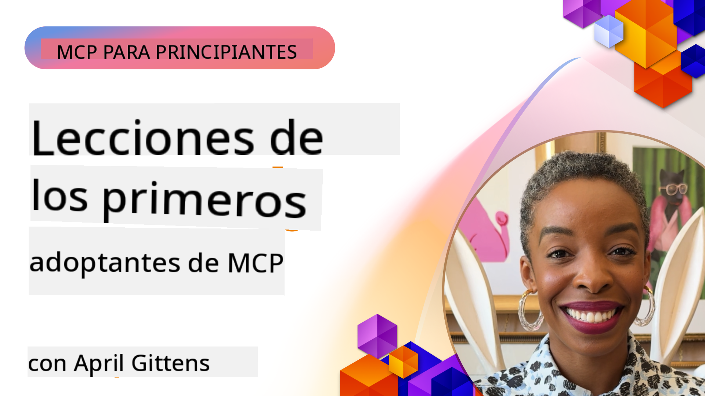

<!--
CO_OP_TRANSLATOR_METADATA:
{
  "original_hash": "41f16dac486d2086a53bc644a01cbe42",
  "translation_date": "2025-08-18T11:36:35+00:00",
  "source_file": "07-LessonsfromEarlyAdoption/README.md",
  "language_code": "es"
}
-->
# 🌟 Lecciones de los primeros adoptantes

[](https://youtu.be/jds7dSmNptE)

_(Haz clic en la imagen de arriba para ver el video de esta lección)_

## 🎯 Qué cubre este módulo

Este módulo explora cómo organizaciones y desarrolladores reales están utilizando el Protocolo de Contexto de Modelo (MCP) para resolver desafíos concretos y fomentar la innovación. A través de estudios de caso detallados y proyectos prácticos, descubrirás cómo MCP permite una integración de IA segura y escalable que conecta modelos de lenguaje, herramientas y datos empresariales.

### 📚 Ver MCP en acción

¿Quieres ver estos principios aplicados a herramientas listas para producción? Consulta nuestra [**Guía de 10 servidores MCP de Microsoft que están transformando la productividad de los desarrolladores**](microsoft-mcp-servers.md), que muestra servidores MCP reales de Microsoft que puedes usar hoy.

## Resumen

Esta lección explora cómo los primeros adoptantes han utilizado el Protocolo de Contexto de Modelo (MCP) para resolver desafíos reales y fomentar la innovación en diversas industrias. A través de estudios de caso detallados y proyectos prácticos, verás cómo MCP permite una integración de IA estandarizada, segura y escalable, conectando modelos de lenguaje, herramientas y datos empresariales en un marco unificado. Obtendrás experiencia práctica diseñando y construyendo soluciones basadas en MCP, aprenderás de patrones de implementación probados y descubrirás las mejores prácticas para implementar MCP en entornos de producción. La lección también destaca tendencias emergentes, direcciones futuras y recursos de código abierto para ayudarte a mantenerte a la vanguardia de la tecnología MCP y su ecosistema en evolución.

## Objetivos de aprendizaje

- Analizar implementaciones reales de MCP en diferentes industrias
- Diseñar y construir aplicaciones completas basadas en MCP
- Explorar tendencias emergentes y direcciones futuras en la tecnología MCP
- Aplicar mejores prácticas en escenarios de desarrollo reales

## Implementaciones reales de MCP

### Estudio de caso 1: Automatización de soporte al cliente empresarial

Una corporación multinacional implementó una solución basada en MCP para estandarizar las interacciones de IA en sus sistemas de soporte al cliente. Esto les permitió:

- Crear una interfaz unificada para múltiples proveedores de modelos de lenguaje
- Mantener una gestión de prompts consistente entre departamentos
- Implementar controles de seguridad y cumplimiento robustos
- Cambiar fácilmente entre diferentes modelos de IA según necesidades específicas

**Implementación técnica:**

```python
# Python MCP server implementation for customer support
import logging
import asyncio
from modelcontextprotocol import create_server, ServerConfig
from modelcontextprotocol.server import MCPServer
from modelcontextprotocol.transports import create_http_transport
from modelcontextprotocol.resources import ResourceDefinition
from modelcontextprotocol.prompts import PromptDefinition
from modelcontextprotocol.tool import ToolDefinition

# Configure logging
logging.basicConfig(level=logging.INFO)

async def main():
    # Create server configuration
    config = ServerConfig(
        name="Enterprise Customer Support Server",
        version="1.0.0",
        description="MCP server for handling customer support inquiries"
    )
    
    # Initialize MCP server
    server = create_server(config)
    
    # Register knowledge base resources
    server.resources.register(
        ResourceDefinition(
            name="customer_kb",
            description="Customer knowledge base documentation"
        ),
        lambda params: get_customer_documentation(params)
    )
    
    # Register prompt templates
    server.prompts.register(
        PromptDefinition(
            name="support_template",
            description="Templates for customer support responses"
        ),
        lambda params: get_support_templates(params)
    )
    
    # Register support tools
    server.tools.register(
        ToolDefinition(
            name="ticketing",
            description="Create and update support tickets"
        ),
        handle_ticketing_operations
    )
    
    # Start server with HTTP transport
    transport = create_http_transport(port=8080)
    await server.run(transport)

if __name__ == "__main__":
    asyncio.run(main())
```

**Resultados:** Reducción del 30% en costos de modelos, mejora del 45% en la consistencia de las respuestas y mayor cumplimiento en operaciones globales.

### Estudio de caso 2: Asistente de diagnóstico en salud

Un proveedor de salud desarrolló una infraestructura MCP para integrar múltiples modelos de IA especializados en medicina mientras aseguraba que los datos sensibles de los pacientes permanecieran protegidos:

- Cambio fluido entre modelos médicos generalistas y especialistas
- Controles estrictos de privacidad y registros de auditoría
- Integración con sistemas existentes de registros electrónicos de salud (EHR)
- Ingeniería de prompts consistente para terminología médica

**Implementación técnica:**

```csharp
// C# MCP host application implementation in healthcare application
using Microsoft.Extensions.DependencyInjection;
using ModelContextProtocol.SDK.Client;
using ModelContextProtocol.SDK.Security;
using ModelContextProtocol.SDK.Resources;

public class DiagnosticAssistant
{
    private readonly MCPHostClient _mcpClient;
    private readonly PatientContext _patientContext;
    
    public DiagnosticAssistant(PatientContext patientContext)
    {
        _patientContext = patientContext;
        
        // Configure MCP client with healthcare-specific settings
        var clientOptions = new ClientOptions
        {
            Name = "Healthcare Diagnostic Assistant",
            Version = "1.0.0",
            Security = new SecurityOptions
            {
                Encryption = EncryptionLevel.Medical,
                AuditEnabled = true
            }
        };
        
        _mcpClient = new MCPHostClientBuilder()
            .WithOptions(clientOptions)
            .WithTransport(new HttpTransport("https://healthcare-mcp.example.org"))
            .WithAuthentication(new HIPAACompliantAuthProvider())
            .Build();
    }
    
    public async Task<DiagnosticSuggestion> GetDiagnosticAssistance(
        string symptoms, string patientHistory)
    {
        // Create request with appropriate resources and tool access
        var resourceRequest = new ResourceRequest
        {
            Name = "patient_records",
            Parameters = new Dictionary<string, object>
            {
                ["patientId"] = _patientContext.PatientId,
                ["requestingProvider"] = _patientContext.ProviderId
            }
        };
        
        // Request diagnostic assistance using appropriate prompt
        var response = await _mcpClient.SendPromptRequestAsync(
            promptName: "diagnostic_assistance",
            parameters: new Dictionary<string, object>
            {
                ["symptoms"] = symptoms,
                patientHistory = patientHistory,
                relevantGuidelines = _patientContext.GetRelevantGuidelines()
            });
            
        return DiagnosticSuggestion.FromMCPResponse(response);
    }
}
```

**Resultados:** Mejora en las sugerencias de diagnóstico para médicos mientras se mantiene el cumplimiento total con HIPAA y una reducción significativa en los cambios de contexto entre sistemas.

### Estudio de caso 3: Análisis de riesgos en servicios financieros

Una institución financiera implementó MCP para estandarizar sus procesos de análisis de riesgos en diferentes departamentos:

- Creación de una interfaz unificada para modelos de riesgo crediticio, detección de fraude y riesgo de inversión
- Implementación de controles de acceso estrictos y versionado de modelos
- Garantía de auditabilidad en todas las recomendaciones de IA
- Mantenimiento de un formato de datos consistente en sistemas diversos

**Implementación técnica:**

```java
// Java MCP server for financial risk assessment
import org.mcp.server.*;
import org.mcp.security.*;

public class FinancialRiskMCPServer {
    public static void main(String[] args) {
        // Create MCP server with financial compliance features
        MCPServer server = new MCPServerBuilder()
            .withModelProviders(
                new ModelProvider("risk-assessment-primary", new AzureOpenAIProvider()),
                new ModelProvider("risk-assessment-audit", new LocalLlamaProvider())
            )
            .withPromptTemplateDirectory("./compliance/templates")
            .withAccessControls(new SOCCompliantAccessControl())
            .withDataEncryption(EncryptionStandard.FINANCIAL_GRADE)
            .withVersionControl(true)
            .withAuditLogging(new DatabaseAuditLogger())
            .build();
            
        server.addRequestValidator(new FinancialDataValidator());
        server.addResponseFilter(new PII_RedactionFilter());
        
        server.start(9000);
        
        System.out.println("Financial Risk MCP Server running on port 9000");
    }
}
```

**Resultados:** Mejora en el cumplimiento regulatorio, ciclos de implementación de modelos un 40% más rápidos y mayor consistencia en la evaluación de riesgos entre departamentos.

### Estudio de caso 4: Servidor MCP de Microsoft Playwright para automatización de navegadores

Microsoft desarrolló el [servidor MCP de Playwright](https://github.com/microsoft/playwright-mcp) para habilitar una automatización de navegadores segura y estandarizada a través del Protocolo de Contexto de Modelo. Este servidor listo para producción permite que agentes de IA y modelos de lenguaje interactúen con navegadores web de manera controlada, auditable y extensible, habilitando casos de uso como pruebas web automatizadas, extracción de datos y flujos de trabajo de extremo a extremo.

> **🎯 Herramienta lista para producción**
> 
> Este estudio de caso muestra un servidor MCP real que puedes usar hoy. Aprende más sobre el servidor MCP de Playwright y otros 9 servidores MCP listos para producción en nuestra [**Guía de servidores MCP de Microsoft**](microsoft-mcp-servers.md#8--playwright-mcp-server).

**Características clave:**
- Expone capacidades de automatización de navegadores (navegación, llenado de formularios, captura de pantallas, etc.) como herramientas MCP
- Implementa controles de acceso estrictos y sandboxing para prevenir acciones no autorizadas
- Proporciona registros de auditoría detallados para todas las interacciones con navegadores
- Soporta integración con Azure OpenAI y otros proveedores de modelos de lenguaje para automatización impulsada por agentes
- Alimenta las capacidades de navegación web del Agente de Codificación de GitHub Copilot

**Implementación técnica:**

```typescript
// TypeScript: Registering Playwright browser automation tools in an MCP server
import { createServer, ToolDefinition } from 'modelcontextprotocol';
import { launch } from 'playwright';

const server = createServer({
  name: 'Playwright MCP Server',
  version: '1.0.0',
  description: 'MCP server for browser automation using Playwright'
});

// Register a tool for navigating to a URL and capturing a screenshot
server.tools.register(
  new ToolDefinition({
    name: 'navigate_and_screenshot',
    description: 'Navigate to a URL and capture a screenshot',
    parameters: {
      url: { type: 'string', description: 'The URL to visit' }
    }
  }),
  async ({ url }) => {
    const browser = await launch();
    const page = await browser.newPage();
    await page.goto(url);
    const screenshot = await page.screenshot();
    await browser.close();
    return { screenshot };
  }
);

// Start the MCP server
server.listen(8080);
```

**Resultados:**

- Habilitación de automatización segura y programática de navegadores para agentes de IA y modelos de lenguaje
- Reducción del esfuerzo de pruebas manuales y mejora en la cobertura de pruebas para aplicaciones web
- Provisión de un marco reutilizable y extensible para la integración de herramientas basadas en navegadores en entornos empresariales
- Alimenta las capacidades de navegación web de GitHub Copilot

**Referencias:**

- [Repositorio GitHub del servidor MCP de Playwright](https://github.com/microsoft/playwright-mcp)
- [Soluciones de IA y automatización de Microsoft](https://azure.microsoft.com/en-us/products/ai-services/)

### Estudio de caso 5: Azure MCP – Protocolo de Contexto de Modelo de nivel empresarial como servicio

El servidor MCP de Azure ([https://aka.ms/azmcp](https://aka.ms/azmcp)) es la implementación gestionada de nivel empresarial de Microsoft del Protocolo de Contexto de Modelo, diseñada para proporcionar capacidades escalables, seguras y conformes de servidores MCP como un servicio en la nube. Azure MCP permite a las organizaciones implementar, gestionar e integrar rápidamente servidores MCP con servicios de IA, datos y seguridad de Azure, reduciendo la carga operativa y acelerando la adopción de IA.

> **🎯 Herramienta lista para producción**
> 
> Este es un servidor MCP real que puedes usar hoy. Aprende más sobre el servidor MCP de Azure AI Foundry en nuestra [**Guía de servidores MCP de Microsoft**](microsoft-mcp-servers.md).

- Hosting de servidores MCP completamente gestionado con escalado, monitoreo y seguridad integrados
- Integración nativa con Azure OpenAI, Azure AI Search y otros servicios de Azure
- Autenticación y autorización empresarial a través de Microsoft Entra ID
- Soporte para herramientas personalizadas, plantillas de prompts y conectores de recursos
- Cumplimiento con requisitos de seguridad y regulaciones empresariales

**Implementación técnica:**

```yaml
# Example: Azure MCP server deployment configuration (YAML)
apiVersion: mcp.microsoft.com/v1
kind: McpServer
metadata:
  name: enterprise-mcp-server
spec:
  modelProviders:
    - name: azure-openai
      type: AzureOpenAI
      endpoint: https://<your-openai-resource>.openai.azure.com/
      apiKeySecret: <your-azure-keyvault-secret>
  tools:
    - name: document_search
      type: AzureAISearch
      endpoint: https://<your-search-resource>.search.windows.net/
      apiKeySecret: <your-azure-keyvault-secret>
  authentication:
    type: EntraID
    tenantId: <your-tenant-id>
  monitoring:
    enabled: true
    logAnalyticsWorkspace: <your-log-analytics-id>
```

**Resultados:**  
- Reducción del tiempo para obtener valor en proyectos empresariales de IA al proporcionar una plataforma de servidores MCP lista para usar y conforme
- Simplificación de la integración de modelos de lenguaje, herramientas y fuentes de datos empresariales
- Mejora en la seguridad, observabilidad y eficiencia operativa para cargas de trabajo MCP
- Mejora en la calidad del código con las mejores prácticas del SDK de Azure y patrones de autenticación actuales

**Referencias:**  
- [Documentación de Azure MCP](https://aka.ms/azmcp)
- [Repositorio GitHub del servidor MCP de Azure](https://github.com/Azure/azure-mcp)
- [Servicios de IA de Azure](https://azure.microsoft.com/en-us/products/ai-services/)
- [Centro MCP de Microsoft](https://mcp.azure.com)

### Estudio de caso 6: NLWeb

MCP (Protocolo de Contexto de Modelo) es un protocolo emergente para chatbots y asistentes de IA que interactúan con herramientas. Cada instancia de NLWeb también es un servidor MCP, que soporta un método principal, ask, utilizado para hacer preguntas a un sitio web en lenguaje natural. La respuesta devuelta utiliza schema.org, un vocabulario ampliamente utilizado para describir datos web. En términos generales, MCP es a NLWeb lo que Http es a HTML. NLWeb combina protocolos, formatos de Schema.org y código de muestra para ayudar a los sitios a crear rápidamente estos endpoints, beneficiando tanto a los humanos a través de interfaces conversacionales como a las máquinas mediante interacción natural entre agentes.

Hay dos componentes distintos en NLWeb:
- Un protocolo, muy simple para comenzar, para interactuar con un sitio en lenguaje natural y un formato, que utiliza json y schema.org para la respuesta devuelta. Consulta la documentación sobre la API REST para más detalles.
- Una implementación sencilla de (1) que aprovecha el marcado existente, para sitios que pueden abstraerse como listas de elementos (productos, recetas, atracciones, reseñas, etc.). Junto con un conjunto de widgets de interfaz de usuario, los sitios pueden proporcionar fácilmente interfaces conversacionales a su contenido. Consulta la documentación sobre el ciclo de vida de una consulta de chat para más detalles sobre cómo funciona esto.

**Referencias:**  
- [Documentación de Azure MCP](https://aka.ms/azmcp)  
- [NLWeb](https://github.com/microsoft/NlWeb)

### Estudio de caso 7: Servidor MCP de Azure AI Foundry – Integración de agentes de IA empresariales

Los servidores MCP de Azure AI Foundry demuestran cómo MCP puede usarse para orquestar y gestionar agentes de IA y flujos de trabajo en entornos empresariales. Al integrar MCP con Azure AI Foundry, las organizaciones pueden estandarizar las interacciones de agentes, aprovechar la gestión de flujos de trabajo de Foundry y garantizar implementaciones seguras y escalables.

> **🎯 Herramienta lista para producción**
> 
> Este es un servidor MCP real que puedes usar hoy. Aprende más sobre el servidor MCP de Azure AI Foundry en nuestra [**Guía de servidores MCP de Microsoft**](microsoft-mcp-servers.md#9--azure-ai-foundry-mcp-server).

**Características clave:**
- Acceso completo al ecosistema de IA de Azure, incluyendo catálogos de modelos y gestión de implementaciones
- Indexación de conocimiento con Azure AI Search para aplicaciones RAG
- Herramientas de evaluación para el rendimiento y la calidad de los modelos de IA
- Integración con el catálogo y laboratorios de Azure AI Foundry para modelos de investigación de vanguardia
- Capacidades de gestión y evaluación de agentes para escenarios de producción

**Resultados:**
- Prototipado rápido y monitoreo robusto de flujos de trabajo de agentes de IA
- Integración fluida con servicios de IA de Azure para escenarios avanzados
- Interfaz unificada para construir, implementar y monitorear pipelines de agentes
- Mejora en la seguridad, cumplimiento y eficiencia operativa para empresas
- Aceleración en la adopción de IA mientras se mantiene el control sobre procesos complejos impulsados por agentes

**Referencias:**
- [Repositorio GitHub del servidor MCP de Azure AI Foundry](https://github.com/azure-ai-foundry/mcp-foundry)
- [Integración de agentes de IA de Azure con MCP (Blog de Microsoft Foundry)](https://devblogs.microsoft.com/foundry/integrating-azure-ai-agents-mcp/)

### Estudio de caso 8: Playground MCP de Foundry – Experimentación y prototipado

El Playground MCP de Foundry ofrece un entorno listo para usar para experimentar con servidores MCP e integraciones de Azure AI Foundry. Los desarrolladores pueden prototipar, probar y evaluar rápidamente modelos de IA y flujos de trabajo de agentes utilizando recursos del catálogo y laboratorios de Azure AI Foundry. El playground simplifica la configuración, proporciona proyectos de muestra y soporta desarrollo colaborativo, facilitando la exploración de mejores prácticas y nuevos escenarios con un mínimo esfuerzo. Es especialmente útil para equipos que buscan validar ideas, compartir experimentos y acelerar el aprendizaje sin necesidad de infraestructura compleja. Al reducir las barreras de entrada, el playground ayuda a fomentar la innovación y las contribuciones comunitarias en el ecosistema de MCP y Azure AI Foundry.

**Referencias:**

- [Repositorio GitHub del Playground MCP de Foundry](https://github.com/azure-ai-foundry/foundry-mcp-playground)

### Estudio de caso 9: Servidor MCP de Microsoft Learn Docs – Acceso a documentación impulsado por IA

El servidor MCP de Microsoft Learn Docs es un servicio alojado en la nube que proporciona a los asistentes de IA acceso en tiempo real a la documentación oficial de Microsoft a través del Protocolo de Contexto de Modelo. Este servidor listo para producción se conecta al ecosistema integral de Microsoft Learn y permite búsquedas semánticas en todas las fuentes oficiales de Microsoft.
> **🎯 Herramienta Lista para Producción**
> 
> ¡Este es un servidor MCP real que puedes usar hoy! Obtén más información sobre el Servidor MCP de Microsoft Learn Docs en nuestra [**Guía de Servidores MCP de Microsoft**](microsoft-mcp-servers.md#1--microsoft-learn-docs-mcp-server).
**Características clave:**
- Acceso en tiempo real a documentación oficial de Microsoft, documentos de Azure y documentación de Microsoft 365
- Capacidades avanzadas de búsqueda semántica que comprenden el contexto y la intención
- Información siempre actualizada a medida que se publica contenido en Microsoft Learn
- Cobertura integral en Microsoft Learn, documentación de Azure y fuentes de Microsoft 365
- Devuelve hasta 10 fragmentos de contenido de alta calidad con títulos de artículos y URLs

**Por qué es crítico:**
- Resuelve el problema de "conocimiento desactualizado de IA" para tecnologías de Microsoft
- Garantiza que los asistentes de IA tengan acceso a las últimas características de .NET, C#, Azure y Microsoft 365
- Proporciona información autorizada y de primera mano para una generación de código precisa
- Esencial para desarrolladores que trabajan con tecnologías de Microsoft en rápida evolución

**Resultados:**
- Mejora drástica en la precisión del código generado por IA para tecnologías de Microsoft
- Reducción del tiempo dedicado a buscar documentación actual y mejores prácticas
- Mayor productividad de los desarrolladores con recuperación de documentación basada en el contexto
- Integración fluida con flujos de trabajo de desarrollo sin salir del IDE

**Referencias:**
- [Repositorio GitHub del servidor MCP de Microsoft Learn Docs](https://github.com/MicrosoftDocs/mcp)
- [Documentación de Microsoft Learn](https://learn.microsoft.com/)

## Proyectos prácticos

### Proyecto 1: Construir un servidor MCP multi-proveedor

**Objetivo:** Crear un servidor MCP que pueda enrutar solicitudes a múltiples proveedores de modelos de IA según criterios específicos.

**Requisitos:**

- Soportar al menos tres proveedores de modelos diferentes (por ejemplo, OpenAI, Anthropic, modelos locales)
- Implementar un mecanismo de enrutamiento basado en metadatos de solicitudes
- Crear un sistema de configuración para gestionar credenciales de proveedores
- Añadir caché para optimizar el rendimiento y los costos
- Construir un tablero simple para monitorear el uso

**Pasos de implementación:**

1. Configurar la infraestructura básica del servidor MCP
2. Implementar adaptadores de proveedores para cada servicio de modelos de IA
3. Crear la lógica de enrutamiento basada en atributos de solicitudes
4. Añadir mecanismos de caché para solicitudes frecuentes
5. Desarrollar el tablero de monitoreo
6. Probar con varios patrones de solicitudes

**Tecnologías:** Elegir entre Python (.NET/Java/Python según tu preferencia), Redis para caché y un marco web simple para el tablero.

### Proyecto 2: Sistema de gestión de prompts empresariales

**Objetivo:** Desarrollar un sistema basado en MCP para gestionar, versionar y desplegar plantillas de prompts en toda una organización.

**Requisitos:**

- Crear un repositorio centralizado para plantillas de prompts
- Implementar sistemas de versionado y flujos de aprobación
- Construir capacidades de prueba de plantillas con entradas de muestra
- Desarrollar controles de acceso basados en roles
- Crear una API para la recuperación y el despliegue de plantillas

**Pasos de implementación:**

1. Diseñar el esquema de base de datos para el almacenamiento de plantillas
2. Crear la API principal para operaciones CRUD de plantillas
3. Implementar el sistema de versionado
4. Construir el flujo de aprobación
5. Desarrollar el marco de pruebas
6. Crear una interfaz web simple para la gestión
7. Integrar con un servidor MCP

**Tecnologías:** Tu elección de marco de backend, base de datos SQL o NoSQL, y un marco de frontend para la interfaz de gestión.

### Proyecto 3: Plataforma de generación de contenido basada en MCP

**Objetivo:** Construir una plataforma de generación de contenido que aproveche MCP para proporcionar resultados consistentes en diferentes tipos de contenido.

**Requisitos:**

- Soportar múltiples formatos de contenido (publicaciones de blog, redes sociales, textos de marketing)
- Implementar generación basada en plantillas con opciones de personalización
- Crear un sistema de revisión y retroalimentación de contenido
- Rastrear métricas de rendimiento del contenido
- Soportar versionado e iteración de contenido

**Pasos de implementación:**

1. Configurar la infraestructura del cliente MCP
2. Crear plantillas para diferentes tipos de contenido
3. Construir la canalización de generación de contenido
4. Implementar el sistema de revisión
5. Desarrollar el sistema de seguimiento de métricas
6. Crear una interfaz de usuario para la gestión de plantillas y generación de contenido

**Tecnologías:** Tu lenguaje de programación preferido, marco web y sistema de base de datos.

## Direcciones futuras para la tecnología MCP

### Tendencias emergentes

1. **MCP multimodal**
   - Expansión de MCP para estandarizar interacciones con modelos de imagen, audio y video
   - Desarrollo de capacidades de razonamiento entre modalidades
   - Formatos de prompts estandarizados para diferentes modalidades

2. **Infraestructura federada de MCP**
   - Redes MCP distribuidas que pueden compartir recursos entre organizaciones
   - Protocolos estandarizados para compartir modelos de forma segura
   - Técnicas de computación que preservan la privacidad

3. **Mercados MCP**
   - Ecosistemas para compartir y monetizar plantillas y complementos MCP
   - Procesos de aseguramiento de calidad y certificación
   - Integración con mercados de modelos

4. **MCP para computación en el borde**
   - Adaptación de estándares MCP para dispositivos de borde con recursos limitados
   - Protocolos optimizados para entornos de bajo ancho de banda
   - Implementaciones MCP especializadas para ecosistemas IoT

5. **Marcos regulatorios**
   - Desarrollo de extensiones MCP para cumplimiento regulatorio
   - Rastreos de auditoría estandarizados e interfaces de explicabilidad
   - Integración con marcos emergentes de gobernanza de IA

### Soluciones MCP de Microsoft

Microsoft y Azure han desarrollado varios repositorios de código abierto para ayudar a los desarrolladores a implementar MCP en diversos escenarios:

#### Organización Microsoft

1. [playwright-mcp](https://github.com/microsoft/playwright-mcp) - Un servidor MCP de Playwright para automatización y pruebas de navegadores
2. [files-mcp-server](https://github.com/microsoft/files-mcp-server) - Una implementación de servidor MCP de OneDrive para pruebas locales y contribución comunitaria
3. [NLWeb](https://github.com/microsoft/NlWeb) - NLWeb es una colección de protocolos abiertos y herramientas de código abierto asociadas. Su enfoque principal es establecer una capa fundamental para la Web de IA

#### Organización Azure-Samples

1. [mcp](https://github.com/Azure-Samples/mcp) - Enlaces a muestras, herramientas y recursos para construir e integrar servidores MCP en Azure usando múltiples lenguajes
2. [mcp-auth-servers](https://github.com/Azure-Samples/mcp-auth-servers) - Servidores MCP de referencia que demuestran autenticación con la especificación actual del Protocolo de Contexto de Modelo
3. [remote-mcp-functions](https://github.com/Azure-Samples/remote-mcp-functions) - Página de inicio para implementaciones de servidores MCP remotos en Azure Functions con enlaces a repositorios específicos de lenguaje
4. [remote-mcp-functions-python](https://github.com/Azure-Samples/remote-mcp-functions-python) - Plantilla de inicio rápido para construir y desplegar servidores MCP remotos personalizados usando Azure Functions con Python
5. [remote-mcp-functions-dotnet](https://github.com/Azure-Samples/remote-mcp-functions-dotnet) - Plantilla de inicio rápido para construir y desplegar servidores MCP remotos personalizados usando Azure Functions con .NET/C#
6. [remote-mcp-functions-typescript](https://github.com/Azure-Samples/remote-mcp-functions-typescript) - Plantilla de inicio rápido para construir y desplegar servidores MCP remotos personalizados usando Azure Functions con TypeScript
7. [remote-mcp-apim-functions-python](https://github.com/Azure-Samples/remote-mcp-apim-functions-python) - Gestión de API de Azure como puerta de enlace de IA para servidores MCP remotos usando Python
8. [AI-Gateway](https://github.com/Azure-Samples/AI-Gateway) - Experimentos de APIM ❤️ IA incluyendo capacidades MCP, integrando con Azure OpenAI y AI Foundry

Estos repositorios proporcionan diversas implementaciones, plantillas y recursos para trabajar con el Protocolo de Contexto de Modelo en diferentes lenguajes de programación y servicios de Azure. Cubren una variedad de casos de uso, desde implementaciones básicas de servidores hasta autenticación, despliegue en la nube e integración empresarial.

#### Directorio de recursos MCP

El [Directorio de recursos MCP](https://github.com/microsoft/mcp/tree/main/Resources) en el repositorio oficial de Microsoft MCP ofrece una colección curada de recursos de muestra, plantillas de prompts y definiciones de herramientas para usar con servidores del Protocolo de Contexto de Modelo. Este directorio está diseñado para ayudar a los desarrolladores a comenzar rápidamente con MCP ofreciendo bloques de construcción reutilizables y ejemplos de mejores prácticas para:

- **Plantillas de prompts:** Plantillas de prompts listas para usar en tareas y escenarios comunes de IA, que pueden adaptarse para tus propias implementaciones de servidores MCP.
- **Definiciones de herramientas:** Ejemplos de esquemas de herramientas y metadatos para estandarizar la integración e invocación de herramientas en diferentes servidores MCP.
- **Muestras de recursos:** Ejemplos de definiciones de recursos para conectarse a fuentes de datos, APIs y servicios externos dentro del marco MCP.
- **Implementaciones de referencia:** Ejemplos prácticos que demuestran cómo estructurar y organizar recursos, prompts y herramientas en proyectos MCP reales.

Estos recursos aceleran el desarrollo, promueven la estandarización y ayudan a garantizar mejores prácticas al construir y desplegar soluciones basadas en MCP.

#### Directorio de recursos MCP

- [Recursos MCP (Prompts de muestra, herramientas y definiciones de recursos)](https://github.com/microsoft/mcp/tree/main/Resources)

### Oportunidades de investigación

- Técnicas eficientes de optimización de prompts dentro de marcos MCP
- Modelos de seguridad para despliegues MCP multi-tenant
- Evaluación de rendimiento entre diferentes implementaciones MCP
- Métodos de verificación formal para servidores MCP

## Conclusión

El Protocolo de Contexto de Modelo (MCP) está moldeando rápidamente el futuro de la integración de IA estandarizada, segura e interoperable en diversas industrias. A través de los estudios de caso y proyectos prácticos en esta lección, has visto cómo los primeros adoptantes, incluidos Microsoft y Azure, están aprovechando MCP para resolver desafíos del mundo real, acelerar la adopción de IA y garantizar cumplimiento, seguridad y escalabilidad. El enfoque modular de MCP permite a las organizaciones conectar modelos de lenguaje grande, herramientas y datos empresariales en un marco unificado y auditable. A medida que MCP continúa evolucionando, mantenerse comprometido con la comunidad, explorar recursos de código abierto y aplicar mejores prácticas será clave para construir soluciones de IA robustas y preparadas para el futuro.

## Recursos adicionales

- [Repositorio GitHub MCP Foundry](https://github.com/azure-ai-foundry/mcp-foundry)
- [Playground MCP Foundry](https://github.com/azure-ai-foundry/foundry-mcp-playground)
- [Integración de agentes de Azure AI con MCP (Blog de Microsoft Foundry)](https://devblogs.microsoft.com/foundry/integrating-azure-ai-agents-mcp/)
- [Repositorio GitHub MCP (Microsoft)](https://github.com/microsoft/mcp)
- [Directorio de recursos MCP (Prompts de muestra, herramientas y definiciones de recursos)](https://github.com/microsoft/mcp/tree/main/Resources)
- [Comunidad y documentación MCP](https://modelcontextprotocol.io/introduction)
- [Documentación MCP de Azure](https://aka.ms/azmcp)
- [Repositorio GitHub del servidor MCP de Playwright](https://github.com/microsoft/playwright-mcp)
- [Servidor MCP de archivos (OneDrive)](https://github.com/microsoft/files-mcp-server)
- [MCP Azure-Samples](https://github.com/Azure-Samples/mcp)
- [Servidores de autenticación MCP (Azure-Samples)](https://github.com/Azure-Samples/mcp-auth-servers)
- [Funciones MCP remotas (Azure-Samples)](https://github.com/Azure-Samples/remote-mcp-functions)
- [Funciones MCP remotas Python (Azure-Samples)](https://github.com/Azure-Samples/remote-mcp-functions-python)
- [Funciones MCP remotas .NET (Azure-Samples)](https://github.com/Azure-Samples/remote-mcp-functions-dotnet)
- [Funciones MCP remotas TypeScript (Azure-Samples)](https://github.com/Azure-Samples/remote-mcp-functions-typescript)
- [Funciones APIM MCP remotas Python (Azure-Samples)](https://github.com/Azure-Samples/remote-mcp-apim-functions-python)
- [AI-Gateway (Azure-Samples)](https://github.com/Azure-Samples/AI-Gateway)
- [Soluciones de IA y automatización de Microsoft](https://azure.microsoft.com/en-us/products/ai-services/)

## Ejercicios

1. Analiza uno de los estudios de caso y propone un enfoque alternativo de implementación.
2. Elige una de las ideas de proyecto y crea una especificación técnica detallada.
3. Investiga una industria no cubierta en los estudios de caso y describe cómo MCP podría abordar sus desafíos específicos.
4. Explora una de las direcciones futuras y crea un concepto para una nueva extensión MCP que la respalde.

Siguiente: [Servidor MCP de Microsoft](../07-LessonsfromEarlyAdoption/microsoft-mcp-servers.md)

**Descargo de responsabilidad**:  
Este documento ha sido traducido utilizando el servicio de traducción automática [Co-op Translator](https://github.com/Azure/co-op-translator). Aunque nos esforzamos por garantizar la precisión, tenga en cuenta que las traducciones automatizadas pueden contener errores o imprecisiones. El documento original en su idioma nativo debe considerarse como la fuente autorizada. Para información crítica, se recomienda una traducción profesional realizada por humanos. No nos hacemos responsables de malentendidos o interpretaciones erróneas que puedan surgir del uso de esta traducción.