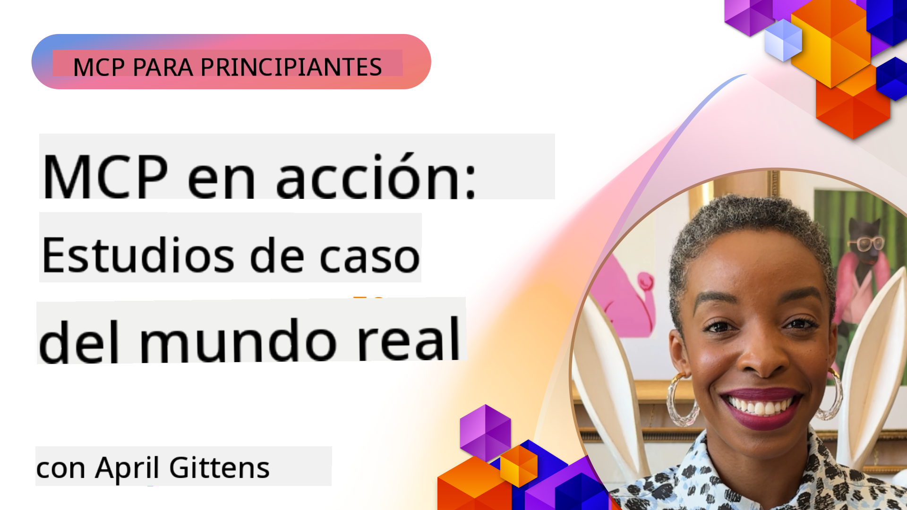

<!--
CO_OP_TRANSLATOR_METADATA:
{
  "original_hash": "1611dc5f6a2a35a789fc4c95fc5bfbe8",
  "translation_date": "2025-09-26T17:36:01+00:00",
  "source_file": "09-CaseStudy/README.md",
  "language_code": "es"
}
-->
# MCP en Acción: Estudios de Caso del Mundo Real

_(Haz clic en la imagen de arriba para ver el video de esta lección)_

El Protocolo de Contexto de Modelo (MCP) está transformando cómo las aplicaciones de IA interactúan con datos, herramientas y servicios. Esta sección presenta estudios de caso del mundo real que demuestran aplicaciones prácticas de MCP en diversos escenarios empresariales.

## Resumen

Esta sección muestra ejemplos concretos de implementaciones de MCP, destacando cómo las organizaciones están aprovechando este protocolo para resolver desafíos empresariales complejos. Al examinar estos estudios de caso, obtendrás información sobre la versatilidad, escalabilidad y beneficios prácticos de MCP en escenarios reales.

## Objetivos Clave de Aprendizaje

Al explorar estos estudios de caso, podrás:

- Comprender cómo MCP puede aplicarse para resolver problemas empresariales específicos.
- Aprender sobre diferentes patrones de integración y enfoques arquitectónicos.
- Reconocer las mejores prácticas para implementar MCP en entornos empresariales.
- Obtener información sobre los desafíos y soluciones encontrados en implementaciones reales.
- Identificar oportunidades para aplicar patrones similares en tus propios proyectos.

## Estudios de Caso Destacados

### 1. [Agentes de Viaje con Azure AI – Implementación de Referencia](./travelagentsample.md)

Este estudio de caso examina la solución de referencia integral de Microsoft que demuestra cómo construir una aplicación de planificación de viajes impulsada por IA y múltiples agentes utilizando MCP, Azure OpenAI y Azure AI Search. El proyecto destaca:

- Orquestación de múltiples agentes a través de MCP.
- Integración de datos empresariales con Azure AI Search.
- Arquitectura segura y escalable utilizando servicios de Azure.
- Herramientas extensibles con componentes MCP reutilizables.
- Experiencia conversacional impulsada por Azure OpenAI.

Los detalles de la arquitectura e implementación proporcionan valiosos conocimientos sobre cómo construir sistemas complejos de múltiples agentes con MCP como capa de coordinación.

### 2. [Actualización de Elementos de Azure DevOps con Datos de YouTube](./UpdateADOItemsFromYT.md)

Este estudio de caso demuestra una aplicación práctica de MCP para automatizar procesos de flujo de trabajo. Muestra cómo las herramientas MCP pueden usarse para:

- Extraer datos de plataformas en línea (YouTube).
- Actualizar elementos de trabajo en sistemas Azure DevOps.
- Crear flujos de trabajo de automatización repetibles.
- Integrar datos entre sistemas dispares.

Este ejemplo ilustra cómo incluso implementaciones relativamente simples de MCP pueden proporcionar importantes ganancias de eficiencia al automatizar tareas rutinarias y mejorar la consistencia de datos entre sistemas.

### 3. [Recuperación de Documentación en Tiempo Real con MCP](./docs-mcp/README.md)

Este estudio de caso te guía a través de la conexión de un cliente de consola Python a un servidor MCP para recuperar y registrar documentación de Microsoft en tiempo real y basada en el contexto. Aprenderás cómo:

- Conectarte a un servidor MCP utilizando un cliente Python y el SDK oficial de MCP.
- Usar clientes HTTP en streaming para una recuperación de datos eficiente en tiempo real.
- Llamar herramientas de documentación en el servidor y registrar respuestas directamente en la consola.
- Integrar documentación actualizada de Microsoft en tu flujo de trabajo sin salir del terminal.

El capítulo incluye una tarea práctica, un ejemplo de código funcional mínimo y enlaces a recursos adicionales para un aprendizaje más profundo. Consulta el recorrido completo y el código en el capítulo vinculado para entender cómo MCP puede transformar el acceso a la documentación y la productividad de los desarrolladores en entornos basados en consola.

### 4. [Generador de Planes de Estudio Interactivo con MCP](./docs-mcp/README.md)

Este estudio de caso demuestra cómo construir una aplicación web interactiva utilizando Chainlit y el Protocolo de Contexto de Modelo (MCP) para generar planes de estudio personalizados sobre cualquier tema. Los usuarios pueden especificar un tema (como "certificación AI-900") y una duración de estudio (por ejemplo, 8 semanas), y la aplicación proporcionará un desglose semanal de contenido recomendado. Chainlit permite una interfaz de chat conversacional, haciendo que la experiencia sea atractiva y adaptativa.

- Aplicación web conversacional impulsada por Chainlit.
- Prompts dirigidos por el usuario para tema y duración.
- Recomendaciones de contenido semana a semana utilizando MCP.
- Respuestas adaptativas en tiempo real en una interfaz de chat.

El proyecto ilustra cómo la IA conversacional y MCP pueden combinarse para crear herramientas educativas dinámicas y centradas en el usuario en un entorno web moderno.

### 5. [Documentación en el Editor con Servidor MCP en VS Code](./docs-mcp/README.md)

Este estudio de caso demuestra cómo puedes llevar la documentación de Microsoft Learn directamente a tu entorno de VS Code utilizando el servidor MCP—¡sin necesidad de cambiar de pestañas del navegador! Verás cómo:

- Buscar y leer documentación instantáneamente dentro de VS Code utilizando el panel MCP o el palette de comandos.
- Referenciar documentación e insertar enlaces directamente en tus archivos README o markdown de cursos.
- Usar GitHub Copilot y MCP juntos para flujos de trabajo de documentación y código impulsados por IA.
- Validar y mejorar tu documentación con retroalimentación en tiempo real y precisión basada en Microsoft.
- Integrar MCP con flujos de trabajo de GitHub para validación continua de documentación.

La implementación incluye:

- Ejemplo de configuración `.vscode/mcp.json` para una fácil instalación.
- Recorridos basados en capturas de pantalla de la experiencia en el editor.
- Consejos para combinar Copilot y MCP para máxima productividad.

Este escenario es ideal para autores de cursos, escritores de documentación y desarrolladores que desean mantenerse enfocados en su editor mientras trabajan con documentación, Copilot y herramientas de validación—todo impulsado por MCP.

### 6. [Creación de Servidor MCP con APIM](./apimsample.md)

Este estudio de caso proporciona una guía paso a paso sobre cómo crear un servidor MCP utilizando Azure API Management (APIM). Cubre:

- Configuración de un servidor MCP en Azure API Management.
- Exposición de operaciones de API como herramientas MCP.
- Configuración de políticas para limitación de tasa y seguridad.
- Pruebas del servidor MCP utilizando Visual Studio Code y GitHub Copilot.

Este ejemplo ilustra cómo aprovechar las capacidades de Azure para crear un servidor MCP robusto que puede usarse en diversas aplicaciones, mejorando la integración de sistemas de IA con APIs empresariales.

### 7. [Registro MCP de GitHub — Acelerando la Integración Agente](https://github.com/mcp)

Este estudio de caso examina cómo el Registro MCP de GitHub, lanzado en septiembre de 2025, aborda un desafío crítico en el ecosistema de IA: la fragmentación en el descubrimiento y despliegue de servidores MCP.

#### Resumen
El **Registro MCP** resuelve el problema creciente de servidores MCP dispersos en repositorios y registros, lo que anteriormente hacía que la integración fuera lenta y propensa a errores. Estos servidores permiten que los agentes de IA interactúen con sistemas externos como APIs, bases de datos y fuentes de documentación.

#### Declaración del Problema
Los desarrolladores que construyen flujos de trabajo agentes enfrentaban varios desafíos:
- **Baja capacidad de descubrimiento** de servidores MCP en diferentes plataformas.
- **Preguntas redundantes de configuración** dispersas en foros y documentación.
- **Riesgos de seguridad** por fuentes no verificadas y no confiables.
- **Falta de estandarización** en la calidad y compatibilidad de los servidores.

#### Arquitectura de la Solución
El Registro MCP de GitHub centraliza servidores MCP confiables con características clave:
- **Instalación con un clic** para una configuración simplificada en VS Code.
- **Clasificación por relevancia** basada en estrellas, actividad y validación comunitaria.
- **Integración directa** con GitHub Copilot y otras herramientas compatibles con MCP.
- **Modelo de contribución abierta** que permite tanto a la comunidad como a socios empresariales contribuir.

#### Impacto Empresarial
El registro ha entregado mejoras medibles:
- **Onboarding más rápido** para desarrolladores utilizando herramientas como el Servidor MCP de Microsoft Learn, que transmite documentación oficial directamente a los agentes.
- **Mayor productividad** mediante servidores especializados como `github-mcp-server`, que habilitan automatización natural de GitHub (creación de PR, reejecución de CI, escaneo de código).
- **Mayor confianza en el ecosistema** a través de listados curados y estándares de configuración transparentes.

#### Valor Estratégico
Para los profesionales especializados en gestión del ciclo de vida de agentes y flujos de trabajo reproducibles, el Registro MCP proporciona:
- **Capacidades de despliegue modular de agentes** con componentes estandarizados.
- **Pipelines de evaluación respaldados por el registro** para pruebas y validación consistentes.
- **Interoperabilidad entre herramientas** que permite una integración fluida entre diferentes plataformas de IA.

Este estudio de caso demuestra que el Registro MCP no es solo un directorio—es una plataforma fundamental para la integración escalable de modelos en el mundo real y el despliegue de sistemas agentes.

## Conclusión

Estos siete estudios de caso comprensivos demuestran la notable versatilidad y aplicaciones prácticas del Protocolo de Contexto de Modelo en diversos escenarios reales. Desde sistemas complejos de planificación de viajes con múltiples agentes y gestión de APIs empresariales hasta flujos de trabajo de documentación optimizados y el revolucionario Registro MCP de GitHub, estos ejemplos muestran cómo MCP proporciona una forma estandarizada y escalable de conectar sistemas de IA con las herramientas, datos y servicios que necesitan para ofrecer un valor excepcional.

Los estudios de caso abarcan múltiples dimensiones de implementación de MCP:
- **Integración Empresarial**: Automatización de Azure DevOps y gestión de APIs con Azure.
- **Orquestación de Múltiples Agentes**: Planificación de viajes con agentes coordinados.
- **Productividad del Desarrollador**: Integración en VS Code y acceso a documentación en tiempo real.
- **Desarrollo del Ecosistema**: Registro MCP de GitHub como plataforma fundamental.
- **Aplicaciones Educativas**: Generadores de planes de estudio interactivos e interfaces conversacionales.

Al estudiar estas implementaciones, obtendrás conocimientos críticos sobre:
- **Patrones arquitectónicos** para diferentes escalas y casos de uso.
- **Estrategias de implementación** que equilibran funcionalidad con mantenibilidad.
- **Consideraciones de seguridad y escalabilidad** para despliegues en producción.
- **Mejores prácticas** para el desarrollo de servidores MCP e integración de clientes.
- **Pensamiento ecosistémico** para construir soluciones interconectadas impulsadas por IA.

Estos ejemplos demuestran colectivamente que MCP no es simplemente un marco teórico, sino un protocolo maduro y listo para producción que habilita soluciones prácticas a desafíos empresariales complejos. Ya sea que estés construyendo herramientas de automatización simples o sistemas sofisticados de múltiples agentes, los patrones y enfoques ilustrados aquí proporcionan una base sólida para tus propios proyectos MCP.

## Recursos Adicionales

- [Repositorio GitHub de Agentes de Viaje con Azure AI](https://github.com/Azure-Samples/azure-ai-travel-agents)
- [Herramienta MCP de Azure DevOps](https://github.com/microsoft/azure-devops-mcp)
- [Herramienta MCP de Playwright](https://github.com/microsoft/playwright-mcp)
- [Servidor MCP de Documentación de Microsoft](https://github.com/MicrosoftDocs/mcp)
- [Registro MCP de GitHub — Acelerando la Integración Agente](https://github.com/mcp)
- [Ejemplos de la Comunidad MCP](https://github.com/microsoft/mcp)

Siguiente: Laboratorio Práctico [Optimización de Flujos de Trabajo de IA: Construcción de un Servidor MCP con AI Toolkit](../10-StreamliningAIWorkflowsBuildingAnMCPServerWithAIToolkit/README.md)

---

