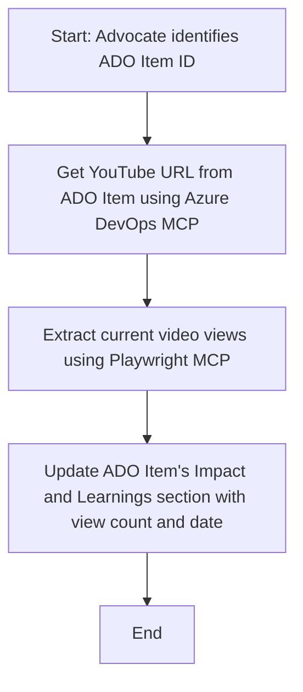

<!--
CO_OP_TRANSLATOR_METADATA:
{
  "original_hash": "14a2dfbea55ef735660a06bd6bdfe5f3",
  "translation_date": "2025-06-13T21:30:34+00:00",
  "source_file": "09-CaseStudy/UpdateADOItemsFromYT.md",
  "language_code": "es"
}
-->
# Estudio de Caso: Actualización de Ítems de Azure DevOps con Datos de YouTube usando MCP

> **Disclaimer:** Existen herramientas y reportes en línea que pueden automatizar el proceso de actualizar ítems de Azure DevOps con datos de plataformas como YouTube. El siguiente escenario se presenta únicamente como un ejemplo para ilustrar cómo se pueden aplicar las herramientas MCP para tareas de automatización e integración.

## Visión General

Este estudio de caso muestra un ejemplo de cómo el Model Context Protocol (MCP) y sus herramientas pueden usarse para automatizar el proceso de actualización de ítems de trabajo en Azure DevOps (ADO) con información obtenida de plataformas en línea, como YouTube. El escenario descrito es solo una ilustración de las capacidades más amplias de estas herramientas, que pueden adaptarse a muchas necesidades similares de automatización.

En este ejemplo, un Advocate realiza el seguimiento de sesiones en línea usando ítems de ADO, donde cada ítem incluye la URL de un video de YouTube. Aprovechando las herramientas MCP, el Advocate puede mantener los ítems de ADO actualizados con las métricas más recientes del video, como el número de vistas, de forma repetible y automatizada. Este enfoque se puede generalizar a otros casos donde la información de fuentes en línea debe integrarse en ADO u otros sistemas.

## Escenario

Un Advocate es responsable de rastrear el impacto de sesiones en línea y la participación de la comunidad. Cada sesión se registra como un ítem de trabajo en ADO dentro del proyecto 'DevRel', y el ítem contiene un campo con la URL del video de YouTube. Para reportar con precisión el alcance de la sesión, el Advocate necesita actualizar el ítem de ADO con el número actual de vistas del video y la fecha en que se obtuvo esta información.

## Herramientas Utilizadas

- [Azure DevOps MCP](https://github.com/microsoft/azure-devops-mcp): Permite el acceso programático y la actualización de ítems de trabajo de ADO mediante MCP.
- [Playwright MCP](https://github.com/microsoft/playwright-mcp): Automatiza acciones en el navegador para extraer datos en vivo de páginas web, como las estadísticas de videos en YouTube.

## Flujo de Trabajo Paso a Paso

1. **Identificar el Ítem de ADO**: Comenzar con el ID del ítem de trabajo de ADO (por ejemplo, 1234) en el proyecto 'DevRel'.
2. **Obtener la URL de YouTube**: Usar la herramienta Azure DevOps MCP para obtener la URL de YouTube del ítem de trabajo.
3. **Extraer las Vistas del Video**: Usar la herramienta Playwright MCP para navegar a la URL de YouTube y extraer el conteo actual de vistas.
4. **Actualizar el Ítem de ADO**: Escribir el conteo más reciente de vistas y la fecha de obtención en la sección 'Impact and Learnings' del ítem de trabajo de ADO usando la herramienta Azure DevOps MCP.

## Ejemplo de Prompt

```bash
- Work with the ADO Item ID: 1234
- The project is '2025-Awesome'
- Get the YouTube URL for the ADO item
- Use Playwright to get the current views from the YouTube video
- Update the ADO item with the current video views and the updated date of the information
```

## Diagrama de Flujo Mermaid



## Implementación Técnica

- **Orquestación MCP**: El flujo de trabajo es coordinado por un servidor MCP, que gestiona el uso de las herramientas Azure DevOps MCP y Playwright MCP.
- **Automatización**: El proceso puede activarse manualmente o programarse para ejecutarse a intervalos regulares y mantener los ítems de ADO actualizados.
- **Extensibilidad**: El mismo patrón puede extenderse para actualizar ítems de ADO con otras métricas en línea (por ejemplo, likes, comentarios) o de otras plataformas.

## Resultados e Impacto

- **Eficiencia**: Reduce el esfuerzo manual de los Advocates al automatizar la obtención y actualización de métricas de videos.
- **Precisión**: Asegura que los ítems de ADO reflejen los datos más actuales disponibles en fuentes en línea.
- **Repetibilidad**: Proporciona un flujo de trabajo reutilizable para escenarios similares que involucren otras fuentes o métricas.

## Referencias

- [Azure DevOps MCP](https://github.com/microsoft/azure-devops-mcp)
- [Playwright MCP](https://github.com/microsoft/playwright-mcp)
- [Model Context Protocol (MCP)](https://modelcontextprotocol.io/)

**Descargo de responsabilidad**:  
Este documento ha sido traducido utilizando el servicio de traducción automática [Co-op Translator](https://github.com/Azure/co-op-translator). Aunque nos esforzamos por la precisión, tenga en cuenta que las traducciones automáticas pueden contener errores o inexactitudes. El documento original en su idioma nativo debe considerarse la fuente autorizada. Para información crítica, se recomienda una traducción profesional realizada por humanos. No nos hacemos responsables de malentendidos o interpretaciones erróneas derivadas del uso de esta traducción.