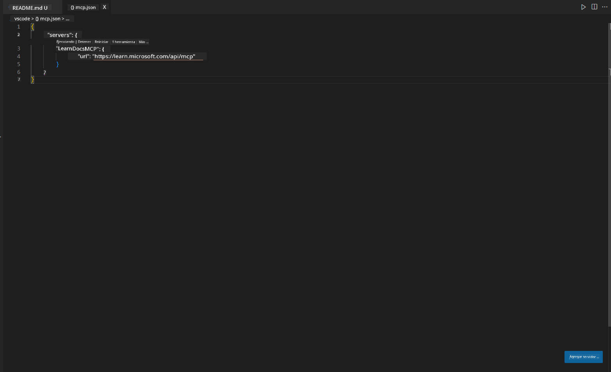
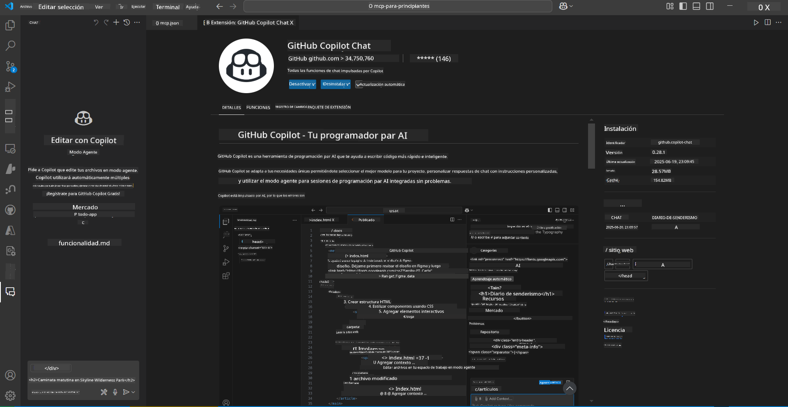
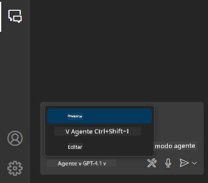
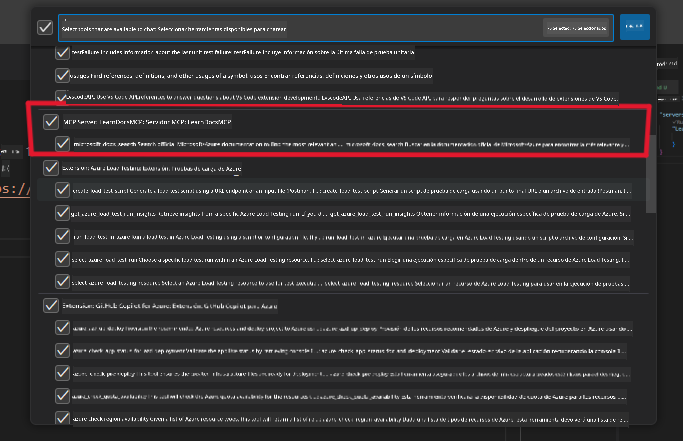
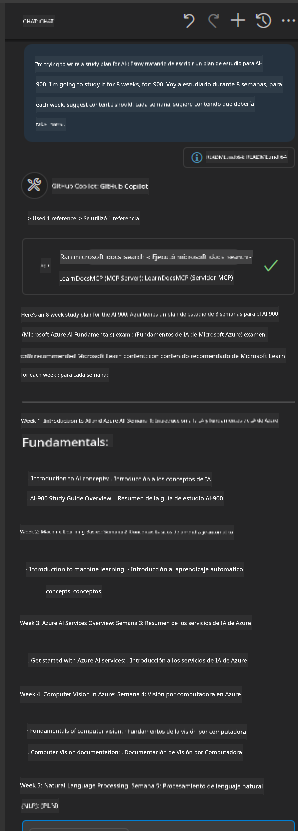
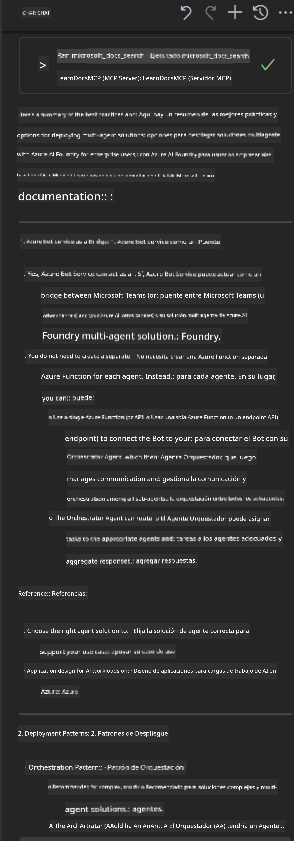

<!--
CO_OP_TRANSLATOR_METADATA:
{
  "original_hash": "db532b1ec386c9ce38c791653dc3c881",
  "translation_date": "2025-07-14T06:46:06+00:00",
  "source_file": "09-CaseStudy/docs-mcp/solution/scenario3/README.md",
  "language_code": "es"
}
-->
# Escenario 3: Documentación dentro del editor con el servidor MCP en VS Code

## Resumen

En este escenario, aprenderás cómo integrar Microsoft Learn Docs directamente en tu entorno de Visual Studio Code usando el servidor MCP. En lugar de estar cambiando constantemente entre pestañas del navegador para buscar documentación, podrás acceder, buscar y consultar la documentación oficial directamente desde tu editor. Este enfoque optimiza tu flujo de trabajo, te mantiene concentrado y permite una integración fluida con herramientas como GitHub Copilot.

- Busca y lee documentación dentro de VS Code sin salir de tu entorno de programación.
- Consulta documentación e inserta enlaces directamente en tus archivos README o de curso.
- Usa GitHub Copilot y MCP juntos para un flujo de trabajo de documentación potenciado por IA y sin interrupciones.

## Objetivos de aprendizaje

Al finalizar este capítulo, entenderás cómo configurar y usar el servidor MCP dentro de VS Code para mejorar tu flujo de trabajo de documentación y desarrollo. Podrás:

- Configurar tu espacio de trabajo para usar el servidor MCP en la búsqueda de documentación.
- Buscar e insertar documentación directamente desde VS Code.
- Combinar el poder de GitHub Copilot y MCP para un flujo de trabajo más productivo y potenciado por IA.

Estas habilidades te ayudarán a mantener el enfoque, mejorar la calidad de la documentación y aumentar tu productividad como desarrollador o redactor técnico.

## Solución

Para lograr acceso a la documentación dentro del editor, seguirás una serie de pasos que integran el servidor MCP con VS Code y GitHub Copilot. Esta solución es ideal para autores de cursos, redactores de documentación y desarrolladores que desean mantener el foco en el editor mientras trabajan con docs y Copilot.

- Añade rápidamente enlaces de referencia a un README mientras escribes documentación de un curso o proyecto.
- Usa Copilot para generar código y MCP para encontrar y citar al instante la documentación relevante.
- Mantente concentrado en tu editor y aumenta tu productividad.

### Guía paso a paso

Para comenzar, sigue estos pasos. Para cada paso, puedes añadir una captura de pantalla de la carpeta assets para ilustrar visualmente el proceso.

1. **Agrega la configuración MCP:**
   En la raíz de tu proyecto, crea un archivo `.vscode/mcp.json` y añade la siguiente configuración:
   ```json
   {
     "servers": {
       "LearnDocsMCP": {
         "url": "https://learn.microsoft.com/api/mcp"
       }
     }
   }
   ```
   Esta configuración indica a VS Code cómo conectarse al [`Microsoft Learn Docs MCP server`](https://github.com/MicrosoftDocs/mcp).
   
   
    
2. **Abre el panel de GitHub Copilot Chat:**
   Si aún no tienes instalada la extensión GitHub Copilot, ve a la vista de Extensiones en VS Code e instálala. Puedes descargarla directamente desde el [Visual Studio Code Marketplace](https://marketplace.visualstudio.com/items?itemName=GitHub.copilot-chat). Luego, abre el panel Copilot Chat desde la barra lateral.

   

3. **Activa el modo agente y verifica las herramientas:**
   En el panel Copilot Chat, activa el modo agente.

   

   Después de activar el modo agente, verifica que el servidor MCP aparezca como una de las herramientas disponibles. Esto asegura que el agente Copilot pueda acceder al servidor de documentación para obtener información relevante.
   
   
4. **Inicia un nuevo chat y haz consultas al agente:**
   Abre un chat nuevo en el panel Copilot Chat. Ahora puedes hacerle preguntas al agente sobre documentación. El agente usará el servidor MCP para obtener y mostrar la documentación relevante de Microsoft Learn directamente en tu editor.

   - *"Estoy tratando de escribir un plan de estudio para el tema X. Lo voy a estudiar durante 8 semanas, para cada semana, sugiéreme el contenido que debería tomar."*

   

5. **Consulta en vivo:**

   > Tomemos una consulta en vivo de la sección [#get-help](https://discord.gg/D6cRhjHWSC) en el Discord de Azure AI Foundry ([ver mensaje original](https://discord.com/channels/1113626258182504448/1385498306720829572)):
   
   *"Estoy buscando respuestas sobre cómo desplegar una solución multiagente con agentes de IA desarrollados en Azure AI Foundry. Veo que no hay un método de despliegue directo, como los canales de Copilot Studio. Entonces, ¿cuáles son las diferentes formas de hacer este despliegue para que los usuarios empresariales puedan interactuar y realizar el trabajo?
Hay numerosos artículos y blogs que dicen que podemos usar el servicio Azure Bot para hacer este trabajo, que puede actuar como puente entre MS Teams y los agentes de Azure AI Foundry. ¿Funcionará esto si configuro un bot de Azure que se conecte al Agente Orquestador en Azure AI Foundry mediante una función de Azure para realizar la orquestación, o necesito crear una función de Azure para cada uno de los agentes de IA que forman parte de la solución multiagente para hacer la orquestación en el Bot Framework? Cualquier otra sugerencia es bienvenida."*

   

   El agente responderá con enlaces y resúmenes de documentación relevantes, que luego podrás insertar directamente en tus archivos markdown o usar como referencia en tu código.
   
### Consultas de ejemplo

Aquí tienes algunas consultas que puedes probar. Estas consultas demostrarán cómo el servidor MCP y Copilot pueden trabajar juntos para proporcionar documentación instantánea, contextual y referencias sin salir de VS Code:

- "Muéstrame cómo usar los triggers de Azure Functions."
- "Inserta un enlace a la documentación oficial de Azure Key Vault."
- "¿Cuáles son las mejores prácticas para asegurar recursos de Azure?"
- "Encuentra un quickstart para los servicios de Azure AI."

Estas consultas demostrarán cómo el servidor MCP y Copilot pueden trabajar juntos para proporcionar documentación instantánea, contextual y referencias sin salir de VS Code.

---

**Aviso legal**:  
Este documento ha sido traducido utilizando el servicio de traducción automática [Co-op Translator](https://github.com/Azure/co-op-translator). Aunque nos esforzamos por la precisión, tenga en cuenta que las traducciones automáticas pueden contener errores o inexactitudes. El documento original en su idioma nativo debe considerarse la fuente autorizada. Para información crítica, se recomienda la traducción profesional realizada por humanos. No nos hacemos responsables de malentendidos o interpretaciones erróneas derivadas del uso de esta traducción.