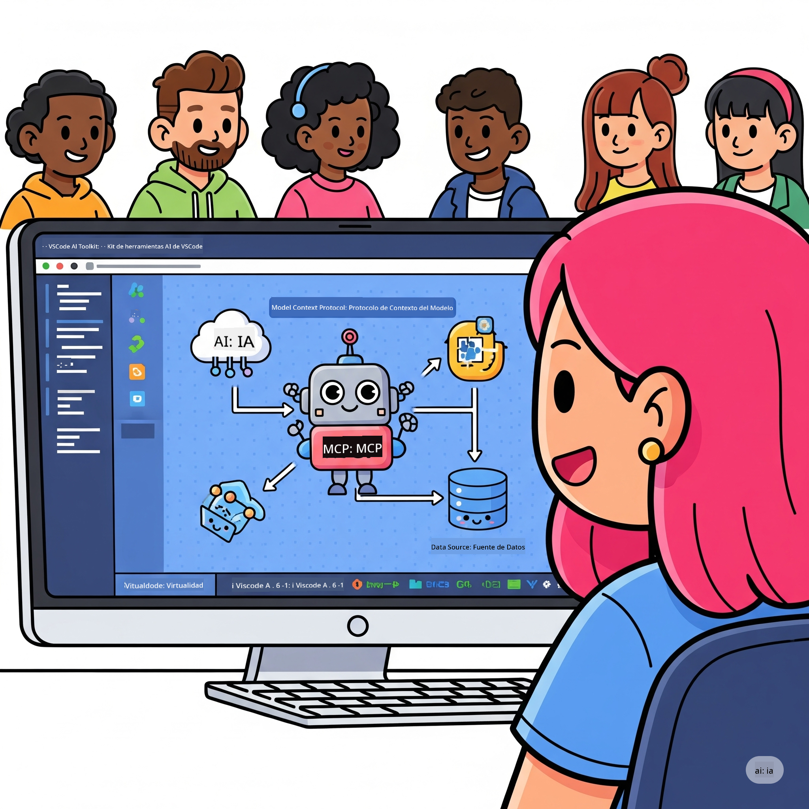
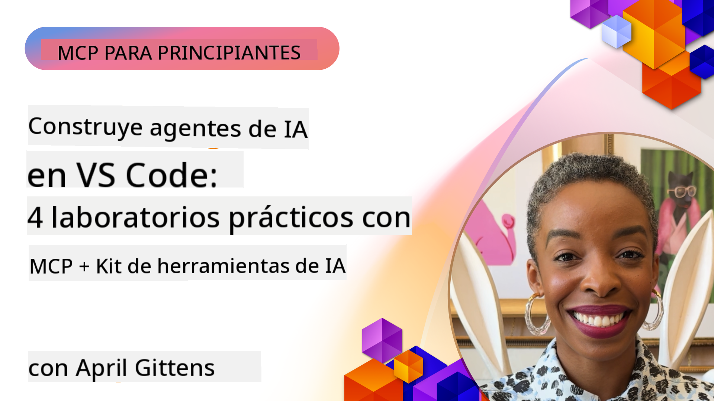

<!--
CO_OP_TRANSLATOR_METADATA:
{
  "original_hash": "1b000fd6e1b04c047578bfc5d07d54eb",
  "translation_date": "2025-07-29T00:54:06+00:00",
  "source_file": "10-StreamliningAIWorkflowsBuildingAnMCPServerWithAIToolkit/README.md",
  "language_code": "es"
}
-->
# Optimización de Flujos de Trabajo de IA: Construyendo un Servidor MCP con AI Toolkit

## 🎯  Descripción General

_(Haz clic en la imagen de arriba para ver el video de esta lección)_

¡Bienvenido al **Taller de Model Context Protocol (MCP)**! Este taller práctico combina dos tecnologías de vanguardia para revolucionar el desarrollo de aplicaciones de IA:

- **🔗 Model Context Protocol (MCP)**: Un estándar abierto para la integración fluida de herramientas de IA
- **🛠️ AI Toolkit para Visual Studio Code (AITK)**: La poderosa extensión de desarrollo de IA de Microsoft

### 🎓 Lo que Aprenderás

Al finalizar este taller, dominarás el arte de construir aplicaciones inteligentes que conecten modelos de IA con herramientas y servicios del mundo real. Desde pruebas automatizadas hasta integraciones personalizadas de API, adquirirás habilidades prácticas para resolver desafíos empresariales complejos.

## 🏗️ Tecnología Utilizada

### 🔌 Model Context Protocol (MCP)

MCP es el **"USB-C para la IA"**: un estándar universal que conecta modelos de IA con herramientas y fuentes de datos externas.

**✨ Características Clave:**

- 🔄 **Integración Estandarizada**: Interfaz universal para conexiones de herramientas de IA
- 🏛️ **Arquitectura Flexible**: Servidores locales y remotos mediante transporte stdio/SSE
- 🧰 **Ecosistema Rico**: Herramientas, prompts y recursos en un solo protocolo
- 🔒 **Preparado para Empresas**: Seguridad y confiabilidad integradas

**🎯 Por qué MCP es Importante:**
Así como el USB-C eliminó el caos de los cables, MCP elimina la complejidad de las integraciones de IA. Un protocolo, posibilidades infinitas.

### 🤖 AI Toolkit para Visual Studio Code (AITK)

La extensión insignia de Microsoft para el desarrollo de IA que transforma VS Code en una herramienta poderosa para IA.

**🚀 Capacidades Principales:**

- 📦 **Catálogo de Modelos**: Acceso a modelos de Azure AI, GitHub, Hugging Face, Ollama
- ⚡ **Inferencia Local**: Ejecución optimizada para CPU/GPU/NPU con ONNX
- 🏗️ **Constructor de Agentes**: Desarrollo visual de agentes de IA con integración MCP
- 🎭 **Multi-Modalidad**: Soporte para texto, visión y salidas estructuradas

**💡 Beneficios para el Desarrollo:**

- Despliegue de modelos sin configuración
- Ingeniería visual de prompts
- Entorno de pruebas en tiempo real
- Integración fluida con servidores MCP

## 📚 Ruta de Aprendizaje

### [🚀 Módulo 1: Fundamentos de AI Toolkit](./lab1/README.md)

**Duración**: 15 minutos

- 🛠️ Instalar y configurar AI Toolkit para VS Code
- 🗂️ Explorar el Catálogo de Modelos (100+ modelos de GitHub, ONNX, OpenAI, Anthropic, Google)
- 🎮 Dominar el Playground Interactivo para pruebas en tiempo real de modelos
- 🤖 Construir tu primer agente de IA con el Constructor de Agentes
- 📊 Evaluar el rendimiento de los modelos con métricas integradas (F1, relevancia, similitud, coherencia)
- ⚡ Aprender capacidades de procesamiento por lotes y soporte multi-modal

**🎯 Resultado de Aprendizaje**: Crear un agente de IA funcional con un entendimiento completo de las capacidades de AITK

### [🌐 Módulo 2: Fundamentos de MCP con AI Toolkit](./lab2/README.md)

**Duración**: 20 minutos

- 🧠 Dominar la arquitectura y conceptos del Model Context Protocol (MCP)
- 🌐 Explorar el ecosistema de servidores MCP de Microsoft
- 🤖 Construir un agente de automatización de navegador usando el servidor MCP de Playwright
- 🔧 Integrar servidores MCP con el Constructor de Agentes de AI Toolkit
- 📊 Configurar y probar herramientas MCP dentro de tus agentes
- 🚀 Exportar y desplegar agentes potenciados por MCP para uso en producción

**🎯 Resultado de Aprendizaje**: Desplegar un agente de IA potenciado con herramientas externas a través de MCP

### [🔧 Módulo 3: Desarrollo Avanzado de MCP con AI Toolkit](./lab3/README.md)

**Duración**: 20 minutos

- 💻 Crear servidores MCP personalizados usando AI Toolkit
- 🐍 Configurar y usar el último SDK de Python para MCP (v1.9.3)
- 🔍 Configurar y utilizar MCP Inspector para depuración
- 🛠️ Construir un Servidor MCP de Clima con flujos de trabajo de depuración profesional
- 🧪 Depurar servidores MCP en entornos de Constructor de Agentes e Inspector

**🎯 Resultado de Aprendizaje**: Desarrollar y depurar servidores MCP personalizados con herramientas modernas

### [🐙 Módulo 4: Desarrollo Práctico de MCP - Servidor Personalizado de Clonación de GitHub](./lab4/README.md)

**Duración**: 30 minutos

- 🏗️ Construir un Servidor MCP de Clonación de GitHub para flujos de trabajo de desarrollo
- 🔄 Implementar clonación inteligente de repositorios con validación y manejo de errores
- 📁 Crear gestión inteligente de directorios e integración con VS Code
- 🤖 Usar el Modo de Agente de GitHub Copilot con herramientas MCP personalizadas
- 🛡️ Aplicar confiabilidad lista para producción y compatibilidad multiplataforma

**🎯 Resultado de Aprendizaje**: Desplegar un servidor MCP listo para producción que optimice flujos de trabajo reales de desarrollo

## 💡 Aplicaciones Reales e Impacto

### 🏢 Casos de Uso Empresariales

#### 🔄 Automatización DevOps

Transforma tu flujo de trabajo de desarrollo con automatización inteligente:

- **Gestión Inteligente de Repositorios**: Revisión de código y decisiones de fusión impulsadas por IA
- **CI/CD Inteligente**: Optimización automática de pipelines basada en cambios de código
- **Clasificación de Incidencias**: Clasificación y asignación automática de errores

#### 🧪 Revolución en Aseguramiento de Calidad

Eleva las pruebas con automatización impulsada por IA:

- **Generación Inteligente de Pruebas**: Creación automática de suites de pruebas completas
- **Pruebas de Regresión Visual**: Detección de cambios en la interfaz con IA
- **Monitoreo de Rendimiento**: Identificación y resolución proactiva de problemas

#### 📊 Inteligencia en Flujos de Datos

Construye flujos de procesamiento de datos más inteligentes:

- **Procesos ETL Adaptativos**: Transformaciones de datos auto-optimizadas
- **Detección de Anomalías**: Monitoreo de calidad de datos en tiempo real
- **Enrutamiento Inteligente**: Gestión inteligente del flujo de datos

#### 🎧 Mejora de la Experiencia del Cliente

Crea interacciones excepcionales con los clientes:

- **Soporte Contextual**: Agentes de IA con acceso al historial del cliente
- **Resolución Proactiva de Problemas**: Servicio al cliente predictivo
- **Integración Multicanal**: Experiencia unificada de IA en todas las plataformas

## 🛠️ Requisitos Previos y Configuración

### 💻 Requisitos del Sistema

| Componente | Requisito | Notas |
|------------|-----------|-------|
| **Sistema Operativo** | Windows 10+, macOS 10.15+, Linux | Cualquier SO moderno |
| **Visual Studio Code** | Última versión estable | Requerido para AITK |
| **Node.js** | v18.0+ y npm | Para desarrollo de servidores MCP |
| **Python** | 3.10+ | Opcional para servidores MCP en Python |
| **Memoria** | Mínimo 8GB de RAM | 16GB recomendados para modelos locales |

### 🔧 Entorno de Desarrollo

#### Extensiones Recomendadas para VS Code

- **AI Toolkit** (ms-windows-ai-studio.windows-ai-studio)
- **Python** (ms-python.python)
- **Depurador de Python** (ms-python.debugpy)
- **GitHub Copilot** (GitHub.copilot) - Opcional pero útil

#### Herramientas Opcionales

- **uv**: Administrador de paquetes moderno para Python
- **MCP Inspector**: Herramienta visual de depuración para servidores MCP
- **Playwright**: Para ejemplos de automatización web

## 🎖️ Resultados de Aprendizaje y Ruta de Certificación

### 🏆 Lista de Verificación de Habilidades

Al completar este taller, lograrás dominar:

#### 🎯 Competencias Clave

- [ ] **Dominio del Protocolo MCP**: Entendimiento profundo de la arquitectura y patrones de implementación
- [ ] **Dominio de AITK**: Uso experto de AI Toolkit para desarrollo rápido
- [ ] **Desarrollo de Servidores Personalizados**: Construcción, despliegue y mantenimiento de servidores MCP en producción
- [ ] **Excelencia en Integración de Herramientas**: Conexión fluida de IA con flujos de trabajo existentes
- [ ] **Aplicación para Resolución de Problemas**: Aplicar habilidades aprendidas a desafíos empresariales reales

#### 🔧 Habilidades Técnicas

- [ ] Configurar e instalar AI Toolkit en VS Code
- [ ] Diseñar e implementar servidores MCP personalizados
- [ ] Integrar Modelos de GitHub con la arquitectura MCP
- [ ] Construir flujos de trabajo de pruebas automatizadas con Playwright
- [ ] Desplegar agentes de IA para uso en producción
- [ ] Depurar y optimizar el rendimiento de servidores MCP

#### 🚀 Capacidades Avanzadas

- [ ] Diseñar integraciones de IA a escala empresarial
- [ ] Implementar mejores prácticas de seguridad para aplicaciones de IA
- [ ] Diseñar arquitecturas escalables de servidores MCP
- [ ] Crear cadenas de herramientas personalizadas para dominios específicos
- [ ] Mentorear a otros en desarrollo nativo de IA

## 📖 Recursos Adicionales

- [Especificación MCP](https://modelcontextprotocol.io/docs)
- [Repositorio de AI Toolkit en GitHub](https://github.com/microsoft/vscode-ai-toolkit)
- [Colección de Servidores MCP de Ejemplo](https://github.com/modelcontextprotocol/servers)
- [Guía de Mejores Prácticas](https://modelcontextprotocol.io/docs/best-practices)

---

**🚀 ¿Listo para revolucionar tu flujo de trabajo de desarrollo de IA?**

¡Construyamos juntos el futuro de las aplicaciones inteligentes con MCP y AI Toolkit!

**Descargo de responsabilidad**:  
Este documento ha sido traducido utilizando el servicio de traducción automática [Co-op Translator](https://github.com/Azure/co-op-translator). Si bien nos esforzamos por lograr precisión, tenga en cuenta que las traducciones automáticas pueden contener errores o imprecisiones. El documento original en su idioma nativo debe considerarse como la fuente autorizada. Para información crítica, se recomienda una traducción profesional realizada por humanos. No nos hacemos responsables de malentendidos o interpretaciones erróneas que puedan surgir del uso de esta traducción.