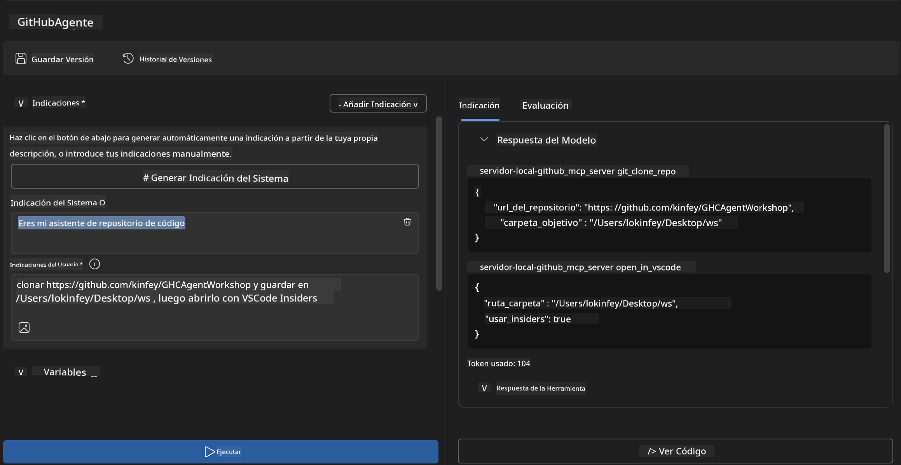
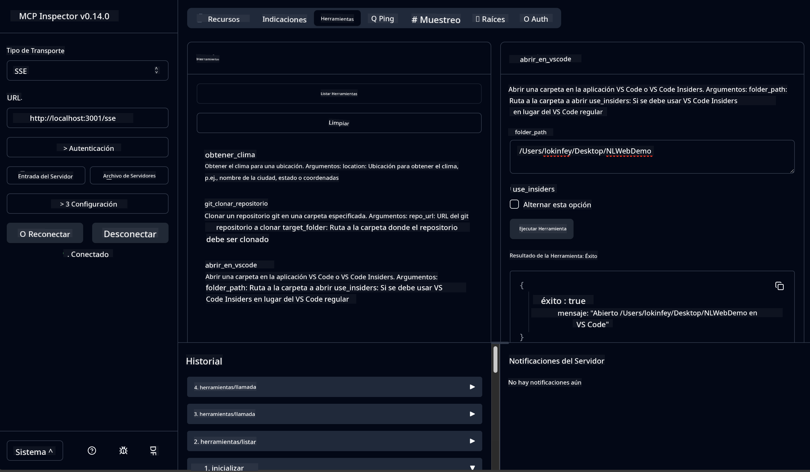

<!--
CO_OP_TRANSLATOR_METADATA:
{
  "original_hash": "f83bc722dc758efffd68667d6a1db470",
  "translation_date": "2025-06-10T06:39:37+00:00",
  "source_file": "10-StreamliningAIWorkflowsBuildingAnMCPServerWithAIToolkit/lab4/README.md",
  "language_code": "es"
}
-->
# 🐙 Módulo 4: Desarrollo Práctico de MCP - Servidor Personalizado de Clonación de GitHub


> **⚡ Inicio Rápido:** ¡Construye un servidor MCP listo para producción que automatiza la clonación de repositorios GitHub e integración con VS Code en solo 30 minutos!

## 🎯 Objetivos de Aprendizaje

Al finalizar este laboratorio, podrás:

- ✅ Crear un servidor MCP personalizado para flujos de trabajo de desarrollo reales
- ✅ Implementar la funcionalidad de clonación de repositorios GitHub a través de MCP
- ✅ Integrar servidores MCP personalizados con VS Code y Agent Builder
- ✅ Usar GitHub Copilot Agent Mode con herramientas MCP personalizadas
- ✅ Probar y desplegar servidores MCP personalizados en entornos de producción

## 📋 Requisitos Previos

- Haber completado los Laboratorios 1-3 (fundamentos de MCP y desarrollo avanzado)
- Suscripción a GitHub Copilot ([registro gratuito disponible](https://github.com/github-copilot/signup))
- VS Code con las extensiones AI Toolkit y GitHub Copilot instaladas
- Git CLI instalado y configurado

## 🏗️ Resumen del Proyecto

### **Desafío de Desarrollo Real**
Como desarrolladores, usamos GitHub con frecuencia para clonar repositorios y abrirlos en VS Code o VS Code Insiders. Este proceso manual implica:
1. Abrir la terminal o símbolo del sistema
2. Navegar al directorio deseado
3. Ejecutar el comando `git clone`
4. Abrir VS Code en el directorio clonado

**¡Nuestra solución MCP simplifica todo esto en un solo comando inteligente!**

### **Lo que Construirás**
Un **Servidor MCP de Clonación GitHub** (`git_mcp_server`) que ofrece:

| Funcionalidad | Descripción | Beneficio |
|---------------|-------------|-----------|
| 🔄 **Clonación Inteligente de Repositorios** | Clona repositorios GitHub con validación | Verificación automática de errores |
| 📁 **Gestión Inteligente de Directorios** | Verifica y crea directorios de forma segura | Evita sobreescrituras |
| 🚀 **Integración Multiplataforma con VS Code** | Abre proyectos en VS Code/Insiders | Transición fluida en el flujo de trabajo |
| 🛡️ **Manejo Robusto de Errores** | Gestiona problemas de red, permisos y rutas | Fiabilidad lista para producción |

---

## 📖 Implementación Paso a Paso

### Paso 1: Crear el Agente GitHub en Agent Builder

1. **Inicia Agent Builder** desde la extensión AI Toolkit
2. **Crea un nuevo agente** con la siguiente configuración:
   ```
   Agent Name: GitHubAgent
   ```

3. **Inicializa el servidor MCP personalizado:**
   - Ve a **Tools** → **Add Tool** → **MCP Server**
   - Selecciona **"Create A new MCP Server"**
   - Elige la plantilla **Python** para máxima flexibilidad
   - **Nombre del Servidor:** `git_mcp_server`

### Paso 2: Configurar GitHub Copilot Agent Mode

1. **Abre GitHub Copilot** en VS Code (Ctrl/Cmd + Shift + P → "GitHub Copilot: Open")
2. **Selecciona el Modelo de Agente** en la interfaz de Copilot
3. **Elige el modelo Claude 3.7** para capacidades avanzadas de razonamiento
4. **Activa la integración MCP** para acceso a herramientas

> **💡 Consejo Profesional:** Claude 3.7 ofrece una comprensión superior de flujos de trabajo de desarrollo y patrones de manejo de errores.

### Paso 3: Implementar la Funcionalidad Principal del Servidor MCP

**Usa el siguiente prompt detallado con GitHub Copilot Agent Mode:**

```
Create two MCP tools with the following comprehensive requirements:

🔧 TOOL A: clone_repository
Requirements:
- Clone any GitHub repository to a specified local folder
- Return the absolute path of the successfully cloned project
- Implement comprehensive validation:
  ✓ Check if target directory already exists (return error if exists)
  ✓ Validate GitHub URL format (https://github.com/user/repo)
  ✓ Verify git command availability (prompt installation if missing)
  ✓ Handle network connectivity issues
  ✓ Provide clear error messages for all failure scenarios

🚀 TOOL B: open_in_vscode
Requirements:
- Open specified folder in VS Code or VS Code Insiders
- Cross-platform compatibility (Windows/Linux/macOS)
- Use direct application launch (not terminal commands)
- Auto-detect available VS Code installations
- Handle cases where VS Code is not installed
- Provide user-friendly error messages

Additional Requirements:
- Follow MCP 1.9.3 best practices
- Include proper type hints and documentation
- Implement logging for debugging purposes
- Add input validation for all parameters
- Include comprehensive error handling
```

### Paso 4: Probar tu Servidor MCP

#### 4a. Prueba en Agent Builder

1. **Inicia la configuración de depuración** en Agent Builder
2. **Configura tu agente con este prompt del sistema:**

```
SYSTEM_PROMPT:
You are my intelligent coding repository assistant. You help developers efficiently clone GitHub repositories and set up their development environment. Always provide clear feedback about operations and handle errors gracefully.
```

3. **Prueba con escenarios de usuario realistas:**

```
USER_PROMPT EXAMPLES:

Scenario : Basic Clone and Open
"Clone {Your GitHub Repo link such as https://github.com/kinfey/GHCAgentWorkshop
 } and save to {The global path you specify}, then open it with VS Code Insiders"
```



**Resultados Esperados:**
- ✅ Clonación exitosa con confirmación de ruta
- ✅ Lanzamiento automático de VS Code
- ✅ Mensajes claros de error para escenarios inválidos
- ✅ Manejo adecuado de casos límite

#### 4b. Prueba en MCP Inspector



---

**🎉 ¡Felicidades!** Has creado exitosamente un servidor MCP práctico y listo para producción que resuelve desafíos reales en flujos de trabajo de desarrollo. Tu servidor personalizado de clonación GitHub demuestra el poder de MCP para automatizar y mejorar la productividad de los desarrolladores.

### 🏆 Logros Desbloqueados:
- ✅ **Desarrollador MCP** - Creación de servidor MCP personalizado
- ✅ **Automatizador de Flujos** - Optimización de procesos de desarrollo  
- ✅ **Experto en Integración** - Conexión de múltiples herramientas de desarrollo
- ✅ **Listo para Producción** - Soluciones desplegables construidas

---

## 🎓 Finalización del Taller: Tu Camino con Model Context Protocol

**Estimado participante del taller,**

¡Felicidades por completar los cuatro módulos del taller Model Context Protocol! Has avanzado mucho, desde comprender conceptos básicos del AI Toolkit hasta construir servidores MCP listos para producción que resuelven desafíos reales de desarrollo.

### 🚀 Resumen de tu Ruta de Aprendizaje:

**[Módulo 1](../lab1/README.md)**: Comenzaste explorando fundamentos del AI Toolkit, pruebas de modelos y creación de tu primer agente AI.

**[Módulo 2](../lab2/README.md)**: Aprendiste la arquitectura MCP, integraste Playwright MCP y construiste tu primer agente de automatización de navegador.

**[Módulo 3](../lab3/README.md)**: Avanzaste al desarrollo de servidores MCP personalizados con el servidor Weather MCP y dominaste herramientas de depuración.

**[Módulo 4](../lab4/README.md)**: Ahora aplicaste todo para crear una herramienta práctica de automatización del flujo de trabajo con repositorios GitHub.

### 🌟 Lo que Has Dominado:

- ✅ **Ecosistema AI Toolkit**: Modelos, agentes y patrones de integración
- ✅ **Arquitectura MCP**: Diseño cliente-servidor, protocolos de transporte y seguridad
- ✅ **Herramientas para Desarrolladores**: Desde Playground hasta Inspector y despliegue en producción
- ✅ **Desarrollo Personalizado**: Construcción, prueba y despliegue de tus propios servidores MCP
- ✅ **Aplicaciones Prácticas**: Resolución de desafíos reales de flujo de trabajo con IA

### 🔮 Tus Próximos Pasos:

1. **Construye tu propio servidor MCP**: Aplica estas habilidades para automatizar tus flujos únicos
2. **Únete a la comunidad MCP**: Comparte tus creaciones y aprende de otros
3. **Explora integraciones avanzadas**: Conecta servidores MCP con sistemas empresariales
4. **Contribuye al código abierto**: Ayuda a mejorar las herramientas y documentación MCP

Recuerda, este taller es solo el comienzo. El ecosistema Model Context Protocol evoluciona rápidamente, y ahora estás preparado para estar a la vanguardia de las herramientas de desarrollo impulsadas por IA.

**¡Gracias por tu participación y dedicación al aprendizaje!**

Esperamos que este taller haya despertado ideas que transformarán la forma en que construyes e interactúas con herramientas de IA en tu camino como desarrollador.

**¡Feliz codificación!**

---

**Aviso Legal**:  
Este documento ha sido traducido utilizando el servicio de traducción automática [Co-op Translator](https://github.com/Azure/co-op-translator). Aunque nos esforzamos por la precisión, tenga en cuenta que las traducciones automáticas pueden contener errores o inexactitudes. El documento original en su idioma nativo debe considerarse la fuente autorizada. Para información crítica, se recomienda una traducción profesional realizada por humanos. No nos hacemos responsables de malentendidos o interpretaciones erróneas derivadas del uso de esta traducción.