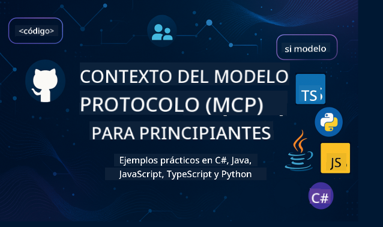

<!--
CO_OP_TRANSLATOR_METADATA:
{
  "original_hash": "2a21391378c12ecfef50f866329dfde0",
  "translation_date": "2025-05-17T05:05:39+00:00",
  "source_file": "README.md",
  "language_code": "es"
}
-->

Sigue estos pasos para comenzar a usar estos recursos:
1. **Haz un Fork del Repositorio**: Haz clic en 
2. **Clona el Repositorio**: `git clone https://github.com/microsoft/mcp-for-beginners.git`
3. [**Únete al Discord de Microsoft Azure AI Foundry y conoce a expertos y otros desarrolladores**](https://discord.com/invite/ByRwuEEgH4)

### 🌐 Soporte Multi-Idioma

#### Soportado a través de GitHub Action (Automatizado y siempre actualizado)
[Francés](../fr/README.md) | [Español](./README.md) | [Alemán](../de/README.md) | [Ruso](../ru/README.md) | [Árabe](../ar/README.md) | [Persa (Farsi)](../fa/README.md) | [Urdu](../ur/README.md) | [Chino (Simplificado)](../zh/README.md) | [Chino (Tradicional, Macao)](../mo/README.md) | [Chino (Tradicional, Hong Kong)](../hk/README.md) | [Chino (Tradicional, Taiwán)](../tw/README.md) | [Japonés](../ja/README.md) | [Coreano](../ko/README.md) | [Hindi](../hi/README.md) | [Bengalí](../bn/README.md) | [Maratí](../mr/README.md) | [Nepalí](../ne/README.md) | [Panyabí (Gurmukhi)](../pa/README.md) | [Portugués (Portugal)](../pt/README.md) | [Portugués (Brasil)](../br/README.md) | [Italiano](../it/README.md) | [Polaco](../pl/README.md) | [Turco](../tr/README.md) | [Griego](../el/README.md) | [Tailandés](../th/README.md) | [Sueco](../sv/README.md) | [Danés](../da/README.md) | [Noruego](../no/README.md) | [Finlandés](../fi/README.md) | [Holandés](../nl/README.md) | [Hebreo](../he/README.md) | [Vietnamita](../vi/README.md) | [Indonesio](../id/README.md) | [Malayo](../ms/README.md) | [Tagalo (Filipino)](../tl/README.md) | [Suajili](../sw/README.md) | [Húngaro](../hu/README.md) | [Checo](../cs/README.md) | [Eslovaco](../sk/README.md) | [Rumano](../ro/README.md) | [Búlgaro](../bg/README.md) | [Serbio (Cirílico)](../sr/README.md) | [Croata](../hr/README.md) | [Esloveno](../sl/README.md)
# 🚀 Guía definitiva del Currículum del Protocolo de Contexto de Modelo (MCP) para principiantes

## **Aprende MCP con ejemplos de código práctico en C#, Java, JavaScript, Python y TypeScript**

## 🧠 Resumen del Currículum del Protocolo de Contexto de Modelo

El **Protocolo de Contexto de Modelo (MCP)** es un marco innovador diseñado para estandarizar las interacciones entre modelos de IA y aplicaciones cliente. Este currículum de código abierto ofrece un camino de aprendizaje estructurado, completo con ejemplos de codificación práctica y casos de uso del mundo real, en lenguajes de programación populares como C#, Java, JavaScript, TypeScript y Python.

Ya seas un desarrollador de IA, arquitecto de sistemas o ingeniero de software, esta guía es tu recurso integral para dominar los fundamentos y estrategias de implementación de MCP.

## 🔗 Recursos oficiales de MCP

- 📘 [Documentación de MCP](https://modelcontextprotocol.io/) – Tutoriales detallados y guías de usuario  
- 📜 [Especificación de MCP](https://spec.modelcontextprotocol.io/) – Arquitectura del protocolo y referencias técnicas  
- 🧑‍💻 [Repositorio de GitHub de MCP](https://github.com/modelcontextprotocol) – SDKs de código abierto, herramientas y ejemplos de código  

## 🧭 Estructura completa del currículum de MCP

### 📌 [Introducción a MCP](./00-Introduction/README.md)

- ¿Qué es el Protocolo de Contexto de Modelo?
- Por qué la estandarización es importante en los flujos de trabajo de IA
- Casos de uso prácticos y beneficios de MCP

### 🧩 [Conceptos clave explicados](./01-CoreConcepts/README.md)

- Entender la arquitectura cliente-servidor en MCP
- Componentes clave del protocolo: solicitudes, respuestas y esquemas
- Patrones de mensajería e intercambio de datos en MCP

### 🔐 [Seguridad en MCP](./02-Security/readme.md)

- Identificación de amenazas de seguridad en sistemas basados en MCP
- Técnicas y mejores prácticas para asegurar las implementaciones

### 🚀 [Comenzando con MCP](./03-GettingStarted/README.md)

- Configuración del entorno
- Creación de servidores y clientes MCP básicos
- Integración de MCP con aplicaciones existentes

#### 🧮 Proyectos de muestra de calculadora MCP:

  
<strong>Explora implementaciones de código por lenguaje</strong>

  - [Ejemplo de servidor MCP en C#](./03-GettingStarted/samples/csharp/README.md)
  - [Calculadora MCP en Java](./03-GettingStarted/samples/java/calculator/README.md)
  - [Demo MCP en JavaScript](./03-GettingStarted/samples/javascript/README.md)
  - [Servidor MCP en Python](../../03-GettingStarted/samples/python/mcp_calculator_server.py)
  - [Ejemplo MCP en TypeScript](./03-GettingStarted/samples/typescript/README.md)

### 🛠️ [Implementación práctica](./04-PracticalImplementation/README.md)

- Uso de SDKs en diferentes lenguajes
- Depuración, pruebas y validación
- Creación de plantillas de solicitud y flujos de trabajo reutilizables

#### 💡 Proyectos avanzados de calculadora MCP:

  
<strong>Explora muestras avanzadas</strong>

  - [Muestra avanzada en C#](./04-PracticalImplementation/samples/csharp/README.md)
  - [Ejemplo de aplicación de contenedor en Java](./04-PracticalImplementation/samples/java/containerapp/README.md)
  - [Muestra avanzada en JavaScript](./04-PracticalImplementation/samples/javascript/README.md)
  - [Implementación compleja en Python](../../04-PracticalImplementation/samples/python/mcp_sample.py)
  - [Muestra de contenedor en TypeScript](./04-PracticalImplementation/samples/typescript/README.md)

### 🎓 [Temas avanzados en MCP](./05-AdvancedTopics/README.md)

- Flujos de trabajo de IA multimodal y extensibilidad
- Estrategias de escalado seguro
- MCP en ecosistemas empresariales

### 🌍 [Contribuciones de la comunidad](./06-CommunityContributions/README.md)

- Cómo contribuir con código y documentación
- Colaboración a través de GitHub
- Mejoras y retroalimentación impulsadas por la comunidad

### 📈 [Perspectivas de la adopción temprana](./07-CaseStudies/README.md)

- Implementaciones en el mundo real y lo que funcionó
- Construcción y despliegue de soluciones basadas en MCP
- Tendencias y hoja de ruta futura

### 📏 [Mejores prácticas para MCP](./08-BestPractices/README.md)

- Ajuste de rendimiento y optimización
- Diseño de sistemas MCP tolerantes a fallos
- Estrategias de prueba y resiliencia

### 📊 [Estudios de caso de MCP](./09-CaseStudy/Readme.md)

- Análisis detallado de arquitecturas de soluciones MCP
- Planos de despliegue y consejos de integración
- Diagramas anotados y recorridos de proyectos

## 🎯 Prerrequisitos para aprender MCP

Para aprovechar al máximo este currículum, deberías tener:

- Conocimientos básicos de C#, Java o Python
- Comprensión del modelo cliente-servidor y APIs
- (Opcional) Familiaridad con conceptos de aprendizaje automático

## 🛠️ Cómo utilizar este currículum de manera efectiva

Cada lección en esta guía incluye:

1. Explicaciones claras de los conceptos de MCP  
2. Ejemplos de código en vivo en múltiples lenguajes  
3. Ejercicios para construir aplicaciones MCP reales  
4. Recursos adicionales para estudiantes avanzados  

## 📜 Información de licencia

Este contenido está licenciado bajo la **Licencia MIT**. Para términos y condiciones, consulta el [LICENSE](../../LICENSE).

## 🤝 Directrices de contribución

Este proyecto da la bienvenida a contribuciones y sugerencias. La mayoría de las contribuciones requieren que aceptes un
Acuerdo de Licencia de Contribuyente (CLA) declarando que tienes el derecho de, y realmente lo haces, otorgarnos
los derechos para usar tu contribución. Para más detalles, visita <https://cla.opensource.microsoft.com>.

Cuando envíes una solicitud de extracción, un bot de CLA determinará automáticamente si necesitas proporcionar
un CLA y decorará el PR apropiadamente (por ejemplo, verificación de estado, comentario). Simplemente sigue las instrucciones
proporcionadas por el bot. Solo necesitarás hacer esto una vez en todos los repositorios que utilicen nuestro CLA.

Este proyecto ha adoptado el [Código de Conducta de Código Abierto de Microsoft](https://opensource.microsoft.com/codeofconduct/).
Para más información, consulta las [Preguntas Frecuentes del Código de Conducta](https://opensource.microsoft.com/codeofconduct/faq/) o
contacta a [opencode@microsoft.com](mailto:opencode@microsoft.com) para cualquier pregunta o comentario adicional.

## ™️ Aviso de marca registrada

Este proyecto puede contener marcas registradas o logotipos para proyectos, productos o servicios. El uso autorizado de las
marcas registradas o logotipos de Microsoft está sujeto y debe seguir
las [Directrices de Marca y Uso de Microsoft](https://www.microsoft.com/legal/intellectualproperty/trademarks/usage/general).
El uso de marcas registradas o logotipos de Microsoft en versiones modificadas de este proyecto no debe causar confusión o implicar patrocinio de Microsoft.
Cualquier uso de marcas registradas o logotipos de terceros está sujeto a las políticas de esos terceros.

**Descargo de responsabilidad**:  
Este documento ha sido traducido utilizando el servicio de traducción automática [Co-op Translator](https://github.com/Azure/co-op-translator). Aunque nos esforzamos por lograr precisión, tenga en cuenta que las traducciones automáticas pueden contener errores o imprecisiones. El documento original en su idioma nativo debe considerarse la fuente autorizada. Para información crítica, se recomienda la traducción profesional humana. No somos responsables de ningún malentendido o interpretación errónea que surja del uso de esta traducción.