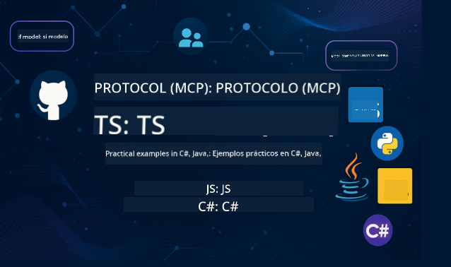

<!--
CO_OP_TRANSLATOR_METADATA:
{
  "original_hash": "b7cce20db5b5b3e9daa5db2e162aa3cf",
  "translation_date": "2025-08-12T20:21:34+00:00",
  "source_file": "README.md",
  "language_code": "es"
}
-->
 

Sigue estos pasos para comenzar a usar estos recursos:
1. **Haz un Fork del Repositorio**: Haz clic en 
2. **Clona el Repositorio**:   `git clone https://github.com/microsoft/mcp-for-beginners.git`
3. [**Únete al Discord de Azure AI Foundry y conecta con expertos y otros desarrolladores**](https://discord.com/invite/ByRwuEEgH4)

### 🌐 Soporte Multilingüe

#### Disponible a través de GitHub Action (Automatizado y Siempre Actualizado)

 [Árabe](../ar/README.md) | [Bengalí](../bn/README.md) | [Búlgaro](../bg/README.md) | [Birmano (Myanmar)](../my/README.md) | [Chino (Simplificado)](../zh/README.md) | [Chino (Tradicional, Hong Kong)](../hk/README.md) | [Chino (Tradicional, Macao)](../mo/README.md) | [Chino (Tradicional, Taiwán)](../tw/README.md) | [Croata](../hr/README.md) | [Checo](../cs/README.md) | [Danés](../da/README.md) | [Holandés](../nl/README.md) | [Finlandés](../fi/README.md) | [Francés](../fr/README.md) | [Alemán](../de/README.md) | [Griego](../el/README.md) | [Hebreo](../he/README.md) | [Hindi](../hi/README.md) | [Húngaro](../hu/README.md) | [Indonesio](../id/README.md) | [Italiano](../it/README.md) | [Japonés](../ja/README.md) | [Coreano](../ko/README.md) | [Malayo](../ms/README.md) | [Maratí](../mr/README.md) | [Nepalí](../ne/README.md) | [Noruego](../no/README.md) | [Persa (Farsi)](../fa/README.md) | [Polaco](../pl/README.md) | [Portugués (Brasil)](../br/README.md) | [Portugués (Portugal)](../pt/README.md) | [Panyabí (Gurmukhi)](../pa/README.md) | [Rumano](../ro/README.md) | [Ruso](../ru/README.md) | [Serbio (Cirílico)](../sr/README.md) | [Eslovaco](../sk/README.md) | [Esloveno](../sl/README.md) | [Español](./README.md) | [Suajili](../sw/README.md) | [Sueco](../sv/README.md) | [Tagalo (Filipino)](../tl/README.md) | [Tailandés](../th/README.md) | [Turco](../tr/README.md) | [Ucraniano](../uk/README.md) | [Urdu](../ur/README.md) | [Vietnamita](../vi/README.md)

# 🚀 Currículo del Protocolo de Contexto de Modelo (MCP) para Principiantes

## **Aprende MCP con Ejemplos Prácticos de Código en C#, Java, JavaScript, Rust, Python y TypeScript**

## 🧠 Resumen del Currículo del Protocolo de Contexto de Modelo

El **Protocolo de Contexto de Modelo (MCP)** es un marco innovador diseñado para estandarizar las interacciones entre modelos de IA y aplicaciones cliente. Este currículo de código abierto ofrece un camino de aprendizaje estructurado, con ejemplos prácticos de codificación y casos de uso del mundo real, en lenguajes de programación populares como C#, Java, JavaScript, TypeScript y Python.

Ya seas un desarrollador de IA, arquitecto de sistemas o ingeniero de software, esta guía es tu recurso integral para dominar los fundamentos y estrategias de implementación de MCP.

## 🔗 Recursos Oficiales de MCP

- 📘 [Documentación de MCP](https://modelcontextprotocol.io/) – Tutoriales detallados y guías de usuario  
- 📜 [Especificación de MCP](https://modelcontextprotocol.io/docs/) – Arquitectura del protocolo y referencias técnicas  
- 📜 [Especificación Original de MCP](https://spec.modelcontextprotocol.io/) – Referencias técnicas heredadas (pueden contener detalles adicionales)  
- 🧑‍💻 [Repositorio de GitHub de MCP](https://github.com/modelcontextprotocol) – SDKs de código abierto, herramientas y ejemplos de código
- 🌐 [Comunidad de MCP](https://github.com/orgs/modelcontextprotocol/discussions) – Únete a discusiones y contribuye a la comunidad

### ➡️Mira Bajo Demanda - MCP Dev Days
Prepárate para dos días de conocimiento técnico profundo, conexión comunitaria y aprendizaje práctico en MCP Dev Days, un evento virtual dedicado al Protocolo de Contexto de Modelo (MCP), el estándar emergente que conecta modelos de IA con las herramientas que necesitan.

Puedes ver MCP Dev Days registrándote en nuestra página del evento: https://aka.ms/mcpdevdays. 

#### Día 1: Productividad, Herramientas de Desarrollo y Comunidad de MCP:

Se trata de empoderar a los desarrolladores para usar MCP en su flujo de trabajo y celebrar la increíble comunidad de MCP. Estaremos acompañados por miembros de la comunidad y socios como Arcade, Block, Okta y Neon para ver cómo están colaborando con Microsoft para dar forma a un ecosistema MCP abierto y extensible.  
Demos del mundo real en VS Code, Visual Studio, GitHub Copilot y herramientas populares de la comunidad  
Flujos de trabajo prácticos y orientados al contexto  
Sesiones lideradas por la comunidad e ideas  
Ya sea que estés comenzando con MCP o ya estés construyendo con él, el Día 1 establecerá el escenario con inspiración y acciones concretas.

#### Día 2: Construye Servidores MCP con Confianza

Está dirigido a los constructores de MCP. Profundizaremos en estrategias de implementación y mejores prácticas para crear servidores MCP e integrar MCP en tus flujos de trabajo de IA.

### Temas incluyen:

- Construcción de servidores MCP e integración en experiencias de agentes
- Desarrollo impulsado por prompts
- Mejores prácticas de seguridad
- Uso de bloques de construcción como Functions, ACA y API Management
- Alineación de registros y herramientas (1P + 3P)

Si eres un desarrollador, creador de herramientas o estratega de productos de IA, este día está lleno de ideas que necesitas para construir soluciones MCP escalables, seguras y preparadas para el futuro.

## 🧭 Resumen del Currículo de MCP

### 📚 Estructura Completa del Currículo

| Módulo | Tema | Descripción | Enlace |
|--------|-------|-------------|--------|
| **Módulo 1-3: Fundamentos** | | | |
| 00 | Introducción a MCP | Resumen del Protocolo de Contexto de Modelo y su importancia en los flujos de IA | [Leer más](./00-Introduction/README.md) |
| 01 | Conceptos Básicos Explicados | Exploración detallada de los conceptos básicos de MCP | [Leer más](./01-CoreConcepts/README.md) |
| 02 | Seguridad en MCP | Amenazas de seguridad y mejores prácticas | [Leer más](./02-Security/README.md) |
| 03 | Comenzando con MCP | Configuración del entorno, servidores/clientes básicos, integración | [Leer más](./03-GettingStarted/README.md) |
| **Módulo 3: Construyendo Tu Primer Servidor y Cliente** | | | |
| 3.1 | Primer Servidor | Crea tu primer servidor MCP | [Guía](./03-GettingStarted/01-first-server/README.md) |
| 3.2 | Primer Cliente | Desarrolla un cliente MCP básico | [Guía](./03-GettingStarted/02-client/README.md) |
| 3.3 | Cliente con LLM | Integra modelos de lenguaje grande | [Guía](./03-GettingStarted/03-llm-client/README.md) |
| 3.4 | Integración con VS Code | Consume servidores MCP en VS Code | [Guía](./03-GettingStarted/04-vscode/README.md) |
| 3.5 | Servidor SSE | Crea servidores usando Server-Sent Events | [Guía](./03-GettingStarted/05-sse-server/README.md) |
| 3.6 | Streaming HTTP | Implementa streaming HTTP en MCP | [Guía](./03-GettingStarted/06-http-streaming/README.md) |
| 3.7 | Toolkit de IA | Usa el Toolkit de IA con MCP | [Guía](./03-GettingStarted/07-aitk/README.md) |
| 3.8 | Pruebas | Prueba la implementación de tu servidor MCP | [Guía](./03-GettingStarted/08-testing/README.md) |
| 3.9 | Despliegue | Despliega servidores MCP en producción | [Guía](./03-GettingStarted/09-deployment/README.md) |
| **Módulo 4-5: Práctico y Avanzado** | | | |
| 04 | Implementación Práctica | SDKs, depuración, pruebas, plantillas de prompts reutilizables | [Leer más](./04-PracticalImplementation/README.md) |
| 05 | Temas Avanzados en MCP | IA multimodal, escalabilidad, uso empresarial | [Leer más](./05-AdvancedTopics/README.md) |
| 5.1 | Integración con Azure | Integración de MCP con Azure | [Guía](./05-AdvancedTopics/mcp-integration/README.md) |
| 5.2 | Multimodalidad | Trabajo con múltiples modalidades | [Guía](./05-AdvancedTopics/mcp-multi-modality/README.md) |
| 5.3 | Demo OAuth2 | Implementa autenticación OAuth2 | [Guía](./05-AdvancedTopics/mcp-oauth2-demo/README.md) |
| 5.4 | Contextos Raíz | Comprende e implementa contextos raíz | [Guía](./05-AdvancedTopics/mcp-root-contexts/README.md) |
| 5.5 | Enrutamiento | Estrategias de enrutamiento en MCP | [Guía](./05-AdvancedTopics/mcp-routing/README.md) |
| 5.6 | Muestreo | Técnicas de muestreo en MCP | [Guía](./05-AdvancedTopics/mcp-sampling/README.md) |
| 5.7 | Escalabilidad | Escala implementaciones de MCP | [Guía](./05-AdvancedTopics/mcp-scaling/README.md) |
| 5.8 | Seguridad | Consideraciones avanzadas de seguridad | [Guía](./05-AdvancedTopics/mcp-security/README.md) |
| 5.9 | Búsqueda Web | Implementa capacidades de búsqueda web | [Guía](./05-AdvancedTopics/web-search-mcp/README.md) |
| 5.10 | Streaming en Tiempo Real | Construye funcionalidad de streaming en tiempo real | [Guía](./05-AdvancedTopics/mcp-realtimestreaming/README.md) |
| 5.11 | Búsqueda en Tiempo Real | Implementa búsqueda en tiempo real | [Guía](./05-AdvancedTopics/mcp-realtimesearch/README.md) |
| 5.12 | Autenticación Entra ID | Autenticación con Microsoft Entra ID | [Guía](./05-AdvancedTopics/mcp-security-entra/README.md) |
| 5.13 | Integración con Foundry | Integra con Azure AI Foundry | [Guía](./05-AdvancedTopics/mcp-foundry-agent-integration/README.md) |
| 5.14 | Ingeniería de Contextos | Técnicas para una ingeniería de contextos efectiva | [Guía](./05-AdvancedTopics/mcp-contextengineering/README.md) |
| **Módulo 6-10: Comunidad y Mejores Prácticas** | | | |
| 06 | Contribuciones de la Comunidad | Cómo contribuir al ecosistema MCP | [Guía](./06-CommunityContributions/README.md) |
| 07 | Lecciones de la Adopción Temprana | Historias de implementación en el mundo real | [Guía](./07-LessonsFromEarlyAdoption/README.md) |
| 08 | Mejores Prácticas para MCP | Rendimiento, tolerancia a fallos, resiliencia | [Guía](./08-BestPractices/README.md) |
| 09 | Estudios de Caso de MCP | Ejemplos prácticos de implementación | [Guía](./09-CaseStudy/README.md) |
| 10 | Taller Práctico | Construcción de un Servidor MCP con AI Toolkit | [Laboratorio](./10-StreamliningAIWorkflowsBuildingAnMCPServerWithAIToolkit/README.md) |

### 💻 Proyectos de Código de Ejemplo

#### Ejemplos Básicos de Calculadora MCP

| Lenguaje | Descripción | Enlace |
|----------|-------------|--------|
| C# | Ejemplo de Servidor MCP | [Ver Código](./03-GettingStarted/samples/csharp/README.md) |
| Java | Calculadora MCP | [Ver Código](./03-GettingStarted/samples/java/calculator/README.md) |
| JavaScript | Demostración MCP | [Ver Código](./03-GettingStarted/samples/javascript/README.md) |
| Python | Servidor MCP | [Ver Código](../../03-GettingStarted/samples/python/mcp_calculator_server.py) |
| TypeScript | Ejemplo MCP | [Ver Código](./03-GettingStarted/samples/typescript/README.md) |

#### Implementaciones Avanzadas de MCP

| Lenguaje | Descripción | Enlace |
|----------|-------------|--------|
| C# | Ejemplo Avanzado | [Ver Código](./04-PracticalImplementation/samples/csharp/README.md) |
| Java con Spring | Ejemplo de Aplicación en Contenedor | [Ver Código](./04-PracticalImplementation/samples/java/containerapp/README.md) |
| JavaScript | Ejemplo Avanzado | [Ver Código](./04-PracticalImplementation/samples/javascript/README.md) |
| Python | Implementación Compleja | [Ver Código](../../04-PracticalImplementation/samples/python/mcp_sample.py) |
| TypeScript | Ejemplo de Contenedor | [Ver Código](./04-PracticalImplementation/samples/typescript/README.md) |

## 🎯 Prerrequisitos para Aprender MCP

Para aprovechar al máximo este currículo, deberías tener:

- Conocimientos básicos de programación en al menos uno de los siguientes lenguajes: C#, Java, JavaScript, Python o TypeScript
- Comprensión del modelo cliente-servidor y APIs
- Familiaridad con conceptos de REST y HTTP
- (Opcional) Conocimientos en conceptos de IA/ML

- Participar en nuestras discusiones comunitarias para obtener apoyo

## 📚 Guía de Estudio y Recursos

Este repositorio incluye varios recursos para ayudarte a navegar y aprender de manera efectiva:

### Guía de Estudio

Una [Guía de Estudio](./study_guide.md) completa está disponible para ayudarte a navegar este repositorio de manera efectiva. La guía incluye:

- Un mapa visual del currículo mostrando todos los temas cubiertos
- Desglose detallado de cada sección del repositorio
- Orientación sobre cómo usar los proyectos de ejemplo
- Rutas de aprendizaje recomendadas para diferentes niveles de habilidad
- Recursos adicionales para complementar tu aprendizaje

### Registro de Cambios

Mantenemos un [Registro de Cambios](./changelog.md) detallado que rastrea todas las actualizaciones significativas de los materiales del currículo, incluyendo:

- Adiciones de contenido nuevo
- Cambios estructurales
- Mejoras de características
- Actualizaciones de documentación

## 🛠️ Cómo Usar Este Currículo de Forma Efectiva

Cada lección en esta guía incluye:

1. Explicaciones claras de los conceptos de MCP  
2. Ejemplos de código en vivo en múltiples lenguajes  
3. Ejercicios para construir aplicaciones reales de MCP  
4. Recursos adicionales para estudiantes avanzados  

## 🌟 Agradecimientos a la Comunidad

Gracias al Microsoft Valued Professional [Shivam Goyal](https://www.linkedin.com/in/shivam2003/) por contribuir con importantes ejemplos de código.

## 📜 Información de Licencia

Este contenido está licenciado bajo la **Licencia MIT**. Para términos y condiciones, consulta el [LICENSE](../../LICENSE).

## 🤝 Directrices de Contribución

Este proyecto da la bienvenida a contribuciones y sugerencias. La mayoría de las contribuciones requieren que aceptes un
Acuerdo de Licencia de Contribuyente (CLA) declarando que tienes el derecho de, y efectivamente otorgas, los derechos para usar tu contribución. Para más detalles, visita 
<https://cla.opensource.microsoft.com>.

Cuando envíes una solicitud de extracción (pull request), un bot de CLA determinará automáticamente si necesitas proporcionar
un CLA y decorará la PR apropiadamente (por ejemplo, verificación de estado, comentario). Simplemente sigue las instrucciones
proporcionadas por el bot. Solo necesitarás hacer esto una vez en todos los repositorios que usen nuestro CLA.

Este proyecto ha adoptado el [Código de Conducta de Código Abierto de Microsoft](https://opensource.microsoft.com/codeofconduct/).
Para más información, consulta las [Preguntas Frecuentes sobre el Código de Conducta](https://opensource.microsoft.com/codeofconduct/faq/) o
contacta a [opencode@microsoft.com](mailto:opencode@microsoft.com) con cualquier pregunta o comentario adicional.

## 📂 Estructura del Repositorio

El repositorio está organizado de la siguiente manera:

- **Currículo Principal (00-10)**: El contenido principal organizado en diez módulos secuenciales
- **images/**: Diagramas e ilustraciones utilizados a lo largo del currículo
- **translations/**: Soporte multilingüe con traducciones automáticas
- **translated_images/**: Versiones localizadas de diagramas e ilustraciones
- **study_guide.md**: Guía completa para navegar el repositorio
- **changelog.md**: Registro de todos los cambios significativos en los materiales del currículo
- **mcp.json**: Archivo de configuración para la especificación MCP
- **CODE_OF_CONDUCT.md, LICENSE, SECURITY.md, SUPPORT.md**: Documentos de gobernanza del proyecto

## 🎒 Otros Cursos
¡Nuestro equipo produce otros cursos! Revisa:

- [Agentes de IA para Principiantes](https://github.com/microsoft/ai-agents-for-beginners?WT.mc_id=academic-105485-koreyst)
- [IA Generativa para Principiantes usando .NET](https://github.com/microsoft/Generative-AI-for-beginners-dotnet?WT.mc_id=academic-105485-koreyst)
- [IA Generativa para Principiantes usando JavaScript](https://github.com/microsoft/generative-ai-with-javascript?WT.mc_id=academic-105485-koreyst)
- [IA Generativa para Principiantes](https://github.com/microsoft/generative-ai-for-beginners?WT.mc_id=academic-105485-koreyst)
- [IA Generativa para Principiantes usando Java](https://github.com/microsoft/generative-ai-for-beginners-java?WT.mc_id=academic-105485-koreyst)
- [ML para Principiantes](https://aka.ms/ml-beginners?WT.mc_id=academic-105485-koreyst)
- [Ciencia de Datos para Principiantes](https://aka.ms/datascience-beginners?WT.mc_id=academic-105485-koreyst)
- [IA para Principiantes](https://aka.ms/ai-beginners?WT.mc_id=academic-105485-koreyst)
- [Ciberseguridad para Principiantes](https://github.com/microsoft/Security-101?WT.mc_id=academic-96948-sayoung)
- [Desarrollo Web para Principiantes](https://aka.ms/webdev-beginners?WT.mc_id=academic-105485-koreyst)
- [IoT para Principiantes](https://aka.ms/iot-beginners?WT.mc_id=academic-105485-koreyst)
- [Desarrollo XR para Principiantes](https://github.com/microsoft/xr-development-for-beginners?WT.mc_id=academic-105485-koreyst)
- [Dominando GitHub Copilot para Programación en Pareja con IA](https://aka.ms/GitHubCopilotAI?WT.mc_id=academic-105485-koreyst)
- [Dominando GitHub Copilot para Desarrolladores de C#/.NET](https://github.com/microsoft/mastering-github-copilot-for-dotnet-csharp-developers?WT.mc_id=academic-105485-koreyst)
- [Elige Tu Propia Aventura con Copilot](https://github.com/microsoft/CopilotAdventures?WT.mc_id=academic-105485-koreyst)

## ™️ Aviso de Marca Registrada

Este proyecto puede contener marcas registradas o logotipos de proyectos, productos o servicios. El uso autorizado de las marcas registradas o logotipos de Microsoft está sujeto a y debe seguir las
[Directrices de Marca y Logotipo de Microsoft](https://www.microsoft.com/legal/intellectualproperty/trademarks/usage/general).
El uso de marcas registradas o logotipos de Microsoft en versiones modificadas de este proyecto no debe causar confusión ni implicar patrocinio de Microsoft.
Cualquier uso de marcas registradas o logotipos de terceros está sujeto a las políticas de esos terceros.

**Descargo de responsabilidad**:  
Este documento ha sido traducido utilizando el servicio de traducción automática [Co-op Translator](https://github.com/Azure/co-op-translator). Aunque nos esforzamos por garantizar la precisión, tenga en cuenta que las traducciones automatizadas pueden contener errores o imprecisiones. El documento original en su idioma nativo debe considerarse como la fuente autorizada. Para información crítica, se recomienda una traducción profesional realizada por humanos. No nos hacemos responsables de malentendidos o interpretaciones erróneas que puedan surgir del uso de esta traducción.